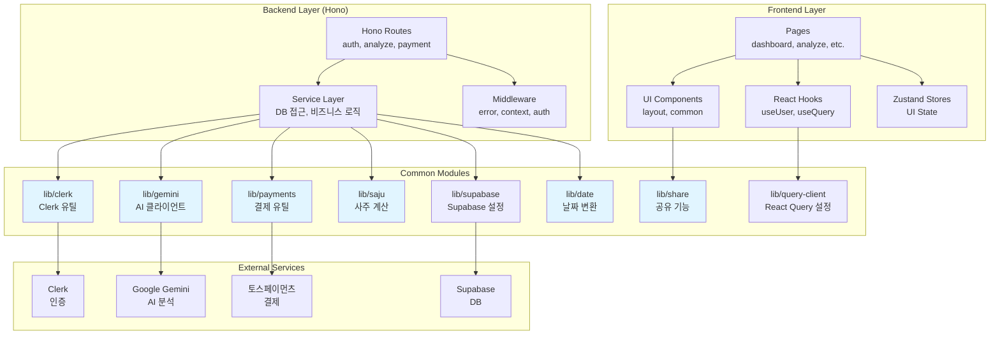

# 공통 모듈 작업 계획서

> **문서 버전**: 1.0
> **작성일**: 2025-10-25
> **프로젝트**: SuperNext - AI 기반 구독형 사주풀이 서비스

---

## 목차

1. [개요](#1-개요)
2. [모듈 다이어그램](#2-모듈-다이어그램)
3. [인증 관련 공통 모듈](#3-인증-관련-공통-모듈)
4. [데이터베이스 공통 모듈](#4-데이터베이스-공통-모듈)
5. [AI 분석 공통 모듈](#5-ai-분석-공통-모듈)
6. [결제 공통 모듈](#6-결제-공통-모듈)
7. [UI 공통 컴포넌트](#7-ui-공통-컴포넌트)
8. [유틸리티 함수](#8-유틸리티-함수)
9. [상태 관리](#9-상태-관리)
10. [타입 정의](#10-타입-정의)
11. [구현 우선순위](#11-구현-우선순위)

---

## 1. 개요

본 문서는 AI 사주풀이 서비스의 페이지 단위 개발에 앞서 공통으로 사용될 모듈들의 구현 계획을 정의합니다. 최소한의 설계로 오버엔지니어링을 피하며, 기존 코드베이스 구조를 엄격히 준수합니다.

### 1.1 설계 원칙

- **DRY(Don't Repeat Yourself)**: 중복 코드 최소화
- **코드베이스 구조 준수**: AGENTS.md의 디렉터리 구조 엄격 준수
- **최소 설계**: 명세에 명시된 기능만 구현
- **타입 안정성**: Zod 스키마 기반 런타임 검증
- **단일 책임 원칙**: 각 모듈은 명확한 하나의 역할만 수행

### 1.2 모듈 목록 요약

| 카테고리 | 모듈명 | 위치 | 설명 |
|---------|--------|------|------|
| 인증 | Clerk 설정 | `src/lib/clerk/` | Clerk 클라이언트/서버 설정 및 유틸리티 |
| 인증 | Webhook 핸들러 | `src/app/api/webhooks/clerk/` | Clerk 이벤트 수신 및 DB 동기화 |
| DB | 마이그레이션 | `supabase/migrations/` | 테이블 스키마 정의 (SQL) |
| DB | 공통 쿼리 | `src/lib/supabase/queries.ts` | 재사용 가능한 쿼리 함수 |
| AI | Gemini 클라이언트 | `src/lib/gemini/` | AI 분석 요청 클라이언트 및 설정 |
| AI | 사주 계산 | `src/lib/saju/` | 사주팔자 전처리 유틸리티 |
| AI | 프롬프트 템플릿 | `src/lib/gemini/prompts.ts` | 구조화된 AI 프롬프트 |
| 결제 | 토스페이먼츠 클라이언트 | `src/lib/payments/` | 결제 승인/조회/취소 유틸리티 |
| 결제 | Webhook 핸들러 | `src/app/api/webhooks/toss/` | 결제 이벤트 수신 및 처리 |
| UI | 레이아웃 | `src/components/layout/` | 헤더, 푸터, 사이드바 |
| UI | 공통 UI | `src/components/common/` | 로딩, 에러, 빈 상태 |
| 유틸리티 | 날짜 처리 | `src/lib/date/` | 양력/음력 변환 |
| 유틸리티 | 공유 기능 | `src/lib/share/` | 카카오톡, 링크 복사, PDF |
| 상태 | Zustand 스토어 | `src/stores/` | 전역 UI 상태 |
| 상태 | React Query 설정 | `src/lib/query-client.ts` | 서버 상태 관리 설정 |
| 타입 | 공통 타입 | `src/types/` | 전역 타입 정의 |

---

## 2. 모듈 다이어그램



---

## 3. 인증 관련 공통 모듈

### 3.1 Clerk 클라이언트 설정

**위치**: `src/lib/clerk/client.ts`, `src/lib/clerk/server.ts`

**역할**: Clerk SDK 초기화 및 사용자 정보 조회 유틸리티 제공

**의존성**:
```bash
# 이미 설치됨
@clerk/nextjs@^6.34.0
```

**구현 계획**:

```typescript
// src/lib/clerk/client.ts
import { useUser as useClerkUser, useAuth as useClerkAuth } from '@clerk/nextjs'

export { useClerkUser as useUser, useClerkAuth as useAuth }

export const getUserPlan = (user: ReturnType<typeof useClerkUser>['user']) => {
  return user?.publicMetadata?.plan ?? 'free'
}

export const getUserCredits = (user: ReturnType<typeof useClerkUser>['user']) => {
  return user?.publicMetadata?.credits ?? 0
}
```

```typescript
// src/lib/clerk/server.ts
import { auth as clerkAuth, currentUser } from '@clerk/nextjs/server'
import { clerkClient } from '@clerk/nextjs/server'

export { clerkAuth as auth, currentUser, clerkClient }

export const updateUserMetadata = async (
  userId: string,
  metadata: { plan?: string; credits?: number }
) => {
  return await clerkClient.users.updateUserMetadata(userId, {
    publicMetadata: metadata,
  })
}
```

**환경변수**:
```env
# .env.local
NEXT_PUBLIC_CLERK_PUBLISHABLE_KEY=pk_test_...
CLERK_SECRET_KEY=sk_test_...
CLERK_WEBHOOK_SECRET=whsec_...
```

---

### 3.2 Clerk Middleware 설정

**위치**: `src/middleware.ts` (이미 존재)

**역할**: 라우트 보호 및 인증 확인

**구현 계획**:

```typescript
// src/middleware.ts (기존 파일 수정)
import { clerkMiddleware, createRouteMatcher } from '@clerk/nextjs/server'

const isProtectedRoute = createRouteMatcher([
  '/dashboard(.*)',
  '/analyze(.*)',
  '/subscription(.*)',
  '/profiles(.*)',
])

export default clerkMiddleware(async (auth, req) => {
  if (isProtectedRoute(req)) {
    await auth.protect()
  }
})

export const config = {
  matcher: [
    '/((?!_next|[^?]*\\.(?:html?|css|js(?!on)|jpe?g|webp|png|gif|svg|ttf|woff2?|ico|csv|docx?|xlsx?|zip|webmanifest)).*)',
    '/(api|trpc)(.*)',
  ],
}
```

---

### 3.3 Clerk Webhook 핸들러

**위치**: `src/app/api/webhooks/clerk/route.ts`

**역할**: Clerk 이벤트 수신 및 Supabase 동기화

**의존성**:
```bash
# 필요 시 설치
npm i @clerk/backend
```

**구현 계획**:

```typescript
// src/app/api/webhooks/clerk/route.ts
import { NextRequest, NextResponse } from 'next/server'
import { Webhook } from 'svix'
import { createClient } from '@/lib/supabase/server'

export async function POST(req: NextRequest) {
  const WEBHOOK_SECRET = process.env.CLERK_WEBHOOK_SECRET!

  const svixId = req.headers.get('svix-id')
  const svixTimestamp = req.headers.get('svix-timestamp')
  const svixSignature = req.headers.get('svix-signature')

  if (!svixId || !svixTimestamp || !svixSignature) {
    return NextResponse.json({ error: 'Missing headers' }, { status: 400 })
  }

  const payload = await req.text()
  const wh = new Webhook(WEBHOOK_SECRET)

  let evt: any
  try {
    evt = wh.verify(payload, {
      'svix-id': svixId,
      'svix-timestamp': svixTimestamp,
      'svix-signature': svixSignature,
    })
  } catch (err) {
    return NextResponse.json({ error: 'Invalid signature' }, { status: 400 })
  }

  const supabase = createClient()

  switch (evt.type) {
    case 'user.created': {
      const { id, email_addresses } = evt.data
      await supabase.from('users').insert({
        clerk_id: id,
        email: email_addresses?.[0]?.email_address,
        subscription_tier: 'free',
        remaining_analyses: 3,
      })
      break
    }
    case 'user.updated': {
      const { id, email_addresses } = evt.data
      await supabase.from('users').update({
        email: email_addresses?.[0]?.email_address,
      }).eq('clerk_id', id)
      break
    }
    case 'user.deleted': {
      const { id } = evt.data
      await supabase.from('users').update({
        deleted_at: new Date().toISOString(),
      }).eq('clerk_id', id)
      break
    }
  }

  return NextResponse.json({ ok: true })
}
```

---

## 4. 데이터베이스 공통 모듈

### 4.1 Supabase 마이그레이션

**위치**: `supabase/migrations/`

**역할**: 데이터베이스 스키마 정의 및 트리거 설정

**구현 계획**:

**파일 목록**:
1. `0002_create_users_table.sql`
2. `0003_create_user_profiles_table.sql`
3. `0004_create_user_analyses_table.sql`
4. `0005_create_payment_history_table.sql`
5. `0006_create_share_tokens_table.sql`
6. `0007_create_triggers.sql`

**예시 (users 테이블)**:

```sql
-- supabase/migrations/0002_create_users_table.sql
CREATE TABLE IF NOT EXISTS users (
  id UUID PRIMARY KEY DEFAULT gen_random_uuid(),
  clerk_id TEXT UNIQUE NOT NULL,
  email TEXT,
  subscription_tier TEXT NOT NULL DEFAULT 'free' CHECK (subscription_tier IN ('free', 'pro', 'pending_cancel')),
  remaining_analyses INTEGER NOT NULL DEFAULT 3,
  billing_key TEXT,
  subscription_start_date TIMESTAMPTZ,
  next_billing_date TIMESTAMPTZ,
  cancel_at_period_end BOOLEAN DEFAULT false,
  created_at TIMESTAMPTZ NOT NULL DEFAULT NOW(),
  updated_at TIMESTAMPTZ NOT NULL DEFAULT NOW(),
  deleted_at TIMESTAMPTZ
);

CREATE INDEX IF NOT EXISTS idx_users_clerk_id ON users(clerk_id);
CREATE INDEX IF NOT EXISTS idx_users_next_billing_date ON users(next_billing_date) WHERE subscription_tier = 'pro';

-- Disable RLS
ALTER TABLE users DISABLE ROW LEVEL SECURITY;
```

**다른 테이블 파일도 database.md의 스키마를 따라 동일한 패턴으로 작성**

---

### 4.2 Supabase 클라이언트 공통 설정

**위치**: `src/lib/supabase/client.ts` (이미 존재)

**역할**: 브라우저 및 서버 Supabase 클라이언트 생성

**기존 코드 활용** (이미 구현됨)

---

### 4.3 공통 쿼리 유틸리티

**위치**: `src/lib/supabase/queries.ts`

**역할**: 자주 사용되는 쿼리 패턴 재사용

**구현 계획**:

```typescript
// src/lib/supabase/queries.ts
import type { SupabaseClient } from '@supabase/supabase-js'

export const getUserByClerkId = async (supabase: SupabaseClient, clerkId: string) => {
  const { data, error } = await supabase
    .from('users')
    .select('*')
    .eq('clerk_id', clerkId)
    .is('deleted_at', null)
    .single()

  if (error) throw error
  return data
}

export const updateUserCredits = async (
  supabase: SupabaseClient,
  userId: string,
  delta: number
) => {
  const { error } = await supabase.rpc('update_user_credits', {
    user_id: userId,
    credit_delta: delta,
  })

  if (error) throw error
}

export const getUserProfiles = async (supabase: SupabaseClient, userId: string) => {
  const { data, error } = await supabase
    .from('user_profiles')
    .select('*')
    .eq('user_id', userId)
    .is('deleted_at', null)
    .order('created_at', { ascending: false })

  if (error) throw error
  return data
}

export const getUserAnalyses = async (
  supabase: SupabaseClient,
  userId: string,
  options?: {
    search?: string
    analysisType?: string
    limit?: number
    offset?: number
  }
) => {
  let query = supabase
    .from('user_analyses')
    .select('id, name, analysis_type, model_used, created_at')
    .eq('user_id', userId)
    .is('deleted_at', null)

  if (options?.search) {
    query = query.ilike('name', `%${options.search}%`)
  }

  if (options?.analysisType) {
    query = query.eq('analysis_type', options.analysisType)
  }

  query = query.order('created_at', { ascending: false })

  if (options?.limit) {
    query = query.limit(options.limit)
  }

  if (options?.offset) {
    query = query.range(options.offset, options.offset + (options.limit ?? 10) - 1)
  }

  const { data, error } = await query

  if (error) throw error
  return data
}
```

---

## 5. AI 분석 공통 모듈

### 5.1 Google Gemini 클라이언트

**위치**: `src/lib/gemini/client.ts`

**역할**: Gemini API 초기화 및 구조화 출력 호출

**의존성**:
```bash
# 이미 설치됨
@google/genai@^1.27.0
```

**환경변수**:
```env
# .env.local
GEMINI_API_KEY=AI...
```

**구현 계획**:

```typescript
// src/lib/gemini/client.ts
import { GoogleGenAI, Type } from '@google/genai'

const ai = new GoogleGenAI({
  apiKey: process.env.GEMINI_API_KEY,
})

export type AnalysisResult = {
  general: string
  wealth: string
  love: string
  health: string
  job: string
}

const analysisSchema = {
  type: Type.OBJECT,
  properties: {
    general: { type: Type.STRING, description: '총운 (200자 이상)' },
    wealth: { type: Type.STRING, description: '재물운 (200자 이상)' },
    love: { type: Type.STRING, description: '애정운 (200자 이상)' },
    health: { type: Type.STRING, description: '건강운 (200자 이상)' },
    job: { type: Type.STRING, description: '직업운 (200자 이상)' },
  },
  required: ['general', 'wealth', 'love', 'health', 'job'],
  propertyOrdering: ['general', 'wealth', 'love', 'health', 'job'],
}

export const generateAnalysis = async (
  prompt: string,
  model: 'gemini-2.5-flash' | 'gemini-2.5-pro' = 'gemini-2.5-flash'
): Promise<AnalysisResult> => {
  const res = await ai.models.generateContent({
    model,
    contents: prompt,
    config: {
      responseMimeType: 'application/json',
      responseSchema: analysisSchema,
    },
  })

  return JSON.parse(res.text)
}
```

---

### 5.2 사주팔자 계산 유틸리티

**위치**: `src/lib/saju/calculate.ts`

**역할**: 생년월일시를 사주팔자 데이터로 변환

**의존성**:
```bash
# 외부 라이브러리 검토 필요 (또는 자체 구현)
# 예: npm i saju-calculator (가상)
```

**구현 계획**:

```typescript
// src/lib/saju/calculate.ts
import { format } from 'date-fns'

export type SajuData = {
  year: { cheongan: string; jiji: string }
  month: { cheongan: string; jiji: string }
  day: { cheongan: string; jiji: string }
  hour: { cheongan: string; jiji: string }
  sipsin: string[]
  daeun: string[]
}

export const calculateSaju = (
  birthDate: Date,
  birthTime?: string,
  isLunar: boolean = false
): SajuData => {
  // TODO: 실제 만세력 계산 로직 구현
  // 외부 라이브러리 사용 또는 자체 알고리즘 구현

  // 임시 더미 데이터 (실제 구현 필요)
  return {
    year: { cheongan: '갑', jiji: '자' },
    month: { cheongan: '병', jiji: '인' },
    day: { cheongan: '무', jiji: '진' },
    hour: { cheongan: '경', jiji: '오' },
    sipsin: ['편관', '정재', '식신', '비견'],
    daeun: ['신유', '임술', '계해'],
  }
}
```

**주의**: 사주팔자 계산은 복잡한 알고리즘이 필요하므로, 신뢰할 수 있는 외부 라이브러리를 사용하거나 전문가의 검증을 거친 알고리즘을 구현해야 합니다.

---

### 5.3 AI 프롬프트 템플릿

**위치**: `src/lib/gemini/prompts.ts`

**역할**: 분석 종류별 구조화된 프롬프트 생성

**구현 계획**:

```typescript
// src/lib/gemini/prompts.ts
import type { SajuData } from '@/lib/saju/calculate'

export type AnalysisType = 'monthly' | 'yearly' | 'lifetime'

const ANALYSIS_TYPE_LABELS: Record<AnalysisType, string> = {
  monthly: '월간 운세',
  yearly: '신년 운세',
  lifetime: '평생 운세',
}

export const createAnalysisPrompt = (
  name: string,
  gender: 'male' | 'female',
  sajuData: SajuData,
  analysisType: AnalysisType
): string => {
  const genderLabel = gender === 'male' ? '남성' : '여성'
  const typeLabel = ANALYSIS_TYPE_LABELS[analysisType]

  return `
당신은 전문 사주 명리학자입니다. 아래 사주 데이터를 바탕으로 ${typeLabel}를 분석해주세요.

**대상 정보**
- 이름: ${name}
- 성별: ${genderLabel}

**사주팔자**
- 년주: ${sajuData.year.cheongan}${sajuData.year.jiji}
- 월주: ${sajuData.month.cheongan}${sajuData.month.jiji}
- 일주: ${sajuData.day.cheongan}${sajuData.day.jiji}
- 시주: ${sajuData.hour.cheongan}${sajuData.hour.jiji}

**십신**: ${sajuData.sipsin.join(', ')}
**대운**: ${sajuData.daeun.join(', ')}

**요청 사항**
각 항목을 200자 이상 한국어로 작성하세요. 구체적이고 긍정적인 조언을 포함하며, JSON 형식으로만 반환하세요.

- general: 전반적인 운세 (총운)
- wealth: 재물운
- love: 애정운
- health: 건강운
- job: 직업운

**주의**: JSON 외의 다른 텍스트는 포함하지 마세요.
`.trim()
}
```

---

## 6. 결제 공통 모듈

### 6.1 토스페이먼츠 클라이언트

**위치**: `src/lib/payments/toss.ts`

**역할**: 결제 승인, 조회, 취소, 빌링키 관리

**의존성**: 없음 (fetch 사용)

**환경변수**:
```env
# .env.local
NEXT_PUBLIC_TOSS_CLIENT_KEY=test_ck_...
TOSS_SECRET_KEY=test_sk_...
```

**구현 계획**:

```typescript
// src/lib/payments/toss.ts
const TOSS_API_BASE = 'https://api.tosspayments.com'

const createAuthHeader = () => {
  const auth = Buffer.from(`${process.env.TOSS_SECRET_KEY}:`).toString('base64')
  return `Basic ${auth}`
}

export type ConfirmPaymentParams = {
  paymentKey: string
  orderId: string
  amount: number
}

export const confirmPayment = async (params: ConfirmPaymentParams) => {
  const res = await fetch(`${TOSS_API_BASE}/v1/payments/confirm`, {
    method: 'POST',
    headers: {
      Authorization: createAuthHeader(),
      'Content-Type': 'application/json',
      'Idempotency-Key': `confirm-${params.orderId}`,
    },
    body: JSON.stringify(params),
  })

  if (!res.ok) {
    const error = await res.json()
    throw new Error(JSON.stringify(error))
  }

  return await res.json()
}

export const getPayment = async (paymentKey: string) => {
  const res = await fetch(`${TOSS_API_BASE}/v1/payments/${paymentKey}`, {
    headers: {
      Authorization: createAuthHeader(),
    },
  })

  if (!res.ok) {
    const error = await res.json()
    throw new Error(JSON.stringify(error))
  }

  return await res.json()
}

export const cancelPayment = async (
  paymentKey: string,
  params: {
    cancelReason: string
    cancelAmount?: number
  }
) => {
  const res = await fetch(`${TOSS_API_BASE}/v1/payments/${paymentKey}/cancel`, {
    method: 'POST',
    headers: {
      Authorization: createAuthHeader(),
      'Content-Type': 'application/json',
      'Idempotency-Key': `cancel-${paymentKey}-${Date.now()}`,
    },
    body: JSON.stringify(params),
  })

  if (!res.ok) {
    const error = await res.json()
    throw new Error(JSON.stringify(error))
  }

  return await res.json()
}

export type IssueBillingKeyParams = {
  authKey: string
  customerKey: string
}

export const issueBillingKey = async (params: IssueBillingKeyParams) => {
  const res = await fetch(`${TOSS_API_BASE}/v1/billing/authorizations/issue`, {
    method: 'POST',
    headers: {
      Authorization: createAuthHeader(),
      'Content-Type': 'application/json',
      'Idempotency-Key': `billing-issue-${params.customerKey}`,
    },
    body: JSON.stringify(params),
  })

  if (!res.ok) {
    const error = await res.json()
    throw new Error(JSON.stringify(error))
  }

  return await res.json()
}

export type ChargeBillingParams = {
  billingKey: string
  orderId: string
  orderName: string
  amount: number
  customerKey: string
}

export const chargeBilling = async (params: ChargeBillingParams) => {
  const { billingKey, ...body } = params

  const res = await fetch(`${TOSS_API_BASE}/v1/billing/${billingKey}`, {
    method: 'POST',
    headers: {
      Authorization: createAuthHeader(),
      'Content-Type': 'application/json',
      'Idempotency-Key': `bill-${billingKey}-${new Date().toISOString().slice(0, 10)}`,
    },
    body: JSON.stringify(body),
  })

  if (!res.ok) {
    const error = await res.json()
    throw new Error(JSON.stringify(error))
  }

  return await res.json()
}

export const deleteBillingKey = async (billingKey: string) => {
  const res = await fetch(`${TOSS_API_BASE}/v1/billing/authorizations/${billingKey}`, {
    method: 'DELETE',
    headers: {
      Authorization: createAuthHeader(),
    },
  })

  if (!res.ok) {
    const error = await res.json()
    throw new Error(JSON.stringify(error))
  }

  return await res.json()
}
```

---

### 6.2 토스페이먼츠 Webhook 핸들러

**위치**: `src/app/api/webhooks/toss/route.ts`

**역할**: 결제 이벤트 수신 및 DB 업데이트

**구현 계획**:

```typescript
// src/app/api/webhooks/toss/route.ts
import { NextRequest, NextResponse } from 'next/server'
import { createClient } from '@/lib/supabase/server'
import { getPayment } from '@/lib/payments/toss'

export async function POST(req: NextRequest) {
  const event = await req.json()
  const supabase = createClient()

  try {
    switch (event.eventType) {
      case 'PAYMENT_STATUS_CHANGED': {
        const { paymentKey, orderId, status } = event.data

        // 조회 API로 교차 검증
        const payment = await getPayment(paymentKey)

        await supabase.from('payment_history').update({
          status: payment.status,
          updated_at: new Date().toISOString(),
        }).eq('order_id', orderId)

        break
      }

      case 'DEPOSIT_CALLBACK': {
        const { secret, orderId, status } = event

        // secret 검증 (가상계좌)
        const { data: payment } = await supabase
          .from('payment_history')
          .select('*')
          .eq('order_id', orderId)
          .single()

        // TODO: secret 일치 확인 로직

        if (status === 'DONE') {
          // 주문 확정 처리
        }

        break
      }

      default:
        break
    }

    return NextResponse.json({ ok: true })
  } catch (error) {
    console.error('Toss webhook error:', error)
    return NextResponse.json({ ok: false }, { status: 500 })
  }
}
```

---

## 7. UI 공통 컴포넌트

### 7.1 레이아웃 컴포넌트

**위치**: `src/components/layout/`

**구현 계획**:

```typescript
// src/components/layout/header.tsx
'use client'

import { UserButton } from '@clerk/nextjs'
import Link from 'next/link'

export const Header = () => {
  return (
    <header className="border-b">
      <div className="container mx-auto flex h-16 items-center justify-between px-4">
        <Link href="/" className="text-xl font-bold">
          SuperNext
        </Link>
        <nav className="flex items-center gap-6">
          <Link href="/dashboard">분석 목록</Link>
          <Link href="/analyze/new">새 분석하기</Link>
          <Link href="/subscription">구독 관리</Link>
          <UserButton afterSignOutUrl="/" />
        </nav>
      </div>
    </header>
  )
}
```

```typescript
// src/components/layout/footer.tsx
export const Footer = () => {
  return (
    <footer className="border-t py-6">
      <div className="container mx-auto text-center text-sm text-muted-foreground">
        <p>© 2025 SuperNext. All rights reserved.</p>
        <p className="mt-2">사주풀이는 참고용이며, 법적 책임을 지지 않습니다.</p>
      </div>
    </footer>
  )
}
```

---

### 7.2 공통 UI 컴포넌트

**위치**: `src/components/common/`

**구현 계획**:

```typescript
// src/components/common/loading-spinner.tsx
'use client'

import { Loader2 } from 'lucide-react'

export const LoadingSpinner = ({ message }: { message?: string }) => {
  return (
    <div className="flex flex-col items-center justify-center gap-4 py-12">
      <Loader2 className="h-12 w-12 animate-spin text-primary" />
      {message && <p className="text-muted-foreground">{message}</p>}
    </div>
  )
}
```

```typescript
// src/components/common/error-state.tsx
'use client'

import { AlertCircle } from 'lucide-react'
import { Button } from '@/components/ui/button'

export const ErrorState = ({
  title = '오류가 발생했습니다',
  message,
  onRetry,
}: {
  title?: string
  message?: string
  onRetry?: () => void
}) => {
  return (
    <div className="flex flex-col items-center justify-center gap-4 py-12">
      <AlertCircle className="h-12 w-12 text-destructive" />
      <div className="text-center">
        <h3 className="text-lg font-semibold">{title}</h3>
        {message && <p className="mt-2 text-muted-foreground">{message}</p>}
      </div>
      {onRetry && (
        <Button onClick={onRetry}>다시 시도</Button>
      )}
    </div>
  )
}
```

```typescript
// src/components/common/empty-state.tsx
'use client'

import { FileQuestion } from 'lucide-react'
import { Button } from '@/components/ui/button'
import Link from 'next/link'

export const EmptyState = ({
  title = '아직 내역이 없습니다',
  message,
  actionLabel,
  actionHref,
}: {
  title?: string
  message?: string
  actionLabel?: string
  actionHref?: string
}) => {
  return (
    <div className="flex flex-col items-center justify-center gap-4 py-12">
      <FileQuestion className="h-12 w-12 text-muted-foreground" />
      <div className="text-center">
        <h3 className="text-lg font-semibold">{title}</h3>
        {message && <p className="mt-2 text-muted-foreground">{message}</p>}
      </div>
      {actionLabel && actionHref && (
        <Button asChild>
          <Link href={actionHref}>{actionLabel}</Link>
        </Button>
      )}
    </div>
  )
}
```

---

## 8. 유틸리티 함수

### 8.1 날짜 처리 (양력/음력 변환)

**위치**: `src/lib/date/lunar.ts`

**역할**: 양력 ↔ 음력 변환

**의존성**:
```bash
# 외부 라이브러리 검토 필요
# 예: npm i lunar-calendar (가상)
```

**구현 계획**:

```typescript
// src/lib/date/lunar.ts
export const solarToLunar = (solarDate: Date): Date => {
  // TODO: 양력 → 음력 변환 알고리즘 구현
  // 외부 라이브러리 사용 권장
  return solarDate
}

export const lunarToSolar = (lunarDate: Date): Date => {
  // TODO: 음력 → 양력 변환 알고리즘 구현
  return lunarDate
}
```

---

### 8.2 공유 기능

**위치**: `src/lib/share/`

**구현 계획**:

```typescript
// src/lib/share/kakao.ts
declare global {
  interface Window {
    Kakao: any
  }
}

export const initKakao = () => {
  if (typeof window === 'undefined') return
  if (window.Kakao?.isInitialized()) return

  const key = process.env.NEXT_PUBLIC_KAKAO_JS_KEY
  if (!key) {
    console.warn('Kakao JS Key not found')
    return
  }

  window.Kakao.init(key)
}

export const shareToKakao = (params: {
  title: string
  description: string
  imageUrl: string
  linkUrl: string
}) => {
  if (!window.Kakao?.isInitialized()) {
    console.error('Kakao not initialized')
    return
  }

  window.Kakao.Link.sendDefault({
    objectType: 'feed',
    content: {
      title: params.title,
      description: params.description,
      imageUrl: params.imageUrl,
      link: {
        mobileWebUrl: params.linkUrl,
        webUrl: params.linkUrl,
      },
    },
  })
}
```

```typescript
// src/lib/share/clipboard.ts
export const copyToClipboard = async (text: string): Promise<boolean> => {
  try {
    await navigator.clipboard.writeText(text)
    return true
  } catch (error) {
    console.error('Failed to copy:', error)
    return false
  }
}
```

```typescript
// src/lib/share/pdf.ts
// PDF 생성은 복잡하므로 외부 라이브러리 사용 권장
// 예: jsPDF, html2pdf.js, Puppeteer 등
export const generatePDF = async (element: HTMLElement): Promise<Blob> => {
  // TODO: PDF 생성 로직 구현
  throw new Error('Not implemented')
}
```

---

## 9. 상태 관리

### 9.1 Zustand 스토어

**위치**: `src/stores/ui-store.ts`

**역할**: 전역 UI 상태 관리 (모달, 사이드바 등)

**구현 계획**:

```typescript
// src/stores/ui-store.ts
import { create } from 'zustand'

type UIStore = {
  isSidebarOpen: boolean
  toggleSidebar: () => void
  closeSidebar: () => void

  activeModal: string | null
  openModal: (modalId: string) => void
  closeModal: () => void
}

export const useUIStore = create<UIStore>((set) => ({
  isSidebarOpen: false,
  toggleSidebar: () => set((state) => ({ isSidebarOpen: !state.isSidebarOpen })),
  closeSidebar: () => set({ isSidebarOpen: false }),

  activeModal: null,
  openModal: (modalId) => set({ activeModal: modalId }),
  closeModal: () => set({ activeModal: null }),
}))
```

---

### 9.2 React Query 설정

**위치**: `src/lib/query-client.ts`

**역할**: React Query 전역 설정 (staleTime, retry 등)

**구현 계획**:

```typescript
// src/lib/query-client.ts
import { QueryClient } from '@tanstack/react-query'

export const queryClient = new QueryClient({
  defaultOptions: {
    queries: {
      staleTime: 5 * 60 * 1000, // 5분
      retry: 3,
      refetchOnWindowFocus: false,
    },
  },
})
```

```typescript
// src/app/providers.tsx (기존 파일 수정)
'use client'

import { QueryClientProvider } from '@tanstack/react-query'
import { queryClient } from '@/lib/query-client'

export const Providers = ({ children }: { children: React.ReactNode }) => {
  return (
    <QueryClientProvider client={queryClient}>
      {children}
    </QueryClientProvider>
  )
}
```

---

## 10. 타입 정의

### 10.1 공통 타입

**위치**: `src/types/index.ts`

**구현 계획**:

```typescript
// src/types/index.ts
export type User = {
  id: string
  clerkId: string
  email: string | null
  subscriptionTier: 'free' | 'pro' | 'pending_cancel'
  remainingAnalyses: number
  billingKey: string | null
  subscriptionStartDate: string | null
  nextBillingDate: string | null
  cancelAtPeriodEnd: boolean
  createdAt: string
  updatedAt: string
}

export type UserProfile = {
  id: string
  userId: string
  name: string
  gender: 'male' | 'female'
  birthDate: string
  birthTime: string | null
  isLunar: boolean
  createdAt: string
  updatedAt: string
}

export type Analysis = {
  id: string
  userId: string
  profileId: string | null
  name: string
  gender: 'male' | 'female'
  birthDate: string
  birthTime: string | null
  isLunar: boolean
  analysisType: 'monthly' | 'yearly' | 'lifetime'
  modelUsed: 'gemini-2.5-flash' | 'gemini-2.5-pro'
  resultJson: {
    general: string
    wealth: string
    love: string
    health: string
    job: string
  }
  createdAt: string
}

export type Payment = {
  id: string
  userId: string
  orderId: string
  paymentKey: string
  amount: number
  status: 'pending' | 'done' | 'canceled' | 'failed'
  method: string | null
  createdAt: string
  updatedAt: string
}

export type ShareToken = {
  id: string
  analysisId: string
  token: string
  expiresAt: string
  createdAt: string
}
```

---

## 11. 구현 우선순위

### Phase 1: 기초 인프라 (1주)
1. **데이터베이스 마이그레이션** (0002-0007.sql)
2. **Supabase 공통 쿼리** (queries.ts)
3. **환경변수 설정** (.env.local)
4. **타입 정의** (types/index.ts)

### Phase 2: 인증 및 사용자 관리 (1주)
1. **Clerk 설정** (lib/clerk/)
2. **Middleware 설정** (middleware.ts)
3. **Clerk Webhook** (api/webhooks/clerk/)
4. **공통 레이아웃** (components/layout/)

### Phase 3: AI 분석 코어 (1주)
1. **Gemini 클라이언트** (lib/gemini/client.ts)
2. **사주 계산 유틸리티** (lib/saju/calculate.ts)
3. **프롬프트 템플릿** (lib/gemini/prompts.ts)
4. **분석 API 엔드포인트** (features/analyze/backend/)

### Phase 4: 결제 시스템 (1주)
1. **토스페이먼츠 클라이언트** (lib/payments/toss.ts)
2. **결제 Webhook** (api/webhooks/toss/)
3. **구독 관리 API** (features/subscription/backend/)

### Phase 5: UI 및 UX (1주)
1. **공통 UI 컴포넌트** (components/common/)
2. **React Query 설정** (lib/query-client.ts)
3. **공유 기능** (lib/share/)
4. **PDF 생성** (lib/share/pdf.ts)

---

## 부록: 필요한 패키지 설치 명령어

```bash
# Clerk (이미 설치됨)
# @clerk/nextjs@^6.34.0

# Gemini (이미 설치됨)
# @google/genai@^1.27.0

# 추가 필요 패키지
npm i svix  # Clerk Webhook 검증

# 선택적 (필요 시)
# npm i lunar-calendar  # 양력/음력 변환
# npm i jspdf html2canvas  # PDF 생성
```

---

## 체크리스트

- [ ] 데이터베이스 마이그레이션 파일 작성 및 적용
- [ ] Clerk 환경변수 설정 및 Webhook 등록
- [ ] Gemini API 키 발급 및 환경변수 설정
- [ ] 토스페이먼츠 키 발급 및 환경변수 설정
- [ ] Supabase 서비스 역할 키 환경변수 설정
- [ ] 모든 공통 모듈 파일 생성
- [ ] 타입 정의 완료
- [ ] 단위 테스트 작성 (주요 유틸리티 함수)

---

**문서 끝**
