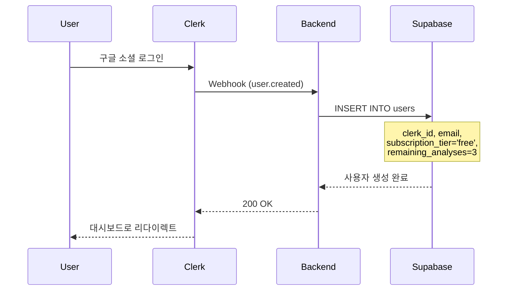
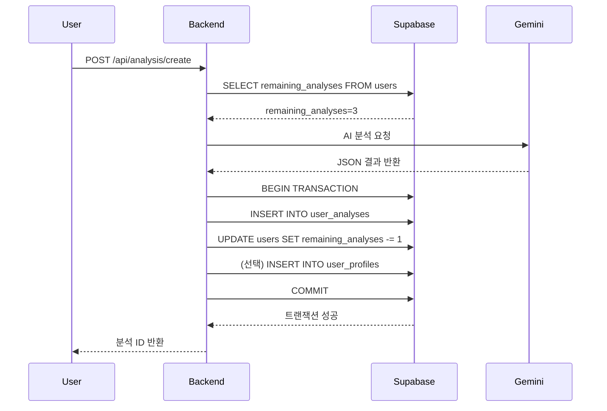
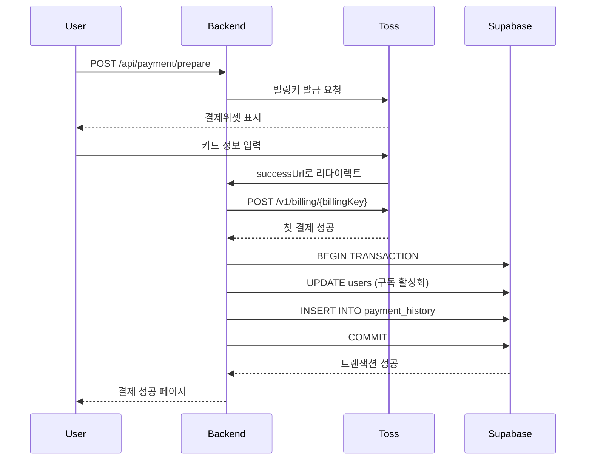
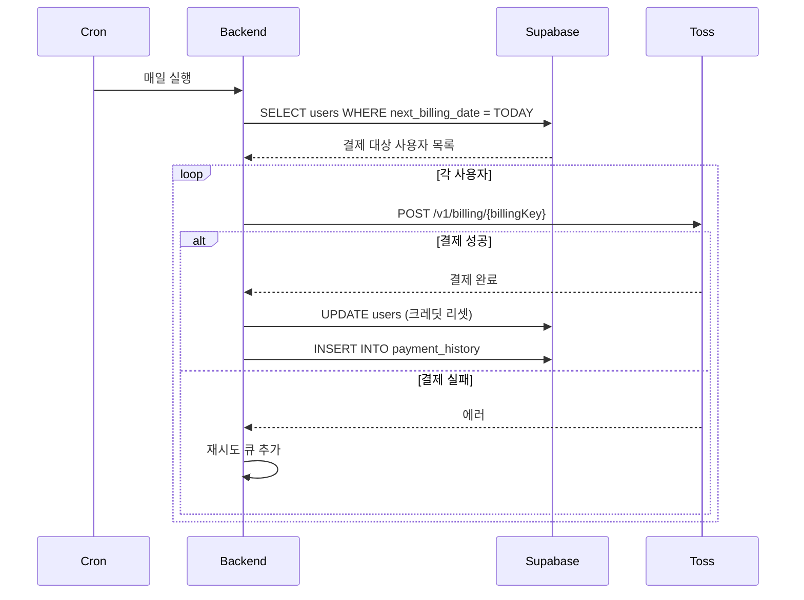
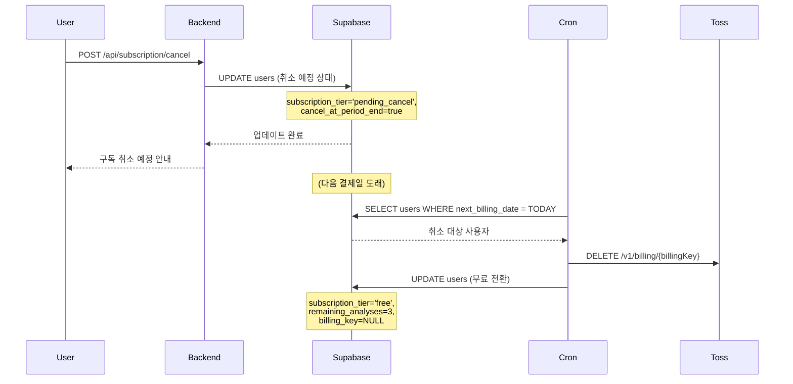

# Database Design Document

> **문서 버전**: 1.0
> **작성일**: 2025-10-24
> **프로젝트**: SuperNext - AI 기반 구독형 사주풀이 서비스

---

## 1. 개요

본 문서는 userflow.md에 명시된 기능을 구현하기 위한 최소 스펙의 데이터베이스 스키마와 데이터 흐름을 정의합니다.

### 1.1 설계 원칙
- userflow에 명시적으로 포함된 데이터만 포함
- PostgreSQL 기반 Supabase 사용
- RLS(Row Level Security) 비활성화 (서버 전용 접근)
- Soft delete 패턴 적용 (deleted_at)
- 모든 테이블에 updated_at 컬럼 및 트리거 추가

---

## 2. 간략한 데이터 플로우

### 2.1 회원가입 플로우
```
Clerk 회원가입
  → Clerk Webhook (user.created)
    → Supabase: users 테이블에 레코드 생성
      - subscription_tier: 'free'
      - remaining_analyses: 3
```

### 2.2 사주 분석 플로우
```
사용자 입력 (이름, 성별, 생년월일시, 분석 종류)
  → 백엔드: remaining_analyses 확인
    → AI 분석 요청 (Gemini API)
      → 성공 시:
        - user_analyses 테이블에 분석 결과 저장
        - users.remaining_analyses -= 1
        - (선택) user_profiles 테이블에 프로필 저장
```

### 2.3 구독 결제 플로우
```
Pro 구독 버튼 클릭
  → 토스페이먼츠 빌링키 발급
    → 첫 결제 실행
      → 성공 시:
        - users.subscription_tier: 'pro'
        - users.remaining_analyses: 10
        - users.billing_key: 빌링키 저장
        - users.next_billing_date: 1개월 후
        - payment_history 테이블에 결제 내역 추가
```

### 2.4 정기 결제 플로우 (Cron)
```
Supabase Cron (매일 실행)
  → next_billing_date = 오늘인 사용자 조회
    → 토스페이먼츠 자동 결제
      → 성공 시:
        - users.remaining_analyses: 10으로 리셋
        - users.next_billing_date: 1개월 후
        - payment_history 테이블에 결제 내역 추가
```

### 2.5 구독 취소 플로우
```
구독 취소 버튼 클릭
  → users.subscription_tier: 'pending_cancel'
  → users.cancel_at_period_end: true
    → 다음 결제일 도래 시 Cron 실행
      → 토스페이먼츠 빌링키 삭제
        - users.subscription_tier: 'free'
        - users.remaining_analyses: 3
        - users.billing_key: null
```

---

## 3. 테이블 스키마 상세

### 3.1 users (사용자)

사용자의 기본 정보와 구독 상태를 관리합니다.

| 컬럼명 | 타입 | 제약조건 | 설명 |
|--------|------|----------|------|
| id | UUID | PRIMARY KEY, DEFAULT gen_random_uuid() | 사용자 고유 ID |
| clerk_id | TEXT | UNIQUE NOT NULL | Clerk 사용자 ID |
| email | TEXT | - | 사용자 이메일 |
| subscription_tier | TEXT | NOT NULL DEFAULT 'free' | 구독 등급 ('free', 'pro', 'pending_cancel') |
| remaining_analyses | INTEGER | NOT NULL DEFAULT 3 | 잔여 분석 횟수 |
| billing_key | TEXT | - | 토스페이먼츠 빌링키 |
| subscription_start_date | TIMESTAMPTZ | - | 구독 시작일 |
| next_billing_date | TIMESTAMPTZ | - | 다음 결제일 |
| cancel_at_period_end | BOOLEAN | DEFAULT false | 기간 종료 시 취소 여부 |
| created_at | TIMESTAMPTZ | NOT NULL DEFAULT NOW() | 생성일 |
| updated_at | TIMESTAMPTZ | NOT NULL DEFAULT NOW() | 수정일 |
| deleted_at | TIMESTAMPTZ | - | 삭제일 (soft delete) |

**인덱스:**
- `idx_users_clerk_id` ON clerk_id
- `idx_users_next_billing_date` ON next_billing_date (WHERE subscription_tier = 'pro')

---

### 3.2 user_profiles (대상 인물 프로필)

사용자가 자주 보는 사람(본인, 가족, 친구)의 정보를 저장합니다.

| 컬럼명 | 타입 | 제약조건 | 설명 |
|--------|------|----------|------|
| id | UUID | PRIMARY KEY, DEFAULT gen_random_uuid() | 프로필 고유 ID |
| user_id | UUID | NOT NULL REFERENCES users(id) ON DELETE CASCADE | 소유자 ID |
| name | TEXT | NOT NULL | 대상 이름 |
| gender | TEXT | NOT NULL | 성별 ('male', 'female') |
| birth_date | DATE | NOT NULL | 생년월일 |
| birth_time | TIME | - | 태어난 시간 (선택) |
| is_lunar | BOOLEAN | NOT NULL DEFAULT false | 음력 여부 |
| created_at | TIMESTAMPTZ | NOT NULL DEFAULT NOW() | 생성일 |
| updated_at | TIMESTAMPTZ | NOT NULL DEFAULT NOW() | 수정일 |
| deleted_at | TIMESTAMPTZ | - | 삭제일 (soft delete) |

**인덱스:**
- `idx_user_profiles_user_id` ON user_id

---

### 3.3 user_analyses (사주 분석 결과)

AI가 생성한 사주 분석 결과를 저장합니다.

| 컬럼명 | 타입 | 제약조건 | 설명 |
|--------|------|----------|------|
| id | UUID | PRIMARY KEY, DEFAULT gen_random_uuid() | 분석 고유 ID |
| user_id | UUID | NOT NULL REFERENCES users(id) ON DELETE CASCADE | 사용자 ID |
| profile_id | UUID | REFERENCES user_profiles(id) ON DELETE SET NULL | 연관 프로필 ID (선택) |
| name | TEXT | NOT NULL | 분석 대상 이름 |
| gender | TEXT | NOT NULL | 성별 ('male', 'female') |
| birth_date | DATE | NOT NULL | 생년월일 |
| birth_time | TIME | - | 태어난 시간 |
| is_lunar | BOOLEAN | NOT NULL DEFAULT false | 음력 여부 |
| analysis_type | TEXT | NOT NULL | 분석 종류 ('monthly', 'yearly', 'lifetime') |
| model_used | TEXT | NOT NULL | 사용 AI 모델 ('gemini-2.5-flash', 'gemini-2.5-pro') |
| result_json | JSONB | NOT NULL | AI 분석 결과 (JSON) |
| created_at | TIMESTAMPTZ | NOT NULL DEFAULT NOW() | 생성일 |
| deleted_at | TIMESTAMPTZ | - | 삭제일 (soft delete) |

**result_json 구조:**
```json
{
  "general": "총운 내용 (200자 이상)",
  "wealth": "재물운 내용 (200자 이상)",
  "love": "애정운 내용 (200자 이상)",
  "health": "건강운 내용 (200자 이상)",
  "job": "직업운 내용 (200자 이상)"
}
```

**인덱스:**
- `idx_user_analyses_user_id` ON user_id
- `idx_user_analyses_created_at` ON created_at DESC

---

### 3.4 payment_history (결제 내역)

토스페이먼츠를 통한 결제 내역을 기록합니다.

| 컬럼명 | 타입 | 제약조건 | 설명 |
|--------|------|----------|------|
| id | UUID | PRIMARY KEY, DEFAULT gen_random_uuid() | 결제 고유 ID |
| user_id | UUID | NOT NULL REFERENCES users(id) ON DELETE CASCADE | 사용자 ID |
| order_id | TEXT | UNIQUE NOT NULL | 주문 ID (토스) |
| payment_key | TEXT | UNIQUE NOT NULL | 결제 키 (토스) |
| amount | INTEGER | NOT NULL | 결제 금액 (원) |
| status | TEXT | NOT NULL | 결제 상태 ('pending', 'done', 'canceled', 'failed') |
| method | TEXT | - | 결제 수단 ('card', 'billing') |
| created_at | TIMESTAMPTZ | NOT NULL DEFAULT NOW() | 생성일 |
| updated_at | TIMESTAMPTZ | NOT NULL DEFAULT NOW() | 수정일 |

**인덱스:**
- `idx_payment_history_user_id` ON user_id
- `idx_payment_history_order_id` ON order_id

---

### 3.5 share_tokens (공유 링크 토큰)

분석 결과 공유를 위한 임시 토큰을 관리합니다.

| 컬럼명 | 타입 | 제약조건 | 설명 |
|--------|------|----------|------|
| id | UUID | PRIMARY KEY, DEFAULT gen_random_uuid() | 토큰 고유 ID |
| analysis_id | UUID | NOT NULL REFERENCES user_analyses(id) ON DELETE CASCADE | 분석 ID |
| token | TEXT | UNIQUE NOT NULL | 공유 토큰 (UUID) |
| expires_at | TIMESTAMPTZ | NOT NULL | 만료일 (생성일 + 7일) |
| created_at | TIMESTAMPTZ | NOT NULL DEFAULT NOW() | 생성일 |

**인덱스:**
- `idx_share_tokens_token` ON token
- `idx_share_tokens_expires_at` ON expires_at

---

## 4. 데이터 플로우 상세

### 4.1 회원가입 시 데이터 흐름



**SQL:**
```sql
INSERT INTO users (clerk_id, email, subscription_tier, remaining_analyses)
VALUES ($1, $2, 'free', 3);
```

---

### 4.2 사주 분석 시 데이터 흐름



**SQL:**
```sql
-- 1. 잔여 횟수 확인
SELECT remaining_analyses FROM users WHERE id = $1 FOR UPDATE;

-- 2. 분석 결과 저장
INSERT INTO user_analyses (
  user_id, profile_id, name, gender, birth_date, birth_time,
  is_lunar, analysis_type, model_used, result_json
) VALUES ($1, $2, $3, $4, $5, $6, $7, $8, $9, $10)
RETURNING id;

-- 3. 잔여 횟수 차감
UPDATE users
SET remaining_analyses = remaining_analyses - 1
WHERE id = $1;

-- 4. (선택) 프로필 저장
INSERT INTO user_profiles (user_id, name, gender, birth_date, birth_time, is_lunar)
VALUES ($1, $2, $3, $4, $5, $6)
ON CONFLICT DO NOTHING;
```

---

### 4.3 구독 결제 시 데이터 흐름



**SQL:**
```sql
-- 1. 구독 활성화
UPDATE users
SET
  subscription_tier = 'pro',
  remaining_analyses = 10,
  billing_key = $2,
  subscription_start_date = NOW(),
  next_billing_date = NOW() + INTERVAL '1 month'
WHERE id = $1;

-- 2. 결제 내역 저장
INSERT INTO payment_history (user_id, order_id, payment_key, amount, status, method)
VALUES ($1, $2, $3, $4, 'done', 'billing');
```

---

### 4.4 정기 결제 시 데이터 흐름 (Cron)



**SQL:**
```sql
-- 1. 결제 대상 조회
SELECT id, billing_key
FROM users
WHERE subscription_tier = 'pro'
  AND next_billing_date::date = CURRENT_DATE
  AND deleted_at IS NULL;

-- 2. 결제 성공 시
UPDATE users
SET
  remaining_analyses = 10,
  next_billing_date = next_billing_date + INTERVAL '1 month'
WHERE id = $1;

INSERT INTO payment_history (user_id, order_id, payment_key, amount, status, method)
VALUES ($1, $2, $3, 10000, 'done', 'billing');
```

---

### 4.5 구독 취소 시 데이터 흐름



**SQL:**
```sql
-- 1. 구독 취소 요청
UPDATE users
SET
  subscription_tier = 'pending_cancel',
  cancel_at_period_end = true
WHERE id = $1;

-- 2. 구독 만료 처리 (Cron)
UPDATE users
SET
  subscription_tier = 'free',
  remaining_analyses = 3,
  billing_key = NULL,
  subscription_start_date = NULL,
  next_billing_date = NULL,
  cancel_at_period_end = false
WHERE id = $1;
```

---

### 4.6 프로필 관리 데이터 흐름

#### 4.6.1 프로필 생성
```sql
INSERT INTO user_profiles (user_id, name, gender, birth_date, birth_time, is_lunar)
VALUES ($1, $2, $3, $4, $5, $6)
RETURNING id;
```

#### 4.6.2 프로필 조회
```sql
SELECT * FROM user_profiles
WHERE user_id = $1 AND deleted_at IS NULL
ORDER BY created_at DESC;
```

#### 4.6.3 프로필 수정
```sql
UPDATE user_profiles
SET name = $2, gender = $3, birth_date = $4, birth_time = $5, is_lunar = $6
WHERE id = $1 AND user_id = $7;
```

#### 4.6.4 프로필 삭제 (Soft Delete)
```sql
UPDATE user_profiles
SET deleted_at = NOW()
WHERE id = $1 AND user_id = $2;
```

---

### 4.7 분석 목록 조회 데이터 흐름

```sql
-- 페이지네이션 + 검색 + 필터
SELECT
  id, name, analysis_type, model_used, created_at
FROM user_analyses
WHERE user_id = $1
  AND deleted_at IS NULL
  AND ($2::text IS NULL OR name ILIKE '%' || $2 || '%')  -- 검색
  AND ($3::text IS NULL OR analysis_type = $3)  -- 필터
ORDER BY created_at DESC
LIMIT $4 OFFSET $5;

-- 전체 개수
SELECT COUNT(*) FROM user_analyses
WHERE user_id = $1 AND deleted_at IS NULL
  AND ($2::text IS NULL OR name ILIKE '%' || $2 || '%')
  AND ($3::text IS NULL OR analysis_type = $3);
```

---

### 4.8 공유 링크 생성 및 접근

#### 4.8.1 공유 링크 생성
```sql
INSERT INTO share_tokens (analysis_id, token, expires_at)
VALUES ($1, gen_random_uuid()::text, NOW() + INTERVAL '7 days')
RETURNING token;
```

#### 4.8.2 공유 링크 접근
```sql
SELECT a.*
FROM user_analyses a
JOIN share_tokens st ON st.analysis_id = a.id
WHERE st.token = $1
  AND st.expires_at > NOW()
  AND a.deleted_at IS NULL;
```

---

## 5. 인덱스 전략

### 5.1 성능 최적화 인덱스

```sql
-- users 테이블
CREATE INDEX idx_users_clerk_id ON users(clerk_id);
CREATE INDEX idx_users_next_billing_date ON users(next_billing_date)
  WHERE subscription_tier = 'pro';

-- user_profiles 테이블
CREATE INDEX idx_user_profiles_user_id ON user_profiles(user_id);

-- user_analyses 테이블
CREATE INDEX idx_user_analyses_user_id ON user_analyses(user_id);
CREATE INDEX idx_user_analyses_created_at ON user_analyses(created_at DESC);

-- payment_history 테이블
CREATE INDEX idx_payment_history_user_id ON payment_history(user_id);
CREATE INDEX idx_payment_history_order_id ON payment_history(order_id);

-- share_tokens 테이블
CREATE INDEX idx_share_tokens_token ON share_tokens(token);
CREATE INDEX idx_share_tokens_expires_at ON share_tokens(expires_at);
```

---

## 6. 데이터 무결성 및 제약조건

### 6.1 Foreign Key 제약조건

- `user_profiles.user_id` → `users.id` (ON DELETE CASCADE)
- `user_analyses.user_id` → `users.id` (ON DELETE CASCADE)
- `user_analyses.profile_id` → `user_profiles.id` (ON DELETE SET NULL)
- `payment_history.user_id` → `users.id` (ON DELETE CASCADE)
- `share_tokens.analysis_id` → `user_analyses.id` (ON DELETE CASCADE)

### 6.2 Unique 제약조건

- `users.clerk_id`
- `payment_history.order_id`
- `payment_history.payment_key`
- `share_tokens.token`

### 6.3 Check 제약조건

```sql
-- users
ALTER TABLE users ADD CONSTRAINT check_subscription_tier
  CHECK (subscription_tier IN ('free', 'pro', 'pending_cancel'));

-- user_profiles
ALTER TABLE user_profiles ADD CONSTRAINT check_gender
  CHECK (gender IN ('male', 'female'));

-- user_analyses
ALTER TABLE user_analyses ADD CONSTRAINT check_analysis_type
  CHECK (analysis_type IN ('monthly', 'yearly', 'lifetime'));
ALTER TABLE user_analyses ADD CONSTRAINT check_model_used
  CHECK (model_used IN ('gemini-2.5-flash', 'gemini-2.5-pro'));

-- payment_history
ALTER TABLE payment_history ADD CONSTRAINT check_status
  CHECK (status IN ('pending', 'done', 'canceled', 'failed'));
ALTER TABLE payment_history ADD CONSTRAINT check_amount_positive
  CHECK (amount > 0);
```

---

## 7. Trigger 정의

### 7.1 updated_at 자동 업데이트

```sql
-- Function
CREATE OR REPLACE FUNCTION update_updated_at_column()
RETURNS TRIGGER AS $$
BEGIN
  NEW.updated_at = NOW();
  RETURN NEW;
END;
$$ language 'plpgsql';

-- Triggers
CREATE TRIGGER update_users_updated_at BEFORE UPDATE ON users
  FOR EACH ROW EXECUTE FUNCTION update_updated_at_column();

CREATE TRIGGER update_user_profiles_updated_at BEFORE UPDATE ON user_profiles
  FOR EACH ROW EXECUTE FUNCTION update_updated_at_column();

CREATE TRIGGER update_payment_history_updated_at BEFORE UPDATE ON payment_history
  FOR EACH ROW EXECUTE FUNCTION update_updated_at_column();
```

---

## 8. Migration 실행 순서

1. `0002_create_users_table.sql` - users 테이블 생성
2. `0003_create_user_profiles_table.sql` - user_profiles 테이블 생성
3. `0004_create_user_analyses_table.sql` - user_analyses 테이블 생성
4. `0005_create_payment_history_table.sql` - payment_history 테이블 생성
5. `0006_create_share_tokens_table.sql` - share_tokens 테이블 생성

---

## 9. 데이터 백업 및 복구 전략

### 9.1 백업 정책
- Supabase 자동 백업 (일 1회)
- 중요 테이블 수동 백업 (주 1회)

### 9.2 복구 시나리오
- 사용자 삭제 복구: deleted_at NULL 처리
- 결제 오류 복구: payment_history 조회 후 수동 처리

---

## 10. 보안 고려사항

### 10.1 민감 정보 보호
- `users.billing_key`: 암호화 저장 권장 (향후)
- `users.email`: 개인정보 마스킹 필요 시 처리

### 10.2 접근 제어
- RLS 비활성화: 서버 측에서만 Supabase 접근
- Service Role Key 사용: 클라이언트에 노출 금지

### 10.3 SQL Injection 방지
- Prepared Statement 사용 ($1, $2 등)
- 사용자 입력 검증 (Zod)

---

## 11. 성능 모니터링

### 11.1 느린 쿼리 추적
```sql
-- pg_stat_statements 확장 활성화
CREATE EXTENSION IF NOT EXISTS pg_stat_statements;

-- 느린 쿼리 조회
SELECT query, mean_exec_time, calls
FROM pg_stat_statements
ORDER BY mean_exec_time DESC
LIMIT 10;
```

### 11.2 인덱스 사용 통계
```sql
SELECT schemaname, tablename, indexname, idx_scan
FROM pg_stat_user_indexes
ORDER BY idx_scan ASC;
```

---

## 12. 확장 계획

### 12.1 Phase 2 추가 테이블 (향후)
- `notifications` - 알림 관리
- `admin_logs` - 관리자 작업 로그
- `user_feedback` - 사용자 피드백

### 12.2 성능 개선 (향후)
- Read Replica 추가
- Connection Pooling 최적화
- 캐시 레이어 추가 (Redis)

---

## 부록: ERD (Entity Relationship Diagram)

```
┌─────────────────────────┐
│        users            │
├─────────────────────────┤
│ id (PK)                 │
│ clerk_id (UQ)           │
│ email                   │
│ subscription_tier       │
│ remaining_analyses      │
│ billing_key             │
│ next_billing_date       │
│ ...                     │
└─────────────────────────┘
       │ 1
       │
       │ N
┌─────────────────────────┐
│    user_profiles        │
├─────────────────────────┤
│ id (PK)                 │
│ user_id (FK) ──────────┐│
│ name                   ││
│ gender                 ││
│ birth_date             ││
│ ...                    ││
└─────────────────────────┘│
                           │
       │ 1                 │
       │                   │
       │ N                 │
┌─────────────────────────┐│
│    user_analyses        ││
├─────────────────────────┤│
│ id (PK)                 ││
│ user_id (FK) ───────────┘
│ profile_id (FK) ─────────┘
│ name                    │
│ gender                  │
│ analysis_type           │
│ result_json             │
│ ...                     │
└─────────────────────────┘
       │ 1
       │
       │ N
┌─────────────────────────┐
│    share_tokens         │
├─────────────────────────┤
│ id (PK)                 │
│ analysis_id (FK) ───────┘
│ token (UQ)              │
│ expires_at              │
└─────────────────────────┘

       users 1:N payment_history
┌─────────────────────────┐
│   payment_history       │
├─────────────────────────┤
│ id (PK)                 │
│ user_id (FK)            │
│ order_id (UQ)           │
│ payment_key (UQ)        │
│ amount                  │
│ status                  │
└─────────────────────────┘
```

---

**문서 끝**
