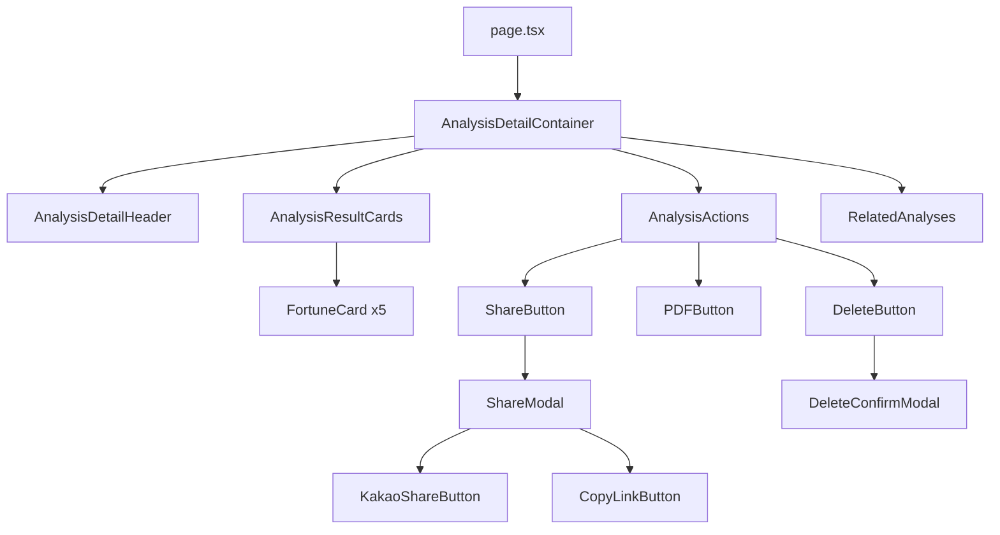
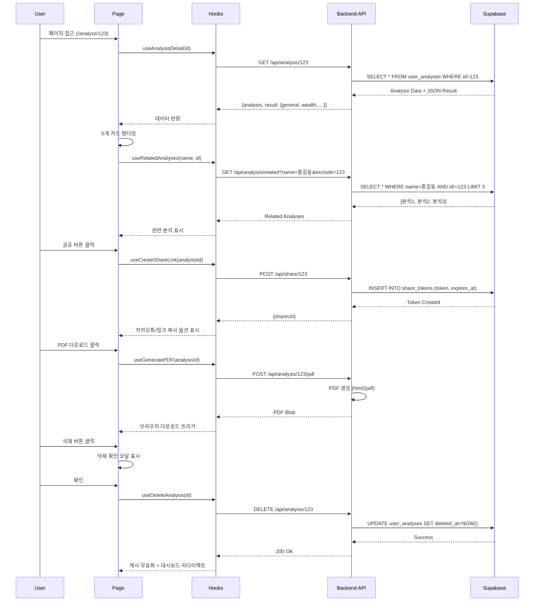

# 분석 상세보기 페이지 구현 계획

> **작성일**: 2025-10-25
> **페이지**: `/analyze/[id]`
> **관련 UC**: UC-006 (분석 상세보기), UC-007 (분석 삭제), UC-016 (PDF 다운로드), UC-017/018 (공유)

---

## 개요

### 목적
사용자가 완료된 AI 사주 분석 결과를 상세하게 확인하고, PDF 다운로드, 공유, 삭제 등의 부가 기능을 수행할 수 있는 페이지를 구현합니다.

### 핵심 기능
1. **분석 결과 조회**: 5가지 운세 카테고리 (총운, 재물운, 애정운, 건강운, 직업운) 표시
2. **PDF 다운로드**: 현재 페이지와 동일한 레이아웃으로 PDF 생성 및 다운로드
3. **공유**: 카카오톡 공유 및 링크 복사 기능
4. **삭제**: 분석 결과 삭제
5. **관련 분석 표시**: 동일 대상의 최근 분석 최대 3개 표시

### 상태관리 전략
- **서버 상태 (React Query)**: 분석 데이터, 관련 분석 목록
- **UI 상태 (Zustand)**: 공유 모달, 삭제 확인 모달
- **로컬 상태 (useState)**: PDF 생성 중 로딩, 공유 링크

---

## 모듈 구조

### 1. 페이지 컴포넌트
| 파일 경로 | 설명 |
|----------|------|
| `src/app/analyze/[id]/page.tsx` | 메인 페이지 컴포넌트 (Server Component) |

### 2. Feature 컴포넌트
| 파일 경로 | 설명 |
|----------|------|
| `src/features/analysis/components/analysis-detail-header.tsx` | 분석 헤더 (이름, 생년월일, 배지) |
| `src/features/analysis/components/analysis-result-cards.tsx` | 결과 카드 그리드 (5개 카드) |
| `src/features/analysis/components/fortune-card.tsx` | 개별 운세 카드 (이모지, 제목, 내용) |
| `src/features/analysis/components/analysis-actions.tsx` | 액션 버튼 그룹 (PDF, 공유, 삭제) |
| `src/features/analysis/components/related-analyses.tsx` | 관련 분석 섹션 |
| `src/features/analysis/components/share-modal.tsx` | 공유 모달 (카카오톡/링크 복사) |
| `src/features/analysis/components/delete-confirm-modal.tsx` | 삭제 확인 모달 |

### 3. React Query Hooks
| 파일 경로 | 설명 |
|----------|------|
| `src/features/analysis/hooks/use-analysis-detail.ts` | 분석 상세 조회 |
| `src/features/analysis/hooks/use-related-analyses.ts` | 관련 분석 목록 조회 |
| `src/features/analysis/hooks/use-create-share-link.ts` | 공유 링크 생성 |
| `src/features/analysis/hooks/use-generate-pdf.ts` | PDF 생성 요청 |
| `src/features/analysis/hooks/use-delete-analysis.ts` | 분석 삭제 |

### 4. Backend API
| 파일 경로 | 설명 |
|----------|------|
| `src/features/analysis/backend/route.ts` | Hono 라우터 (`GET /api/analysis/:id`, `GET /api/analysis/:id/related`) |
| `src/features/analysis/backend/service.ts` | 비즈니스 로직 (Supabase 접근) |
| `src/features/analysis/backend/schema.ts` | Zod 스키마 (응답 타입) |
| `src/features/analysis/backend/error.ts` | 에러 코드 정의 |

### 5. 공유 기능 (별도 feature)
| 파일 경로 | 설명 |
|----------|------|
| `src/features/share/backend/route.ts` | 공유 링크 생성 API (`POST /api/share/:analysisId`) |
| `src/features/share/backend/service.ts` | 공유 토큰 생성 및 저장 |
| `src/features/share/hooks/use-kakao-share.ts` | 카카오톡 공유 훅 |
| `src/features/share/lib/kakao-sdk.ts` | 카카오 SDK 초기화 |

### 6. PDF 생성 (별도 feature)
| 파일 경로 | 설명 |
|----------|------|
| `src/features/pdf/backend/route.ts` | PDF 생성 API (`POST /api/analysis/:id/pdf`) |
| `src/features/pdf/backend/service.ts` | PDF 생성 로직 (html2pdf 또는 jsPDF) |

### 7. 공통 타입 및 상수
| 파일 경로 | 설명 |
|----------|------|
| `src/features/analysis/lib/types.ts` | AnalysisDetail, FortuneType 등 타입 정의 |
| `src/features/analysis/constants/fortune.ts` | 운세 카테고리별 이모지 및 레이블 |

---

## Diagram

### 컴포넌트 계층 구조



### 데이터 플로우



---

## Implementation Plan

### 1. Backend API 구현

#### 1.1. 분석 상세 조회 API

**파일**: `src/features/analysis/backend/route.ts`

```typescript
import { Hono } from 'hono'
import { zValidator } from '@hono/zod-validator'
import { z } from 'zod'
import { AppEnv } from '@/backend/hono/context'
import { getAnalysisDetail } from './service'
import { respond } from '@/backend/http/response'

export function registerAnalysisRoutes(app: Hono<AppEnv>) {
  // 분석 상세 조회
  app.get('/api/analysis/:id', async (c) => {
    const { id } = c.req.param()
    const userId = c.get('userId') // Clerk 인증 미들웨어에서 주입

    const result = await getAnalysisDetail(c.get('supabase'), userId, id)
    return respond(c, result)
  })

  // 관련 분석 조회
  app.get(
    '/api/analysis/:id/related',
    zValidator('query', z.object({
      limit: z.string().optional().default('3'),
    })),
    async (c) => {
      const { id } = c.req.param()
      const { limit } = c.req.valid('query')
      const userId = c.get('userId')

      const result = await getRelatedAnalyses(
        c.get('supabase'),
        userId,
        id,
        parseInt(limit, 10)
      )
      return respond(c, result)
    }
  )
}
```

**파일**: `src/features/analysis/backend/service.ts`

```typescript
import { SupabaseClient } from '@supabase/supabase-js'
import { success, failure } from '@/backend/http/response'
import { ANALYSIS_ERRORS } from './error'

export async function getAnalysisDetail(
  supabase: SupabaseClient,
  userId: string,
  analysisId: string
) {
  const { data, error } = await supabase
    .from('user_analyses')
    .select('*')
    .eq('id', analysisId)
    .eq('user_id', userId)
    .is('deleted_at', null)
    .single()

  if (error || !data) {
    return failure(ANALYSIS_ERRORS.NOT_FOUND, 404)
  }

  // JSON 결과 파싱
  const result = data.result_json as {
    general: string
    wealth: string
    love: string
    health: string
    job: string
  }

  return success({
    analysis: {
      id: data.id,
      name: data.name,
      gender: data.gender,
      birthDate: data.birth_date,
      birthTime: data.birth_time,
      isLunar: data.is_lunar,
      analysisType: data.analysis_type,
      modelUsed: data.model_used,
      createdAt: data.created_at,
    },
    result,
  })
}

export async function getRelatedAnalyses(
  supabase: SupabaseClient,
  userId: string,
  excludeId: string,
  limit: number
) {
  // 현재 분석의 이름 조회
  const { data: currentAnalysis } = await supabase
    .from('user_analyses')
    .select('name')
    .eq('id', excludeId)
    .single()

  if (!currentAnalysis) {
    return failure(ANALYSIS_ERRORS.NOT_FOUND, 404)
  }

  // 동일 이름의 다른 분석 조회
  const { data, error } = await supabase
    .from('user_analyses')
    .select('id, name, analysis_type, model_used, created_at')
    .eq('user_id', userId)
    .eq('name', currentAnalysis.name)
    .neq('id', excludeId)
    .is('deleted_at', null)
    .order('created_at', { ascending: false })
    .limit(limit)

  if (error) {
    return failure('DATABASE_ERROR', 500)
  }

  return success({ analyses: data })
}
```

**파일**: `src/features/analysis/backend/error.ts`

```typescript
export const ANALYSIS_ERRORS = {
  NOT_FOUND: 'ANALYSIS_NOT_FOUND',
  FORBIDDEN: 'ANALYSIS_FORBIDDEN',
  INVALID_JSON: 'ANALYSIS_INVALID_JSON',
} as const
```

**파일**: `src/features/analysis/backend/schema.ts`

```typescript
import { z } from 'zod'

export const analysisDetailResponseSchema = z.object({
  analysis: z.object({
    id: z.string(),
    name: z.string(),
    gender: z.enum(['male', 'female']),
    birthDate: z.string(),
    birthTime: z.string().nullable(),
    isLunar: z.boolean(),
    analysisType: z.enum(['monthly', 'yearly', 'lifetime']),
    modelUsed: z.string(),
    createdAt: z.string(),
  }),
  result: z.object({
    general: z.string(),
    wealth: z.string(),
    love: z.string(),
    health: z.string(),
    job: z.string(),
  }),
})

export const relatedAnalysesResponseSchema = z.object({
  analyses: z.array(
    z.object({
      id: z.string(),
      name: z.string(),
      analysisType: z.enum(['monthly', 'yearly', 'lifetime']),
      modelUsed: z.string(),
      createdAt: z.string(),
    })
  ),
})

export type AnalysisDetailResponse = z.infer<typeof analysisDetailResponseSchema>
export type RelatedAnalysesResponse = z.infer<typeof relatedAnalysesResponseSchema>
```

#### Unit Tests (service.ts)

```typescript
// src/features/analysis/backend/__tests__/service.test.ts
import { describe, it, expect, vi } from 'vitest'
import { getAnalysisDetail, getRelatedAnalyses } from '../service'

describe('getAnalysisDetail', () => {
  it('should return analysis detail when valid', async () => {
    const mockSupabase = {
      from: vi.fn().mockReturnValue({
        select: vi.fn().mockReturnValue({
          eq: vi.fn().mockReturnValue({
            eq: vi.fn().mockReturnValue({
              is: vi.fn().mockReturnValue({
                single: vi.fn().mockResolvedValue({
                  data: {
                    id: '123',
                    name: '홍길동',
                    result_json: { general: '총운 내용', wealth: '재물운 내용', love: '애정운 내용', health: '건강운 내용', job: '직업운 내용' },
                    created_at: '2025-01-01',
                  },
                  error: null,
                }),
              }),
            }),
          }),
        }),
      }),
    }

    const result = await getAnalysisDetail(mockSupabase as any, 'user123', '123')
    expect(result.ok).toBe(true)
    expect(result.data?.analysis.name).toBe('홍길동')
  })

  it('should return NOT_FOUND when analysis does not exist', async () => {
    const mockSupabase = {
      from: vi.fn().mockReturnValue({
        select: vi.fn().mockReturnValue({
          eq: vi.fn().mockReturnValue({
            eq: vi.fn().mockReturnValue({
              is: vi.fn().mockReturnValue({
                single: vi.fn().mockResolvedValue({
                  data: null,
                  error: { message: 'Not found' },
                }),
              }),
            }),
          }),
        }),
      }),
    }

    const result = await getAnalysisDetail(mockSupabase as any, 'user123', '999')
    expect(result.ok).toBe(false)
    expect(result.error?.code).toBe('ANALYSIS_NOT_FOUND')
  })
})

describe('getRelatedAnalyses', () => {
  it('should return related analyses', async () => {
    const mockSupabase = {
      from: vi.fn()
        .mockReturnValueOnce({
          select: vi.fn().mockReturnValue({
            eq: vi.fn().mockReturnValue({
              single: vi.fn().mockResolvedValue({
                data: { name: '홍길동' },
              }),
            }),
          }),
        })
        .mockReturnValueOnce({
          select: vi.fn().mockReturnValue({
            eq: vi.fn().mockReturnValue({
              eq: vi.fn().mockReturnValue({
                neq: vi.fn().mockReturnValue({
                  is: vi.fn().mockReturnValue({
                    order: vi.fn().mockReturnValue({
                      limit: vi.fn().mockResolvedValue({
                        data: [{ id: '456', name: '홍길동', analysis_type: 'yearly' }],
                        error: null,
                      }),
                    }),
                  }),
                }),
              }),
            }),
          }),
        }),
    }

    const result = await getRelatedAnalyses(mockSupabase as any, 'user123', '123', 3)
    expect(result.ok).toBe(true)
    expect(result.data?.analyses.length).toBe(1)
  })
})
```

---

### 2. Frontend Hooks 구현

#### 2.1. 분석 상세 조회 훅

**파일**: `src/features/analysis/hooks/use-analysis-detail.ts`

```typescript
'use client'

import { useQuery } from '@tanstack/react-query'
import { apiClient } from '@/lib/remote/api-client'
import { AnalysisDetailResponse } from '../backend/schema'

export const queryKeys = {
  analysisDetail: (id: string) => ['analyses', 'detail', id] as const,
}

export function useAnalysisDetail(id: string) {
  return useQuery({
    queryKey: queryKeys.analysisDetail(id),
    queryFn: async () => {
      const response = await apiClient.get<AnalysisDetailResponse>(
        `/api/analysis/${id}`
      )
      return response.data
    },
    staleTime: Infinity, // 분석 결과는 변경 불가
    retry: 1,
  })
}
```

#### 2.2. 관련 분석 조회 훅

**파일**: `src/features/analysis/hooks/use-related-analyses.ts`

```typescript
'use client'

import { useQuery } from '@tanstack/react-query'
import { apiClient } from '@/lib/remote/api-client'
import { RelatedAnalysesResponse } from '../backend/schema'

export const queryKeys = {
  relatedAnalyses: (id: string) => ['analyses', 'related', id] as const,
}

export function useRelatedAnalyses(id: string, limit: number = 3) {
  return useQuery({
    queryKey: queryKeys.relatedAnalyses(id),
    queryFn: async () => {
      const response = await apiClient.get<RelatedAnalysesResponse>(
        `/api/analysis/${id}/related`,
        { params: { limit: limit.toString() } }
      )
      return response.data
    },
    staleTime: 5 * 60 * 1000, // 5분
  })
}
```

#### 2.3. 분석 삭제 훅

**파일**: `src/features/analysis/hooks/use-delete-analysis.ts`

```typescript
'use client'

import { useMutation, useQueryClient } from '@tanstack/react-query'
import { useRouter } from 'next/navigation'
import { apiClient } from '@/lib/remote/api-client'

export function useDeleteAnalysis() {
  const queryClient = useQueryClient()
  const router = useRouter()

  return useMutation({
    mutationFn: async (id: string) => {
      await apiClient.delete(`/api/analysis/${id}`)
    },
    onSuccess: () => {
      // 분석 목록 캐시 무효화
      queryClient.invalidateQueries({ queryKey: ['analyses'] })
      // 대시보드로 리다이렉트
      router.push('/dashboard')
    },
  })
}
```

---

### 3. UI 컴포넌트 구현

#### 3.1. 공통 타입 및 상수

**파일**: `src/features/analysis/lib/types.ts`

```typescript
export type FortuneType = 'general' | 'wealth' | 'love' | 'health' | 'job'

export interface FortuneCardData {
  type: FortuneType
  emoji: string
  label: string
  content: string
}
```

**파일**: `src/features/analysis/constants/fortune.ts`

```typescript
import { FortuneType } from '../lib/types'

export const FORTUNE_CONFIG: Record<
  FortuneType,
  { emoji: string; label: string }
> = {
  general: { emoji: '🌟', label: '총운' },
  wealth: { emoji: '💰', label: '재물운' },
  love: { emoji: '💕', label: '애정운' },
  health: { emoji: '🏥', label: '건강운' },
  job: { emoji: '💼', label: '직업운' },
}

export const FORTUNE_ORDER: FortuneType[] = [
  'general',
  'wealth',
  'love',
  'health',
  'job',
]
```

#### 3.2. 메인 페이지 컴포넌트

**파일**: `src/app/analyze/[id]/page.tsx`

```typescript
'use client'

import { use } from 'react'
import { useAnalysisDetail } from '@/features/analysis/hooks/use-analysis-detail'
import { useRelatedAnalyses } from '@/features/analysis/hooks/use-related-analyses'
import { AnalysisDetailHeader } from '@/features/analysis/components/analysis-detail-header'
import { AnalysisResultCards } from '@/features/analysis/components/analysis-result-cards'
import { AnalysisActions } from '@/features/analysis/components/analysis-actions'
import { RelatedAnalyses } from '@/features/analysis/components/related-analyses'
import { Skeleton } from '@/components/ui/skeleton'
import { Button } from '@/components/ui/button'
import { useRouter } from 'next/navigation'

export default function AnalysisDetailPage(props: {
  params: Promise<{ id: string }>
}) {
  const params = use(props.params)
  const router = useRouter()
  const { data, isLoading, error } = useAnalysisDetail(params.id)
  const { data: relatedData } = useRelatedAnalyses(params.id)

  if (isLoading) {
    return (
      <div className="container py-8 space-y-8">
        <Skeleton className="h-32 w-full" />
        <div className="grid gap-6 md:grid-cols-2">
          {[...Array(5)].map((_, i) => (
            <Skeleton key={i} className="h-64 w-full" />
          ))}
        </div>
      </div>
    )
  }

  if (error) {
    return (
      <div className="container py-8 text-center">
        <h1 className="text-2xl font-bold mb-4">분석을 찾을 수 없습니다</h1>
        <p className="text-muted-foreground mb-4">
          존재하지 않거나 접근 권한이 없는 분석입니다.
        </p>
        <Button onClick={() => router.push('/dashboard')}>
          대시보드로 이동
        </Button>
      </div>
    )
  }

  if (!data) return null

  return (
    <div className="container py-8 space-y-8">
      <AnalysisDetailHeader analysis={data.analysis} />
      <AnalysisResultCards result={data.result} />
      <AnalysisActions analysisId={params.id} />
      {relatedData?.analyses && relatedData.analyses.length > 0 && (
        <RelatedAnalyses analyses={relatedData.analyses} />
      )}
    </div>
  )
}
```

#### 3.3. 분석 헤더 컴포넌트

**파일**: `src/features/analysis/components/analysis-detail-header.tsx`

```typescript
'use client'

import { Card, CardContent } from '@/components/ui/card'
import { Badge } from '@/components/ui/badge'
import { format } from 'date-fns'
import { ko } from 'date-fns/locale'

interface AnalysisDetailHeaderProps {
  analysis: {
    name: string
    gender: 'male' | 'female'
    birthDate: string
    birthTime: string | null
    isLunar: boolean
    analysisType: 'monthly' | 'yearly' | 'lifetime'
    modelUsed: string
    createdAt: string
  }
}

const ANALYSIS_TYPE_LABELS = {
  monthly: '월간 운세',
  yearly: '신년 운세',
  lifetime: '평생 운세',
}

export function AnalysisDetailHeader({ analysis }: AnalysisDetailHeaderProps) {
  const birthDateStr = format(new Date(analysis.birthDate), 'yyyy년 M월 d일', {
    locale: ko,
  })
  const createdAtStr = format(new Date(analysis.createdAt), 'yyyy년 M월 d일', {
    locale: ko,
  })

  return (
    <Card>
      <CardContent className="pt-6">
        <div className="flex items-start justify-between">
          <div className="space-y-2">
            <h1 className="text-3xl font-bold">{analysis.name}님의 사주 분석</h1>
            <div className="flex items-center gap-2 text-muted-foreground">
              <span>
                {birthDateStr} ({analysis.isLunar ? '음력' : '양력'})
              </span>
              {analysis.birthTime && <span>| {analysis.birthTime}</span>}
              {!analysis.birthTime && (
                <span className="text-xs">
                  (시간 미입력 - 정오 기준)
                </span>
              )}
            </div>
            <div className="flex items-center gap-2">
              <Badge variant="secondary">
                {ANALYSIS_TYPE_LABELS[analysis.analysisType]}
              </Badge>
              <Badge variant="outline">
                {analysis.modelUsed.includes('pro') ? 'Pro 모델' : 'Flash 모델'}
              </Badge>
            </div>
          </div>
          <div className="text-right text-sm text-muted-foreground">
            <div>분석일: {createdAtStr}</div>
          </div>
        </div>
      </CardContent>
    </Card>
  )
}
```

#### QA Sheet (AnalysisDetailHeader)

| 테스트 케이스 | 입력 | 예상 출력 | 통과 여부 |
|------------|------|----------|----------|
| 정상 데이터 표시 | name="홍길동", birthDate="1990-05-15", isLunar=false | "홍길동님의 사주 분석", "1990년 5월 15일 (양력)" 표시 | ⬜ |
| 음력 표시 | isLunar=true | "(음력)" 텍스트 표시 | ⬜ |
| 시간 미입력 | birthTime=null | "(시간 미입력 - 정오 기준)" 표시 | ⬜ |
| 시간 입력됨 | birthTime="14:30" | "14:30" 표시 | ⬜ |
| Pro 모델 배지 | modelUsed="gemini-2.5-pro" | "Pro 모델" 배지 표시 | ⬜ |
| Flash 모델 배지 | modelUsed="gemini-2.5-flash" | "Flash 모델" 배지 표시 | ⬜ |

#### 3.4. 결과 카드 그리드

**파일**: `src/features/analysis/components/analysis-result-cards.tsx`

```typescript
'use client'

import { FortuneCard } from './fortune-card'
import { FORTUNE_CONFIG, FORTUNE_ORDER } from '../constants/fortune'

interface AnalysisResultCardsProps {
  result: {
    general: string
    wealth: string
    love: string
    health: string
    job: string
  }
}

export function AnalysisResultCards({ result }: AnalysisResultCardsProps) {
  return (
    <div className="grid gap-6 md:grid-cols-2">
      {FORTUNE_ORDER.map((type) => (
        <FortuneCard
          key={type}
          type={type}
          emoji={FORTUNE_CONFIG[type].emoji}
          label={FORTUNE_CONFIG[type].label}
          content={result[type]}
        />
      ))}
    </div>
  )
}
```

#### 3.5. 개별 운세 카드

**파일**: `src/features/analysis/components/fortune-card.tsx`

```typescript
'use client'

import { useState } from 'react'
import { Card, CardHeader, CardTitle, CardContent } from '@/components/ui/card'
import { Button } from '@/components/ui/button'
import { ChevronDown, ChevronUp } from 'lucide-react'
import { FortuneType } from '../lib/types'

interface FortuneCardProps {
  type: FortuneType
  emoji: string
  label: string
  content: string
}

export function FortuneCard({ emoji, label, content }: FortuneCardProps) {
  const [isExpanded, setIsExpanded] = useState(content.length <= 300)

  const displayContent =
    isExpanded || content.length <= 300
      ? content
      : content.slice(0, 300) + '...'

  return (
    <Card>
      <CardHeader>
        <CardTitle className="flex items-center gap-2">
          <span className="text-2xl">{emoji}</span>
          <span>{label}</span>
        </CardTitle>
      </CardHeader>
      <CardContent>
        <p className="whitespace-pre-wrap text-muted-foreground leading-relaxed">
          {displayContent}
        </p>
        {content.length > 300 && (
          <Button
            variant="ghost"
            size="sm"
            onClick={() => setIsExpanded(!isExpanded)}
            className="mt-2"
          >
            {isExpanded ? (
              <>
                <ChevronUp className="mr-1 h-4 w-4" />
                접기
              </>
            ) : (
              <>
                <ChevronDown className="mr-1 h-4 w-4" />
                더 보기
              </>
            )}
          </Button>
        )}
      </CardContent>
    </Card>
  )
}
```

#### QA Sheet (FortuneCard)

| 테스트 케이스 | 입력 | 예상 출력 | 통과 여부 |
|------------|------|----------|----------|
| 짧은 내용 (300자 이하) | content="총운이 좋습니다." | 전체 내용 표시, "더 보기" 버튼 없음 | ⬜ |
| 긴 내용 (300자 초과) | content="총운이..."(500자) | 300자까지만 표시, "더 보기" 버튼 표시 | ⬜ |
| "더 보기" 클릭 | isExpanded=false → 버튼 클릭 | 전체 내용 확장, "접기" 버튼으로 변경 | ⬜ |
| "접기" 클릭 | isExpanded=true → 버튼 클릭 | 300자로 축소, "더 보기" 버튼으로 변경 | ⬜ |
| 이모지 및 제목 표시 | emoji="🌟", label="총운" | "🌟 총운" 헤더 표시 | ⬜ |

#### 3.6. 액션 버튼 그룹

**파일**: `src/features/analysis/components/analysis-actions.tsx`

```typescript
'use client'

import { useState } from 'react'
import { Button } from '@/components/ui/button'
import { Download, Share2, Trash2 } from 'lucide-react'
import { ShareModal } from './share-modal'
import { DeleteConfirmModal } from './delete-confirm-modal'
import { useGeneratePDF } from '../hooks/use-generate-pdf'
import { useToast } from '@/hooks/use-toast'

interface AnalysisActionsProps {
  analysisId: string
}

export function AnalysisActions({ analysisId }: AnalysisActionsProps) {
  const [isShareModalOpen, setIsShareModalOpen] = useState(false)
  const [isDeleteModalOpen, setIsDeleteModalOpen] = useState(false)
  const { mutate: generatePDF, isPending: isPDFGenerating } = useGeneratePDF()
  const { toast } = useToast()

  const handlePDFDownload = () => {
    generatePDF(analysisId, {
      onSuccess: () => {
        toast({
          title: 'PDF 다운로드 시작',
          description: '분석 결과를 PDF로 다운로드합니다.',
        })
      },
      onError: () => {
        toast({
          title: 'PDF 생성 실패',
          description: '잠시 후 다시 시도해주세요.',
          variant: 'destructive',
        })
      },
    })
  }

  return (
    <>
      <div className="flex justify-center gap-4">
        <Button
          variant="outline"
          onClick={handlePDFDownload}
          disabled={isPDFGenerating}
        >
          <Download className="mr-2 h-4 w-4" />
          {isPDFGenerating ? 'PDF 생성 중...' : 'PDF로 저장'}
        </Button>
        <Button variant="outline" onClick={() => setIsShareModalOpen(true)}>
          <Share2 className="mr-2 h-4 w-4" />
          공유하기
        </Button>
        <Button
          variant="outline"
          onClick={() => setIsDeleteModalOpen(true)}
          className="text-destructive hover:text-destructive"
        >
          <Trash2 className="mr-2 h-4 w-4" />
          삭제하기
        </Button>
      </div>

      <ShareModal
        analysisId={analysisId}
        isOpen={isShareModalOpen}
        onClose={() => setIsShareModalOpen(false)}
      />

      <DeleteConfirmModal
        analysisId={analysisId}
        isOpen={isDeleteModalOpen}
        onClose={() => setIsDeleteModalOpen(false)}
      />
    </>
  )
}
```

#### 3.7. 공유 모달

**파일**: `src/features/analysis/components/share-modal.tsx`

```typescript
'use client'

import { useState } from 'react'
import {
  Dialog,
  DialogContent,
  DialogHeader,
  DialogTitle,
} from '@/components/ui/dialog'
import { Button } from '@/components/ui/button'
import { useCreateShareLink } from '@/features/share/hooks/use-create-share-link'
import { useKakaoShare } from '@/features/share/hooks/use-kakao-share'
import { useToast } from '@/hooks/use-toast'
import { Copy, MessageCircle } from 'lucide-react'

interface ShareModalProps {
  analysisId: string
  isOpen: boolean
  onClose: () => void
}

export function ShareModal({ analysisId, isOpen, onClose }: ShareModalProps) {
  const { mutate: createShareLink, isPending } = useCreateShareLink()
  const { shareToKakao } = useKakaoShare()
  const { toast } = useToast()
  const [shareUrl, setShareUrl] = useState<string | null>(null)

  const handleGenerateLink = () => {
    createShareLink(analysisId, {
      onSuccess: (data) => {
        setShareUrl(data.shareUrl)
      },
    })
  }

  const handleCopyLink = () => {
    if (shareUrl) {
      navigator.clipboard.writeText(shareUrl)
      toast({
        title: '링크 복사 완료',
        description: '공유 링크가 클립보드에 복사되었습니다.',
      })
    }
  }

  const handleKakaoShare = () => {
    if (!shareUrl) return
    shareToKakao(shareUrl, '사주 분석 결과')
  }

  return (
    <Dialog open={isOpen} onOpenChange={onClose}>
      <DialogContent>
        <DialogHeader>
          <DialogTitle>분석 결과 공유하기</DialogTitle>
        </DialogHeader>
        <div className="space-y-4">
          {!shareUrl && (
            <Button
              onClick={handleGenerateLink}
              disabled={isPending}
              className="w-full"
            >
              {isPending ? '링크 생성 중...' : '공유 링크 생성'}
            </Button>
          )}
          {shareUrl && (
            <>
              <div className="flex items-center gap-2">
                <input
                  type="text"
                  value={shareUrl}
                  readOnly
                  className="flex-1 px-3 py-2 border rounded-md bg-muted"
                />
                <Button variant="outline" size="icon" onClick={handleCopyLink}>
                  <Copy className="h-4 w-4" />
                </Button>
              </div>
              <Button onClick={handleKakaoShare} className="w-full" variant="outline">
                <MessageCircle className="mr-2 h-4 w-4" />
                카카오톡으로 공유
              </Button>
            </>
          )}
        </div>
      </DialogContent>
    </Dialog>
  )
}
```

#### 3.8. 삭제 확인 모달

**파일**: `src/features/analysis/components/delete-confirm-modal.tsx`

```typescript
'use client'

import {
  AlertDialog,
  AlertDialogAction,
  AlertDialogCancel,
  AlertDialogContent,
  AlertDialogDescription,
  AlertDialogFooter,
  AlertDialogHeader,
  AlertDialogTitle,
} from '@/components/ui/alert-dialog'
import { useDeleteAnalysis } from '../hooks/use-delete-analysis'
import { useToast } from '@/hooks/use-toast'

interface DeleteConfirmModalProps {
  analysisId: string
  isOpen: boolean
  onClose: () => void
}

export function DeleteConfirmModal({
  analysisId,
  isOpen,
  onClose,
}: DeleteConfirmModalProps) {
  const { mutate: deleteAnalysis, isPending } = useDeleteAnalysis()
  const { toast } = useToast()

  const handleDelete = () => {
    deleteAnalysis(analysisId, {
      onSuccess: () => {
        toast({
          title: '분석이 삭제되었습니다',
          description: '대시보드로 이동합니다.',
        })
        onClose()
      },
      onError: () => {
        toast({
          title: '삭제 실패',
          description: '잠시 후 다시 시도해주세요.',
          variant: 'destructive',
        })
      },
    })
  }

  return (
    <AlertDialog open={isOpen} onOpenChange={onClose}>
      <AlertDialogContent>
        <AlertDialogHeader>
          <AlertDialogTitle>정말로 삭제하시겠습니까?</AlertDialogTitle>
          <AlertDialogDescription>
            삭제된 분석은 복구할 수 없습니다.
            <br />
            관련 프로필 및 다른 분석 내역은 유지됩니다.
          </AlertDialogDescription>
        </AlertDialogHeader>
        <AlertDialogFooter>
          <AlertDialogCancel disabled={isPending}>취소</AlertDialogCancel>
          <AlertDialogAction onClick={handleDelete} disabled={isPending}>
            {isPending ? '삭제 중...' : '삭제'}
          </AlertDialogAction>
        </AlertDialogFooter>
      </AlertDialogContent>
    </AlertDialog>
  )
}
```

#### 3.9. 관련 분석 섹션

**파일**: `src/features/analysis/components/related-analyses.tsx`

```typescript
'use client'

import { Card, CardContent } from '@/components/ui/card'
import { Badge } from '@/components/ui/badge'
import { format } from 'date-fns'
import { ko } from 'date-fns/locale'
import Link from 'next/link'

interface RelatedAnalysesProps {
  analyses: Array<{
    id: string
    name: string
    analysisType: 'monthly' | 'yearly' | 'lifetime'
    modelUsed: string
    createdAt: string
  }>
}

const ANALYSIS_TYPE_LABELS = {
  monthly: '월간 운세',
  yearly: '신년 운세',
  lifetime: '평생 운세',
}

export function RelatedAnalyses({ analyses }: RelatedAnalysesProps) {
  return (
    <div className="space-y-4">
      <h2 className="text-2xl font-bold">관련 분석</h2>
      <div className="grid gap-4 md:grid-cols-3">
        {analyses.map((analysis) => (
          <Link key={analysis.id} href={`/analyze/${analysis.id}`}>
            <Card className="hover:shadow-lg transition-shadow cursor-pointer">
              <CardContent className="pt-6">
                <div className="space-y-2">
                  <h3 className="font-semibold">{analysis.name}님</h3>
                  <Badge variant="secondary">
                    {ANALYSIS_TYPE_LABELS[analysis.analysisType]}
                  </Badge>
                  <p className="text-sm text-muted-foreground">
                    {format(new Date(analysis.createdAt), 'yyyy년 M월 d일', {
                      locale: ko,
                    })}
                  </p>
                </div>
              </CardContent>
            </Card>
          </Link>
        ))}
      </div>
    </div>
  )
}
```

#### QA Sheet (RelatedAnalyses)

| 테스트 케이스 | 입력 | 예상 출력 | 통과 여부 |
|------------|------|----------|----------|
| 관련 분석 3개 표시 | analyses.length=3 | 3개 카드 렌더링 | ⬜ |
| 관련 분석 없음 | analyses.length=0 | 컴포넌트 렌더링 안됨 (부모에서 조건부) | ⬜ |
| 카드 클릭 시 이동 | 카드 클릭 | `/analyze/{id}` 페이지로 이동 | ⬜ |
| hover 효과 | 카드에 마우스 올림 | 그림자 효과 표시 | ⬜ |

---

### 4. 공유 기능 구현

#### 4.1. 공유 링크 생성 API

**파일**: `src/features/share/backend/route.ts`

```typescript
import { Hono } from 'hono'
import { AppEnv } from '@/backend/hono/context'
import { createShareToken } from './service'
import { respond } from '@/backend/http/response'

export function registerShareRoutes(app: Hono<AppEnv>) {
  app.post('/api/share/:analysisId', async (c) => {
    const { analysisId } = c.req.param()
    const userId = c.get('userId')

    const result = await createShareToken(
      c.get('supabase'),
      userId,
      analysisId
    )
    return respond(c, result)
  })
}
```

**파일**: `src/features/share/backend/service.ts`

```typescript
import { SupabaseClient } from '@supabase/supabase-js'
import { success, failure } from '@/backend/http/response'
import { v4 as uuidv4 } from 'uuid'

export async function createShareToken(
  supabase: SupabaseClient,
  userId: string,
  analysisId: string
) {
  // 분석 소유권 확인
  const { data: analysis } = await supabase
    .from('user_analyses')
    .select('id')
    .eq('id', analysisId)
    .eq('user_id', userId)
    .is('deleted_at', null)
    .single()

  if (!analysis) {
    return failure('ANALYSIS_NOT_FOUND', 404)
  }

  const token = uuidv4()
  const expiresAt = new Date()
  expiresAt.setDate(expiresAt.getDate() + 7) // 7일 후 만료

  const { error } = await supabase.from('share_tokens').insert({
    analysis_id: analysisId,
    token,
    expires_at: expiresAt.toISOString(),
  })

  if (error) {
    return failure('DATABASE_ERROR', 500)
  }

  const baseUrl = process.env.NEXT_PUBLIC_BASE_URL || 'http://localhost:3000'
  const shareUrl = `${baseUrl}/share/${token}`

  return success({ shareUrl, token })
}
```

#### 4.2. 공유 링크 생성 훅

**파일**: `src/features/share/hooks/use-create-share-link.ts`

```typescript
'use client'

import { useMutation } from '@tanstack/react-query'
import { apiClient } from '@/lib/remote/api-client'

interface CreateShareLinkResponse {
  shareUrl: string
  token: string
}

export function useCreateShareLink() {
  return useMutation({
    mutationFn: async (analysisId: string) => {
      const response = await apiClient.post<CreateShareLinkResponse>(
        `/api/share/${analysisId}`
      )
      return response.data
    },
  })
}
```

#### 4.3. 카카오톡 공유 훅

**파일**: `src/features/share/hooks/use-kakao-share.ts`

```typescript
'use client'

import { useEffect } from 'react'

declare global {
  interface Window {
    Kakao: any
  }
}

export function useKakaoShare() {
  useEffect(() => {
    if (!window.Kakao) {
      const script = document.createElement('script')
      script.src = 'https://developers.kakao.com/sdk/js/kakao.js'
      script.async = true
      document.body.appendChild(script)

      script.onload = () => {
        if (!window.Kakao.isInitialized()) {
          window.Kakao.init(process.env.NEXT_PUBLIC_KAKAO_APP_KEY)
        }
      }
    }
  }, [])

  const shareToKakao = (url: string, title: string) => {
    if (!window.Kakao) {
      console.error('Kakao SDK not loaded')
      return
    }

    window.Kakao.Link.sendDefault({
      objectType: 'feed',
      content: {
        title: `${title}`,
        description: '운명의 해석을 확인해보세요',
        imageUrl: `${process.env.NEXT_PUBLIC_BASE_URL}/og-image.png`,
        link: {
          mobileWebUrl: url,
          webUrl: url,
        },
      },
      buttons: [
        {
          title: '분석 결과 보기',
          link: {
            mobileWebUrl: url,
            webUrl: url,
          },
        },
      ],
    })
  }

  return { shareToKakao }
}
```

---

### 5. PDF 생성 기능 구현

#### 5.1. PDF 생성 API

**파일**: `src/features/pdf/backend/route.ts`

```typescript
import { Hono } from 'hono'
import { AppEnv } from '@/backend/hono/context'
import { generateAnalysisPDF } from './service'
import { respond } from '@/backend/http/response'

export function registerPDFRoutes(app: Hono<AppEnv>) {
  app.post('/api/analysis/:id/pdf', async (c) => {
    const { id } = c.req.param()
    const userId = c.get('userId')

    const result = await generateAnalysisPDF(c.get('supabase'), userId, id)

    if (!result.ok) {
      return respond(c, result)
    }

    // PDF Blob 반환
    return new Response(result.data.pdfBlob, {
      headers: {
        'Content-Type': 'application/pdf',
        'Content-Disposition': `attachment; filename="analysis-${id}.pdf"`,
      },
    })
  })
}
```

**파일**: `src/features/pdf/backend/service.ts`

```typescript
import { SupabaseClient } from '@supabase/supabase-js'
import { success, failure } from '@/backend/http/response'
import jsPDF from 'jspdf'

export async function generateAnalysisPDF(
  supabase: SupabaseClient,
  userId: string,
  analysisId: string
) {
  // 분석 데이터 조회
  const { data, error } = await supabase
    .from('user_analyses')
    .select('*')
    .eq('id', analysisId)
    .eq('user_id', userId)
    .is('deleted_at', null)
    .single()

  if (error || !data) {
    return failure('ANALYSIS_NOT_FOUND', 404)
  }

  // PDF 생성
  const doc = new jsPDF()
  const result = data.result_json as any

  // 폰트 설정 (한글 지원)
  doc.setFont('NotoSansKR', 'normal')

  // 헤더
  doc.setFontSize(20)
  doc.text(`${data.name}님의 사주 분석`, 20, 20)

  doc.setFontSize(12)
  doc.text(`생년월일: ${data.birth_date} (${data.is_lunar ? '음력' : '양력'})`, 20, 30)

  // 결과 내용
  let yPosition = 50
  const categories = [
    { key: 'general', label: '총운', emoji: '🌟' },
    { key: 'wealth', label: '재물운', emoji: '💰' },
    { key: 'love', label: '애정운', emoji: '💕' },
    { key: 'health', label: '건강운', emoji: '🏥' },
    { key: 'job', label: '직업운', emoji: '💼' },
  ]

  categories.forEach((cat) => {
    doc.setFontSize(16)
    doc.text(`${cat.emoji} ${cat.label}`, 20, yPosition)
    yPosition += 10

    doc.setFontSize(10)
    const lines = doc.splitTextToSize(result[cat.key], 170)
    doc.text(lines, 20, yPosition)
    yPosition += lines.length * 5 + 10

    if (yPosition > 270) {
      doc.addPage()
      yPosition = 20
    }
  })

  const pdfBlob = doc.output('blob')
  return success({ pdfBlob })
}
```

#### 5.2. PDF 생성 훅

**파일**: `src/features/analysis/hooks/use-generate-pdf.ts`

```typescript
'use client'

import { useMutation } from '@tanstack/react-query'
import { apiClient } from '@/lib/remote/api-client'

export function useGeneratePDF() {
  return useMutation({
    mutationFn: async (analysisId: string) => {
      const response = await apiClient.post(
        `/api/analysis/${analysisId}/pdf`,
        {},
        { responseType: 'blob' }
      )

      // Blob을 다운로드로 트리거
      const url = window.URL.createObjectURL(response.data)
      const link = document.createElement('a')
      link.href = url
      link.download = `analysis-${analysisId}.pdf`
      document.body.appendChild(link)
      link.click()
      document.body.removeChild(link)
      window.URL.revokeObjectURL(url)
    },
  })
}
```

---

## 구현 순서

### Phase 1: 백엔드 API (1-2일)
1. ✅ 분석 상세 조회 API 구현 (`GET /api/analysis/:id`)
2. ✅ 관련 분석 조회 API 구현 (`GET /api/analysis/:id/related`)
3. ✅ 에러 코드 및 스키마 정의
4. ✅ Unit Tests 작성

### Phase 2: 프론트엔드 Hooks (1일)
1. ✅ React Query 훅 구현 (`use-analysis-detail`, `use-related-analyses`)
2. ✅ 삭제 훅 구현 (`use-delete-analysis`)

### Phase 3: UI 컴포넌트 (2-3일)
1. ✅ 공통 타입 및 상수 정의
2. ✅ 메인 페이지 컴포넌트
3. ✅ 분석 헤더 컴포넌트
4. ✅ 결과 카드 그리드 및 개별 카드
5. ✅ 액션 버튼 그룹
6. ✅ 관련 분석 섹션
7. ✅ QA Sheet 기반 테스트

### Phase 4: 공유 기능 (1-2일)
1. ✅ 공유 링크 생성 API 및 서비스
2. ✅ 공유 모달 컴포넌트
3. ✅ 카카오톡 공유 훅
4. ✅ 링크 복사 기능

### Phase 5: PDF 생성 (1-2일)
1. ✅ PDF 생성 API 구현
2. ✅ PDF 생성 훅
3. ✅ jsPDF 라이브러리 설정 (한글 폰트)
4. ✅ 다운로드 트리거 구현

### Phase 6: 삭제 기능 (1일)
1. ✅ 삭제 확인 모달
2. ✅ 삭제 API 연동 (이미 구현된 `DELETE /api/analysis/:id` 사용)
3. ✅ 캐시 무효화 및 리다이렉트

### Phase 7: 통합 테스트 및 QA (1-2일)
1. ✅ E2E 테스트 (Playwright)
2. ✅ 반응형 디자인 검증 (모바일/데스크톱)
3. ✅ 에러 케이스 테스트 (404, 403 등)
4. ✅ 성능 최적화 (이미지 lazy loading, 코드 스플리팅)

---

## 환경 변수

```env
# .env.local
NEXT_PUBLIC_BASE_URL=http://localhost:3000
NEXT_PUBLIC_KAKAO_APP_KEY=your_kakao_app_key
```

---

## 문서 끝
