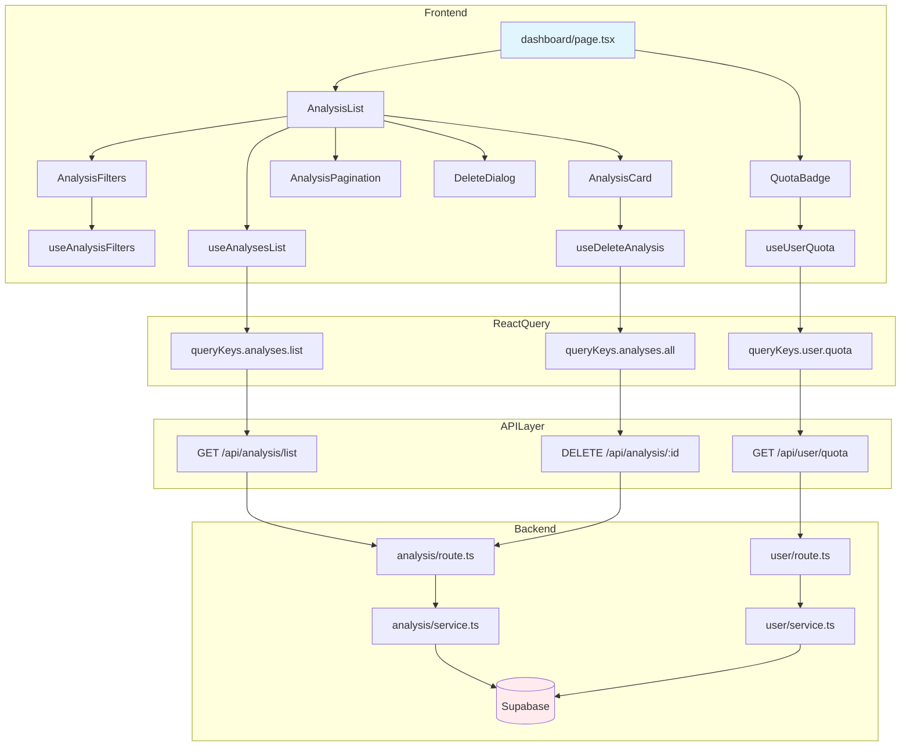

# 대시보드 (분석 목록) 페이지 구현 계획

> **페이지**: `/dashboard`
> **작성일**: 2025-10-25
> **관련 UC**: UC-005 (사주 분석 목록 조회), UC-007 (분석 삭제)

---

## 목차

1. [개요](#개요)
2. [요구사항 분석](#요구사항-분석)
3. [모듈 설계](#모듈-설계)
4. [아키텍처 다이어그램](#아키텍처-다이어그램)
5. [구현 계획](#구현-계획)
6. [API 명세](#api-명세)
7. [상태 관리](#상태-관리)
8. [UI/UX 설계](#uiux-설계)
9. [테스트 계획](#테스트-계획)

---

## 개요

대시보드는 사용자의 사주 분석 목록을 조회하고 관리하는 핵심 페이지입니다. 검색, 필터링, 페이지네이션 기능을 제공하며, 각 분석을 삭제하거나 상세보기로 이동할 수 있습니다.

### 핵심 기능
- 분석 목록 조회 (페이지네이션)
- 이름 검색
- 분석 종류별 필터링
- 개별 분석 삭제
- 빈 상태 처리
- 사용자 구독 정보 표시

---

## 요구사항 분석

### 기능 요구사항

#### 1. 목록 조회 (UC-005)
- 사용자별 분석 목록을 생성일 기준 내림차순으로 조회
- 페이지당 10개씩 표시
- 카드 형태의 3열 그리드 레이아웃
- 각 카드 정보:
  - 대상 이름
  - 분석 종류 배지 (월간/신년/평생)
  - 생성일
  - 사용 AI 모델 배지 (Flash/Pro)
  - 호버 시 삭제 버튼

#### 2. 검색 (UC-005 AF-2)
- 대상 이름으로 부분 일치 검색
- 검색 키워드 하이라이트
- 검색 태그 표시 (제거 가능)

#### 3. 필터링 (UC-005 AF-3)
- 분석 종류별 필터: 전체/월간/신년/평생
- 필터 태그 표시 (제거 가능)
- 검색과 필터 동시 적용 가능

#### 4. 페이지네이션 (UC-005 AF-5)
- 하단에 페이지 번호 표시
- 이전/다음 버튼
- URL 쿼리 파라미터 동기화

#### 5. 삭제 (UC-007)
- 개별 분석 삭제
- 확인 다이얼로그
- 삭제 후 목록 자동 갱신

#### 6. 빈 상태 (UC-005 AF-1)
- 분석 내역 없을 때 안내 메시지
- "첫 분석하기" CTA 버튼

#### 7. 헤더 정보
- 현재 플랜 표시 (무료/Pro)
- 남은 분석 횟수 배지

### 비기능 요구사항

- 로딩 시 스켈레톤 UI
- 반응형 디자인 (모바일: 1열, 태블릿: 2열, 데스크톱: 3열)
- React Query 캐싱 (5분)
- 에러 상태 처리
- 접근성 (키보드 네비게이션, ARIA)

---

## 모듈 설계

### 디렉토리 구조

```
src/
├── features/analysis/
│   ├── backend/
│   │   ├── route.ts                # Hono 라우터 (목록 조회, 삭제)
│   │   ├── service.ts              # Supabase 쿼리 로직
│   │   ├── schema.ts               # Zod 스키마 (요청/응답)
│   │   └── error.ts                # 에러 코드 정의
│   ├── components/
│   │   ├── analysis-card.tsx       # 분석 카드 컴포넌트
│   │   ├── analysis-list.tsx       # 목록 컨테이너
│   │   ├── analysis-filters.tsx    # 검색/필터 UI
│   │   ├── analysis-pagination.tsx # 페이지네이션 UI
│   │   ├── delete-dialog.tsx       # 삭제 확인 모달
│   │   └── analysis-card-skeleton.tsx # 스켈레톤 로딩
│   ├── hooks/
│   │   ├── use-analyses-list.ts    # 목록 조회 훅
│   │   ├── use-delete-analysis.ts  # 삭제 훅
│   │   └── use-analysis-filters.ts # 필터/검색 상태 훅
│   ├── lib/
│   │   ├── dto.ts                  # 스키마 재노출
│   │   └── constants.ts            # 상수 (분석 종류, 배지 색상 등)
│   └── types.ts                    # 타입 정의
│
├── features/user/
│   ├── backend/
│   │   ├── route.ts                # 사용자 정보 라우터
│   │   ├── service.ts              # 구독 정보 조회
│   │   └── schema.ts               # 구독 상태 스키마
│   ├── hooks/
│   │   └── use-user-quota.ts       # 잔여 횟수 조회 훅
│   └── components/
│       └── quota-badge.tsx         # 잔여 횟수 배지
│
├── app/(protected)/dashboard/
│   └── page.tsx                    # 대시보드 페이지 진입점
│
└── lib/
    └── query-keys.ts               # React Query 키 팩토리
```

### 모듈 목록

| 모듈 | 위치 | 설명 |
|------|------|------|
| **Backend** |
| `analysis/backend/route.ts` | API 라우터 | 목록 조회, 삭제 엔드포인트 |
| `analysis/backend/service.ts` | 비즈니스 로직 | Supabase 쿼리, 필터링 |
| `analysis/backend/schema.ts` | 검증 | 요청/응답 Zod 스키마 |
| `user/backend/route.ts` | API 라우터 | 구독 정보 조회 |
| `user/backend/service.ts` | 비즈니스 로직 | 사용자 크레딧 조회 |
| **Frontend** |
| `app/(protected)/dashboard/page.tsx` | 페이지 | 대시보드 진입점 |
| `analysis/components/analysis-list.tsx` | 컴포넌트 | 목록 컨테이너 |
| `analysis/components/analysis-card.tsx` | 컴포넌트 | 개별 카드 |
| `analysis/components/analysis-filters.tsx` | 컴포넌트 | 검색/필터 UI |
| `analysis/components/analysis-pagination.tsx` | 컴포넌트 | 페이지네이션 |
| `analysis/components/delete-dialog.tsx` | 컴포넌트 | 삭제 확인 모달 |
| `analysis/hooks/use-analyses-list.ts` | 훅 | 목록 조회 React Query |
| `analysis/hooks/use-delete-analysis.ts` | 훅 | 삭제 Mutation |
| `analysis/hooks/use-analysis-filters.ts` | 훅 | 필터/검색 상태 |
| `user/hooks/use-user-quota.ts` | 훅 | 잔여 횟수 조회 |
| `user/components/quota-badge.tsx` | 컴포넌트 | 잔여 횟수 배지 |

---

## 아키텍처 다이어그램



---

## 구현 계획

### Phase 1: Backend API 구현

#### 1.1 스키마 정의 (`analysis/backend/schema.ts`)

```typescript
import { z } from 'zod';

// 요청 스키마
export const AnalysisListQuerySchema = z.object({
  page: z.coerce.number().int().min(1).default(1),
  limit: z.coerce.number().int().min(1).max(50).default(10),
  search: z.string().optional(),
  analysisType: z.enum(['monthly', 'yearly', 'lifetime']).optional(),
  sortBy: z.enum(['created_at', 'name']).default('created_at'),
  order: z.enum(['asc', 'desc']).default('desc'),
});

export type AnalysisListQuery = z.infer<typeof AnalysisListQuerySchema>;

// 응답 스키마
export const AnalysisListItemSchema = z.object({
  id: z.string().uuid(),
  name: z.string(),
  analysisType: z.enum(['monthly', 'yearly', 'lifetime']),
  modelUsed: z.enum(['gemini-2.5-flash', 'gemini-2.5-pro']),
  createdAt: z.string().datetime(),
});

export const AnalysisListResponseSchema = z.object({
  analyses: z.array(AnalysisListItemSchema),
  pagination: z.object({
    total: z.number().int(),
    page: z.number().int(),
    limit: z.number().int(),
    totalPages: z.number().int(),
  }),
});

export type AnalysisListItem = z.infer<typeof AnalysisListItemSchema>;
export type AnalysisListResponse = z.infer<typeof AnalysisListResponseSchema>;

// 삭제 요청
export const DeleteAnalysisParamsSchema = z.object({
  id: z.string().uuid(),
});

export type DeleteAnalysisParams = z.infer<typeof DeleteAnalysisParamsSchema>;
```

#### 1.2 서비스 로직 (`analysis/backend/service.ts`)

```typescript
import type { SupabaseClient } from '@supabase/supabase-js';
import { failure, success, type HandlerResult } from '@/backend/http/response';
import type {
  AnalysisListQuery,
  AnalysisListResponse,
} from './schema';
import { analysisErrorCodes, type AnalysisServiceError } from './error';

export const getAnalysesList = async (
  client: SupabaseClient,
  userId: string,
  query: AnalysisListQuery,
): Promise<HandlerResult<AnalysisListResponse, AnalysisServiceError, unknown>> => {
  const { page, limit, search, analysisType, sortBy, order } = query;
  const offset = (page - 1) * limit;

  // 쿼리 빌더 시작
  let queryBuilder = client
    .from('user_analyses')
    .select('id, name, analysis_type, model_used, created_at', { count: 'exact' })
    .eq('user_id', userId)
    .is('deleted_at', null);

  // 검색 필터
  if (search) {
    queryBuilder = queryBuilder.ilike('name', `%${search}%`);
  }

  // 분석 종류 필터
  if (analysisType) {
    queryBuilder = queryBuilder.eq('analysis_type', analysisType);
  }

  // 정렬
  queryBuilder = queryBuilder.order(sortBy, { ascending: order === 'asc' });

  // 페이지네이션
  queryBuilder = queryBuilder.range(offset, offset + limit - 1);

  const { data, error, count } = await queryBuilder;

  if (error) {
    return failure(500, analysisErrorCodes.fetchError, error.message);
  }

  const totalPages = Math.ceil((count || 0) / limit);

  return success({
    analyses: data.map((row) => ({
      id: row.id,
      name: row.name,
      analysisType: row.analysis_type,
      modelUsed: row.model_used,
      createdAt: row.created_at,
    })),
    pagination: {
      total: count || 0,
      page,
      limit,
      totalPages,
    },
  });
};

export const deleteAnalysisById = async (
  client: SupabaseClient,
  userId: string,
  analysisId: string,
): Promise<HandlerResult<void, AnalysisServiceError, unknown>> => {
  // 권한 확인
  const { data: analysis, error: fetchError } = await client
    .from('user_analyses')
    .select('id')
    .eq('id', analysisId)
    .eq('user_id', userId)
    .is('deleted_at', null)
    .maybeSingle();

  if (fetchError) {
    return failure(500, analysisErrorCodes.fetchError, fetchError.message);
  }

  if (!analysis) {
    return failure(404, analysisErrorCodes.notFound, 'Analysis not found');
  }

  // Soft delete
  const { error: updateError } = await client
    .from('user_analyses')
    .update({ deleted_at: new Date().toISOString() })
    .eq('id', analysisId);

  if (updateError) {
    return failure(500, analysisErrorCodes.deleteError, updateError.message);
  }

  return success(undefined);
};
```

#### 1.3 에러 코드 (`analysis/backend/error.ts`)

```typescript
export const analysisErrorCodes = {
  fetchError: 'ANALYSIS_FETCH_ERROR',
  notFound: 'ANALYSIS_NOT_FOUND',
  deleteError: 'ANALYSIS_DELETE_ERROR',
  validationError: 'ANALYSIS_VALIDATION_ERROR',
} as const;

export type AnalysisServiceError =
  (typeof analysisErrorCodes)[keyof typeof analysisErrorCodes];
```

#### 1.4 라우터 (`analysis/backend/route.ts`)

```typescript
import type { Hono } from 'hono';
import { failure, respond } from '@/backend/http/response';
import { getSupabase, getLogger, type AppEnv } from '@/backend/hono/context';
import {
  AnalysisListQuerySchema,
  DeleteAnalysisParamsSchema,
} from './schema';
import { getAnalysesList, deleteAnalysisById } from './service';

export const registerAnalysisRoutes = (app: Hono<AppEnv>) => {
  // 목록 조회
  app.get('/api/analysis/list', async (c) => {
    const userId = c.get('userId'); // 인증 미들웨어에서 주입
    const query = c.req.query();

    const parsedQuery = AnalysisListQuerySchema.safeParse(query);
    if (!parsedQuery.success) {
      return respond(
        c,
        failure(400, 'INVALID_QUERY', 'Invalid query parameters', parsedQuery.error.format()),
      );
    }

    const supabase = getSupabase(c);
    const result = await getAnalysesList(supabase, userId, parsedQuery.data);

    return respond(c, result);
  });

  // 삭제
  app.delete('/api/analysis/:id', async (c) => {
    const userId = c.get('userId');
    const parsedParams = DeleteAnalysisParamsSchema.safeParse({
      id: c.req.param('id'),
    });

    if (!parsedParams.success) {
      return respond(
        c,
        failure(400, 'INVALID_PARAMS', 'Invalid analysis ID', parsedParams.error.format()),
      );
    }

    const supabase = getSupabase(c);
    const logger = getLogger(c);

    const result = await deleteAnalysisById(supabase, userId, parsedParams.data.id);

    if (!result.ok) {
      logger.error('Failed to delete analysis', result.error);
    }

    return respond(c, result);
  });
};
```

#### 1.5 사용자 구독 정보 (`user/backend/service.ts`)

```typescript
import type { SupabaseClient } from '@supabase/supabase-js';
import { failure, success, type HandlerResult } from '@/backend/http/response';
import type { UserQuotaResponse } from './schema';
import { userErrorCodes, type UserServiceError } from './error';

export const getUserQuota = async (
  client: SupabaseClient,
  userId: string,
): Promise<HandlerResult<UserQuotaResponse, UserServiceError, unknown>> => {
  const { data, error } = await client
    .from('users')
    .select('subscription_tier, remaining_analyses')
    .eq('clerk_id', userId)
    .maybeSingle();

  if (error) {
    return failure(500, userErrorCodes.fetchError, error.message);
  }

  if (!data) {
    return failure(404, userErrorCodes.notFound, 'User not found');
  }

  return success({
    plan: data.subscription_tier,
    remainingAnalyses: data.remaining_analyses,
  });
};
```

### Phase 2: Frontend Hooks 구현

#### 2.1 React Query 키 팩토리 (`lib/query-keys.ts`)

```typescript
export const queryKeys = {
  analyses: {
    all: () => ['analyses'] as const,
    list: (filters: AnalysisListQuery) => ['analyses', 'list', filters] as const,
    detail: (id: string) => ['analyses', 'detail', id] as const,
  },
  user: {
    quota: () => ['user', 'quota'] as const,
    subscription: () => ['user', 'subscription'] as const,
  },
} as const;
```

#### 2.2 목록 조회 훅 (`analysis/hooks/use-analyses-list.ts`)

```typescript
'use client';

import { useQuery } from '@tanstack/react-query';
import { apiClient, extractApiErrorMessage } from '@/lib/remote/api-client';
import { AnalysisListResponseSchema } from '@/features/analysis/lib/dto';
import { queryKeys } from '@/lib/query-keys';
import type { AnalysisListQuery } from '@/features/analysis/backend/schema';

const fetchAnalysesList = async (query: AnalysisListQuery) => {
  try {
    const { data } = await apiClient.get('/api/analysis/list', { params: query });
    return AnalysisListResponseSchema.parse(data);
  } catch (error) {
    const message = extractApiErrorMessage(error, 'Failed to fetch analyses list.');
    throw new Error(message);
  }
};

export const useAnalysesList = (query: AnalysisListQuery) =>
  useQuery({
    queryKey: queryKeys.analyses.list(query),
    queryFn: () => fetchAnalysesList(query),
    staleTime: 5 * 60 * 1000, // 5분
  });
```

#### 2.3 삭제 훅 (`analysis/hooks/use-delete-analysis.ts`)

```typescript
'use client';

import { useMutation, useQueryClient } from '@tanstack/react-query';
import { apiClient, extractApiErrorMessage } from '@/lib/remote/api-client';
import { queryKeys } from '@/lib/query-keys';

const deleteAnalysis = async (id: string) => {
  try {
    await apiClient.delete(`/api/analysis/${id}`);
  } catch (error) {
    const message = extractApiErrorMessage(error, 'Failed to delete analysis.');
    throw new Error(message);
  }
};

export const useDeleteAnalysis = () => {
  const queryClient = useQueryClient();

  return useMutation({
    mutationFn: deleteAnalysis,
    onSuccess: () => {
      // 목록 캐시 무효화
      queryClient.invalidateQueries({ queryKey: queryKeys.analyses.all() });
    },
  });
};
```

#### 2.4 필터 상태 훅 (`analysis/hooks/use-analysis-filters.ts`)

```typescript
'use client';

import { useRouter, useSearchParams } from 'next/navigation';
import { useCallback } from 'react';
import type { AnalysisListQuery } from '@/features/analysis/backend/schema';

export const useAnalysisFilters = () => {
  const router = useRouter();
  const searchParams = useSearchParams();

  const filters: AnalysisListQuery = {
    page: Number(searchParams.get('page')) || 1,
    limit: 10,
    search: searchParams.get('search') || undefined,
    analysisType: (searchParams.get('type') as AnalysisListQuery['analysisType']) || undefined,
    sortBy: 'created_at',
    order: 'desc',
  };

  const updateFilters = useCallback(
    (updates: Partial<AnalysisListQuery>) => {
      const params = new URLSearchParams(searchParams);

      // 페이지는 필터 변경 시 1로 리셋
      if (updates.search !== undefined || updates.analysisType !== undefined) {
        params.set('page', '1');
      } else if (updates.page !== undefined) {
        params.set('page', String(updates.page));
      }

      if (updates.search !== undefined) {
        if (updates.search) {
          params.set('search', updates.search);
        } else {
          params.delete('search');
        }
      }

      if (updates.analysisType !== undefined) {
        if (updates.analysisType) {
          params.set('type', updates.analysisType);
        } else {
          params.delete('type');
        }
      }

      router.push(`/dashboard?${params.toString()}`);
    },
    [router, searchParams],
  );

  const clearFilters = useCallback(() => {
    router.push('/dashboard');
  }, [router]);

  return { filters, updateFilters, clearFilters };
};
```

#### 2.5 잔여 횟수 훅 (`user/hooks/use-user-quota.ts`)

```typescript
'use client';

import { useQuery } from '@tanstack/react-query';
import { apiClient, extractApiErrorMessage } from '@/lib/remote/api-client';
import { UserQuotaResponseSchema } from '@/features/user/lib/dto';
import { queryKeys } from '@/lib/query-keys';

const fetchUserQuota = async () => {
  try {
    const { data } = await apiClient.get('/api/user/quota');
    return UserQuotaResponseSchema.parse(data);
  } catch (error) {
    const message = extractApiErrorMessage(error, 'Failed to fetch user quota.');
    throw new Error(message);
  }
};

export const useUserQuota = () =>
  useQuery({
    queryKey: queryKeys.user.quota(),
    queryFn: fetchUserQuota,
    staleTime: 1 * 60 * 1000, // 1분
  });
```

### Phase 3: UI 컴포넌트 구현

#### 3.1 분석 카드 (`analysis/components/analysis-card.tsx`)

```typescript
'use client';

import { Card, CardContent, CardFooter, CardHeader } from '@/components/ui/card';
import { Badge } from '@/components/ui/badge';
import { Button } from '@/components/ui/button';
import { Trash2 } from 'lucide-react';
import Link from 'next/link';
import { format } from 'date-fns';
import { ko } from 'date-fns/locale';
import type { AnalysisListItem } from '@/features/analysis/backend/schema';
import { ANALYSIS_TYPE_LABELS, MODEL_LABELS } from '@/features/analysis/lib/constants';

type AnalysisCardProps = {
  analysis: AnalysisListItem;
  onDelete: (id: string) => void;
};

export const AnalysisCard = ({ analysis, onDelete }: AnalysisCardProps) => {
  return (
    <Card className="group relative transition-shadow hover:shadow-lg">
      <Link href={`/analyze/${analysis.id}`}>
        <CardHeader>
          <div className="flex items-start justify-between">
            <h3 className="text-lg font-semibold">{analysis.name}</h3>
            <Button
              variant="ghost"
              size="icon"
              className="opacity-0 group-hover:opacity-100"
              onClick={(e) => {
                e.preventDefault();
                onDelete(analysis.id);
              }}
            >
              <Trash2 className="h-4 w-4 text-destructive" />
            </Button>
          </div>
        </CardHeader>
        <CardContent>
          <div className="flex gap-2">
            <Badge variant="secondary">
              {ANALYSIS_TYPE_LABELS[analysis.analysisType]}
            </Badge>
            <Badge variant="outline">
              {MODEL_LABELS[analysis.modelUsed]}
            </Badge>
          </div>
        </CardContent>
        <CardFooter>
          <p className="text-sm text-muted-foreground">
            {format(new Date(analysis.createdAt), 'yyyy년 MM월 dd일', { locale: ko })}
          </p>
        </CardFooter>
      </Link>
    </Card>
  );
};
```

#### 3.2 검색/필터 (`analysis/components/analysis-filters.tsx`)

```typescript
'use client';

import { Input } from '@/components/ui/input';
import { Button } from '@/components/ui/button';
import { Badge } from '@/components/ui/badge';
import {
  Select,
  SelectContent,
  SelectItem,
  SelectTrigger,
  SelectValue,
} from '@/components/ui/select';
import { Search, X } from 'lucide-react';
import { useState } from 'react';
import type { AnalysisListQuery } from '@/features/analysis/backend/schema';
import { ANALYSIS_TYPE_OPTIONS } from '@/features/analysis/lib/constants';

type AnalysisFiltersProps = {
  filters: AnalysisListQuery;
  onUpdateFilters: (updates: Partial<AnalysisListQuery>) => void;
  onClearFilters: () => void;
};

export const AnalysisFilters = ({
  filters,
  onUpdateFilters,
  onClearFilters,
}: AnalysisFiltersProps) => {
  const [searchInput, setSearchInput] = useState(filters.search || '');

  const handleSearchSubmit = (e: React.FormEvent) => {
    e.preventDefault();
    onUpdateFilters({ search: searchInput || undefined });
  };

  const hasActiveFilters = Boolean(filters.search || filters.analysisType);

  return (
    <div className="space-y-4">
      <div className="flex gap-4">
        {/* 검색창 */}
        <form onSubmit={handleSearchSubmit} className="flex flex-1 gap-2">
          <Input
            placeholder="이름으로 검색..."
            value={searchInput}
            onChange={(e) => setSearchInput(e.target.value)}
          />
          <Button type="submit" variant="secondary">
            <Search className="h-4 w-4" />
          </Button>
        </form>

        {/* 분석 종류 필터 */}
        <Select
          value={filters.analysisType || 'all'}
          onValueChange={(value) =>
            onUpdateFilters({
              analysisType: value === 'all' ? undefined : (value as AnalysisListQuery['analysisType']),
            })
          }
        >
          <SelectTrigger className="w-[180px]">
            <SelectValue placeholder="분석 종류" />
          </SelectTrigger>
          <SelectContent>
            <SelectItem value="all">전체</SelectItem>
            {ANALYSIS_TYPE_OPTIONS.map((option) => (
              <SelectItem key={option.value} value={option.value}>
                {option.label}
              </SelectItem>
            ))}
          </SelectContent>
        </Select>
      </div>

      {/* 활성 필터 태그 */}
      {hasActiveFilters && (
        <div className="flex flex-wrap gap-2">
          {filters.search && (
            <Badge variant="secondary" className="gap-1">
              {filters.search}
              <button
                onClick={() => {
                  setSearchInput('');
                  onUpdateFilters({ search: undefined });
                }}
              >
                <X className="h-3 w-3" />
              </button>
            </Badge>
          )}
          {filters.analysisType && (
            <Badge variant="secondary" className="gap-1">
              {ANALYSIS_TYPE_OPTIONS.find((o) => o.value === filters.analysisType)?.label}
              <button onClick={() => onUpdateFilters({ analysisType: undefined })}>
                <X className="h-3 w-3" />
              </button>
            </Badge>
          )}
          <Button variant="ghost" size="sm" onClick={onClearFilters}>
            전체 해제
          </Button>
        </div>
      )}
    </div>
  );
};
```

#### 3.3 페이지네이션 (`analysis/components/analysis-pagination.tsx`)

```typescript
'use client';

import { Button } from '@/components/ui/button';
import { ChevronLeft, ChevronRight } from 'lucide-react';

type AnalysisPaginationProps = {
  currentPage: number;
  totalPages: number;
  onPageChange: (page: number) => void;
};

export const AnalysisPagination = ({
  currentPage,
  totalPages,
  onPageChange,
}: AnalysisPaginationProps) => {
  if (totalPages <= 1) return null;

  const pages = Array.from({ length: totalPages }, (_, i) => i + 1);

  return (
    <div className="flex items-center justify-center gap-2">
      <Button
        variant="outline"
        size="icon"
        disabled={currentPage === 1}
        onClick={() => onPageChange(currentPage - 1)}
      >
        <ChevronLeft className="h-4 w-4" />
      </Button>

      {pages.map((page) => (
        <Button
          key={page}
          variant={page === currentPage ? 'default' : 'outline'}
          size="sm"
          onClick={() => onPageChange(page)}
        >
          {page}
        </Button>
      ))}

      <Button
        variant="outline"
        size="icon"
        disabled={currentPage === totalPages}
        onClick={() => onPageChange(currentPage + 1)}
      >
        <ChevronRight className="h-4 w-4" />
      </Button>
    </div>
  );
};
```

#### 3.4 삭제 확인 모달 (`analysis/components/delete-dialog.tsx`)

```typescript
'use client';

import {
  AlertDialog,
  AlertDialogAction,
  AlertDialogCancel,
  AlertDialogContent,
  AlertDialogDescription,
  AlertDialogFooter,
  AlertDialogHeader,
  AlertDialogTitle,
} from '@/components/ui/alert-dialog';

type DeleteDialogProps = {
  open: boolean;
  onOpenChange: (open: boolean) => void;
  onConfirm: () => void;
};

export const DeleteDialog = ({ open, onOpenChange, onConfirm }: DeleteDialogProps) => {
  return (
    <AlertDialog open={open} onOpenChange={onOpenChange}>
      <AlertDialogContent>
        <AlertDialogHeader>
          <AlertDialogTitle>분석을 삭제하시겠습니까?</AlertDialogTitle>
          <AlertDialogDescription>
            이 작업은 되돌릴 수 없습니다. 삭제된 분석은 30일 후 완전히 제거됩니다.
          </AlertDialogDescription>
        </AlertDialogHeader>
        <AlertDialogFooter>
          <AlertDialogCancel>취소</AlertDialogCancel>
          <AlertDialogAction onClick={onConfirm}>삭제</AlertDialogAction>
        </AlertDialogFooter>
      </AlertDialogContent>
    </AlertDialog>
  );
};
```

#### 3.5 목록 컨테이너 (`analysis/components/analysis-list.tsx`)

```typescript
'use client';

import { useState } from 'react';
import { useToast } from '@/hooks/use-toast';
import { LoadingSpinner } from '@/components/common/loading-spinner';
import { EmptyState } from '@/components/common/empty-state';
import { useAnalysesList } from '@/features/analysis/hooks/use-analyses-list';
import { useDeleteAnalysis } from '@/features/analysis/hooks/use-delete-analysis';
import { useAnalysisFilters } from '@/features/analysis/hooks/use-analysis-filters';
import { AnalysisCard } from './analysis-card';
import { AnalysisFilters } from './analysis-filters';
import { AnalysisPagination } from './analysis-pagination';
import { DeleteDialog } from './delete-dialog';
import { AnalysisCardSkeleton } from './analysis-card-skeleton';

export const AnalysisList = () => {
  const { toast } = useToast();
  const { filters, updateFilters, clearFilters } = useAnalysisFilters();
  const { data, isLoading, error } = useAnalysesList(filters);
  const deleteMutation = useDeleteAnalysis();

  const [deleteDialogOpen, setDeleteDialogOpen] = useState(false);
  const [deleteTargetId, setDeleteTargetId] = useState<string | null>(null);

  const handleDeleteClick = (id: string) => {
    setDeleteTargetId(id);
    setDeleteDialogOpen(true);
  };

  const handleDeleteConfirm = async () => {
    if (!deleteTargetId) return;

    try {
      await deleteMutation.mutateAsync(deleteTargetId);
      toast({
        title: '삭제 완료',
        description: '분석이 삭제되었습니다.',
      });
    } catch (error) {
      toast({
        title: '삭제 실패',
        description: error instanceof Error ? error.message : '다시 시도해주세요.',
        variant: 'destructive',
      });
    } finally {
      setDeleteDialogOpen(false);
      setDeleteTargetId(null);
    }
  };

  if (isLoading) {
    return (
      <div className="space-y-6">
        <AnalysisFilters
          filters={filters}
          onUpdateFilters={updateFilters}
          onClearFilters={clearFilters}
        />
        <div className="grid gap-6 md:grid-cols-2 lg:grid-cols-3">
          {Array.from({ length: 6 }).map((_, i) => (
            <AnalysisCardSkeleton key={i} />
          ))}
        </div>
      </div>
    );
  }

  if (error) {
    return (
      <EmptyState
        title="목록을 불러올 수 없습니다"
        message={error instanceof Error ? error.message : '다시 시도해주세요.'}
      />
    );
  }

  if (!data || data.analyses.length === 0) {
    return (
      <>
        <AnalysisFilters
          filters={filters}
          onUpdateFilters={updateFilters}
          onClearFilters={clearFilters}
        />
        <EmptyState
          title="아직 분석 내역이 없습니다"
          message="첫 번째 사주 분석을 시작해보세요"
          actionLabel="첫 분석하기"
          actionHref="/analyze/new"
        />
      </>
    );
  }

  return (
    <div className="space-y-6">
      <AnalysisFilters
        filters={filters}
        onUpdateFilters={updateFilters}
        onClearFilters={clearFilters}
      />

      <div className="grid gap-6 md:grid-cols-2 lg:grid-cols-3">
        {data.analyses.map((analysis) => (
          <AnalysisCard
            key={analysis.id}
            analysis={analysis}
            onDelete={handleDeleteClick}
          />
        ))}
      </div>

      <AnalysisPagination
        currentPage={data.pagination.page}
        totalPages={data.pagination.totalPages}
        onPageChange={(page) => updateFilters({ page })}
      />

      <DeleteDialog
        open={deleteDialogOpen}
        onOpenChange={setDeleteDialogOpen}
        onConfirm={handleDeleteConfirm}
      />
    </div>
  );
};
```

#### 3.6 잔여 횟수 배지 (`user/components/quota-badge.tsx`)

```typescript
'use client';

import { Badge } from '@/components/ui/badge';
import { useUserQuota } from '@/features/user/hooks/use-user-quota';
import { Loader2 } from 'lucide-react';

export const QuotaBadge = () => {
  const { data, isLoading } = useUserQuota();

  if (isLoading) {
    return <Loader2 className="h-4 w-4 animate-spin" />;
  }

  if (!data) return null;

  const variant = data.remainingAnalyses <= 3 ? 'destructive' : 'secondary';

  return (
    <div className="flex items-center gap-2">
      <Badge variant={variant}>
        남은 횟수: {data.remainingAnalyses}회
      </Badge>
      <Badge variant="outline">
        {data.plan === 'pro' ? 'Pro' : '무료'}
      </Badge>
    </div>
  );
};
```

#### 3.7 대시보드 페이지 (`app/(protected)/dashboard/page.tsx`)

```typescript
'use client';

import { AnalysisList } from '@/features/analysis/components/analysis-list';
import { QuotaBadge } from '@/features/user/components/quota-badge';
import { Button } from '@/components/ui/button';
import { Plus } from 'lucide-react';
import Link from 'next/link';

type DashboardPageProps = {
  params: Promise<Record<string, never>>;
};

export default function DashboardPage({ params }: DashboardPageProps) {
  void params;

  return (
    <div className="container mx-auto max-w-7xl space-y-8 px-4 py-8">
      <header className="flex items-center justify-between">
        <div>
          <h1 className="text-3xl font-bold">분석 목록</h1>
          <p className="mt-2 text-muted-foreground">
            저장된 사주 분석을 확인하고 관리하세요
          </p>
        </div>
        <div className="flex items-center gap-4">
          <QuotaBadge />
          <Button asChild>
            <Link href="/analyze/new">
              <Plus className="mr-2 h-4 w-4" />
              새 분석하기
            </Link>
          </Button>
        </div>
      </header>

      <AnalysisList />
    </div>
  );
}
```

---

## API 명세

### 1. 분석 목록 조회

**Endpoint**: `GET /api/analysis/list`

**Query Parameters**:
```typescript
{
  page?: number;        // 페이지 번호 (기본값: 1)
  limit?: number;       // 페이지당 개수 (기본값: 10, 최대: 50)
  search?: string;      // 이름 검색
  analysisType?: 'monthly' | 'yearly' | 'lifetime'; // 분석 종류 필터
  sortBy?: 'created_at' | 'name';  // 정렬 기준 (기본값: created_at)
  order?: 'asc' | 'desc';          // 정렬 순서 (기본값: desc)
}
```

**Response**:
```typescript
{
  analyses: [
    {
      id: string;
      name: string;
      analysisType: 'monthly' | 'yearly' | 'lifetime';
      modelUsed: 'gemini-2.5-flash' | 'gemini-2.5-pro';
      createdAt: string; // ISO 8601
    }
  ];
  pagination: {
    total: number;
    page: number;
    limit: number;
    totalPages: number;
  };
}
```

### 2. 분석 삭제

**Endpoint**: `DELETE /api/analysis/:id`

**Response**: `204 No Content`

### 3. 사용자 구독 정보

**Endpoint**: `GET /api/user/quota`

**Response**:
```typescript
{
  plan: 'free' | 'pro' | 'pending_cancel';
  remainingAnalyses: number;
}
```

---

## 상태 관리

### React Query 캐싱 전략

```typescript
// 목록: 5분 캐싱
queryKey: ['analyses', 'list', filters]
staleTime: 5 * 60 * 1000

// 사용자 구독 정보: 1분 캐싱
queryKey: ['user', 'quota']
staleTime: 1 * 60 * 1000

// 삭제 시 캐시 무효화
onSuccess: () => {
  queryClient.invalidateQueries({ queryKey: ['analyses'] })
}
```

### URL 상태 동기화

검색, 필터, 페이지 상태는 URL 쿼리 파라미터로 관리:
- `/dashboard?page=2`
- `/dashboard?search=홍길동&type=yearly&page=1`

---

## UI/UX 설계

### 반응형 그리드

```css
/* 모바일 */
@media (max-width: 768px) {
  grid-template-columns: 1fr;
}

/* 태블릿 */
@media (min-width: 768px) and (max-width: 1024px) {
  grid-template-columns: repeat(2, 1fr);
}

/* 데스크톱 */
@media (min-width: 1024px) {
  grid-template-columns: repeat(3, 1fr);
}
```

### 스켈레톤 로딩

```typescript
export const AnalysisCardSkeleton = () => (
  <Card>
    <CardHeader>
      <Skeleton className="h-6 w-32" />
    </CardHeader>
    <CardContent>
      <div className="flex gap-2">
        <Skeleton className="h-5 w-16" />
        <Skeleton className="h-5 w-16" />
      </div>
    </CardContent>
    <CardFooter>
      <Skeleton className="h-4 w-24" />
    </CardFooter>
  </Card>
);
```

### 색상 테마

```typescript
export const ANALYSIS_TYPE_VARIANTS = {
  monthly: 'bg-green-100 text-green-800',
  yearly: 'bg-blue-100 text-blue-800',
  lifetime: 'bg-purple-100 text-purple-800',
} as const;
```

---

## 테스트 계획

### Unit Tests (Backend)

#### `analysis/backend/service.spec.ts`

```typescript
describe('getAnalysesList', () => {
  it('should return paginated analyses', async () => {
    // Given
    const mockSupabase = createMockSupabase();
    const userId = 'user-123';
    const query = { page: 1, limit: 10, sortBy: 'created_at', order: 'desc' };

    // When
    const result = await getAnalysesList(mockSupabase, userId, query);

    // Then
    expect(result.ok).toBe(true);
    expect(result.data.analyses).toHaveLength(10);
    expect(result.data.pagination.totalPages).toBe(3);
  });

  it('should filter by search term', async () => {
    // Given
    const query = { page: 1, limit: 10, search: '홍길동', sortBy: 'created_at', order: 'desc' };

    // When
    const result = await getAnalysesList(mockSupabase, userId, query);

    // Then
    expect(result.data.analyses.every((a) => a.name.includes('홍길동'))).toBe(true);
  });

  it('should filter by analysis type', async () => {
    // Given
    const query = { page: 1, limit: 10, analysisType: 'yearly', sortBy: 'created_at', order: 'desc' };

    // When
    const result = await getAnalysesList(mockSupabase, userId, query);

    // Then
    expect(result.data.analyses.every((a) => a.analysisType === 'yearly')).toBe(true);
  });
});

describe('deleteAnalysisById', () => {
  it('should soft delete analysis', async () => {
    // Given
    const analysisId = 'analysis-123';

    // When
    const result = await deleteAnalysisById(mockSupabase, userId, analysisId);

    // Then
    expect(result.ok).toBe(true);
    expect(mockSupabase.from).toHaveBeenCalledWith('user_analyses');
  });

  it('should return 404 for non-existent analysis', async () => {
    // Given
    const analysisId = 'non-existent';

    // When
    const result = await deleteAnalysisById(mockSupabase, userId, analysisId);

    // Then
    expect(result.ok).toBe(false);
    expect(result.status).toBe(404);
  });

  it('should return 404 for unauthorized access', async () => {
    // Given
    const analysisId = 'other-user-analysis';

    // When
    const result = await deleteAnalysisById(mockSupabase, 'different-user', analysisId);

    // Then
    expect(result.ok).toBe(false);
    expect(result.status).toBe(404);
  });
});
```

### Component Tests (Frontend)

#### `analysis/components/analysis-card.spec.tsx`

```typescript
describe('AnalysisCard', () => {
  it('should render analysis information', () => {
    const analysis = {
      id: '123',
      name: '홍길동',
      analysisType: 'yearly',
      modelUsed: 'gemini-2.5-pro',
      createdAt: '2025-10-24T12:00:00Z',
    };

    render(<AnalysisCard analysis={analysis} onDelete={jest.fn()} />);

    expect(screen.getByText('홍길동')).toBeInTheDocument();
    expect(screen.getByText('신년 운세')).toBeInTheDocument();
    expect(screen.getByText('Pro')).toBeInTheDocument();
  });

  it('should show delete button on hover', async () => {
    const analysis = createMockAnalysis();
    const onDelete = jest.fn();

    render(<AnalysisCard analysis={analysis} onDelete={onDelete} />);

    const card = screen.getByRole('link');
    await userEvent.hover(card);

    const deleteButton = screen.getByRole('button');
    expect(deleteButton).toBeVisible();
  });

  it('should call onDelete when delete button clicked', async () => {
    const analysis = createMockAnalysis();
    const onDelete = jest.fn();

    render(<AnalysisCard analysis={analysis} onDelete={onDelete} />);

    const deleteButton = screen.getByRole('button');
    await userEvent.click(deleteButton);

    expect(onDelete).toHaveBeenCalledWith(analysis.id);
  });
});
```

### Integration Tests

#### `app/(protected)/dashboard/page.spec.tsx`

```typescript
describe('Dashboard Page', () => {
  it('should display analyses list', async () => {
    mockApi.get('/api/analysis/list').reply(200, {
      analyses: [createMockAnalysis(), createMockAnalysis()],
      pagination: { total: 2, page: 1, limit: 10, totalPages: 1 },
    });

    render(<DashboardPage params={Promise.resolve({})} />);

    await waitFor(() => {
      expect(screen.getAllByRole('link')).toHaveLength(2);
    });
  });

  it('should show empty state when no analyses', async () => {
    mockApi.get('/api/analysis/list').reply(200, {
      analyses: [],
      pagination: { total: 0, page: 1, limit: 10, totalPages: 0 },
    });

    render(<DashboardPage params={Promise.resolve({})} />);

    await waitFor(() => {
      expect(screen.getByText('아직 분석 내역이 없습니다')).toBeInTheDocument();
    });
  });

  it('should filter analyses by search', async () => {
    const user = userEvent.setup();

    render(<DashboardPage params={Promise.resolve({})} />);

    const searchInput = screen.getByPlaceholderText('이름으로 검색...');
    await user.type(searchInput, '홍길동');
    await user.click(screen.getByRole('button', { name: /search/i }));

    await waitFor(() => {
      expect(mockRouter.push).toHaveBeenCalledWith('/dashboard?search=홍길동&page=1');
    });
  });

  it('should delete analysis with confirmation', async () => {
    const user = userEvent.setup();

    mockApi.get('/api/analysis/list').reply(200, mockAnalysesList);
    mockApi.delete('/api/analysis/123').reply(204);

    render(<DashboardPage params={Promise.resolve({})} />);

    // 삭제 버튼 클릭
    const deleteButton = screen.getAllByRole('button', { name: /delete/i })[0];
    await user.click(deleteButton);

    // 확인 모달
    expect(screen.getByText('분석을 삭제하시겠습니까?')).toBeInTheDocument();
    await user.click(screen.getByRole('button', { name: '삭제' }));

    await waitFor(() => {
      expect(screen.getByText('삭제 완료')).toBeInTheDocument();
    });
  });
});
```

---

## 구현 순서

### 1단계: Backend 구현 (1일)
1. ✅ 스키마 정의 (`schema.ts`)
2. ✅ 에러 코드 정의 (`error.ts`)
3. ✅ 서비스 로직 (`service.ts`)
4. ✅ 라우터 등록 (`route.ts`)
5. ✅ 유닛 테스트 작성

### 2단계: Frontend Hooks (0.5일)
1. ✅ Query Keys 정의
2. ✅ 목록 조회 훅 (`use-analyses-list.ts`)
3. ✅ 삭제 훅 (`use-delete-analysis.ts`)
4. ✅ 필터 상태 훅 (`use-analysis-filters.ts`)
5. ✅ 잔여 횟수 훅 (`use-user-quota.ts`)

### 3단계: UI 컴포넌트 (1일)
1. ✅ 분석 카드 (`analysis-card.tsx`)
2. ✅ 검색/필터 (`analysis-filters.tsx`)
3. ✅ 페이지네이션 (`analysis-pagination.tsx`)
4. ✅ 삭제 모달 (`delete-dialog.tsx`)
5. ✅ 스켈레톤 (`analysis-card-skeleton.tsx`)
6. ✅ 목록 컨테이너 (`analysis-list.tsx`)
7. ✅ 잔여 횟수 배지 (`quota-badge.tsx`)

### 4단계: 페이지 통합 (0.5일)
1. ✅ 대시보드 페이지 (`page.tsx`)
2. ✅ 헤더 업데이트 (이미 구현됨)
3. ✅ 반응형 레이아웃 검증

### 5단계: 테스트 & 최적화 (1일)
1. ✅ 컴포넌트 테스트
2. ✅ 통합 테스트
3. ✅ 접근성 검증
4. ✅ 성능 최적화

**총 소요 시간**: 약 4일

---

## 참고사항

### Shadcn-ui 컴포넌트 설치

```bash
npx shadcn@latest add card
npx shadcn@latest add badge
npx shadcn@latest add input
npx shadcn@latest add select
npx shadcn@latest add alert-dialog
npx shadcn@latest add skeleton
```

### 상수 정의 (`analysis/lib/constants.ts`)

```typescript
export const ANALYSIS_TYPE_LABELS = {
  monthly: '월간 운세',
  yearly: '신년 운세',
  lifetime: '평생 운세',
} as const;

export const ANALYSIS_TYPE_OPTIONS = [
  { value: 'monthly', label: '월간 운세' },
  { value: 'yearly', label: '신년 운세' },
  { value: 'lifetime', label: '평생 운세' },
] as const;

export const MODEL_LABELS = {
  'gemini-2.5-flash': 'Flash',
  'gemini-2.5-pro': 'Pro',
} as const;
```

---

**문서 끝**
