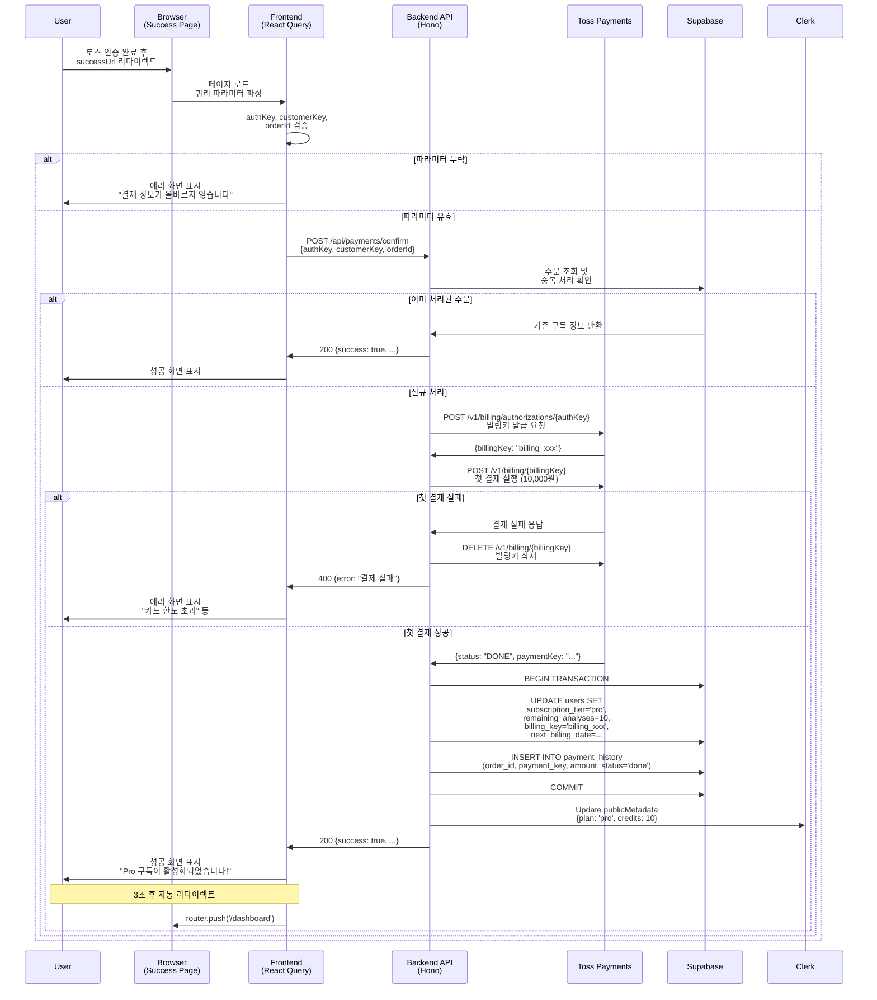
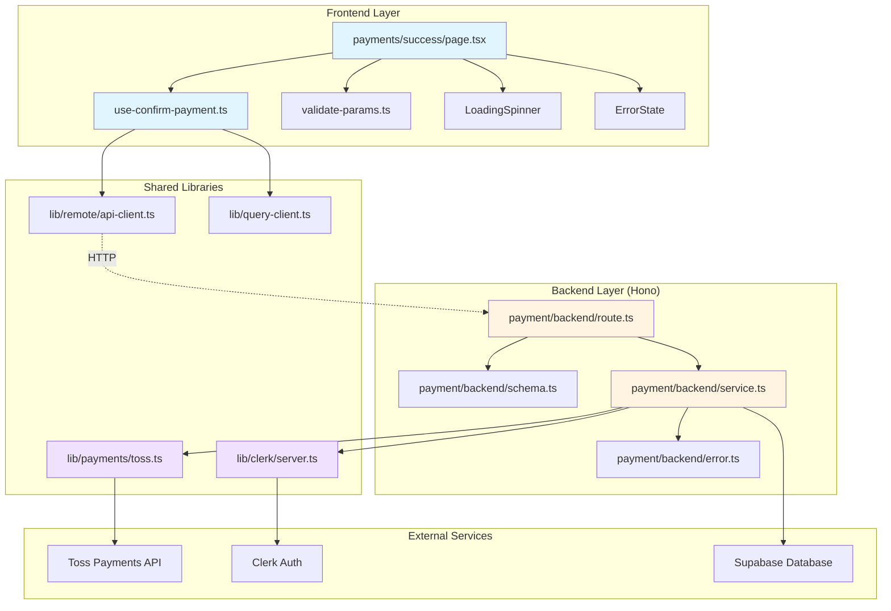

# 결제 성공 페이지 구현 계획

> **페이지**: `/payments/success`
> **작성일**: 2025-10-25
> **관련 UC**: UC-011 (Pro 구독 결제)

---

## 1. 개요

### 1.1 페이지 목적
토스페이먼츠 결제 성공 후 리다이렉트되는 페이지로, 결제 승인 처리 및 구독 활성화를 담당합니다.

### 1.2 주요 기능
- 쿼리 파라미터로 전달받은 결제 정보 파싱
- 서버에서 토스페이먼츠 빌링키 발급 및 첫 결제 실행
- Supabase 구독 상태 업데이트
- Clerk 메타데이터 업데이트 (선택적)
- 대시보드로 리다이렉트

### 1.3 핵심 요구사항
- 10분 이내 결제 승인 완료 (토스페이먼츠 제약)
- 중복 처리 방지
- 트랜잭션 보장
- 오류 처리 및 재시도 로직

---

## 2. 페이지 구조 및 로딩 처리

### 2.1 Page Component 구조

```typescript
// src/app/payments/success/page.tsx
'use client'

import { useEffect, useState } from 'react'
import { useRouter, useSearchParams } from 'next/navigation'
import { LoadingSpinner } from '@/components/common/loading-spinner'
import { ErrorState } from '@/components/common/error-state'
import { useConfirmPayment } from '@/features/payment/hooks/use-confirm-payment'

export default function PaymentSuccessPage() {
  const router = useRouter()
  const searchParams = useSearchParams()
  const [status, setStatus] = useState<'processing' | 'success' | 'error'>('processing')
  const [errorMessage, setErrorMessage] = useState<string>('')

  const authKey = searchParams.get('authKey')
  const customerKey = searchParams.get('customerKey')
  const orderId = searchParams.get('orderId')

  const { mutate: confirmPayment, isPending } = useConfirmPayment()

  useEffect(() => {
    // 필수 파라미터 검증
    if (!authKey || !customerKey || !orderId) {
      setStatus('error')
      setErrorMessage('결제 정보가 올바르지 않습니다.')
      return
    }

    // 결제 승인 요청
    confirmPayment(
      { authKey, customerKey, orderId },
      {
        onSuccess: () => {
          setStatus('success')
          // 3초 후 대시보드로 리다이렉트
          setTimeout(() => {
            router.push('/dashboard')
          }, 3000)
        },
        onError: (error: any) => {
          setStatus('error')
          setErrorMessage(error?.message || '결제 처리 중 오류가 발생했습니다.')
        },
      }
    )
  }, [authKey, customerKey, orderId, confirmPayment, router])

  // 처리 중 로딩 화면
  if (status === 'processing' || isPending) {
    return (
      <div className="container mx-auto flex min-h-screen items-center justify-center">
        <LoadingSpinner message="결제를 처리하고 있습니다..." />
      </div>
    )
  }

  // 성공 화면
  if (status === 'success') {
    return (
      <div className="container mx-auto flex min-h-screen flex-col items-center justify-center gap-6">
        <div className="flex h-20 w-20 items-center justify-center rounded-full bg-green-100">
          <svg
            className="h-12 w-12 text-green-600"
            fill="none"
            stroke="currentColor"
            viewBox="0 0 24 24"
          >
            <path
              strokeLinecap="round"
              strokeLinejoin="round"
              strokeWidth={2}
              d="M5 13l4 4L19 7"
            />
          </svg>
        </div>
        <div className="text-center">
          <h1 className="text-2xl font-bold">Pro 구독이 활성화되었습니다!</h1>
          <p className="mt-2 text-muted-foreground">
            이제 월 10회의 고급 AI 분석을 이용하실 수 있습니다.
          </p>
          <p className="mt-4 text-sm text-muted-foreground">
            잠시 후 대시보드로 이동합니다...
          </p>
        </div>
      </div>
    )
  }

  // 오류 화면
  return (
    <div className="container mx-auto flex min-h-screen items-center justify-center">
      <ErrorState
        title="결제 처리 실패"
        message={errorMessage}
        onRetry={() => {
          setStatus('processing')
          setErrorMessage('')
          window.location.reload()
        }}
      />
    </div>
  )
}
```

---

## 3. 쿼리 파라미터 파싱

### 3.1 토스페이먼츠 successUrl 파라미터
토스페이먼츠는 성공 시 다음 파라미터를 전달합니다:

```
/payments/success?authKey={authKey}&customerKey={customerKey}&orderId={orderId}
```

- `authKey`: 빌링키 발급을 위한 인증 키
- `customerKey`: 사용자 ID (결제 요청 시 전달한 값)
- `orderId`: 주문 ID (결제 준비 시 생성한 값)

### 3.2 파라미터 검증

```typescript
// src/features/payment/lib/validate-params.ts
import { z } from 'zod'

export const paymentSuccessParamsSchema = z.object({
  authKey: z.string().min(1, 'authKey가 필요합니다'),
  customerKey: z.string().min(1, 'customerKey가 필요합니다'),
  orderId: z.string().min(1, 'orderId가 필요합니다'),
})

export type PaymentSuccessParams = z.infer<typeof paymentSuccessParamsSchema>

export function validatePaymentSuccessParams(params: unknown): PaymentSuccessParams {
  return paymentSuccessParamsSchema.parse(params)
}
```

---

## 4. 결제 승인 API 호출

### 4.1 React Query Hook

```typescript
// src/features/payment/hooks/use-confirm-payment.ts
import { useMutation, useQueryClient } from '@tanstack/react-query'
import { apiClient } from '@/lib/remote/api-client'
import { queryKeys } from '@/lib/query-client'
import type { PaymentSuccessParams } from '../lib/validate-params'

type ConfirmPaymentResponse = {
  success: boolean
  subscriptionTier: string
  remainingAnalyses: number
  nextBillingDate: string
}

async function confirmPayment(params: PaymentSuccessParams): Promise<ConfirmPaymentResponse> {
  const response = await apiClient.post('/api/payments/confirm', params)
  return response.data
}

export function useConfirmPayment() {
  const queryClient = useQueryClient()

  return useMutation({
    mutationFn: confirmPayment,
    onSuccess: () => {
      // 구독 상태 캐시 무효화
      queryClient.invalidateQueries({ queryKey: queryKeys.user.subscription() })
      queryClient.invalidateQueries({ queryKey: queryKeys.user.quota() })
    },
    retry: 2, // 네트워크 오류 시 최대 2회 재시도
    retryDelay: 1000, // 1초 간격
  })
}
```

### 4.2 API Client 구성

```typescript
// src/lib/remote/api-client.ts (기존 파일 활용)
import axios from 'axios'

export const apiClient = axios.create({
  baseURL: process.env.NEXT_PUBLIC_API_URL || '',
  timeout: 30000, // 30초 타임아웃
  headers: {
    'Content-Type': 'application/json',
  },
})

// Clerk 인증 토큰 자동 주입 (이미 구현되어 있다고 가정)
apiClient.interceptors.request.use(async (config) => {
  // Clerk 세션 토큰 추가
  const token = await window.Clerk?.session?.getToken()
  if (token) {
    config.headers.Authorization = `Bearer ${token}`
  }
  return config
})
```

---

## 5. 백엔드 API 구현

### 5.1 Hono Route

```typescript
// src/features/payment/backend/route.ts
import { Hono } from 'hono'
import { zValidator } from '@hono/zod-validator'
import type { AppEnv } from '@/backend/hono/context'
import { confirmPaymentSchema } from './schema'
import { confirmPaymentService } from './service'
import { respond, failure } from '@/backend/http/response'

export const paymentRoutes = new Hono<AppEnv>()

paymentRoutes.post(
  '/api/payments/confirm',
  zValidator('json', confirmPaymentSchema),
  async (c) => {
    try {
      const body = c.req.valid('json')
      const supabase = c.get('supabase')
      const logger = c.get('logger')

      // Clerk 사용자 ID 가져오기 (미들웨어에서 주입되었다고 가정)
      const userId = c.get('userId')
      if (!userId) {
        return c.json(failure('UNAUTHORIZED', 'Unauthorized'), 401)
      }

      logger.info('결제 승인 시작', { userId, orderId: body.orderId })

      const result = await confirmPaymentService({
        supabase,
        logger,
        userId,
        authKey: body.authKey,
        customerKey: body.customerKey,
        orderId: body.orderId,
      })

      logger.info('결제 승인 완료', { userId, orderId: body.orderId })

      return c.json(respond(result), 200)
    } catch (error: any) {
      const logger = c.get('logger')
      logger.error('결제 승인 실패', { error: error.message, stack: error.stack })

      return c.json(
        failure('PAYMENT_CONFIRMATION_FAILED', error.message || '결제 승인에 실패했습니다'),
        500
      )
    }
  }
)
```

### 5.2 Zod Schema

```typescript
// src/features/payment/backend/schema.ts
import { z } from 'zod'

export const confirmPaymentSchema = z.object({
  authKey: z.string().min(1),
  customerKey: z.string().min(1),
  orderId: z.string().min(1),
})

export type ConfirmPaymentInput = z.infer<typeof confirmPaymentSchema>

export const confirmPaymentResponseSchema = z.object({
  success: z.boolean(),
  subscriptionTier: z.enum(['free', 'pro', 'pending_cancel']),
  remainingAnalyses: z.number(),
  nextBillingDate: z.string(),
})

export type ConfirmPaymentResponse = z.infer<typeof confirmPaymentResponseSchema>
```

### 5.3 Service Layer

```typescript
// src/features/payment/backend/service.ts
import type { SupabaseClient } from '@supabase/supabase-js'
import type { AppLogger } from '@/backend/config'
import { issueBillingKey, chargeBilling } from '@/lib/payments/toss'
import { updateUserMetadata } from '@/lib/clerk/server'
import type { ConfirmPaymentResponse } from './schema'

type ConfirmPaymentServiceParams = {
  supabase: SupabaseClient
  logger: AppLogger
  userId: string
  authKey: string
  customerKey: string
  orderId: string
}

export async function confirmPaymentService(
  params: ConfirmPaymentServiceParams
): Promise<ConfirmPaymentResponse> {
  const { supabase, logger, userId, authKey, customerKey, orderId } = params

  // 1. 주문 조회 및 중복 처리 방지
  const { data: existingPayment, error: paymentError } = await supabase
    .from('payment_history')
    .select('*')
    .eq('order_id', orderId)
    .single()

  if (paymentError && paymentError.code !== 'PGRST116') {
    throw new Error('주문 조회 실패')
  }

  if (existingPayment && existingPayment.status === 'done') {
    logger.info('이미 처리된 주문', { orderId })
    // 이미 처리된 경우 현재 구독 정보 반환
    const { data: user } = await supabase
      .from('users')
      .select('subscription_tier, remaining_analyses, next_billing_date')
      .eq('clerk_id', userId)
      .single()

    return {
      success: true,
      subscriptionTier: user?.subscription_tier || 'free',
      remainingAnalyses: user?.remaining_analyses || 0,
      nextBillingDate: user?.next_billing_date || '',
    }
  }

  // 2. 토스페이먼츠 빌링키 발급
  logger.info('빌링키 발급 시작', { authKey, customerKey })
  const billingKeyResponse = await issueBillingKey({ authKey, customerKey })
  const billingKey = billingKeyResponse.billingKey

  if (!billingKey) {
    throw new Error('빌링키 발급 실패')
  }

  logger.info('빌링키 발급 성공', { billingKey })

  try {
    // 3. 첫 결제 실행
    logger.info('첫 결제 실행 시작', { billingKey, orderId })
    const paymentResponse = await chargeBilling({
      billingKey,
      orderId,
      orderName: 'SuperNext Pro 구독',
      amount: 10000, // TODO: 환경변수 또는 설정에서 가져오기
      customerKey,
    })

    if (paymentResponse.status !== 'DONE') {
      throw new Error('결제 실패')
    }

    logger.info('첫 결제 성공', { paymentKey: paymentResponse.paymentKey })

    // 4. 트랜잭션으로 DB 업데이트
    const nextBillingDate = new Date()
    nextBillingDate.setMonth(nextBillingDate.getMonth() + 1)

    // 사용자 구독 정보 업데이트
    const { error: userUpdateError } = await supabase
      .from('users')
      .update({
        subscription_tier: 'pro',
        remaining_analyses: 10,
        billing_key: billingKey,
        subscription_start_date: new Date().toISOString(),
        next_billing_date: nextBillingDate.toISOString(),
        subscription_status: 'active',
        updated_at: new Date().toISOString(),
      })
      .eq('clerk_id', userId)

    if (userUpdateError) {
      throw new Error('사용자 구독 정보 업데이트 실패')
    }

    // 결제 내역 저장
    const { error: paymentHistoryError } = await supabase.from('payment_history').insert({
      user_id: userId,
      order_id: orderId,
      payment_key: paymentResponse.paymentKey,
      amount: 10000,
      status: 'done',
      method: paymentResponse.method,
      created_at: new Date().toISOString(),
      updated_at: new Date().toISOString(),
    })

    if (paymentHistoryError) {
      throw new Error('결제 내역 저장 실패')
    }

    // 5. Clerk 메타데이터 업데이트 (선택적)
    try {
      await updateUserMetadata(userId, {
        plan: 'pro',
        credits: 10,
      })
    } catch (clerkError) {
      logger.error('Clerk 메타데이터 업데이트 실패', { error: clerkError })
      // Clerk 업데이트 실패는 치명적이지 않으므로 계속 진행
    }

    logger.info('결제 승인 완료', { userId, orderId })

    return {
      success: true,
      subscriptionTier: 'pro',
      remainingAnalyses: 10,
      nextBillingDate: nextBillingDate.toISOString(),
    }
  } catch (error) {
    // 첫 결제 실패 시 빌링키 삭제
    logger.error('결제 실패, 빌링키 삭제 시작', { billingKey })
    try {
      await deleteBillingKey(billingKey)
      logger.info('빌링키 삭제 완료', { billingKey })
    } catch (deleteError) {
      logger.error('빌링키 삭제 실패', { error: deleteError })
    }

    throw error
  }
}
```

---

## 6. 오류 처리 및 재시도

### 6.1 오류 타입 정의

```typescript
// src/features/payment/backend/error.ts
export const PAYMENT_ERROR_CODES = {
  BILLING_KEY_ISSUE_FAILED: 'BILLING_KEY_ISSUE_FAILED',
  FIRST_PAYMENT_FAILED: 'FIRST_PAYMENT_FAILED',
  DB_UPDATE_FAILED: 'DB_UPDATE_FAILED',
  DUPLICATE_PAYMENT: 'DUPLICATE_PAYMENT',
  TIMEOUT: 'TIMEOUT',
  NETWORK_ERROR: 'NETWORK_ERROR',
} as const

export type PaymentErrorCode = keyof typeof PAYMENT_ERROR_CODES

export class PaymentError extends Error {
  constructor(
    public code: PaymentErrorCode,
    message: string
  ) {
    super(message)
    this.name = 'PaymentError'
  }
}
```

### 6.2 재시도 로직

프론트엔드에서 React Query의 `retry` 옵션으로 자동 재시도:

```typescript
export function useConfirmPayment() {
  return useMutation({
    mutationFn: confirmPayment,
    retry: (failureCount, error: any) => {
      // 네트워크 오류나 타임아웃은 최대 2회 재시도
      if (error.code === 'NETWORK_ERROR' || error.code === 'TIMEOUT') {
        return failureCount < 2
      }
      // 그 외 오류는 재시도하지 않음
      return false
    },
    retryDelay: 1000, // 1초 간격
  })
}
```

### 6.3 타임아웃 처리

토스페이먼츠는 successUrl 리다이렉트 후 10분 이내 승인이 필요합니다. 이를 백엔드에서 체크:

```typescript
// src/features/payment/backend/service.ts에 추가
async function checkPaymentTimeout(orderId: string, supabase: SupabaseClient): Promise<void> {
  const { data: payment } = await supabase
    .from('payment_history')
    .select('created_at')
    .eq('order_id', orderId)
    .single()

  if (payment) {
    const createdAt = new Date(payment.created_at)
    const now = new Date()
    const diffMinutes = (now.getTime() - createdAt.getTime()) / 1000 / 60

    if (diffMinutes > 10) {
      throw new PaymentError('TIMEOUT', '결제 처리 시간이 초과되었습니다 (10분 이상 경과)')
    }
  }
}
```

---

## 7. 리다이렉트 처리

### 7.1 성공 후 자동 리다이렉트

```typescript
// page.tsx에서 이미 구현됨
if (status === 'success') {
  setTimeout(() => {
    router.push('/dashboard')
  }, 3000) // 3초 후 자동 이동
}
```

### 7.2 실패 시 리다이렉트 옵션

```typescript
<ErrorState
  title="결제 처리 실패"
  message={errorMessage}
  onRetry={() => {
    // 페이지 새로고침으로 재시도
    window.location.reload()
  }}
/>
```

사용자에게 다음 옵션 제공:
- **재시도**: 현재 페이지 새로고침
- **구독 관리로 이동**: 다시 결제 프로세스 시작
- **대시보드로 이동**: 결제 포기

---

## 8. 구현 순서 및 우선순위

### Phase 1: 핵심 기능 (1일차)
1. ✅ 페이지 컴포넌트 구조 설계
2. ✅ 쿼리 파라미터 파싱 및 검증
3. ✅ React Query Hook 구현
4. ✅ 기본 로딩 및 성공 화면 UI

### Phase 2: 백엔드 API (2일차)
1. ✅ Hono Route 구현
2. ✅ Zod Schema 정의
3. ✅ Service Layer 구현 (빌링키 발급 + 첫 결제)
4. ✅ Supabase 트랜잭션 처리

### Phase 3: 오류 처리 (3일차)
1. ✅ 오류 타입 정의 및 PaymentError 클래스
2. ✅ 재시도 로직 구현
3. ✅ 타임아웃 체크
4. ✅ 에러 화면 UI

### Phase 4: 통합 테스트 (4일차)
1. ⏳ 토스페이먼츠 테스트 환경 연동
2. ⏳ 성공 시나리오 E2E 테스트
3. ⏳ 실패 시나리오 테스트 (빌링키 발급 실패, 첫 결제 실패 등)
4. ⏳ 중복 처리 방지 테스트

### Phase 5: 최적화 및 배포 (5일차)
1. ⏳ 로딩 성능 최적화
2. ⏳ 로그 정제 및 모니터링 설정
3. ⏳ 프로덕션 배포 및 스모크 테스트

---

## 9. 체크리스트

### 기능 구현
- [ ] 페이지 컴포넌트 작성
- [ ] 쿼리 파라미터 파싱 로직
- [ ] React Query Hook 구현
- [ ] Hono API Route 구현
- [ ] Service Layer 구현
- [ ] Supabase 트랜잭션 처리
- [ ] 토스페이먼츠 API 연동 (빌링키 발급, 첫 결제)

### 오류 처리
- [ ] 필수 파라미터 누락 에러
- [ ] 빌링키 발급 실패 에러
- [ ] 첫 결제 실패 에러 (빌링키 삭제 포함)
- [ ] DB 업데이트 실패 에러
- [ ] 중복 처리 방지
- [ ] 타임아웃 처리 (10분 제약)
- [ ] 네트워크 오류 재시도

### UI/UX
- [ ] 로딩 스피너 및 메시지
- [ ] 성공 화면 (축하 메시지, 자동 리다이렉트)
- [ ] 오류 화면 (재시도 옵션)
- [ ] 모바일 반응형 디자인

### 테스트
- [ ] 성공 시나리오 E2E 테스트
- [ ] 빌링키 발급 실패 시나리오
- [ ] 첫 결제 실패 시나리오
- [ ] 중복 처리 시나리오
- [ ] 타임아웃 시나리오
- [ ] 네트워크 오류 시나리오

### 배포 전 확인
- [ ] 환경변수 설정 (토스페이먼츠 키 등)
- [ ] Supabase 마이그레이션 적용
- [ ] Hono 라우트 등록 확인
- [ ] 로그 모니터링 설정
- [ ] 프로덕션 테스트 환경 검증

---

## 10. 참고 자료

### 관련 문서
- [PRD: 섹션 4.2 API 엔드포인트](/docs/prd.md#42-api-엔드포인트-hono)
- [PRD: 섹션 7.3 구독 및 결제 관리](/docs/prd.md#73-구독-및-결제-관리)
- [UC-011: Pro 구독 결제](/docs/usecases/011/spec.md)
- [Userflow: 섹션 3.3 결제 성공 처리](/docs/userflow.md#33-결제-성공-처리)
- [상태관리 설계: 섹션 7 결제 성공/실패](/docs/external/state-design.md#7-결제-성공실패-paymentssuccess-paymentsfail)
- [공통 모듈: 섹션 6 결제 공통 모듈](/docs/common-modules.md#6-결제-공통-모듈)

### 외부 API 문서
- [토스페이먼츠 빌링키 발급 API](https://docs.tosspayments.com/reference/billing#issue-billing-key)
- [토스페이먼츠 빌링키 결제 API](https://docs.tosspayments.com/reference/billing#charge-billing-key)
- [토스페이먼츠 결제 승인 시간 제약](https://docs.tosspayments.com/guides/payment-widget/integration#step-4)

---

## 11. 다이어그램

### 11.1 시퀀스 다이어그램



### 11.2 모듈 의존성 다이어그램



---

## 12. 예상 문제점 및 해결 방안

### 12.1 타임아웃 문제
**문제**: 사용자가 결제 인증 후 successUrl 접근이 10분 이상 지연되어 토스페이먼츠 승인 시간 초과

**해결**:
- 백엔드에서 주문 생성 시간을 체크하여 10분 경과 시 에러 반환
- 사용자에게 "처음부터 다시 시도하세요" 안내
- Webhook 보완 처리로 누락 방지

### 12.2 중복 결제 방지
**문제**: 사용자가 페이지를 새로고침하거나 여러 탭에서 동시 접근

**해결**:
- `orderId`로 중복 체크하여 이미 처리된 경우 현재 구독 정보만 반환
- 트랜잭션으로 DB 업데이트 보장

### 12.3 빌링키 발급 성공, 첫 결제 실패
**문제**: 빌링키는 발급되었으나 첫 결제가 실패 (카드 한도 초과 등)

**해결**:
- 첫 결제 실패 시 즉시 빌링키 삭제 API 호출
- 트랜잭션 롤백으로 DB 일관성 유지
- 사용자에게 실패 사유 명확히 안내

### 12.4 네트워크 오류
**문제**: 프론트엔드와 백엔드 간 네트워크 불안정

**해결**:
- React Query의 자동 재시도 (최대 2회)
- 백엔드에서 Idempotency Key 사용하여 중복 방지
- Webhook 보완 처리

---

**문서 끝**
