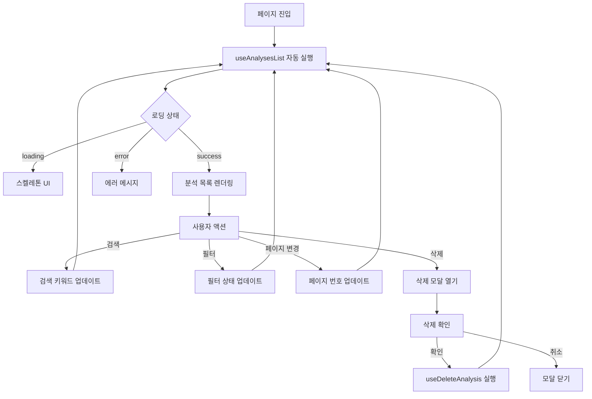
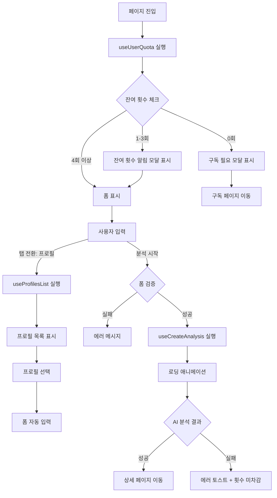
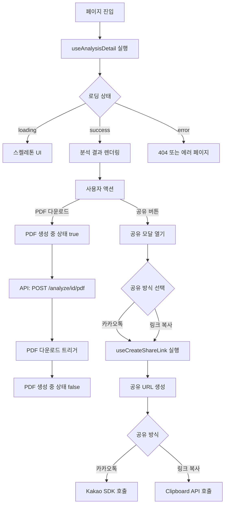
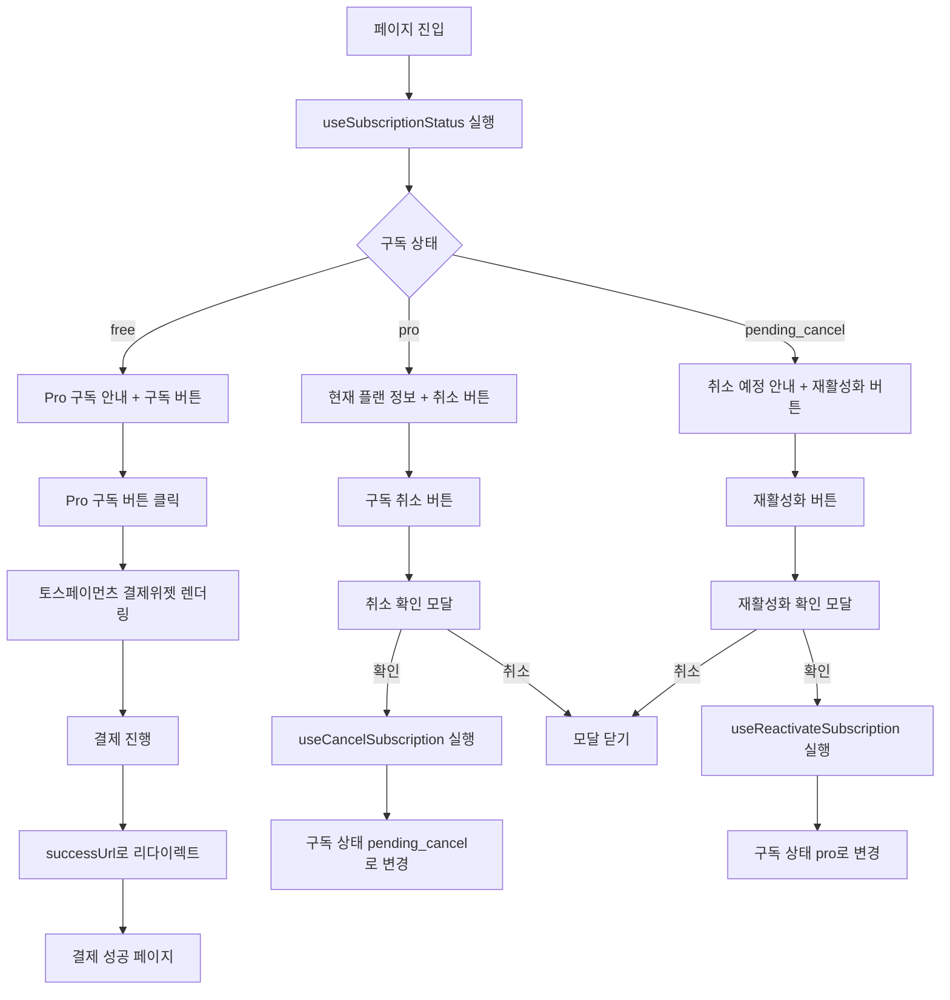
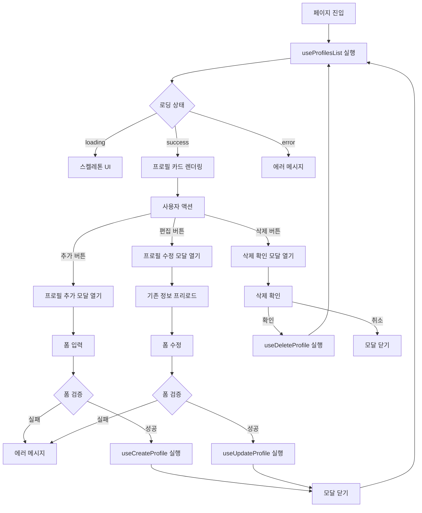
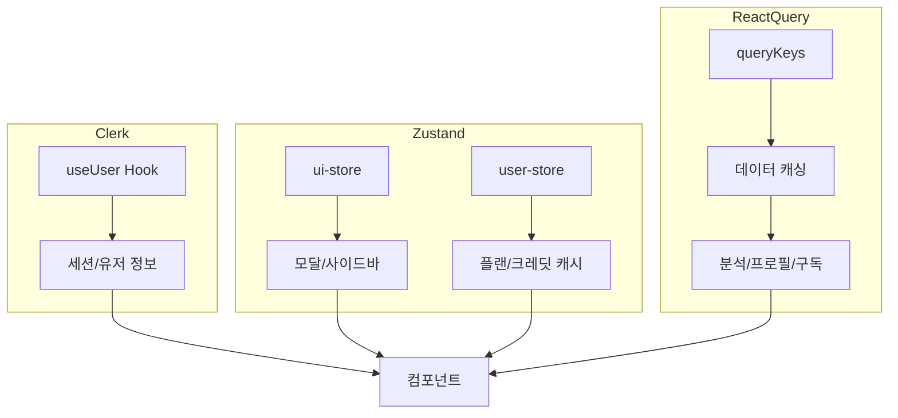
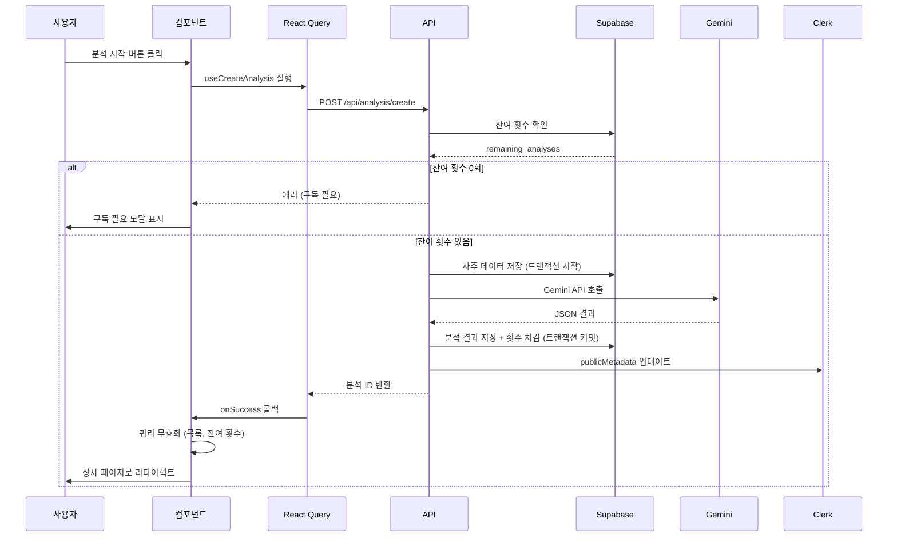

# 상태관리 설계 문서

> **문서 버전**: 1.0
> **작성일**: 2025-10-25
> **프로젝트**: SuperNext - AI 기반 구독형 사주풀이 서비스

---

## 목차

1. [개요](#개요)
2. [전역 상태 관리 전략](#전역-상태-관리-전략)
3. [페이지별 상태 설계](#페이지별-상태-설계)
   - [홈 (랜딩)](#1-홈-랜딩--)
   - [대시보드 (분석 목록)](#2-대시보드-분석-목록-dashboard)
   - [새 분석하기](#3-새-분석하기-analyzenew)
   - [분석 상세보기](#4-분석-상세보기-analyzeid)
   - [구독 관리](#5-구독-관리-subscription)
   - [프로필 관리](#6-프로필-관리-profiles)
   - [결제 성공/실패](#7-결제-성공실패-paymentssuccess-paymentsfail)
   - [마이페이지](#8-마이페이지-my-account)
4. [공통 스토어](#공통-스토어)
5. [상태 플로우 다이어그램](#상태-플로우-다이어그램)

---

## 개요

### 설계 원칙

1. **Zustand**: 클라이언트 전역 UI 상태 관리 (모달, 사이드바, 로딩 등)
2. **React Query**: 서버 상태 관리 (API 데이터 캐싱, 페칭, 동기화)
3. **최소 상태 원칙**: 파생 가능한 데이터는 상태로 관리하지 않음
4. **상태 분리**: 페이지별 필요한 상태만 관리, 전역 오염 최소화

### 기술 스택

- **Zustand**: 클라이언트 전역 상태
- **@tanstack/react-query**: 서버 상태 (staleTime 5분, cacheTime 10분)
- **Clerk**: 인증 상태 (SDK 내장)
- **React Hook Form + Zod**: 폼 상태 및 검증

---

## 전역 상태 관리 전략

### Zustand 전역 스토어

```
src/stores/
  ui-store.ts          # UI 상태 (모달, 사이드바)
  user-store.ts        # 사용자 정보 캐시 (Clerk 동기화)
```

### React Query 키 구조

```typescript
// 쿼리 키 팩토리 패턴
export const queryKeys = {
  user: {
    quota: () => ['user', 'quota'] as const,
    subscription: () => ['user', 'subscription'] as const,
  },
  analyses: {
    all: () => ['analyses'] as const,
    list: (filters: AnalysisFilters) => ['analyses', 'list', filters] as const,
    detail: (id: string) => ['analyses', 'detail', id] as const,
  },
  profiles: {
    all: () => ['profiles'] as const,
    list: () => ['profiles', 'list'] as const,
    detail: (id: string) => ['profiles', 'detail', id] as const,
  },
  payments: {
    history: () => ['payments', 'history'] as const,
  },
}
```

---

## 페이지별 상태 설계

### 1. 홈 (랜딩) - `/`

#### 상태관리 필요 여부

**❌ 상태관리 불필요**

#### 이유

- 정적 컨텐츠 위주의 마케팅 페이지
- 로그인 상태는 Clerk SDK의 `useUser()` 훅으로 충분
- 헤더 UI 상태는 전역 UI 스토어 사용

#### 사용하는 전역 상태

- `useUser()` (Clerk): 로그인 상태 확인
- `useUIStore`: 모바일 메뉴 토글

#### 화면 구성

```
[미로그인]
- 서비스 로고
- 로그인/회원가입 버튼

[로그인]
- 서비스 로고
- 분석 목록 / 새 분석하기 / 구독 관리 메뉴
- 사용자 프로필 (Clerk UserButton)
```

---

### 2. 대시보드 (분석 목록) - `/dashboard`

#### 관리할 상태 목록

| 상태 유형 | 상태명 | 관리 방식 | 목적 |
|---------|--------|----------|------|
| 서버 상태 | 분석 목록 | React Query | 사용자 분석 내역 조회 |
| 서버 상태 | 사용자 구독 정보 | React Query | 잔여 횟수 표시 |
| 로컬 상태 | 검색 키워드 | useState | 이름 검색 필터 |
| 로컬 상태 | 분석 종류 필터 | useState | 월간/신년/평생 필터 |
| 로컬 상태 | 페이지 번호 | useState | 페이지네이션 |
| UI 상태 | 삭제 확인 모달 | Zustand | 삭제 확인 다이얼로그 |

#### 상태가 아닌 화면 데이터

- 분석 카드 썸네일 이모지 (하드코딩)
- 페이지네이션 총 페이지 수 (분석 목록 총 개수로부터 계산)

#### 상태 변경 조건 및 화면 변화

| 상태 | 변경 조건 | 화면 변화 |
|------|----------|----------|
| 분석 목록 | 페이지 로드 / 필터 변경 / 삭제 성공 | 목록 재렌더링, 스켈레톤 → 카드 그리드 |
| 검색 키워드 | 검색창 입력 + 엔터 / 검색 버튼 클릭 | 목록 필터링, 페이지 1로 리셋 |
| 분석 종류 필터 | 필터 드롭다운 선택 | 목록 필터링, 페이지 1로 리셋 |
| 페이지 번호 | 페이지네이션 버튼 클릭 | 해당 페이지 데이터 로드 |
| 삭제 확인 모달 | 삭제 버튼 클릭 / 확인/취소 | 모달 열림/닫힘 |

#### React Query 사용

```typescript
// src/features/analysis/hooks/use-analyses-list.ts
export function useAnalysesList(filters: AnalysisFilters) {
  return useQuery({
    queryKey: queryKeys.analyses.list(filters),
    queryFn: () => fetchAnalysesList(filters),
    staleTime: 5 * 60 * 1000, // 5분
  })
}

// src/features/analysis/hooks/use-delete-analysis.ts
export function useDeleteAnalysis() {
  const queryClient = useQueryClient()

  return useMutation({
    mutationFn: (id: string) => deleteAnalysis(id),
    onSuccess: () => {
      // 목록 무효화하여 재조회
      queryClient.invalidateQueries({ queryKey: queryKeys.analyses.all() })
    },
  })
}
```

#### 상태 플로우



---

### 3. 새 분석하기 - `/analyze/new`

#### 관리할 상태 목록

| 상태 유형 | 상태명 | 관리 방식 | 목적 |
|---------|--------|----------|------|
| 서버 상태 | 사용자 잔여 횟수 | React Query | 분석 가능 여부 확인 |
| 서버 상태 | 프로필 목록 | React Query | 저장된 프로필 불러오기 |
| 폼 상태 | 분석 입력 폼 | React Hook Form | 이름, 성별, 생년월일시, 분석 종류 |
| 로컬 상태 | 활성 탭 | useState | 새로 입력 / 프로필 불러오기 |
| 로컬 상태 | 선택된 프로필 ID | useState | 프로필 불러오기 탭에서 선택한 프로필 |
| UI 상태 | 분석 중 로딩 | Zustand 또는 local | AI 분석 중 로딩 애니메이션 |
| UI 상태 | 잔여 횟수 알림 모달 | Zustand | 3회 이하 알림 |
| UI 상태 | 구독 필요 모달 | Zustand | 0회 시 Pro 구독 안내 |

#### 상태가 아닌 화면 데이터

- 성별 라디오 옵션 (하드코딩: 남성/여성)
- 분석 종류 옵션 (하드코딩: 월간/신년/평생)
- 로딩 메시지 (하드코딩: "운명을 해석하고 있습니다...")

#### 상태 변경 조건 및 화면 변화

| 상태 | 변경 조건 | 화면 변화 |
|------|----------|----------|
| 사용자 잔여 횟수 | 페이지 진입 / 분석 성공 | 헤더에 남은 횟수 배지 표시, 3회 이하 알림 |
| 프로필 목록 | 프로필 불러오기 탭 전환 | 저장된 프로필 카드 렌더링 |
| 활성 탭 | 탭 클릭 | 탭 콘텐츠 전환 (폼 / 프로필 목록) |
| 선택된 프로필 | 프로필 카드 클릭 | 폼 자동 입력 (이름, 성별, 생년월일시) |
| 분석 입력 폼 | 사용자 입력 / 프로필 선택 | 필드별 값 업데이트, 검증 에러 표시 |
| 분석 중 로딩 | 분석 시작 버튼 클릭 / API 응답 | 로딩 오버레이 + 애니메이션 표시/숨김 |
| 잔여 횟수 알림 모달 | 페이지 진입 시 잔여 3회 이하 | 모달 표시 |
| 구독 필요 모달 | 분석 시작 시 잔여 0회 | 모달 표시 + 구독 페이지 이동 버튼 |

#### React Hook Form + Zod 스키마

```typescript
// src/features/analysis/lib/schema.ts
export const analysisInputSchema = z.object({
  name: z.string().min(1, '이름을 입력해주세요'),
  gender: z.enum(['male', 'female'], { required_error: '성별을 선택해주세요' }),
  birthDate: z.string().min(1, '생년월일을 입력해주세요'),
  birthTime: z.string().optional(),
  isLunar: z.boolean().default(false),
  analysisType: z.enum(['monthly', 'yearly', 'lifetime']),
  saveAsProfile: z.boolean().default(false),
})

export type AnalysisInput = z.infer<typeof analysisInputSchema>
```

#### React Query 사용

```typescript
// src/features/user/hooks/use-user-quota.ts
export function useUserQuota() {
  return useQuery({
    queryKey: queryKeys.user.quota(),
    queryFn: fetchUserQuota,
    staleTime: 1 * 60 * 1000, // 1분
  })
}

// src/features/analysis/hooks/use-create-analysis.ts
export function useCreateAnalysis() {
  const queryClient = useQueryClient()
  const router = useRouter()

  return useMutation({
    mutationFn: createAnalysis,
    onSuccess: (data) => {
      // 잔여 횟수 업데이트
      queryClient.invalidateQueries({ queryKey: queryKeys.user.quota() })
      // 분석 목록 무효화
      queryClient.invalidateQueries({ queryKey: queryKeys.analyses.all() })
      // 상세 페이지로 이동
      router.push(`/analyze/${data.id}`)
    },
  })
}
```

#### 상태 플로우



---

### 4. 분석 상세보기 - `/analyze/[id]`

#### 관리할 상태 목록

| 상태 유형 | 상태명 | 관리 방식 | 목적 |
|---------|--------|----------|------|
| 서버 상태 | 분석 결과 | React Query | AI 생성 결과 조회 |
| UI 상태 | 공유 모달 | Zustand | 공유 옵션 선택 모달 |
| UI 상태 | PDF 생성 중 | 로컬 useState | PDF 다운로드 로딩 |
| 로컬 상태 | 공유 링크 | useState | 생성된 공유 URL |

#### 상태가 아닌 화면 데이터

- 운세 카테고리별 이모지 (하드코딩: 총운 🌟, 재물운 💰 등)
- 카드 레이아웃 (shadcn-ui Card)

#### 상태 변경 조건 및 화면 변화

| 상태 | 변경 조건 | 화면 변화 |
|------|----------|----------|
| 분석 결과 | 페이지 진입 (ID 파라미터) | 로딩 → 결과 카드 렌더링 |
| 공유 모달 | 공유 버튼 클릭 / 옵션 선택 | 모달 열림/닫힘, 카카오톡/링크 복사 UI |
| PDF 생성 중 | PDF 버튼 클릭 / 생성 완료 | 버튼 로딩 스피너 표시/숨김 |
| 공유 링크 | 공유 링크 생성 API 완료 | 클립보드 복사 또는 카카오톡 전송 |

#### React Query 사용

```typescript
// src/features/analysis/hooks/use-analysis-detail.ts
export function useAnalysisDetail(id: string) {
  return useQuery({
    queryKey: queryKeys.analyses.detail(id),
    queryFn: () => fetchAnalysisDetail(id),
    staleTime: Infinity, // 분석 결과는 변경 불가 → 무한 캐시
  })
}

// src/features/analysis/hooks/use-create-share-link.ts
export function useCreateShareLink() {
  return useMutation({
    mutationFn: (analysisId: string) => createShareLink(analysisId),
  })
}
```

#### 상태 플로우



---

### 5. 구독 관리 - `/subscription`

#### 관리할 상태 목록

| 상태 유형 | 상태명 | 관리 방식 | 목적 |
|---------|--------|----------|------|
| 서버 상태 | 구독 상태 | React Query | 플랜, 잔여 횟수, 다음 결제일 |
| 서버 상태 | 결제 내역 | React Query | 최근 12개월 결제 내역 |
| UI 상태 | 결제위젯 로딩 | 로컬 useState | 토스페이먼츠 위젯 로딩 |
| UI 상태 | 구독 취소 확인 모달 | Zustand | 취소 확인 다이얼로그 |
| UI 상태 | 재활성화 확인 모달 | Zustand | 재활성화 확인 다이얼로그 |

#### 상태가 아닌 화면 데이터

- 요금제 비교표 (하드코딩)
- 플랜별 혜택 (하드코딩: 무료 3회, Pro 10회 등)

#### 상태 변경 조건 및 화면 변화

| 상태 | 변경 조건 | 화면 변화 |
|------|----------|----------|
| 구독 상태 | 페이지 진입 / 구독/취소 성공 | 플랜 배지, 잔여 횟수 프로그레스바, 다음 결제일 |
| 결제 내역 | 페이지 진입 | 결제 내역 테이블 렌더링 |
| 결제위젯 로딩 | Pro 구독 버튼 클릭 / 위젯 렌더링 완료 | 로딩 스피너 → 결제위젯 UI |
| 구독 취소 확인 모달 | 구독 취소 버튼 클릭 / 확인/취소 | 모달 열림/닫힘 |
| 재활성화 확인 모달 | 재활성화 버튼 클릭 / 확인/취소 | 모달 열림/닫힘 |

#### React Query 사용

```typescript
// src/features/subscription/hooks/use-subscription-status.ts
export function useSubscriptionStatus() {
  return useQuery({
    queryKey: queryKeys.user.subscription(),
    queryFn: fetchSubscriptionStatus,
    staleTime: 1 * 60 * 1000, // 1분
  })
}

// src/features/subscription/hooks/use-cancel-subscription.ts
export function useCancelSubscription() {
  const queryClient = useQueryClient()

  return useMutation({
    mutationFn: cancelSubscription,
    onSuccess: () => {
      queryClient.invalidateQueries({ queryKey: queryKeys.user.subscription() })
    },
  })
}

// src/features/subscription/hooks/use-reactivate-subscription.ts
export function useReactivateSubscription() {
  const queryClient = useQueryClient()

  return useMutation({
    mutationFn: reactivateSubscription,
    onSuccess: () => {
      queryClient.invalidateQueries({ queryKey: queryKeys.user.subscription() })
    },
  })
}
```

#### 상태 플로우



---

### 6. 프로필 관리 - `/profiles`

#### 관리할 상태 목록

| 상태 유형 | 상태명 | 관리 방식 | 목적 |
|---------|--------|----------|------|
| 서버 상태 | 프로필 목록 | React Query | 저장된 프로필 CRUD |
| 폼 상태 | 프로필 입력 폼 | React Hook Form | 이름, 성별, 생년월일시 |
| UI 상태 | 프로필 추가 모달 | Zustand | 추가 폼 모달 |
| UI 상태 | 프로필 수정 모달 | Zustand | 수정 폼 모달 |
| UI 상태 | 삭제 확인 모달 | Zustand | 삭제 확인 다이얼로그 |
| 로컬 상태 | 선택된 프로필 ID | useState | 수정/삭제 대상 프로필 |

#### 상태가 아닌 화면 데이터

- 성별 아이콘 (하드코딩)
- 프로필 카드 레이아웃

#### 상태 변경 조건 및 화면 변화

| 상태 | 변경 조건 | 화면 변화 |
|------|----------|----------|
| 프로필 목록 | 페이지 진입 / 추가/수정/삭제 성공 | 프로필 카드 그리드 렌더링 |
| 프로필 입력 폼 | 모달 열기 / 사용자 입력 | 필드별 값 업데이트, 검증 에러 |
| 프로필 추가 모달 | 추가 버튼 클릭 / 저장/취소 | 모달 열림/닫힘 |
| 프로필 수정 모달 | 편집 버튼 클릭 / 저장/취소 | 모달 열림/닫힘, 기존 정보 프리로드 |
| 삭제 확인 모달 | 삭제 버튼 클릭 / 확인/취소 | 모달 열림/닫힘 |
| 선택된 프로필 ID | 편집/삭제 버튼 클릭 | 해당 프로필 데이터 로드 |

#### React Query 사용

```typescript
// src/features/profile/hooks/use-profiles-list.ts
export function useProfilesList() {
  return useQuery({
    queryKey: queryKeys.profiles.list(),
    queryFn: fetchProfilesList,
    staleTime: 5 * 60 * 1000, // 5분
  })
}

// src/features/profile/hooks/use-create-profile.ts
export function useCreateProfile() {
  const queryClient = useQueryClient()

  return useMutation({
    mutationFn: createProfile,
    onSuccess: () => {
      queryClient.invalidateQueries({ queryKey: queryKeys.profiles.all() })
    },
  })
}

// src/features/profile/hooks/use-update-profile.ts
export function useUpdateProfile() {
  const queryClient = useQueryClient()

  return useMutation({
    mutationFn: ({ id, data }: UpdateProfileParams) => updateProfile(id, data),
    onSuccess: () => {
      queryClient.invalidateQueries({ queryKey: queryKeys.profiles.all() })
    },
  })
}

// src/features/profile/hooks/use-delete-profile.ts
export function useDeleteProfile() {
  const queryClient = useQueryClient()

  return useMutation({
    mutationFn: (id: string) => deleteProfile(id),
    onSuccess: () => {
      queryClient.invalidateQueries({ queryKey: queryKeys.profiles.all() })
    },
  })
}
```

#### 상태 플로우



---

### 7. 결제 성공/실패 - `/payments/success`, `/payments/fail`

#### 상태관리 필요 여부

**❌ 상태관리 불필요 (성공 페이지는 서버 처리만, 실패 페이지는 정적)**

#### 이유

- `/payments/success`: URL 파라미터(`paymentKey`, `orderId`, `amount`)를 서버에서 승인 처리 후 즉시 리다이렉트
- `/payments/fail`: 에러 메시지 표시 후 재시도/취소 버튼만 제공

#### 처리 방식

**성공 페이지**:
```typescript
// app/payments/success/page.tsx
export default async function PaymentSuccessPage(props: {
  searchParams: Promise<{ paymentKey: string; orderId: string; amount: string }>
}) {
  const { paymentKey, orderId, amount } = await props.searchParams

  // 서버 액션 또는 API Route에서 승인 처리
  await confirmPayment({ paymentKey, orderId, amount: Number(amount) })

  // 대시보드로 리다이렉트
  redirect('/dashboard')
}
```

**실패 페이지**:
```typescript
// app/payments/fail/page.tsx
export default async function PaymentFailPage(props: {
  searchParams: Promise<{ code?: string; message?: string }>
}) {
  const { code, message } = await props.searchParams

  return (
    <div>
      <h1>결제 실패</h1>
      <p>{message || '결제 중 오류가 발생했습니다.'}</p>
      <Button onClick={() => router.push('/subscription')}>다시 시도</Button>
      <Button onClick={() => router.push('/dashboard')}>취소</Button>
    </div>
  )
}
```

---

### 8. 마이페이지 - `/my-account`

#### 상태관리 필요 여부

**❌ 상태관리 불필요 (Clerk 기본 UI)**

#### 이유

- Clerk의 `<UserProfile />` 컴포넌트 사용
- 인증 정보 수정, 로그아웃, 회원 탈퇴 등 모든 기능이 Clerk SDK 내장

#### 구현

```typescript
// app/my-account/page.tsx
'use client'

import { UserProfile } from '@clerk/nextjs'

export default function MyAccountPage() {
  return <UserProfile />
}
```

---

## 공통 스토어

### UI 스토어 (Zustand)

```typescript
// src/stores/ui-store.ts
import { create } from 'zustand'

type UIStore = {
  // 사이드바
  isSidebarOpen: boolean
  toggleSidebar: () => void
  closeSidebar: () => void

  // 모달
  activeModal: string | null
  openModal: (modalId: string) => void
  closeModal: () => void

  // 로딩
  isGlobalLoading: boolean
  setGlobalLoading: (loading: boolean) => void
}

export const useUIStore = create<UIStore>((set) => ({
  // 사이드바
  isSidebarOpen: false,
  toggleSidebar: () => set((state) => ({ isSidebarOpen: !state.isSidebarOpen })),
  closeSidebar: () => set({ isSidebarOpen: false }),

  // 모달
  activeModal: null,
  openModal: (modalId) => set({ activeModal: modalId }),
  closeModal: () => set({ activeModal: null }),

  // 로딩
  isGlobalLoading: false,
  setGlobalLoading: (loading) => set({ isGlobalLoading: loading }),
}))
```

### 사용자 스토어 (Zustand + Clerk 동기화)

```typescript
// src/stores/user-store.ts
import { create } from 'zustand'

type UserStore = {
  // Clerk publicMetadata 캐시 (UI 즉시 반영용, 최종 판정은 DB)
  plan: 'free' | 'pro' | 'pending_cancel'
  credits: number

  // 업데이트
  updateUserData: (data: Partial<Pick<UserStore, 'plan' | 'credits'>>) => void
}

export const useUserStore = create<UserStore>((set) => ({
  plan: 'free',
  credits: 0,

  updateUserData: (data) => set(data),
}))
```

---

## 상태 플로우 다이어그램

### 전역 상태 관리 흐름



### 데이터 플로우 (분석 생성 예시)



---

## 부록: React Query 기본 설정

```typescript
// src/lib/query-client.ts
import { QueryClient } from '@tanstack/react-query'

export const queryClient = new QueryClient({
  defaultOptions: {
    queries: {
      staleTime: 5 * 60 * 1000, // 5분
      cacheTime: 10 * 60 * 1000, // 10분
      refetchOnWindowFocus: false,
      retry: 1,
    },
    mutations: {
      retry: 0,
    },
  },
})
```

```typescript
// app/providers.tsx
'use client'

import { QueryClientProvider } from '@tanstack/react-query'
import { ReactQueryDevtools } from '@tanstack/react-query-devtools'
import { queryClient } from '@/lib/query-client'

export function Providers({ children }: { children: React.ReactNode }) {
  return (
    <QueryClientProvider client={queryClient}>
      {children}
      <ReactQueryDevtools initialIsOpen={false} />
    </QueryClientProvider>
  )
}
```

---

**문서 끝**
