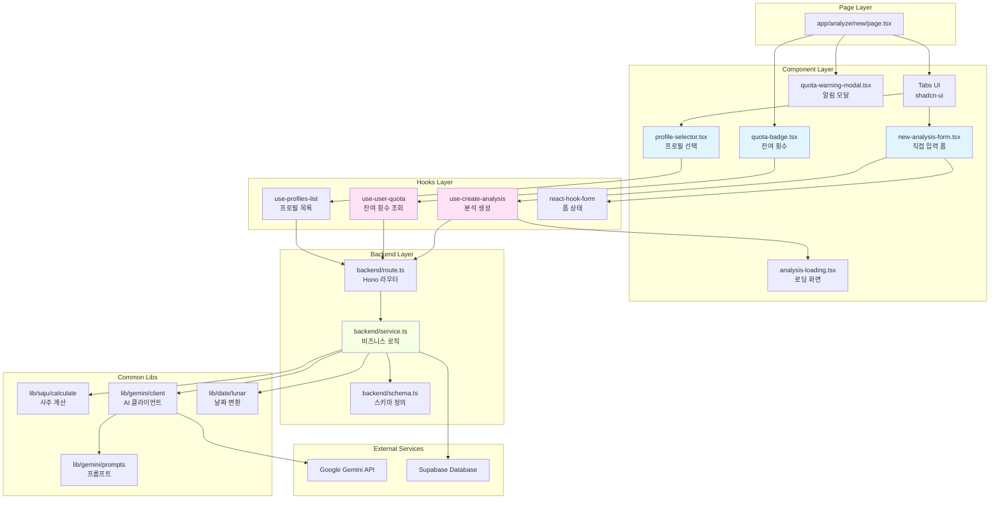
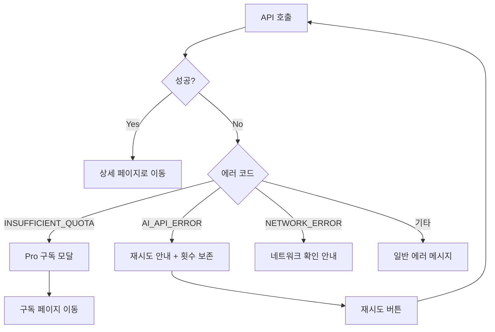

# 새 분석하기 페이지 구현 계획서

> **문서 버전**: 1.0
> **작성일**: 2025-10-25
> **페이지 경로**: `/analyze/new`
> **관련 유스케이스**: UC-003

---

## 목차

1. [개요](#1-개요)
2. [모듈 다이어그램](#2-모듈-다이어그램)
3. [페이지 구조 및 컴포넌트 분할](#3-페이지-구조-및-컴포넌트-분할)
4. [폼 관리 (react-hook-form + zod)](#4-폼-관리-react-hook-form--zod)
5. [탭 구조 구현](#5-탭-구조-구현)
6. [상태관리](#6-상태관리)
7. [API 연동](#7-api-연동)
8. [백엔드 구현](#8-백엔드-구현)
9. [에러 처리 및 예외 플로우](#9-에러-처리-및-예외-플로우)
10. [구현 순서 및 우선순위](#10-구현-순서-및-우선순위)

---

## 1. 개요

### 1.1 페이지 목적
사용자가 새로운 사주 분석을 생성하기 위한 데이터 입력 및 AI 분석 요청 페이지

### 1.2 주요 기능
- 사주 정보 직접 입력 (이름, 성별, 생년월일시, 분석 종류)
- 저장된 프로필 불러오기
- 사용자 잔여 횟수 표시 및 알림
- AI 분석 요청 및 로딩 처리
- 프로필 저장 옵션

### 1.3 설계 원칙
- **DRY**: 공통 모듈 최대 활용
- **타입 안정성**: Zod 스키마 기반 폼 검증
- **사용자 경험**: 명확한 에러 메시지 및 로딩 상태
- **접근성**: WCAG 2.1 AA 준수

### 1.4 모듈 위치
```
src/
├── app/
│   └── analyze/
│       └── new/
│           └── page.tsx                    # 페이지 진입점
├── features/
│   ├── analyze/
│   │   ├── components/
│   │   │   ├── new-analysis-form.tsx       # 새로 입력하기 폼
│   │   │   ├── profile-selector.tsx        # 프로필 불러오기
│   │   │   ├── quota-badge.tsx             # 잔여 횟수 배지
│   │   │   ├── analysis-loading.tsx        # 분석 중 로딩 화면
│   │   │   └── quota-warning-modal.tsx     # 횟수 부족 알림 모달
│   │   ├── hooks/
│   │   │   ├── use-user-quota.ts           # 잔여 횟수 조회
│   │   │   ├── use-create-analysis.ts      # 분석 생성 mutation
│   │   │   └── use-profiles-list.ts        # 프로필 목록 조회
│   │   ├── lib/
│   │   │   └── schema.ts                   # 폼 검증 스키마
│   │   └── backend/
│   │       ├── route.ts                    # Hono 라우터
│   │       ├── service.ts                  # 비즈니스 로직
│   │       ├── schema.ts                   # 요청/응답 스키마
│   │       └── error.ts                    # 에러 코드 정의
│   └── profile/
│       └── hooks/
│           └── use-profiles-list.ts        # 프로필 목록 조회 (공유)
└── lib/
    ├── saju/
    │   └── calculate.ts                    # 사주팔자 계산 (공통 모듈)
    ├── gemini/
    │   ├── client.ts                       # Gemini API 클라이언트
    │   └── prompts.ts                      # AI 프롬프트 템플릿
    └── date/
        └── lunar.ts                        # 양력/음력 변환
```

---

## 2. 모듈 다이어그램



---

## 3. 페이지 구조 및 컴포넌트 분할

### 3.1 페이지 진입점

**파일**: `src/app/analyze/new/page.tsx`

```typescript
'use client'

import { Tabs, TabsContent, TabsList, TabsTrigger } from '@/components/ui/tabs'
import { NewAnalysisForm } from '@/features/analyze/components/new-analysis-form'
import { ProfileSelector } from '@/features/analyze/components/profile-selector'
import { QuotaBadge } from '@/features/analyze/components/quota-badge'
import { QuotaWarningModal } from '@/features/analyze/components/quota-warning-modal'
import { useUserQuota } from '@/features/analyze/hooks/use-user-quota'

export default function NewAnalysisPage() {
  const { data: quota, isLoading } = useUserQuota()

  if (isLoading) {
    return <div>Loading...</div>
  }

  return (
    <div className="container mx-auto max-w-4xl py-8">
      <div className="mb-6 flex items-center justify-between">
        <h1 className="text-3xl font-bold">새 분석하기</h1>
        <QuotaBadge remaining={quota?.remaining ?? 0} tier={quota?.tier ?? 'free'} />
      </div>

      <QuotaWarningModal remaining={quota?.remaining ?? 0} tier={quota?.tier ?? 'free'} />

      <Tabs defaultValue="new" className="w-full">
        <TabsList className="grid w-full grid-cols-2">
          <TabsTrigger value="new">새로 입력하기</TabsTrigger>
          <TabsTrigger value="load">프로필 불러오기</TabsTrigger>
        </TabsList>

        <TabsContent value="new" className="mt-6">
          <NewAnalysisForm />
        </TabsContent>

        <TabsContent value="load" className="mt-6">
          <ProfileSelector />
        </TabsContent>
      </Tabs>
    </div>
  )
}
```

**컴포넌트 역할**:
- 페이지 레이아웃 구성
- 탭 UI 제공
- 잔여 횟수 표시 및 알림 모달 렌더링

---

### 3.2 새로 입력하기 폼

**파일**: `src/features/analyze/components/new-analysis-form.tsx`

```typescript
'use client'

import { useForm } from 'react-hook-form'
import { zodResolver } from '@hookform/resolvers/zod'
import { Button } from '@/components/ui/button'
import { Form, FormControl, FormField, FormItem, FormLabel, FormMessage } from '@/components/ui/form'
import { Input } from '@/components/ui/input'
import { RadioGroup, RadioGroupItem } from '@/components/ui/radio-group'
import { Calendar } from '@/components/ui/calendar'
import { Switch } from '@/components/ui/switch'
import { Select, SelectContent, SelectItem, SelectTrigger, SelectValue } from '@/components/ui/select'
import { Checkbox } from '@/components/ui/checkbox'
import { analysisInputSchema, type AnalysisInput } from '@/features/analyze/lib/schema'
import { useCreateAnalysis } from '@/features/analyze/hooks/use-create-analysis'
import { AnalysisLoading } from './analysis-loading'

export function NewAnalysisForm() {
  const form = useForm<AnalysisInput>({
    resolver: zodResolver(analysisInputSchema),
    defaultValues: {
      name: '',
      gender: undefined,
      birthDate: '',
      birthTime: undefined,
      isLunar: false,
      analysisType: 'yearly',
      saveAsProfile: false,
    },
  })

  const { mutate: createAnalysis, isPending } = useCreateAnalysis()

  const onSubmit = (data: AnalysisInput) => {
    createAnalysis(data)
  }

  if (isPending) {
    return <AnalysisLoading />
  }

  return (
    <Form {...form}>
      <form onSubmit={form.handleSubmit(onSubmit)} className="space-y-6">
        {/* 이름 */}
        <FormField
          control={form.control}
          name="name"
          render={({ field }) => (
            <FormItem>
              <FormLabel>이름</FormLabel>
              <FormControl>
                <Input placeholder="홍길동" {...field} />
              </FormControl>
              <FormMessage />
            </FormItem>
          )}
        />

        {/* 성별 */}
        <FormField
          control={form.control}
          name="gender"
          render={({ field }) => (
            <FormItem>
              <FormLabel>성별</FormLabel>
              <FormControl>
                <RadioGroup onValueChange={field.onChange} value={field.value}>
                  <div className="flex items-center space-x-2">
                    <RadioGroupItem value="male" id="male" />
                    <label htmlFor="male">남성</label>
                  </div>
                  <div className="flex items-center space-x-2">
                    <RadioGroupItem value="female" id="female" />
                    <label htmlFor="female">여성</label>
                  </div>
                </RadioGroup>
              </FormControl>
              <FormMessage />
            </FormItem>
          )}
        />

        {/* 생년월일 */}
        <FormField
          control={form.control}
          name="birthDate"
          render={({ field }) => (
            <FormItem>
              <FormLabel>생년월일</FormLabel>
              <FormControl>
                <Input type="date" {...field} />
              </FormControl>
              <FormMessage />
            </FormItem>
          )}
        />

        {/* 음력/양력 */}
        <FormField
          control={form.control}
          name="isLunar"
          render={({ field }) => (
            <FormItem className="flex flex-row items-center justify-between rounded-lg border p-4">
              <div className="space-y-0.5">
                <FormLabel className="text-base">음력</FormLabel>
              </div>
              <FormControl>
                <Switch checked={field.value} onCheckedChange={field.onChange} />
              </FormControl>
            </FormItem>
          )}
        />

        {/* 태어난 시간 */}
        <FormField
          control={form.control}
          name="birthTime"
          render={({ field }) => (
            <FormItem>
              <FormLabel>태어난 시간 (선택사항)</FormLabel>
              <FormControl>
                <Input type="time" {...field} />
              </FormControl>
              <FormMessage />
            </FormItem>
          )}
        />

        {/* 분석 종류 */}
        <FormField
          control={form.control}
          name="analysisType"
          render={({ field }) => (
            <FormItem>
              <FormLabel>분석 종류</FormLabel>
              <Select onValueChange={field.onChange} defaultValue={field.value}>
                <FormControl>
                  <SelectTrigger>
                    <SelectValue placeholder="분석 종류를 선택하세요" />
                  </SelectTrigger>
                </FormControl>
                <SelectContent>
                  <SelectItem value="monthly">월간 운세</SelectItem>
                  <SelectItem value="yearly">신년 운세</SelectItem>
                  <SelectItem value="lifetime">평생 운세</SelectItem>
                </SelectContent>
              </Select>
              <FormMessage />
            </FormItem>
          )}
        />

        {/* 프로필로 저장 */}
        <FormField
          control={form.control}
          name="saveAsProfile"
          render={({ field }) => (
            <FormItem className="flex flex-row items-start space-x-3 space-y-0">
              <FormControl>
                <Checkbox checked={field.value} onCheckedChange={field.onChange} />
              </FormControl>
              <div className="space-y-1 leading-none">
                <FormLabel>프로필로 저장</FormLabel>
              </div>
            </FormItem>
          )}
        />

        <Button type="submit" className="w-full" disabled={isPending}>
          분석 시작
        </Button>
      </form>
    </Form>
  )
}
```

**컴포넌트 역할**:
- 사주 정보 입력 폼 렌더링
- 클라이언트 측 유효성 검증 (Zod)
- 분석 생성 API 호출
- 로딩 상태 표시

---

### 3.3 프로필 선택기

**파일**: `src/features/analyze/components/profile-selector.tsx`

```typescript
'use client'

import { useProfilesList } from '@/features/profile/hooks/use-profiles-list'
import { Card, CardContent, CardDescription, CardHeader, CardTitle } from '@/components/ui/card'
import { Button } from '@/components/ui/button'
import { EmptyState } from '@/components/common/empty-state'
import { LoadingSpinner } from '@/components/common/loading-spinner'
import { useRouter } from 'next/navigation'
import { format } from 'date-fns'

export function ProfileSelector() {
  const { data: profiles, isLoading } = useProfilesList()
  const router = useRouter()

  const handleSelectProfile = (profileId: string) => {
    // TODO: 프로필 정보를 폼에 자동 입력하는 로직
    // 현재는 간단히 쿼리 파라미터로 전달
    router.push(`/analyze/new?profileId=${profileId}`)
  }

  if (isLoading) {
    return <LoadingSpinner message="프로필 목록을 불러오는 중..." />
  }

  if (!profiles || profiles.length === 0) {
    return (
      <EmptyState
        title="저장된 프로필이 없습니다"
        message="새로 입력하기 탭에서 정보를 입력하고 프로필로 저장해보세요"
        actionLabel="프로필 관리"
        actionHref="/profiles"
      />
    )
  }

  return (
    <div className="grid gap-4 md:grid-cols-2">
      {profiles.map((profile) => (
        <Card key={profile.id} className="cursor-pointer hover:bg-accent" onClick={() => handleSelectProfile(profile.id)}>
          <CardHeader>
            <CardTitle>{profile.name}</CardTitle>
            <CardDescription>
              {profile.gender === 'male' ? '남성' : '여성'} • {format(new Date(profile.birthDate), 'yyyy-MM-dd')}
            </CardDescription>
          </CardHeader>
          <CardContent>
            <div className="text-sm text-muted-foreground">
              {profile.isLunar ? '음력' : '양력'}
              {profile.birthTime && ` • ${profile.birthTime}`}
            </div>
          </CardContent>
        </Card>
      ))}
    </div>
  )
}
```

**컴포넌트 역할**:
- 저장된 프로필 목록 표시
- 프로필 선택 시 폼에 자동 입력
- 빈 상태 처리

---

### 3.4 잔여 횟수 배지

**파일**: `src/features/analyze/components/quota-badge.tsx`

```typescript
'use client'

import { Badge } from '@/components/ui/badge'
import { Sparkles } from 'lucide-react'

type QuotaBadgeProps = {
  remaining: number
  tier: 'free' | 'pro'
}

export function QuotaBadge({ remaining, tier }: QuotaBadgeProps) {
  const variant = remaining === 0 ? 'destructive' : remaining <= 3 ? 'warning' : 'default'

  return (
    <Badge variant={variant} className="flex items-center gap-2">
      <Sparkles className="h-4 w-4" />
      남은 분석 {remaining}회
      {tier === 'pro' && ' (Pro)'}
    </Badge>
  )
}
```

**컴포넌트 역할**:
- 잔여 횟수 시각적 표시
- 3회 이하 시 경고 색상 변경

---

### 3.5 분석 중 로딩 화면

**파일**: `src/features/analyze/components/analysis-loading.tsx`

```typescript
'use client'

import { Loader2 } from 'lucide-react'

export function AnalysisLoading() {
  return (
    <div className="flex min-h-[400px] flex-col items-center justify-center gap-4">
      <div className="relative">
        <Loader2 className="h-16 w-16 animate-spin text-primary" />
        <div className="absolute inset-0 flex items-center justify-center">
          <Loader2 className="h-8 w-8 animate-spin text-primary/50" style={{ animationDirection: 'reverse' }} />
        </div>
      </div>
      <div className="text-center">
        <h3 className="text-xl font-semibold">운명을 해석하고 있습니다...</h3>
        <p className="mt-2 text-muted-foreground">AI가 사주를 분석 중입니다. 잠시만 기다려주세요.</p>
        <p className="mt-4 text-sm text-muted-foreground">예상 소요 시간: 10~30초</p>
      </div>
    </div>
  )
}
```

**컴포넌트 역할**:
- AI 분석 중 로딩 애니메이션
- 사용자 친화적인 대기 메시지

---

### 3.6 횟수 부족 알림 모달

**파일**: `src/features/analyze/components/quota-warning-modal.tsx`

```typescript
'use client'

import { useEffect, useState } from 'react'
import {
  AlertDialog,
  AlertDialogAction,
  AlertDialogCancel,
  AlertDialogContent,
  AlertDialogDescription,
  AlertDialogFooter,
  AlertDialogHeader,
  AlertDialogTitle,
} from '@/components/ui/alert-dialog'
import { useRouter } from 'next/navigation'

type QuotaWarningModalProps = {
  remaining: number
  tier: 'free' | 'pro'
}

export function QuotaWarningModal({ remaining, tier }: QuotaWarningModalProps) {
  const [open, setOpen] = useState(false)
  const router = useRouter()

  useEffect(() => {
    // 0회: Pro 구독 필요
    if (remaining === 0) {
      setOpen(true)
    }
    // 1-3회: 알림만 표시
    else if (remaining > 0 && remaining <= 3) {
      setOpen(true)
    }
  }, [remaining])

  const handleUpgrade = () => {
    router.push('/subscription')
  }

  if (remaining === 0) {
    return (
      <AlertDialog open={open} onOpenChange={setOpen}>
        <AlertDialogContent>
          <AlertDialogHeader>
            <AlertDialogTitle>더 이상 무료 분석 횟수가 없습니다</AlertDialogTitle>
            <AlertDialogDescription>
              Pro 요금제로 업그레이드하여 월 10회의 고품질 분석을 이용하세요.
            </AlertDialogDescription>
          </AlertDialogHeader>
          <AlertDialogFooter>
            <AlertDialogCancel onClick={() => router.push('/dashboard')}>취소</AlertDialogCancel>
            <AlertDialogAction onClick={handleUpgrade}>Pro로 업그레이드</AlertDialogAction>
          </AlertDialogFooter>
        </AlertDialogContent>
      </AlertDialog>
    )
  }

  return (
    <AlertDialog open={open} onOpenChange={setOpen}>
      <AlertDialogContent>
        <AlertDialogHeader>
          <AlertDialogTitle>남은 분석 횟수가 {remaining}회입니다</AlertDialogTitle>
          <AlertDialogDescription>
            {tier === 'free'
              ? 'Pro로 업그레이드하여 더 많은 분석을 이용하세요.'
              : '다음 결제일에 10회로 초기화됩니다.'}
          </AlertDialogDescription>
        </AlertDialogHeader>
        <AlertDialogFooter>
          <AlertDialogAction onClick={() => setOpen(false)}>확인</AlertDialogAction>
          {tier === 'free' && (
            <AlertDialogAction onClick={handleUpgrade}>Pro 보기</AlertDialogAction>
          )}
        </AlertDialogFooter>
      </AlertDialogContent>
    </AlertDialog>
  )
}
```

**컴포넌트 역할**:
- 잔여 횟수 0회 시 Pro 구독 유도
- 1-3회 시 알림 표시

---

## 4. 폼 관리 (react-hook-form + zod)

### 4.1 폼 검증 스키마

**파일**: `src/features/analyze/lib/schema.ts`

```typescript
import { z } from 'zod'

export const analysisInputSchema = z.object({
  name: z.string().min(1, '이름을 입력해주세요').max(50, '이름은 50자 이내로 입력해주세요'),
  gender: z.enum(['male', 'female'], { required_error: '성별을 선택해주세요' }),
  birthDate: z.string().min(1, '생년월일을 입력해주세요'),
  birthTime: z.string().optional(),
  isLunar: z.boolean().default(false),
  analysisType: z.enum(['monthly', 'yearly', 'lifetime'], {
    required_error: '분석 종류를 선택해주세요',
  }),
  saveAsProfile: z.boolean().default(false),
})

export type AnalysisInput = z.infer<typeof analysisInputSchema>
```

**스키마 역할**:
- 클라이언트 측 입력 유효성 검증
- TypeScript 타입 자동 생성
- 에러 메시지 정의

---

## 5. 탭 구조 구현

### 5.1 shadcn-ui Tabs 컴포넌트 활용

```bash
# Tabs 컴포넌트 설치 (아직 없다면)
npx shadcn@latest add tabs
```

**구현 전략**:
- shadcn-ui의 `Tabs` 컴포넌트 사용
- 기본 탭: "새로 입력하기"
- 탭 전환 시 각 탭의 컴포넌트만 렌더링 (조건부 렌더링)
- 탭 상태는 로컬 상태로 관리 (Zustand 불필요)

---

## 6. 상태관리

### 6.1 서버 상태 (React Query)

#### 6.1.1 잔여 횟수 조회

**파일**: `src/features/analyze/hooks/use-user-quota.ts`

```typescript
import { useQuery } from '@tanstack/react-query'
import { apiClient } from '@/lib/remote/api-client'

type UserQuota = {
  remaining: number
  tier: 'free' | 'pro'
}

const fetchUserQuota = async (): Promise<UserQuota> => {
  const response = await apiClient.get<UserQuota>('/api/user/quota')
  return response.data
}

export function useUserQuota() {
  return useQuery({
    queryKey: ['user', 'quota'],
    queryFn: fetchUserQuota,
    staleTime: 1 * 60 * 1000, // 1분
  })
}
```

---

#### 6.1.2 분석 생성

**파일**: `src/features/analyze/hooks/use-create-analysis.ts`

```typescript
import { useMutation, useQueryClient } from '@tanstack/react-query'
import { useRouter } from 'next/navigation'
import { apiClient } from '@/lib/remote/api-client'
import { toast } from 'sonner'
import type { AnalysisInput } from '@/features/analyze/lib/schema'

type CreateAnalysisResponse = {
  id: string
}

const createAnalysis = async (data: AnalysisInput): Promise<CreateAnalysisResponse> => {
  const response = await apiClient.post<CreateAnalysisResponse>('/api/analysis/create', data)
  return response.data
}

export function useCreateAnalysis() {
  const queryClient = useQueryClient()
  const router = useRouter()

  return useMutation({
    mutationFn: createAnalysis,
    onSuccess: (data) => {
      // 잔여 횟수 무효화
      queryClient.invalidateQueries({ queryKey: ['user', 'quota'] })
      // 분석 목록 무효화
      queryClient.invalidateQueries({ queryKey: ['analyses'] })
      // 상세 페이지로 이동
      router.push(`/analyze/${data.id}`)
      toast.success('분석이 완료되었습니다')
    },
    onError: (error: any) => {
      const message = error?.response?.data?.message ?? '분석 생성에 실패했습니다'
      toast.error(message)
    },
  })
}
```

---

#### 6.1.3 프로필 목록 조회

**파일**: `src/features/profile/hooks/use-profiles-list.ts`

```typescript
import { useQuery } from '@tanstack/react-query'
import { apiClient } from '@/lib/remote/api-client'

type UserProfile = {
  id: string
  name: string
  gender: 'male' | 'female'
  birthDate: string
  birthTime: string | null
  isLunar: boolean
  createdAt: string
}

const fetchProfilesList = async (): Promise<UserProfile[]> => {
  const response = await apiClient.get<UserProfile[]>('/api/profiles')
  return response.data
}

export function useProfilesList() {
  return useQuery({
    queryKey: ['profiles', 'list'],
    queryFn: fetchProfilesList,
    staleTime: 5 * 60 * 1000, // 5분
  })
}
```

---

### 6.2 로컬 상태 (useState)

- **활성 탭**: `Tabs` 컴포넌트 내부 상태로 관리
- **선택된 프로필**: 쿼리 파라미터로 전달 또는 임시 상태
- **폼 상태**: `react-hook-form`으로 관리

### 6.3 전역 상태 (Zustand)

**이 페이지에서는 전역 상태 불필요**
- 모달은 로컬 상태로 충분
- 로딩은 mutation의 `isPending`으로 관리

---

## 7. API 연동

### 7.1 API 엔드포인트

| 엔드포인트 | 메서드 | 설명 |
|-----------|--------|------|
| `/api/user/quota` | GET | 사용자 잔여 횟수 조회 |
| `/api/analysis/create` | POST | 새 분석 생성 |
| `/api/profiles` | GET | 프로필 목록 조회 |

### 7.2 요청/응답 예시

#### 7.2.1 잔여 횟수 조회

**Request**:
```http
GET /api/user/quota
Authorization: Bearer <Clerk JWT>
```

**Response**:
```json
{
  "remaining": 5,
  "tier": "pro"
}
```

---

#### 7.2.2 분석 생성

**Request**:
```http
POST /api/analysis/create
Authorization: Bearer <Clerk JWT>
Content-Type: application/json

{
  "name": "홍길동",
  "gender": "male",
  "birthDate": "1990-05-15",
  "birthTime": "14:30",
  "isLunar": false,
  "analysisType": "yearly",
  "saveAsProfile": true
}
```

**Response** (성공):
```json
{
  "id": "uuid-123"
}
```

**Response** (실패 - 잔여 횟수 부족):
```json
{
  "error": "INSUFFICIENT_QUOTA",
  "message": "잔여 횟수가 부족합니다"
}
```

---

## 8. 백엔드 구현

### 8.1 Hono 라우터

**파일**: `src/features/analyze/backend/route.ts`

```typescript
import { Hono } from 'hono'
import { zValidator } from '@hono/zod-validator'
import { analysisCreateSchema, analysisResponseSchema } from './schema'
import { createAnalysisService, getUserQuotaService } from './service'
import type { AppEnv } from '@/backend/hono/context'

export const analyzeRoutes = new Hono<AppEnv>()

// 잔여 횟수 조회
analyzeRoutes.get('/user/quota', async (c) => {
  const supabase = c.get('supabase')
  const logger = c.get('logger')
  const user = c.get('user') // Clerk 미들웨어에서 주입

  try {
    const quota = await getUserQuotaService(supabase, user.id)
    return c.json(quota)
  } catch (error) {
    logger.error('Failed to fetch user quota', error)
    return c.json({ error: 'Failed to fetch quota' }, 500)
  }
})

// 분석 생성
analyzeRoutes.post('/analysis/create', zValidator('json', analysisCreateSchema), async (c) => {
  const supabase = c.get('supabase')
  const logger = c.get('logger')
  const config = c.get('config')
  const user = c.get('user')

  const input = c.req.valid('json')

  try {
    const analysisId = await createAnalysisService(supabase, logger, config, user.id, input)
    return c.json({ id: analysisId }, 201)
  } catch (error: any) {
    logger.error('Failed to create analysis', error)

    if (error.code === 'INSUFFICIENT_QUOTA') {
      return c.json({ error: error.code, message: error.message }, 400)
    }

    if (error.code === 'AI_API_ERROR') {
      return c.json({ error: error.code, message: error.message }, 503)
    }

    return c.json({ error: 'INTERNAL_ERROR', message: '분석 생성에 실패했습니다' }, 500)
  }
})
```

---

### 8.2 서비스 레이어

**파일**: `src/features/analyze/backend/service.ts`

```typescript
import type { SupabaseClient } from '@supabase/supabase-js'
import type { AppLogger } from '@/backend/middleware/logger'
import type { AppConfig } from '@/backend/config'
import { calculateSaju } from '@/lib/saju/calculate'
import { createAnalysisPrompt } from '@/lib/gemini/prompts'
import { generateAnalysis } from '@/lib/gemini/client'
import { lunarToSolar } from '@/lib/date/lunar'
import { AnalysisCreateError } from './error'
import type { AnalysisCreateInput } from './schema'

export const getUserQuotaService = async (supabase: SupabaseClient, clerkId: string) => {
  const { data: user, error } = await supabase
    .from('users')
    .select('remaining_analyses, subscription_tier')
    .eq('clerk_id', clerkId)
    .is('deleted_at', null)
    .single()

  if (error) throw error

  return {
    remaining: user.remaining_analyses,
    tier: user.subscription_tier as 'free' | 'pro',
  }
}

export const createAnalysisService = async (
  supabase: SupabaseClient,
  logger: AppLogger,
  config: AppConfig,
  clerkId: string,
  input: AnalysisCreateInput
): Promise<string> => {
  // 1. 사용자 정보 조회 및 잔여 횟수 확인
  const { data: user, error: userError } = await supabase
    .from('users')
    .select('*')
    .eq('clerk_id', clerkId)
    .is('deleted_at', null)
    .single()

  if (userError) throw userError

  if (user.remaining_analyses <= 0) {
    throw new AnalysisCreateError('INSUFFICIENT_QUOTA', '잔여 횟수가 부족합니다')
  }

  // 2. 음력 → 양력 변환 (필요시)
  let birthDate = new Date(input.birthDate)
  if (input.isLunar) {
    birthDate = lunarToSolar(birthDate)
  }

  // 3. 사주팔자 계산
  const sajuData = calculateSaju(birthDate, input.birthTime, input.isLunar)

  // 4. AI 모델 선택
  const model = user.subscription_tier === 'pro' ? 'gemini-2.5-pro' : 'gemini-2.5-flash'

  // 5. 프롬프트 생성 및 AI 호출
  const prompt = createAnalysisPrompt(input.name, input.gender, sajuData, input.analysisType)

  let analysisResult
  try {
    analysisResult = await generateAnalysis(prompt, model)
  } catch (error) {
    logger.error('AI API call failed', error)
    throw new AnalysisCreateError('AI_API_ERROR', 'AI 분석 중 오류가 발생했습니다')
  }

  // 6. 트랜잭션 시작: 분석 저장 + 횟수 차감 + (선택) 프로필 저장
  const { data: analysis, error: insertError } = await supabase
    .from('user_analyses')
    .insert({
      user_id: user.id,
      name: input.name,
      gender: input.gender,
      birth_date: birthDate.toISOString().split('T')[0],
      birth_time: input.birthTime || null,
      is_lunar: input.isLunar,
      analysis_type: input.analysisType,
      model_used: model,
      result_json: analysisResult,
    })
    .select('id')
    .single()

  if (insertError) throw insertError

  // 7. 잔여 횟수 차감
  const { error: updateError } = await supabase
    .from('users')
    .update({ remaining_analyses: user.remaining_analyses - 1 })
    .eq('id', user.id)

  if (updateError) {
    logger.error('Failed to update user credits', updateError)
    // 이미 분석은 저장되었으므로 롤백 필요 (실제로는 DB 트랜잭션 권장)
  }

  // 8. 프로필 저장 (선택)
  if (input.saveAsProfile) {
    await supabase.from('user_profiles').insert({
      user_id: user.id,
      name: input.name,
      gender: input.gender,
      birth_date: birthDate.toISOString().split('T')[0],
      birth_time: input.birthTime || null,
      is_lunar: input.isLunar,
    })
    // 에러 무시 (중복 프로필 등)
  }

  return analysis.id
}
```

---

### 8.3 스키마 정의

**파일**: `src/features/analyze/backend/schema.ts`

```typescript
import { z } from 'zod'

export const analysisCreateSchema = z.object({
  name: z.string().min(1).max(50),
  gender: z.enum(['male', 'female']),
  birthDate: z.string(),
  birthTime: z.string().optional(),
  isLunar: z.boolean().default(false),
  analysisType: z.enum(['monthly', 'yearly', 'lifetime']),
  saveAsProfile: z.boolean().default(false),
})

export type AnalysisCreateInput = z.infer<typeof analysisCreateSchema>

export const analysisResponseSchema = z.object({
  id: z.string().uuid(),
})
```

---

### 8.4 에러 정의

**파일**: `src/features/analyze/backend/error.ts`

```typescript
export class AnalysisCreateError extends Error {
  constructor(public code: string, message: string) {
    super(message)
    this.name = 'AnalysisCreateError'
  }
}
```

---

## 9. 에러 처리 및 예외 플로우

### 9.1 에러 시나리오

| 에러 코드 | 시나리오 | 처리 방법 |
|---------|---------|----------|
| `INSUFFICIENT_QUOTA` | 잔여 횟수 부족 | Pro 구독 안내 모달 |
| `AI_API_ERROR` | Gemini API 실패 | 재시도 버튼 + 횟수 미차감 |
| `INVALID_LUNAR_DATE` | 유효하지 않은 음력 날짜 | 폼 에러 메시지 |
| `NETWORK_ERROR` | 네트워크 오류 | 재시도 안내 |
| `INTERNAL_ERROR` | 기타 서버 오류 | 일반 에러 메시지 |

### 9.2 에러 처리 플로우



---

## 10. 구현 순서 및 우선순위

### Phase 1: 기초 설정 (1일)
1. ✅ 페이지 파일 생성 (`app/analyze/new/page.tsx`)
2. ✅ 디렉터리 구조 생성 (`features/analyze/`)
3. ✅ 스키마 정의 (`lib/schema.ts`, `backend/schema.ts`)
4. ✅ 타입 정의

### Phase 2: UI 컴포넌트 구현 (2일)
1. ✅ `QuotaBadge` 컴포넌트
2. ✅ `NewAnalysisForm` 컴포넌트
3. ✅ `AnalysisLoading` 컴포넌트
4. ✅ `QuotaWarningModal` 컴포넌트
5. ✅ `ProfileSelector` 컴포넌트 (간단 버전)

### Phase 3: React Query Hooks (1일)
1. ✅ `use-user-quota.ts`
2. ✅ `use-create-analysis.ts`
3. ✅ `use-profiles-list.ts`

### Phase 4: 백엔드 구현 (3일)
1. ✅ Hono 라우터 (`route.ts`)
2. ✅ 서비스 레이어 (`service.ts`)
3. ✅ 사주 계산 유틸리티 (`lib/saju/calculate.ts`)
4. ✅ Gemini API 클라이언트 (`lib/gemini/client.ts`)
5. ✅ 프롬프트 템플릿 (`lib/gemini/prompts.ts`)
6. ✅ 양력/음력 변환 (`lib/date/lunar.ts`)

### Phase 5: 통합 및 테스트 (2일)
1. ✅ 프론트엔드-백엔드 연동
2. ✅ 에러 처리 테스트
3. ✅ 엣지케이스 테스트
4. ✅ UI/UX 개선

### Phase 6: QA 및 배포 (1일)
1. ✅ 전체 플로우 테스트
2. ✅ 접근성 검토
3. ✅ 반응형 디자인 확인
4. ✅ 성능 최적화

**총 예상 기간**: 10일

---

## 11. QA Sheet (컴포넌트 테스트 체크리스트)

### 11.1 페이지 레벨
- [ ] 페이지 로드 시 잔여 횟수가 올바르게 표시되는가?
- [ ] 잔여 횟수 0회 시 모달이 자동으로 열리는가?
- [ ] 1-3회 시 알림 모달이 표시되는가?
- [ ] 탭 전환이 정상 작동하는가?

### 11.2 새로 입력하기 폼
- [ ] 모든 필수 필드가 비어있을 때 제출 불가능한가?
- [ ] 이름 50자 초과 시 에러 메시지가 표시되는가?
- [ ] 성별 미선택 시 에러 메시지가 표시되는가?
- [ ] 음력 토글이 정상 작동하는가?
- [ ] 태어난 시간 미입력 시에도 제출 가능한가?
- [ ] 프로필 저장 체크박스가 정상 작동하는가?
- [ ] 제출 시 로딩 화면이 표시되는가?
- [ ] 분석 완료 후 상세 페이지로 이동하는가?

### 11.3 프로필 불러오기
- [ ] 프로필 목록이 올바르게 표시되는가?
- [ ] 프로필 없을 때 빈 상태가 표시되는가?
- [ ] 프로필 선택 시 폼에 정보가 자동 입력되는가? (향후 구현)

### 11.4 에러 처리
- [ ] 잔여 횟수 부족 시 에러 메시지가 표시되는가?
- [ ] AI API 실패 시 재시도 안내가 표시되는가?
- [ ] 네트워크 오류 시 적절한 메시지가 표시되는가?
- [ ] 유효하지 않은 음력 날짜 입력 시 에러 메시지가 표시되는가?

### 11.5 접근성
- [ ] 키보드만으로 모든 기능에 접근 가능한가?
- [ ] 스크린 리더로 모든 요소가 읽히는가?
- [ ] 색상 대비가 WCAG AA 기준을 충족하는가?
- [ ] 폼 에러 메시지가 aria-live로 알려지는가?

---

## 12. Unit Test 예시 (서비스 레이어)

**파일**: `src/features/analyze/backend/service.test.ts`

```typescript
import { describe, it, expect, vi } from 'vitest'
import { createAnalysisService } from './service'
import type { SupabaseClient } from '@supabase/supabase-js'

describe('createAnalysisService', () => {
  it('should throw INSUFFICIENT_QUOTA error when user has 0 credits', async () => {
    const mockSupabase = {
      from: vi.fn().mockReturnValue({
        select: vi.fn().mockReturnValue({
          eq: vi.fn().mockReturnValue({
            is: vi.fn().mockReturnValue({
              single: vi.fn().mockResolvedValue({
                data: { remaining_analyses: 0 },
                error: null,
              }),
            }),
          }),
        }),
      }),
    } as unknown as SupabaseClient

    await expect(
      createAnalysisService(mockSupabase, {} as any, {} as any, 'user-123', {} as any)
    ).rejects.toThrow('잔여 횟수가 부족합니다')
  })

  // 추가 테스트 케이스...
})
```

---

## 부록: 필요한 shadcn-ui 컴포넌트

```bash
# 설치 필요 컴포넌트
npx shadcn@latest add tabs
npx shadcn@latest add form
npx shadcn@latest add input
npx shadcn@latest add radio-group
npx shadcn@latest add calendar
npx shadcn@latest add switch
npx shadcn@latest add select
npx shadcn@latest add checkbox
npx shadcn@latest add button
npx shadcn@latest add badge
npx shadcn@latest add card
npx shadcn@latest add alert-dialog
```

---

**문서 끝**
