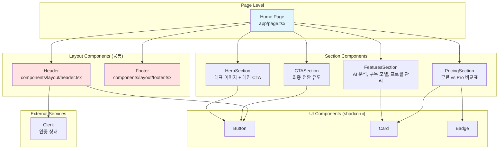

# 홈 (랜딩) 페이지 구현 계획

> **문서 버전**: 1.0
> **작성일**: 2025-10-25
> **페이지 경로**: `/`
> **프로젝트**: SuperNext - AI 기반 구독형 사주풀이 서비스

---

## 목차

1. [개요](#1-개요)
2. [페이지 요구사항](#2-페이지-요구사항)
3. [모듈 다이어그램](#3-모듈-다이어그램)
4. [컴포넌트 구조](#4-컴포넌트-구조)
5. [구현 계획](#5-구현-계획)
6. [QA 체크리스트](#6-qa-체크리스트)
7. [구현 순서](#7-구현-순서)

---

## 1. 개요

### 1.1 페이지 목적

홈(랜딩) 페이지는 서비스의 첫 인상을 결정하는 마케팅 페이지로, 다음 목표를 달성합니다:

- **서비스 가치 전달**: AI 사주풀이 서비스의 핵심 가치 제안
- **사용자 유입 전환**: 회원가입 유도 및 무료 체험 안내
- **요금제 안내**: 무료 vs Pro 비교를 통한 구독 전환 유도
- **신뢰 구축**: 깔끔하고 현대적인 디자인으로 서비스 신뢰도 확보

### 1.2 기술 스택

- **Framework**: Next.js 15 (App Router)
- **스타일링**: Tailwind CSS, shadcn-ui
- **인증**: Clerk (소셜 로그인 지원)
- **상태관리**: 없음 (정적 컨텐츠 위주, 인증 상태만 Clerk useUser 훅 사용)
- **아이콘**: lucide-react

### 1.3 페이지 특징

- ✅ **정적 컨텐츠 위주**: 서버 상태 관리 불필요
- ✅ **인증 불필요**: 누구나 접근 가능
- ✅ **반응형 디자인**: 모바일 최적화
- ✅ **토스페이먼츠 스타일 벤치마킹**: 깔끔하고 현대적인 디자인

---

## 2. 페이지 요구사항

### 2.1 PRD 기반 요구사항

**출처**: `docs/prd.md` 섹션 8.2

#### 2.1.1 디자인
- 토스페이먼츠 웹사이트 스타일 벤치마킹
- 깔끔하고 현대적인 레이아웃
- 반응형 디자인 (모바일 최적화)

#### 2.1.2 헤더 구성

**미로그인 상태**:
- 서비스 로고 (좌측)
- 로그인 / 회원가입 버튼 (우측)

**로그인 상태**:
- 서비스 로고 (좌측)
- 메뉴: 분석 목록 / 새 분석하기 / 구독 관리
- 사용자 프로필 아이콘 (Clerk UserButton)
  - 정보 수정
  - 로그아웃
  - 회원 탈퇴

#### 2.1.3 주요 섹션
- **Hero Section**: 서비스 핵심 가치 제안
- **Features**: AI 분석, 구독 모델, 프로필 관리 등
- **Pricing**: 무료 vs Pro 비교표
- **CTA**: "무료로 시작하기" 버튼

### 2.2 상태관리 설계

**출처**: `docs/external/state-design.md` 섹션 3.1

- **상태관리 불필요**: 정적 컨텐츠 위주
- **사용하는 전역 상태**:
  - `useUser()` (Clerk): 로그인 상태 확인
  - `useUIStore` (선택적): 모바일 메뉴 토글

### 2.3 공통 모듈 활용

**출처**: `docs/common-modules.md`

- **레이아웃 컴포넌트**: `Header`, `Footer` (이미 구현됨)
- **UI 컴포넌트**: shadcn-ui `Button`, `Card`, `Badge` 등

---

## 3. 모듈 다이어그램



---

## 4. 컴포넌트 구조

### 4.1 페이지 파일

**위치**: `src/app/page.tsx`

**역할**: 홈 페이지의 루트 컴포넌트, 섹션 컴포넌트들을 조합

**의존성**:
- 레이아웃: `Header`, `Footer` (기존 공통 컴포넌트)
- 섹션: `HeroSection`, `FeaturesSection`, `PricingSection`, `CTASection`

### 4.2 섹션 컴포넌트

모든 섹션 컴포넌트는 `src/app/(landing)/` 디렉터리에 배치합니다.

#### 4.2.1 HeroSection

**위치**: `src/app/(landing)/_components/hero-section.tsx`

**역할**: 서비스 핵심 가치 제안 및 메인 CTA

**구조**:
```tsx
- 큰 제목 (H1): "AI가 풀어주는 당신의 운명"
- 부제목 (P): "Google Gemini 기반 정확한 사주 분석"
- CTA 버튼: "무료로 시작하기" (회원가입 페이지로 이동)
- 배경: 그라데이션 또는 일러스트레이션
```

#### 4.2.2 FeaturesSection

**위치**: `src/app/(landing)/_components/features-section.tsx`

**역할**: 주요 기능 소개 (3-4개 카드)

**구조**:
```tsx
- 섹션 제목: "SuperNext의 강점"
- 카드 그리드 (3개):
  1. AI 기반 정확한 분석 (아이콘: Sparkles)
     - Google Gemini Pro 사용
     - 구조화된 JSON 결과
  2. 편리한 프로필 관리 (아이콘: Users)
     - 가족/지인 정보 저장
     - 빠른 재분석
  3. 합리적인 구독 모델 (아이콘: CreditCard)
     - 무료 3회 체험
     - Pro 월 10회
```

#### 4.2.3 PricingSection

**위치**: `src/app/(landing)/_components/pricing-section.tsx`

**역할**: 요금제 비교표

**구조**:
```tsx
- 섹션 제목: "요금제 안내"
- 비교 카드 (2개):
  1. 무료 (Free Tier)
     - 가격: ₩0
     - 횟수: 최초 3회
     - 모델: gemini-2.5-flash
     - CTA: "무료로 시작하기"
  2. Pro (Premium Tier)
     - 가격: ₩10,000/월
     - 횟수: 월 10회
     - 모델: gemini-2.5-pro
     - CTA: "Pro 구독하기"
     - 배지: "추천" (Badge)
```

#### 4.2.4 CTASection

**위치**: `src/app/(landing)/_components/cta-section.tsx`

**역할**: 최종 전환 유도

**구조**:
```tsx
- 제목: "지금 바로 무료로 시작하세요"
- 설명: "회원가입 후 3회 무료 분석 제공"
- CTA 버튼: "회원가입하기"
- 배경: 그라데이션 또는 패턴
```

---

## 5. 구현 계획

### 5.1 페이지 파일 (`app/page.tsx`)

**기존 파일 교체**: 현재 예제 페이지를 랜딩 페이지로 대체

**구현 내용**:

```tsx
'use client'

import { Header } from '@/components/layout/header'
import { Footer } from '@/components/layout/footer'
import { HeroSection } from './(landing)/_components/hero-section'
import { FeaturesSection } from './(landing)/_components/features-section'
import { PricingSection } from './(landing)/_components/pricing-section'
import { CTASection } from './(landing)/_components/cta-section'

export default function HomePage() {
  return (
    <div className="min-h-screen flex flex-col">
      <Header />
      <main className="flex-1">
        <HeroSection />
        <FeaturesSection />
        <PricingSection />
        <CTASection />
      </main>
      <Footer />
    </div>
  )
}
```

**주의사항**:
- `use client` 디렉티브 필수 (CLAUDE.md 규칙)
- Header는 이미 Clerk UserButton을 포함하므로 수정 불필요
- 모든 섹션은 반응형 디자인 적용

---

### 5.2 HeroSection 구현

**파일**: `src/app/(landing)/_components/hero-section.tsx`

**구현 내용**:

```tsx
'use client'

import { Button } from '@/components/ui/button'
import Link from 'next/link'
import { Sparkles } from 'lucide-react'

export function HeroSection() {
  return (
    <section className="relative bg-gradient-to-br from-indigo-50 via-white to-purple-50 py-20 md:py-32">
      <div className="container mx-auto px-4">
        <div className="mx-auto max-w-4xl text-center">
          <div className="mb-6 inline-flex items-center gap-2 rounded-full bg-indigo-100 px-4 py-2 text-sm font-medium text-indigo-700">
            <Sparkles className="h-4 w-4" />
            Google Gemini AI 기반
          </div>

          <h1 className="mb-6 text-4xl font-bold tracking-tight text-gray-900 md:text-6xl">
            AI가 풀어주는
            <br />
            <span className="bg-gradient-to-r from-indigo-600 to-purple-600 bg-clip-text text-transparent">
              당신의 운명
            </span>
          </h1>

          <p className="mb-8 text-lg text-gray-600 md:text-xl">
            Google Gemini Pro를 활용한 정확한 사주 분석
            <br />
            총운, 재물운, 애정운, 건강운, 직업운을 한눈에
          </p>

          <div className="flex flex-col items-center justify-center gap-4 sm:flex-row">
            <Button asChild size="lg" className="w-full sm:w-auto">
              <Link href="/signup">
                무료로 시작하기
              </Link>
            </Button>
            <Button asChild variant="outline" size="lg" className="w-full sm:w-auto">
              <Link href="#features">
                자세히 알아보기
              </Link>
            </Button>
          </div>

          <p className="mt-6 text-sm text-gray-500">
            ✨ 회원가입 시 3회 무료 분석 제공
          </p>
        </div>
      </div>

      {/* 배경 데코레이션 */}
      <div className="absolute inset-0 -z-10 overflow-hidden">
        <div className="absolute left-1/2 top-1/2 h-[500px] w-[500px] -translate-x-1/2 -translate-y-1/2 rounded-full bg-indigo-200/20 blur-3xl" />
      </div>
    </section>
  )
}
```

**QA 체크리스트**:
- [ ] 제목과 부제목이 명확하게 표시되는가?
- [ ] CTA 버튼이 눈에 잘 띄는가?
- [ ] 모바일에서 레이아웃이 깨지지 않는가?
- [ ] 배지 아이콘이 정렬되어 있는가?
- [ ] 링크가 올바른 경로로 연결되는가?

---

### 5.3 FeaturesSection 구현

**파일**: `src/app/(landing)/_components/features-section.tsx`

**구현 내용**:

```tsx
'use client'

import { Card, CardContent, CardDescription, CardHeader, CardTitle } from '@/components/ui/card'
import { Sparkles, Users, CreditCard } from 'lucide-react'

const features = [
  {
    icon: Sparkles,
    title: 'AI 기반 정확한 분석',
    description: 'Google Gemini Pro를 사용하여 사주팔자를 정밀하게 해석합니다. 구조화된 JSON 결과로 일관된 품질을 보장합니다.',
  },
  {
    icon: Users,
    title: '편리한 프로필 관리',
    description: '가족, 친구 등 자주 보는 사람의 정보를 저장하고, 빠르게 재분석할 수 있습니다.',
  },
  {
    icon: CreditCard,
    title: '합리적인 구독 모델',
    description: '무료로 3회 체험 후, Pro 구독으로 월 10회 고품질 분석을 받을 수 있습니다.',
  },
]

export function FeaturesSection() {
  return (
    <section id="features" className="bg-white py-20 md:py-32">
      <div className="container mx-auto px-4">
        <div className="mb-12 text-center">
          <h2 className="mb-4 text-3xl font-bold tracking-tight text-gray-900 md:text-4xl">
            SuperNext의 강점
          </h2>
          <p className="text-lg text-gray-600">
            AI 기술과 전통 명리학의 만남
          </p>
        </div>

        <div className="grid gap-8 md:grid-cols-3">
          {features.map((feature) => {
            const Icon = feature.icon
            return (
              <Card key={feature.title} className="border-2 transition-shadow hover:shadow-lg">
                <CardHeader>
                  <div className="mb-4 inline-flex h-12 w-12 items-center justify-center rounded-lg bg-indigo-100">
                    <Icon className="h-6 w-6 text-indigo-600" />
                  </div>
                  <CardTitle className="text-xl">{feature.title}</CardTitle>
                </CardHeader>
                <CardContent>
                  <CardDescription className="text-base leading-relaxed">
                    {feature.description}
                  </CardDescription>
                </CardContent>
              </Card>
            )
          })}
        </div>
      </div>
    </section>
  )
}
```

**QA 체크리스트**:
- [ ] 3개의 카드가 그리드로 정렬되는가?
- [ ] 모바일에서 1열로 스택되는가?
- [ ] 아이콘이 제대로 표시되는가?
- [ ] hover 효과가 작동하는가?
- [ ] 텍스트 가독성이 좋은가?

---

### 5.4 PricingSection 구현

**파일**: `src/app/(landing)/_components/pricing-section.tsx`

**구현 내용**:

```tsx
'use client'

import { Button } from '@/components/ui/button'
import { Card, CardContent, CardDescription, CardFooter, CardHeader, CardTitle } from '@/components/ui/card'
import { Badge } from '@/components/ui/badge'
import Link from 'next/link'
import { Check } from 'lucide-react'

const plans = [
  {
    name: '무료',
    price: '₩0',
    period: '영구',
    badge: null,
    features: [
      '최초 3회 분석',
      'gemini-2.5-flash 모델',
      '프로필 최대 5개',
      'PDF 다운로드',
    ],
    cta: '무료로 시작하기',
    ctaHref: '/signup',
    variant: 'outline' as const,
  },
  {
    name: 'Pro',
    price: '₩10,000',
    period: '월',
    badge: '추천',
    features: [
      '월 10회 분석',
      'gemini-2.5-pro 모델',
      '무제한 프로필',
      'PDF 다운로드',
      '우선 고객지원',
    ],
    cta: 'Pro 구독하기',
    ctaHref: '/subscription',
    variant: 'default' as const,
  },
]

export function PricingSection() {
  return (
    <section className="bg-gradient-to-br from-gray-50 to-indigo-50 py-20 md:py-32">
      <div className="container mx-auto px-4">
        <div className="mb-12 text-center">
          <h2 className="mb-4 text-3xl font-bold tracking-tight text-gray-900 md:text-4xl">
            요금제 안내
          </h2>
          <p className="text-lg text-gray-600">
            지금 무료로 시작하고, 원할 때 Pro로 업그레이드하세요
          </p>
        </div>

        <div className="mx-auto grid max-w-5xl gap-8 md:grid-cols-2">
          {plans.map((plan) => (
            <Card
              key={plan.name}
              className={`relative border-2 transition-all ${
                plan.badge
                  ? 'border-indigo-600 shadow-xl'
                  : 'border-gray-200 hover:shadow-lg'
              }`}
            >
              {plan.badge && (
                <div className="absolute -top-4 left-1/2 -translate-x-1/2">
                  <Badge className="bg-indigo-600 px-4 py-1 text-white">
                    {plan.badge}
                  </Badge>
                </div>
              )}

              <CardHeader>
                <CardTitle className="text-2xl">{plan.name}</CardTitle>
                <CardDescription>
                  <span className="text-4xl font-bold text-gray-900">
                    {plan.price}
                  </span>
                  <span className="text-gray-600"> / {plan.period}</span>
                </CardDescription>
              </CardHeader>

              <CardContent>
                <ul className="space-y-3">
                  {plan.features.map((feature) => (
                    <li key={feature} className="flex items-start gap-3">
                      <Check className="h-5 w-5 flex-shrink-0 text-indigo-600" />
                      <span className="text-gray-700">{feature}</span>
                    </li>
                  ))}
                </ul>
              </CardContent>

              <CardFooter>
                <Button asChild variant={plan.variant} size="lg" className="w-full">
                  <Link href={plan.ctaHref}>{plan.cta}</Link>
                </Button>
              </CardFooter>
            </Card>
          ))}
        </div>

        <p className="mt-8 text-center text-sm text-gray-500">
          * 사용하지 않은 횟수는 다음 달로 이월되지 않습니다
        </p>
      </div>
    </section>
  )
}
```

**QA 체크리스트**:
- [ ] 2개의 카드가 나란히 정렬되는가?
- [ ] Pro 카드에 "추천" 배지가 표시되는가?
- [ ] 각 플랜의 가격과 기능이 명확한가?
- [ ] CTA 버튼이 각각 올바른 경로로 연결되는가?
- [ ] 모바일에서 카드가 1열로 스택되는가?

---

### 5.5 CTASection 구현

**파일**: `src/app/(landing)/_components/cta-section.tsx`

**구현 내용**:

```tsx
'use client'

import { Button } from '@/components/ui/button'
import Link from 'next/link'
import { ArrowRight } from 'lucide-react'

export function CTASection() {
  return (
    <section className="bg-gradient-to-r from-indigo-600 to-purple-600 py-20 md:py-32">
      <div className="container mx-auto px-4">
        <div className="mx-auto max-w-3xl text-center">
          <h2 className="mb-6 text-3xl font-bold text-white md:text-5xl">
            지금 바로 무료로 시작하세요
          </h2>

          <p className="mb-8 text-lg text-indigo-100 md:text-xl">
            회원가입 후 즉시 3회 무료 분석 제공
            <br />
            신용카드 등록 없이 시작할 수 있습니다
          </p>

          <Button
            asChild
            size="lg"
            variant="secondary"
            className="group gap-2"
          >
            <Link href="/signup">
              회원가입하기
              <ArrowRight className="h-5 w-5 transition-transform group-hover:translate-x-1" />
            </Link>
          </Button>

          <p className="mt-6 text-sm text-indigo-200">
            이미 계정이 있으신가요?{' '}
            <Link href="/login" className="font-medium text-white underline">
              로그인
            </Link>
          </p>
        </div>
      </div>
    </section>
  )
}
```

**QA 체크리스트**:
- [ ] 배경 그라데이션이 적용되었는가?
- [ ] 텍스트가 배경에서 잘 보이는가?
- [ ] CTA 버튼에 hover 효과가 있는가?
- [ ] 로그인 링크가 작동하는가?
- [ ] 아이콘 애니메이션이 자연스러운가?

---

### 5.6 Header 컴포넌트 수정

**파일**: `src/components/layout/header.tsx` (기존 파일 수정)

**현재 상태**: Clerk UserButton 포함, 인증된 사용자용 메뉴 제공

**수정 사항**: 미로그인 상태에서 로그인/회원가입 버튼 추가

**구현 내용**:

```tsx
'use client'

import { useUser, UserButton } from '@clerk/nextjs'
import Link from 'next/link'
import { Button } from '@/components/ui/button'

export const Header = () => {
  const { isSignedIn, isLoaded } = useUser()

  return (
    <header className="sticky top-0 z-50 border-b bg-white/80 backdrop-blur-sm">
      <div className="container mx-auto flex h-16 items-center justify-between px-4">
        <Link href="/" className="text-xl font-bold text-gray-900">
          SuperNext
        </Link>

        {isLoaded && (
          <nav className="flex items-center gap-4">
            {isSignedIn ? (
              <>
                <Link
                  href="/dashboard"
                  className="text-sm font-medium text-gray-700 transition-colors hover:text-gray-900"
                >
                  분석 목록
                </Link>
                <Link
                  href="/analyze/new"
                  className="text-sm font-medium text-gray-700 transition-colors hover:text-gray-900"
                >
                  새 분석하기
                </Link>
                <Link
                  href="/subscription"
                  className="text-sm font-medium text-gray-700 transition-colors hover:text-gray-900"
                >
                  구독 관리
                </Link>
                <UserButton afterSignOutUrl="/" />
              </>
            ) : (
              <>
                <Button asChild variant="ghost" size="sm">
                  <Link href="/login">로그인</Link>
                </Button>
                <Button asChild size="sm">
                  <Link href="/signup">회원가입</Link>
                </Button>
              </>
            )}
          </nav>
        )}
      </div>
    </header>
  )
}
```

**QA 체크리스트**:
- [ ] 로그인 상태에 따라 다른 메뉴가 표시되는가?
- [ ] Clerk 로딩 중 UI가 깜빡이지 않는가?
- [ ] sticky 헤더가 스크롤 시 상단에 고정되는가?
- [ ] 모바일에서 메뉴가 잘 보이는가?
- [ ] 로고 클릭 시 홈으로 이동하는가?

---

### 5.7 필요한 shadcn-ui 컴포넌트

다음 컴포넌트들이 이미 설치되어 있는지 확인:

```bash
# 확인 필요 (이미 설치되어 있을 수 있음)
npx shadcn@latest add button
npx shadcn@latest add card
npx shadcn@latest add badge
```

---

## 6. QA 체크리스트

### 6.1 기능 테스트

**인증 상태**:
- [ ] 미로그인 시 헤더에 로그인/회원가입 버튼 표시
- [ ] 로그인 시 헤더에 메뉴 + UserButton 표시
- [ ] UserButton 클릭 시 정보 수정/로그아웃 옵션 표시

**네비게이션**:
- [ ] "무료로 시작하기" 버튼 → `/signup` 이동
- [ ] "로그인" 버튼 → `/login` 이동
- [ ] "자세히 알아보기" 버튼 → Features 섹션으로 스크롤
- [ ] "Pro 구독하기" 버튼 → `/subscription` 이동
- [ ] 로고 클릭 → `/` (홈) 이동

### 6.2 디자인 테스트

**반응형**:
- [ ] 모바일 (< 768px): 모든 섹션이 1열로 스택
- [ ] 태블릿 (768px - 1024px): 카드가 2열로 정렬
- [ ] 데스크톱 (> 1024px): 전체 레이아웃 정상 표시

**스타일**:
- [ ] 토스페이먼츠 스타일 (깔끔한 그라데이션, 넓은 여백)
- [ ] 폰트 크기 및 가독성
- [ ] 색상 대비 (WCAG AA 준수)
- [ ] hover 효과가 자연스러움

### 6.3 성능 테스트

- [ ] 초기 로드 시간 < 2초
- [ ] Lighthouse 성능 점수 > 90
- [ ] 이미지 최적화 (필요 시 next/image 사용)
- [ ] 불필요한 리렌더링 없음

### 6.4 접근성 테스트

- [ ] 키보드 네비게이션 가능
- [ ] 스크린 리더 호환 (ARIA 레이블)
- [ ] 색상 대비비 4.5:1 이상
- [ ] 포커스 인디케이터 표시

---

## 7. 구현 순서

### Phase 1: 기본 구조 (1일)
1. [ ] `app/page.tsx` 파일 수정 (기존 예제 제거)
2. [ ] `(landing)/_components/` 디렉터리 생성
3. [ ] Header 컴포넌트 수정 (로그인/회원가입 버튼 추가)

### Phase 2: 섹션 구현 (2일)
1. [ ] HeroSection 구현 및 스타일링
2. [ ] FeaturesSection 구현 (카드 3개)
3. [ ] PricingSection 구현 (비교표 2개)
4. [ ] CTASection 구현

### Phase 3: 스타일링 및 반응형 (1일)
1. [ ] 전체 레이아웃 반응형 테스트
2. [ ] 색상 및 그라데이션 미세 조정
3. [ ] hover/focus 효과 추가
4. [ ] 모바일 UI 최적화

### Phase 4: QA 및 최적화 (0.5일)
1. [ ] QA 체크리스트 확인
2. [ ] Lighthouse 성능 테스트
3. [ ] 접근성 검증
4. [ ] 최종 검토 및 배포

---

## 8. 참고 문서

- **PRD**: `docs/prd.md` 섹션 8.2
- **Userflow**: `docs/userflow.md` 섹션 1 (회원가입 및 로그인)
- **상태관리**: `docs/external/state-design.md` 섹션 3.1
- **공통 모듈**: `docs/common-modules.md` 섹션 7 (UI 공통 컴포넌트)

---

## 9. 변경 이력

| 버전 | 날짜 | 변경 내용 | 작성자 |
|------|------|-----------|--------|
| 1.0 | 2025-10-25 | 초안 작성 | Claude |

---

**문서 끝**
