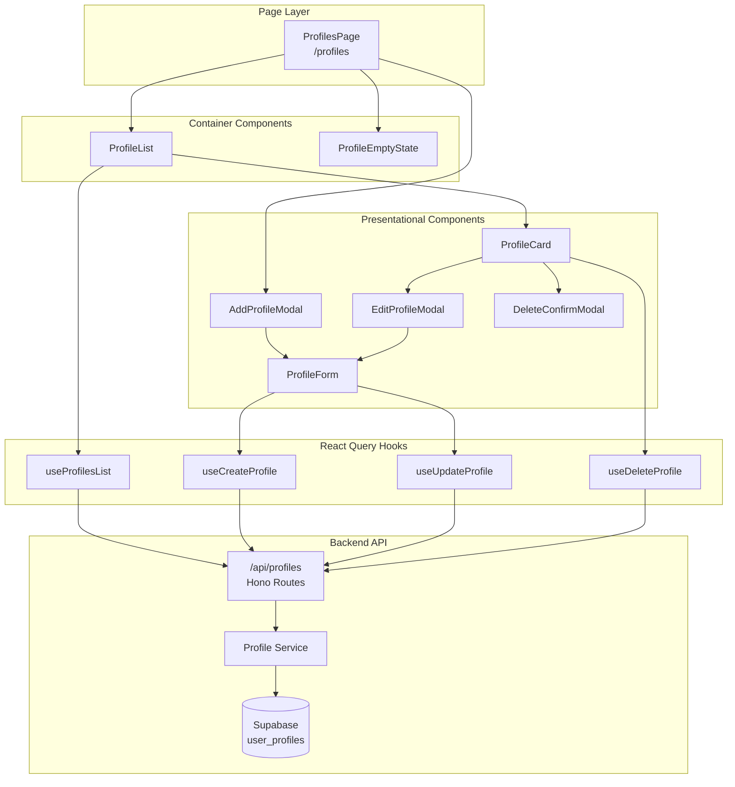
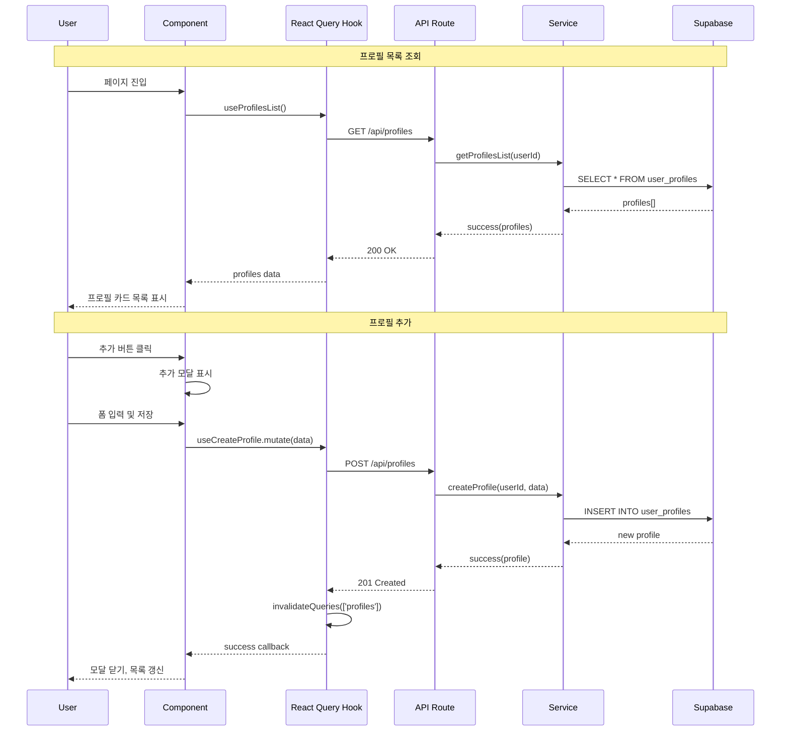
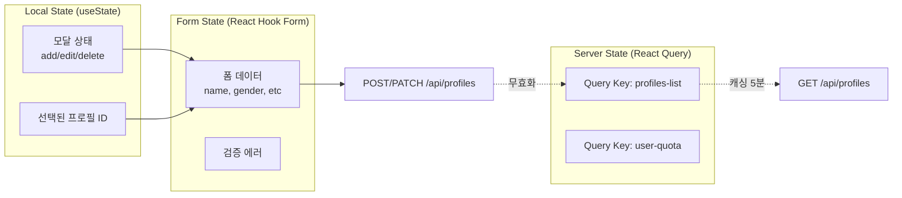

# 프로필 관리 페이지 구현 계획

> **페이지**: `/profiles`
> **기능**: 대상 인물(프로필) CRUD 관리
> **작성일**: 2025-10-25
> **버전**: 1.0

---

## 목차

1. [개요](#개요)
2. [모듈 구조](#모듈-구조)
3. [다이어그램](#다이어그램)
4. [구현 계획](#구현-계획)
5. [테스트 계획](#테스트-계획)

---

## 개요

### 페이지 목적
사용자가 본인 및 가족/지인의 사주 정보를 프로필로 저장하고 관리하여, 새 분석 시 빠르게 정보를 불러올 수 있도록 합니다.

### 핵심 기능
- **프로필 목록 조회**: 사용자의 저장된 프로필 목록을 카드 형태로 표시
- **프로필 추가**: 새로운 프로필 생성 (모달 다이얼로그)
- **프로필 수정**: 기존 프로필 정보 수정 (모달 다이얼로그)
- **프로필 삭제**: 프로필 삭제 (확인 다이얼로그)

### 비즈니스 규칙
- 무료 사용자: 최대 5개 프로필 제한
- Pro 사용자: 무제한 프로필
- 중복 방지: 동일 이름 + 생년월일 프로필 불가
- 소프트 삭제: `deleted_at` 설정 (30일 후 완전 삭제)

---

## 모듈 구조

### Backend Modules (Hono)

| 모듈명 | 위치 | 설명 |
|-------|------|------|
| Profile Schema | `src/features/profile/backend/schema.ts` | Zod 스키마 정의 (요청/응답) |
| Profile Service | `src/features/profile/backend/service.ts` | Supabase CRUD 로직 |
| Profile Route | `src/features/profile/backend/route.ts` | Hono API 엔드포인트 |
| Profile Error | `src/features/profile/backend/error.ts` | 에러 코드 정의 |

### Frontend Modules (React)

| 모듈명 | 위치 | 설명 |
|-------|------|------|
| Profiles Page | `src/app/(protected)/profiles/page.tsx` | 프로필 관리 메인 페이지 |
| Profile Card | `src/features/profile/components/profile-card.tsx` | 프로필 카드 컴포넌트 |
| Profile Form | `src/features/profile/components/profile-form.tsx` | 프로필 입력 폼 (추가/수정 공용) |
| Profile Modals | `src/features/profile/components/profile-modals.tsx` | 추가/수정/삭제 다이얼로그 |
| Profile Empty State | `src/features/profile/components/profile-empty-state.tsx` | 빈 상태 UI |

### Hooks (React Query)

| 모듈명 | 위치 | 설명 |
|-------|------|------|
| useProfilesList | `src/features/profile/hooks/use-profiles-list.ts` | 프로필 목록 조회 |
| useCreateProfile | `src/features/profile/hooks/use-create-profile.ts` | 프로필 생성 mutation |
| useUpdateProfile | `src/features/profile/hooks/use-update-profile.ts` | 프로필 수정 mutation |
| useDeleteProfile | `src/features/profile/hooks/use-delete-profile.ts` | 프로필 삭제 mutation |

### Types & DTO

| 모듈명 | 위치 | 설명 |
|-------|------|------|
| Profile Types | `src/features/profile/types/index.ts` | 프로필 타입 정의 |
| Profile DTO | `src/features/profile/lib/dto.ts` | Backend 스키마 재노출 |

### Constants

| 모듈명 | 위치 | 설명 |
|-------|------|------|
| Profile Constants | `src/features/profile/constants/index.ts` | Query keys, 상수 |

---

## 다이어그램

### 컴포넌트 구조



### API 플로우



### 상태 관리 구조



---

## 구현 계획

### Phase 1: Backend API 구현

#### 1.1 Schema 정의 (`src/features/profile/backend/schema.ts`)

```typescript
import { z } from 'zod';

// 테이블 Row 스키마
export const ProfileTableRowSchema = z.object({
  id: z.string().uuid(),
  user_id: z.string().uuid(),
  name: z.string(),
  gender: z.enum(['male', 'female']),
  birth_date: z.string(), // DATE 타입은 문자열로 반환
  birth_time: z.string().nullable(),
  is_lunar: z.boolean(),
  created_at: z.string(),
  updated_at: z.string(),
  deleted_at: z.string().nullable(),
});

export type ProfileRow = z.infer<typeof ProfileTableRowSchema>;

// API 응답 스키마
export const ProfileResponseSchema = z.object({
  id: z.string().uuid(),
  name: z.string(),
  gender: z.enum(['male', 'female']),
  birthDate: z.string(),
  birthTime: z.string().nullable(),
  isLunar: z.boolean(),
  createdAt: z.string(),
  updatedAt: z.string(),
});

export type ProfileResponse = z.infer<typeof ProfileResponseSchema>;

// 프로필 생성 요청 스키마
export const CreateProfileRequestSchema = z.object({
  name: z.string().min(1, '이름을 입력해주세요').max(50, '이름은 50자 이내로 입력해주세요'),
  gender: z.enum(['male', 'female'], { required_error: '성별을 선택해주세요' }),
  birthDate: z.string().regex(/^\d{4}-\d{2}-\d{2}$/, '올바른 날짜 형식이 아닙니다'),
  birthTime: z.string().regex(/^\d{2}:\d{2}$/).nullable().optional(),
  isLunar: z.boolean().default(false),
});

export type CreateProfileRequest = z.infer<typeof CreateProfileRequestSchema>;

// 프로필 수정 요청 스키마
export const UpdateProfileRequestSchema = CreateProfileRequestSchema.partial();
export type UpdateProfileRequest = z.infer<typeof UpdateProfileRequestSchema>;

// 프로필 목록 응답 스키마
export const ProfilesListResponseSchema = z.object({
  profiles: z.array(ProfileResponseSchema),
  total: z.number(),
  canAddMore: z.boolean(),
});

export type ProfilesListResponse = z.infer<typeof ProfilesListResponseSchema>;
```

**QA Sheet**:
- [ ] 스키마가 DB 테이블 구조와 일치하는가?
- [ ] 필수 필드 검증이 적절한가?
- [ ] 날짜/시간 형식 검증이 정확한가?

---

#### 1.2 Error 정의 (`src/features/profile/backend/error.ts`)

```typescript
export const profileErrorCodes = {
  fetchError: 'PROFILE_FETCH_ERROR',
  notFound: 'PROFILE_NOT_FOUND',
  validationError: 'PROFILE_VALIDATION_ERROR',
  createError: 'PROFILE_CREATE_ERROR',
  updateError: 'PROFILE_UPDATE_ERROR',
  deleteError: 'PROFILE_DELETE_ERROR',
  unauthorized: 'PROFILE_UNAUTHORIZED',
  limitExceeded: 'PROFILE_LIMIT_EXCEEDED',
  duplicateProfile: 'PROFILE_DUPLICATE',
} as const;

export type ProfileServiceError = keyof typeof profileErrorCodes;
```

---

#### 1.3 Service 로직 (`src/features/profile/backend/service.ts`)

```typescript
import type { SupabaseClient } from '@supabase/supabase-js';
import {
  failure,
  success,
  type HandlerResult,
} from '@/backend/http/response';
import {
  ProfileTableRowSchema,
  ProfileResponseSchema,
  type ProfileResponse,
  type ProfileRow,
  type CreateProfileRequest,
  type UpdateProfileRequest,
  type ProfilesListResponse,
} from './schema';
import { profileErrorCodes, type ProfileServiceError } from './error';

const PROFILE_TABLE = 'user_profiles';

// Row를 Response로 변환
const mapRowToResponse = (row: ProfileRow): ProfileResponse => ({
  id: row.id,
  name: row.name,
  gender: row.gender,
  birthDate: row.birth_date,
  birthTime: row.birth_time,
  isLunar: row.is_lunar,
  createdAt: row.created_at,
  updatedAt: row.updated_at,
});

// 1. 프로필 목록 조회
export const getProfilesList = async (
  client: SupabaseClient,
  userId: string,
): Promise<HandlerResult<ProfilesListResponse, ProfileServiceError, unknown>> => {
  // 사용자의 구독 상태 확인 (무료/Pro)
  const { data: userData, error: userError } = await client
    .from('users')
    .select('subscription_tier')
    .eq('id', userId)
    .single();

  if (userError) {
    return failure(500, profileErrorCodes.fetchError, userError.message);
  }

  const isPro = userData?.subscription_tier === 'pro';

  // 프로필 목록 조회
  const { data, error, count } = await client
    .from(PROFILE_TABLE)
    .select('*', { count: 'exact' })
    .eq('user_id', userId)
    .is('deleted_at', null)
    .order('created_at', { ascending: false });

  if (error) {
    return failure(500, profileErrorCodes.fetchError, error.message);
  }

  // 검증
  const profiles: ProfileResponse[] = [];
  for (const row of data || []) {
    const rowParse = ProfileTableRowSchema.safeParse(row);
    if (!rowParse.success) continue;

    const mapped = mapRowToResponse(rowParse.data);
    const parsed = ProfileResponseSchema.safeParse(mapped);
    if (parsed.success) {
      profiles.push(parsed.data);
    }
  }

  const total = count || 0;
  const canAddMore = isPro || total < 5;

  return success({ profiles, total, canAddMore });
};

// 2. 프로필 생성
export const createProfile = async (
  client: SupabaseClient,
  userId: string,
  data: CreateProfileRequest,
): Promise<HandlerResult<ProfileResponse, ProfileServiceError, unknown>> => {
  // 프로필 개수 확인
  const { data: userData, error: userError } = await client
    .from('users')
    .select('subscription_tier')
    .eq('id', userId)
    .single();

  if (userError) {
    return failure(500, profileErrorCodes.fetchError, userError.message);
  }

  const isPro = userData?.subscription_tier === 'pro';

  const { count } = await client
    .from(PROFILE_TABLE)
    .select('*', { count: 'exact', head: true })
    .eq('user_id', userId)
    .is('deleted_at', null);

  if (!isPro && (count || 0) >= 5) {
    return failure(
      403,
      profileErrorCodes.limitExceeded,
      '무료 플랜은 최대 5개의 프로필만 저장할 수 있습니다',
    );
  }

  // 중복 확인 (이름 + 생년월일)
  const { data: duplicate } = await client
    .from(PROFILE_TABLE)
    .select('id')
    .eq('user_id', userId)
    .eq('name', data.name)
    .eq('birth_date', data.birthDate)
    .is('deleted_at', null)
    .maybeSingle();

  if (duplicate) {
    return failure(
      400,
      profileErrorCodes.duplicateProfile,
      '동일한 프로필이 이미 존재합니다',
    );
  }

  // 프로필 생성
  const { data: newProfile, error: insertError } = await client
    .from(PROFILE_TABLE)
    .insert({
      user_id: userId,
      name: data.name,
      gender: data.gender,
      birth_date: data.birthDate,
      birth_time: data.birthTime || null,
      is_lunar: data.isLunar,
    })
    .select()
    .single<ProfileRow>();

  if (insertError) {
    return failure(500, profileErrorCodes.createError, insertError.message);
  }

  const rowParse = ProfileTableRowSchema.safeParse(newProfile);
  if (!rowParse.success) {
    return failure(
      500,
      profileErrorCodes.validationError,
      'Profile row failed validation.',
      rowParse.error.format(),
    );
  }

  const mapped = mapRowToResponse(rowParse.data);
  const parsed = ProfileResponseSchema.safeParse(mapped);

  if (!parsed.success) {
    return failure(
      500,
      profileErrorCodes.validationError,
      'Profile payload failed validation.',
      parsed.error.format(),
    );
  }

  return success(parsed.data);
};

// 3. 프로필 수정
export const updateProfile = async (
  client: SupabaseClient,
  userId: string,
  profileId: string,
  data: UpdateProfileRequest,
): Promise<HandlerResult<ProfileResponse, ProfileServiceError, unknown>> => {
  // 권한 확인
  const { data: existing, error: fetchError } = await client
    .from(PROFILE_TABLE)
    .select('user_id')
    .eq('id', profileId)
    .is('deleted_at', null)
    .maybeSingle();

  if (fetchError) {
    return failure(500, profileErrorCodes.fetchError, fetchError.message);
  }

  if (!existing) {
    return failure(404, profileErrorCodes.notFound, '프로필을 찾을 수 없습니다');
  }

  if (existing.user_id !== userId) {
    return failure(403, profileErrorCodes.unauthorized, '권한이 없습니다');
  }

  // 업데이트할 필드 구성
  const updateFields: Record<string, unknown> = {};
  if (data.name !== undefined) updateFields.name = data.name;
  if (data.gender !== undefined) updateFields.gender = data.gender;
  if (data.birthDate !== undefined) updateFields.birth_date = data.birthDate;
  if (data.birthTime !== undefined) updateFields.birth_time = data.birthTime || null;
  if (data.isLunar !== undefined) updateFields.is_lunar = data.isLunar;

  // 변경사항 없으면 현재 데이터 반환
  if (Object.keys(updateFields).length === 0) {
    const { data: current } = await client
      .from(PROFILE_TABLE)
      .select('*')
      .eq('id', profileId)
      .single<ProfileRow>();

    if (current) {
      const rowParse = ProfileTableRowSchema.safeParse(current);
      if (rowParse.success) {
        const mapped = mapRowToResponse(rowParse.data);
        return success(mapped);
      }
    }
  }

  // 프로필 업데이트
  const { data: updated, error: updateError } = await client
    .from(PROFILE_TABLE)
    .update(updateFields)
    .eq('id', profileId)
    .select()
    .single<ProfileRow>();

  if (updateError) {
    return failure(500, profileErrorCodes.updateError, updateError.message);
  }

  const rowParse = ProfileTableRowSchema.safeParse(updated);
  if (!rowParse.success) {
    return failure(
      500,
      profileErrorCodes.validationError,
      'Profile row failed validation.',
      rowParse.error.format(),
    );
  }

  const mapped = mapRowToResponse(rowParse.data);
  const parsed = ProfileResponseSchema.safeParse(mapped);

  if (!parsed.success) {
    return failure(
      500,
      profileErrorCodes.validationError,
      'Profile payload failed validation.',
      parsed.error.format(),
    );
  }

  return success(parsed.data);
};

// 4. 프로필 삭제
export const deleteProfile = async (
  client: SupabaseClient,
  userId: string,
  profileId: string,
): Promise<HandlerResult<{ success: true }, ProfileServiceError, unknown>> => {
  // 권한 확인
  const { data: existing, error: fetchError } = await client
    .from(PROFILE_TABLE)
    .select('user_id')
    .eq('id', profileId)
    .is('deleted_at', null)
    .maybeSingle();

  if (fetchError) {
    return failure(500, profileErrorCodes.fetchError, fetchError.message);
  }

  if (!existing) {
    return failure(404, profileErrorCodes.notFound, '프로필을 찾을 수 없습니다');
  }

  if (existing.user_id !== userId) {
    return failure(403, profileErrorCodes.unauthorized, '권한이 없습니다');
  }

  // 소프트 삭제
  const { error: deleteError } = await client
    .from(PROFILE_TABLE)
    .update({ deleted_at: new Date().toISOString() })
    .eq('id', profileId);

  if (deleteError) {
    return failure(500, profileErrorCodes.deleteError, deleteError.message);
  }

  return success({ success: true });
};
```

**Unit Test Cases**:
```typescript
describe('Profile Service', () => {
  describe('getProfilesList', () => {
    it('무료 사용자: canAddMore가 true (프로필 4개)', () => {});
    it('무료 사용자: canAddMore가 false (프로필 5개)', () => {});
    it('Pro 사용자: canAddMore가 항상 true', () => {});
    it('deleted_at이 null인 프로필만 반환', () => {});
  });

  describe('createProfile', () => {
    it('무료 사용자: 5개 초과 시 403 에러', () => {});
    it('Pro 사용자: 무제한 생성 가능', () => {});
    it('중복 프로필 생성 시 400 에러', () => {});
    it('정상 생성 시 201 및 프로필 반환', () => {});
  });

  describe('updateProfile', () => {
    it('다른 사용자의 프로필 수정 시 403 에러', () => {});
    it('존재하지 않는 프로필 수정 시 404 에러', () => {});
    it('변경사항 없으면 현재 데이터 반환', () => {});
    it('정상 수정 시 200 및 업데이트된 프로필 반환', () => {});
  });

  describe('deleteProfile', () => {
    it('다른 사용자의 프로필 삭제 시 403 에러', () => {});
    it('존재하지 않는 프로필 삭제 시 404 에러', () => {});
    it('정상 삭제 시 deleted_at 설정', () => {});
  });
});
```

---

#### 1.4 Route 정의 (`src/features/profile/backend/route.ts`)

```typescript
import type { Hono } from 'hono';
import {
  failure,
  respond,
  type ErrorResult,
} from '@/backend/http/response';
import {
  getLogger,
  getSupabase,
  type AppEnv,
} from '@/backend/hono/context';
import {
  CreateProfileRequestSchema,
  UpdateProfileRequestSchema,
} from './schema';
import {
  getProfilesList,
  createProfile,
  updateProfile,
  deleteProfile,
} from './service';
import {
  profileErrorCodes,
  type ProfileServiceError,
} from './error';

// 현재 사용자 ID 가져오기 (예시, 실제 인증 로직에 따라 조정)
const getCurrentUserId = async (c: any): Promise<string | null> => {
  // Clerk 또는 Supabase Auth로부터 사용자 ID 추출
  // 예: c.get('userId') 또는 Clerk SDK 사용
  return 'user-id-placeholder'; // TODO: 실제 구현 필요
};

export const registerProfileRoutes = (app: Hono<AppEnv>) => {
  // 1. 프로필 목록 조회
  app.get('/api/profiles', async (c) => {
    const userId = await getCurrentUserId(c);
    if (!userId) {
      return respond(c, failure(401, 'UNAUTHORIZED', '인증이 필요합니다'));
    }

    const supabase = getSupabase(c);
    const logger = getLogger(c);

    const result = await getProfilesList(supabase, userId);

    if (!result.ok) {
      const errorResult = result as ErrorResult<ProfileServiceError, unknown>;
      logger.error('Failed to fetch profiles', errorResult.error.message);
    }

    return respond(c, result);
  });

  // 2. 프로필 생성
  app.post('/api/profiles', async (c) => {
    const userId = await getCurrentUserId(c);
    if (!userId) {
      return respond(c, failure(401, 'UNAUTHORIZED', '인증이 필요합니다'));
    }

    const body = await c.req.json();
    const parsedBody = CreateProfileRequestSchema.safeParse(body);

    if (!parsedBody.success) {
      return respond(
        c,
        failure(
          400,
          'INVALID_PROFILE_DATA',
          '입력 데이터가 유효하지 않습니다',
          parsedBody.error.format(),
        ),
      );
    }

    const supabase = getSupabase(c);
    const logger = getLogger(c);

    const result = await createProfile(supabase, userId, parsedBody.data);

    if (!result.ok) {
      const errorResult = result as ErrorResult<ProfileServiceError, unknown>;
      logger.error('Failed to create profile', errorResult.error.message);
    }

    return respond(c, result);
  });

  // 3. 프로필 수정
  app.patch('/api/profiles/:id', async (c) => {
    const userId = await getCurrentUserId(c);
    if (!userId) {
      return respond(c, failure(401, 'UNAUTHORIZED', '인증이 필요합니다'));
    }

    const profileId = c.req.param('id');
    const body = await c.req.json();
    const parsedBody = UpdateProfileRequestSchema.safeParse(body);

    if (!parsedBody.success) {
      return respond(
        c,
        failure(
          400,
          'INVALID_PROFILE_DATA',
          '입력 데이터가 유효하지 않습니다',
          parsedBody.error.format(),
        ),
      );
    }

    const supabase = getSupabase(c);
    const logger = getLogger(c);

    const result = await updateProfile(supabase, userId, profileId, parsedBody.data);

    if (!result.ok) {
      const errorResult = result as ErrorResult<ProfileServiceError, unknown>;
      logger.error('Failed to update profile', errorResult.error.message);
    }

    return respond(c, result);
  });

  // 4. 프로필 삭제
  app.delete('/api/profiles/:id', async (c) => {
    const userId = await getCurrentUserId(c);
    if (!userId) {
      return respond(c, failure(401, 'UNAUTHORIZED', '인증이 필요합니다'));
    }

    const profileId = c.req.param('id');
    const supabase = getSupabase(c);
    const logger = getLogger(c);

    const result = await deleteProfile(supabase, userId, profileId);

    if (!result.ok) {
      const errorResult = result as ErrorResult<ProfileServiceError, unknown>;
      logger.error('Failed to delete profile', errorResult.error.message);
    }

    return respond(c, result);
  });
};
```

**QA Sheet**:
- [ ] 모든 엔드포인트에서 인증 확인이 되는가?
- [ ] 요청 본문 검증이 적절한가?
- [ ] 에러 응답이 일관적인가?
- [ ] HTTP 상태 코드가 적절한가?

---

### Phase 2: Frontend Hooks 구현

#### 2.1 Constants (`src/features/profile/constants/index.ts`)

```typescript
export const profileQueryKeys = {
  all: () => ['profiles'] as const,
  list: () => ['profiles', 'list'] as const,
  detail: (id: string) => ['profiles', 'detail', id] as const,
} as const;

export const PROFILE_STALE_TIME = 5 * 60 * 1000; // 5분
```

---

#### 2.2 Types (`src/features/profile/types/index.ts`)

```typescript
export type ProfileGender = 'male' | 'female';

export interface Profile {
  id: string;
  name: string;
  gender: ProfileGender;
  birthDate: string;
  birthTime: string | null;
  isLunar: boolean;
  createdAt: string;
  updatedAt: string;
}

export interface ProfileFormData {
  name: string;
  gender: ProfileGender;
  birthDate: string;
  birthTime?: string;
  isLunar: boolean;
}

export interface ProfilesListData {
  profiles: Profile[];
  total: number;
  canAddMore: boolean;
}
```

---

#### 2.3 DTO (`src/features/profile/lib/dto.ts`)

```typescript
export {
  ProfileResponseSchema,
  ProfilesListResponseSchema,
  CreateProfileRequestSchema,
  UpdateProfileRequestSchema,
  type ProfileResponse,
  type ProfilesListResponse,
  type CreateProfileRequest,
  type UpdateProfileRequest,
} from '@/features/profile/backend/schema';
```

---

#### 2.4 Query Hook (`src/features/profile/hooks/use-profiles-list.ts`)

```typescript
'use client';

import { useQuery } from '@tanstack/react-query';
import { apiClient } from '@/lib/remote/api-client';
import { profileQueryKeys, PROFILE_STALE_TIME } from '../constants';
import type { ProfilesListData } from '../types';

export function useProfilesList() {
  return useQuery({
    queryKey: profileQueryKeys.list(),
    queryFn: async (): Promise<ProfilesListData> => {
      const response = await apiClient.get('/api/profiles');
      return response.data;
    },
    staleTime: PROFILE_STALE_TIME,
  });
}
```

---

#### 2.5 Mutation Hooks

**Create (`src/features/profile/hooks/use-create-profile.ts`)**:
```typescript
'use client';

import { useMutation, useQueryClient } from '@tanstack/react-query';
import { apiClient } from '@/lib/remote/api-client';
import { profileQueryKeys } from '../constants';
import type { ProfileFormData, Profile } from '../types';
import { useToast } from '@/hooks/use-toast';

export function useCreateProfile() {
  const queryClient = useQueryClient();
  const { toast } = useToast();

  return useMutation({
    mutationFn: async (data: ProfileFormData): Promise<Profile> => {
      const response = await apiClient.post('/api/profiles', data);
      return response.data;
    },
    onSuccess: () => {
      queryClient.invalidateQueries({ queryKey: profileQueryKeys.all() });
      toast({
        title: '프로필이 추가되었습니다',
        variant: 'default',
      });
    },
    onError: (error: any) => {
      toast({
        title: '프로필 추가 실패',
        description: error.response?.data?.message || '오류가 발생했습니다',
        variant: 'destructive',
      });
    },
  });
}
```

**Update (`src/features/profile/hooks/use-update-profile.ts`)**:
```typescript
'use client';

import { useMutation, useQueryClient } from '@tanstack/react-query';
import { apiClient } from '@/lib/remote/api-client';
import { profileQueryKeys } from '../constants';
import type { Profile } from '../types';
import { useToast } from '@/hooks/use-toast';

interface UpdateProfileParams {
  id: string;
  data: Partial<ProfileFormData>;
}

export function useUpdateProfile() {
  const queryClient = useQueryClient();
  const { toast } = useToast();

  return useMutation({
    mutationFn: async ({ id, data }: UpdateProfileParams): Promise<Profile> => {
      const response = await apiClient.patch(`/api/profiles/${id}`, data);
      return response.data;
    },
    onSuccess: () => {
      queryClient.invalidateQueries({ queryKey: profileQueryKeys.all() });
      toast({
        title: '프로필이 수정되었습니다',
        variant: 'default',
      });
    },
    onError: (error: any) => {
      toast({
        title: '프로필 수정 실패',
        description: error.response?.data?.message || '오류가 발생했습니다',
        variant: 'destructive',
      });
    },
  });
}
```

**Delete (`src/features/profile/hooks/use-delete-profile.ts`)**:
```typescript
'use client';

import { useMutation, useQueryClient } from '@tanstack/react-query';
import { apiClient } from '@/lib/remote/api-client';
import { profileQueryKeys } from '../constants';
import { useToast } from '@/hooks/use-toast';

export function useDeleteProfile() {
  const queryClient = useQueryClient();
  const { toast } = useToast();

  return useMutation({
    mutationFn: async (id: string): Promise<void> => {
      await apiClient.delete(`/api/profiles/${id}`);
    },
    onSuccess: () => {
      queryClient.invalidateQueries({ queryKey: profileQueryKeys.all() });
      toast({
        title: '프로필이 삭제되었습니다',
        variant: 'default',
      });
    },
    onError: (error: any) => {
      toast({
        title: '프로필 삭제 실패',
        description: error.response?.data?.message || '오류가 발생했습니다',
        variant: 'destructive',
      });
    },
  });
}
```

---

### Phase 3: UI Components 구현

#### 3.1 Profile Form (`src/features/profile/components/profile-form.tsx`)

```typescript
'use client';

import { useForm } from 'react-hook-form';
import { zodResolver } from '@hookform/resolvers/zod';
import { z } from 'zod';
import { Button } from '@/components/ui/button';
import { Input } from '@/components/ui/input';
import { Label } from '@/components/ui/label';
import {
  Select,
  SelectContent,
  SelectItem,
  SelectTrigger,
  SelectValue,
} from '@/components/ui/select';
import type { ProfileFormData, Profile } from '../types';

const profileFormSchema = z.object({
  name: z.string().min(1, '이름을 입력해주세요').max(50, '이름은 50자 이내로 입력해주세요'),
  gender: z.enum(['male', 'female'], { required_error: '성별을 선택해주세요' }),
  birthDate: z.string().regex(/^\d{4}-\d{2}-\d{2}$/, '올바른 날짜 형식이 아닙니다'),
  birthTime: z.string().regex(/^\d{2}:\d{2}$/).optional(),
  isLunar: z.boolean(),
});

interface ProfileFormProps {
  defaultValues?: Partial<Profile>;
  onSubmit: (data: ProfileFormData) => void;
  onCancel: () => void;
  isSubmitting?: boolean;
}

export function ProfileForm({
  defaultValues,
  onSubmit,
  onCancel,
  isSubmitting = false,
}: ProfileFormProps) {
  const form = useForm<ProfileFormData>({
    resolver: zodResolver(profileFormSchema),
    defaultValues: {
      name: defaultValues?.name || '',
      gender: defaultValues?.gender || 'male',
      birthDate: defaultValues?.birthDate || '',
      birthTime: defaultValues?.birthTime || '',
      isLunar: defaultValues?.isLunar || false,
    },
  });

  return (
    <form onSubmit={form.handleSubmit(onSubmit)} className="space-y-4">
      <div>
        <Label htmlFor="name">이름</Label>
        <Input
          id="name"
          {...form.register('name')}
          placeholder="이름을 입력하세요"
        />
        {form.formState.errors.name && (
          <p className="text-sm text-destructive mt-1">
            {form.formState.errors.name.message}
          </p>
        )}
      </div>

      <div>
        <Label htmlFor="gender">성별</Label>
        <Select
          value={form.watch('gender')}
          onValueChange={(value) => form.setValue('gender', value as 'male' | 'female')}
        >
          <SelectTrigger>
            <SelectValue />
          </SelectTrigger>
          <SelectContent>
            <SelectItem value="male">남성</SelectItem>
            <SelectItem value="female">여성</SelectItem>
          </SelectContent>
        </Select>
        {form.formState.errors.gender && (
          <p className="text-sm text-destructive mt-1">
            {form.formState.errors.gender.message}
          </p>
        )}
      </div>

      <div>
        <Label htmlFor="birthDate">생년월일</Label>
        <Input
          id="birthDate"
          type="date"
          {...form.register('birthDate')}
        />
        {form.formState.errors.birthDate && (
          <p className="text-sm text-destructive mt-1">
            {form.formState.errors.birthDate.message}
          </p>
        )}
      </div>

      <div>
        <Label htmlFor="birthTime">태어난 시간 (선택)</Label>
        <Input
          id="birthTime"
          type="time"
          {...form.register('birthTime')}
        />
      </div>

      <div className="flex items-center space-x-2">
        <input
          type="checkbox"
          id="isLunar"
          {...form.register('isLunar')}
          className="rounded"
        />
        <Label htmlFor="isLunar">음력</Label>
      </div>

      <div className="flex justify-end gap-2">
        <Button type="button" variant="outline" onClick={onCancel}>
          취소
        </Button>
        <Button type="submit" disabled={isSubmitting}>
          {isSubmitting ? '저장 중...' : '저장'}
        </Button>
      </div>
    </form>
  );
}
```

**QA Sheet**:
- [ ] 폼 검증이 실시간으로 동작하는가?
- [ ] 날짜/시간 선택기가 올바르게 동작하는가?
- [ ] 음력 체크박스가 정상 작동하는가?
- [ ] 기본값이 올바르게 설정되는가 (수정 모드)?

---

#### 3.2 Profile Card (`src/features/profile/components/profile-card.tsx`)

```typescript
'use client';

import { Card, CardContent } from '@/components/ui/card';
import { Button } from '@/components/ui/button';
import { Edit2, Trash2, User } from 'lucide-react';
import type { Profile } from '../types';
import { format } from 'date-fns';

interface ProfileCardProps {
  profile: Profile;
  onEdit: (profile: Profile) => void;
  onDelete: (profile: Profile) => void;
}

export function ProfileCard({ profile, onEdit, onDelete }: ProfileCardProps) {
  const genderLabel = profile.gender === 'male' ? '남성' : '여성';
  const calendarLabel = profile.isLunar ? '음력' : '양력';
  const formattedDate = format(new Date(profile.birthDate), 'yyyy년 MM월 dd일');

  return (
    <Card className="group hover:shadow-md transition-shadow">
      <CardContent className="p-6">
        <div className="flex items-start justify-between">
          <div className="flex items-start gap-4">
            <div className="w-12 h-12 rounded-full bg-primary/10 flex items-center justify-center">
              <User className="w-6 h-6 text-primary" />
            </div>
            <div>
              <h3 className="font-semibold text-lg">{profile.name}</h3>
              <div className="text-sm text-muted-foreground space-y-1 mt-1">
                <p>{genderLabel}</p>
                <p>{formattedDate} ({calendarLabel})</p>
                {profile.birthTime && (
                  <p>태어난 시간: {profile.birthTime}</p>
                )}
              </div>
            </div>
          </div>

          <div className="flex gap-2 opacity-0 group-hover:opacity-100 transition-opacity">
            <Button
              size="sm"
              variant="ghost"
              onClick={() => onEdit(profile)}
              aria-label="프로필 수정"
            >
              <Edit2 className="w-4 h-4" />
            </Button>
            <Button
              size="sm"
              variant="ghost"
              onClick={() => onDelete(profile)}
              aria-label="프로필 삭제"
            >
              <Trash2 className="w-4 h-4 text-destructive" />
            </Button>
          </div>
        </div>
      </CardContent>
    </Card>
  );
}
```

**QA Sheet**:
- [ ] 날짜 포맷이 올바른가?
- [ ] 호버 시 버튼이 표시되는가?
- [ ] 접근성 레이블이 적절한가?

---

#### 3.3 Profile Modals (`src/features/profile/components/profile-modals.tsx`)

```typescript
'use client';

import {
  Dialog,
  DialogContent,
  DialogDescription,
  DialogHeader,
  DialogTitle,
} from '@/components/ui/dialog';
import {
  AlertDialog,
  AlertDialogAction,
  AlertDialogCancel,
  AlertDialogContent,
  AlertDialogDescription,
  AlertDialogFooter,
  AlertDialogHeader,
  AlertDialogTitle,
} from '@/components/ui/alert-dialog';
import { ProfileForm } from './profile-form';
import type { Profile, ProfileFormData } from '../types';

interface AddProfileModalProps {
  open: boolean;
  onOpenChange: (open: boolean) => void;
  onSubmit: (data: ProfileFormData) => void;
  isSubmitting?: boolean;
}

export function AddProfileModal({
  open,
  onOpenChange,
  onSubmit,
  isSubmitting,
}: AddProfileModalProps) {
  return (
    <Dialog open={open} onOpenChange={onOpenChange}>
      <DialogContent>
        <DialogHeader>
          <DialogTitle>새 프로필 추가</DialogTitle>
          <DialogDescription>
            자주 보는 사람의 정보를 저장하세요
          </DialogDescription>
        </DialogHeader>
        <ProfileForm
          onSubmit={onSubmit}
          onCancel={() => onOpenChange(false)}
          isSubmitting={isSubmitting}
        />
      </DialogContent>
    </Dialog>
  );
}

interface EditProfileModalProps {
  open: boolean;
  onOpenChange: (open: boolean) => void;
  profile: Profile | null;
  onSubmit: (data: ProfileFormData) => void;
  isSubmitting?: boolean;
}

export function EditProfileModal({
  open,
  onOpenChange,
  profile,
  onSubmit,
  isSubmitting,
}: EditProfileModalProps) {
  if (!profile) return null;

  return (
    <Dialog open={open} onOpenChange={onOpenChange}>
      <DialogContent>
        <DialogHeader>
          <DialogTitle>프로필 수정</DialogTitle>
          <DialogDescription>
            {profile.name}님의 정보를 수정하세요
          </DialogDescription>
        </DialogHeader>
        <ProfileForm
          defaultValues={profile}
          onSubmit={onSubmit}
          onCancel={() => onOpenChange(false)}
          isSubmitting={isSubmitting}
        />
      </DialogContent>
    </Dialog>
  );
}

interface DeleteConfirmModalProps {
  open: boolean;
  onOpenChange: (open: boolean) => void;
  profile: Profile | null;
  onConfirm: () => void;
  isDeleting?: boolean;
}

export function DeleteConfirmModal({
  open,
  onOpenChange,
  profile,
  onConfirm,
  isDeleting,
}: DeleteConfirmModalProps) {
  if (!profile) return null;

  return (
    <AlertDialog open={open} onOpenChange={onOpenChange}>
      <AlertDialogContent>
        <AlertDialogHeader>
          <AlertDialogTitle>정말로 삭제하시겠습니까?</AlertDialogTitle>
          <AlertDialogDescription>
            {profile.name}님의 프로필이 삭제됩니다.
            <br />
            기존 분석 내역은 유지됩니다.
          </AlertDialogDescription>
        </AlertDialogHeader>
        <AlertDialogFooter>
          <AlertDialogCancel>취소</AlertDialogCancel>
          <AlertDialogAction
            onClick={onConfirm}
            disabled={isDeleting}
            className="bg-destructive hover:bg-destructive/90"
          >
            {isDeleting ? '삭제 중...' : '삭제'}
          </AlertDialogAction>
        </AlertDialogFooter>
      </AlertDialogContent>
    </AlertDialog>
  );
}
```

---

#### 3.4 Empty State (`src/features/profile/components/profile-empty-state.tsx`)

```typescript
'use client';

import { Button } from '@/components/ui/button';
import { UserPlus } from 'lucide-react';

interface ProfileEmptyStateProps {
  onAddClick: () => void;
}

export function ProfileEmptyState({ onAddClick }: ProfileEmptyStateProps) {
  return (
    <div className="flex flex-col items-center justify-center py-16 text-center">
      <UserPlus className="w-16 h-16 text-muted-foreground mb-4" />
      <h3 className="text-lg font-semibold mb-2">저장된 프로필이 없습니다</h3>
      <p className="text-muted-foreground mb-6 max-w-md">
        자주 보는 사람의 정보를 프로필로 저장하여
        <br />
        다음 분석 시 빠르게 정보를 불러올 수 있습니다
      </p>
      <Button onClick={onAddClick}>
        <UserPlus className="w-4 h-4 mr-2" />
        첫 프로필 추가하기
      </Button>
    </div>
  );
}
```

---

### Phase 4: Page 구현

#### 4.1 Profiles Page (`src/app/(protected)/profiles/page.tsx`)

```typescript
'use client';

import { useState } from 'react';
import { Button } from '@/components/ui/button';
import { LoadingSpinner } from '@/components/common/loading-spinner';
import { ErrorState } from '@/components/common/error-state';
import { UserPlus, AlertCircle } from 'lucide-react';
import { Alert, AlertDescription } from '@/components/ui/alert';
import { useProfilesList } from '@/features/profile/hooks/use-profiles-list';
import { useCreateProfile } from '@/features/profile/hooks/use-create-profile';
import { useUpdateProfile } from '@/features/profile/hooks/use-update-profile';
import { useDeleteProfile } from '@/features/profile/hooks/use-delete-profile';
import { ProfileCard } from '@/features/profile/components/profile-card';
import { ProfileEmptyState } from '@/features/profile/components/profile-empty-state';
import {
  AddProfileModal,
  EditProfileModal,
  DeleteConfirmModal,
} from '@/features/profile/components/profile-modals';
import type { Profile, ProfileFormData } from '@/features/profile/types';

export default function ProfilesPage() {
  const [addModalOpen, setAddModalOpen] = useState(false);
  const [editModalOpen, setEditModalOpen] = useState(false);
  const [deleteModalOpen, setDeleteModalOpen] = useState(false);
  const [selectedProfile, setSelectedProfile] = useState<Profile | null>(null);

  const { data, isLoading, error, refetch } = useProfilesList();
  const createMutation = useCreateProfile();
  const updateMutation = useUpdateProfile();
  const deleteMutation = useDeleteProfile();

  const handleAddClick = () => {
    if (data && !data.canAddMore) {
      // 제한 안내 (무료 사용자, 5개 초과)
      // TODO: Pro 업그레이드 모달 표시
      return;
    }
    setAddModalOpen(true);
  };

  const handleAddSubmit = (formData: ProfileFormData) => {
    createMutation.mutate(formData, {
      onSuccess: () => {
        setAddModalOpen(false);
      },
    });
  };

  const handleEdit = (profile: Profile) => {
    setSelectedProfile(profile);
    setEditModalOpen(true);
  };

  const handleEditSubmit = (formData: ProfileFormData) => {
    if (!selectedProfile) return;
    updateMutation.mutate(
      { id: selectedProfile.id, data: formData },
      {
        onSuccess: () => {
          setEditModalOpen(false);
          setSelectedProfile(null);
        },
      },
    );
  };

  const handleDelete = (profile: Profile) => {
    setSelectedProfile(profile);
    setDeleteModalOpen(true);
  };

  const handleDeleteConfirm = () => {
    if (!selectedProfile) return;
    deleteMutation.mutate(selectedProfile.id, {
      onSuccess: () => {
        setDeleteModalOpen(false);
        setSelectedProfile(null);
      },
    });
  };

  if (isLoading) {
    return <LoadingSpinner message="프로필 목록을 불러오는 중..." />;
  }

  if (error) {
    return (
      <ErrorState
        title="프로필 목록을 불러오지 못했습니다"
        message={error.message}
        onRetry={refetch}
      />
    );
  }

  const profiles = data?.profiles || [];
  const canAddMore = data?.canAddMore ?? true;

  return (
    <div className="container mx-auto py-8 px-4">
      <div className="flex items-center justify-between mb-6">
        <div>
          <h1 className="text-3xl font-bold">프로필 관리</h1>
          <p className="text-muted-foreground mt-1">
            자주 보는 사람의 정보를 저장하세요
          </p>
        </div>
        {profiles.length > 0 && (
          <Button onClick={handleAddClick} disabled={!canAddMore}>
            <UserPlus className="w-4 h-4 mr-2" />
            프로필 추가
          </Button>
        )}
      </div>

      {!canAddMore && (
        <Alert className="mb-6">
          <AlertCircle className="h-4 w-4" />
          <AlertDescription>
            무료 플랜은 최대 5개의 프로필만 저장할 수 있습니다.
            Pro로 업그레이드하여 무제한 프로필을 이용하세요.
          </AlertDescription>
        </Alert>
      )}

      {profiles.length === 0 ? (
        <ProfileEmptyState onAddClick={handleAddClick} />
      ) : (
        <div className="grid grid-cols-1 md:grid-cols-2 lg:grid-cols-3 gap-4">
          {profiles.map((profile) => (
            <ProfileCard
              key={profile.id}
              profile={profile}
              onEdit={handleEdit}
              onDelete={handleDelete}
            />
          ))}
        </div>
      )}

      <AddProfileModal
        open={addModalOpen}
        onOpenChange={setAddModalOpen}
        onSubmit={handleAddSubmit}
        isSubmitting={createMutation.isPending}
      />

      <EditProfileModal
        open={editModalOpen}
        onOpenChange={setEditModalOpen}
        profile={selectedProfile}
        onSubmit={handleEditSubmit}
        isSubmitting={updateMutation.isPending}
      />

      <DeleteConfirmModal
        open={deleteModalOpen}
        onOpenChange={setDeleteModalOpen}
        profile={selectedProfile}
        onConfirm={handleDeleteConfirm}
        isDeleting={deleteMutation.isPending}
      />
    </div>
  );
}
```

**QA Sheet**:
- [ ] 빈 상태일 때 Empty State가 표시되는가?
- [ ] 프로필 5개 제한이 작동하는가?
- [ ] 모달 열기/닫기가 정상 작동하는가?
- [ ] 로딩/에러 상태가 올바르게 표시되는가?
- [ ] CRUD 작업 후 목록이 자동 갱신되는가?

---

## 테스트 계획

### Unit Tests (Backend)

**위치**: `src/features/profile/backend/__tests__/`

- `service.test.ts`: 각 서비스 함수별 유닛 테스트
- `schema.test.ts`: Zod 스키마 검증 테스트

### Integration Tests (API)

**위치**: `src/features/profile/backend/__tests__/`

- `route.test.ts`: API 엔드포인트 통합 테스트 (Hono 테스트 헬퍼 사용)

### Component Tests (Frontend)

**위치**: `src/features/profile/components/__tests__/`

- `profile-form.test.tsx`: 폼 입력 및 검증 테스트
- `profile-card.test.tsx`: 카드 렌더링 및 이벤트 테스트
- `profile-modals.test.tsx`: 모달 동작 테스트

### E2E Tests

**도구**: Playwright

- 프로필 추가 플로우
- 프로필 수정 플로우
- 프로필 삭제 플로우
- 5개 제한 테스트 (무료 사용자)

---

## 구현 우선순위

### Phase 1 (필수): Backend + 기본 UI
1. Schema, Error, Service, Route 구현
2. React Query Hooks 구현
3. 기본 Page 및 ProfileCard 구현
4. 목록 조회 기능 완성

### Phase 2 (필수): CRUD 완성
1. ProfileForm 구현
2. AddProfileModal 구현
3. EditProfileModal 구현
4. DeleteConfirmModal 구현

### Phase 3 (개선): UX 향상
1. Empty State 구현
2. 5개 제한 알림 구현
3. 로딩/에러 상태 개선
4. 애니메이션 추가

### Phase 4 (테스트): 품질 보증
1. Unit Tests 작성
2. Integration Tests 작성
3. Component Tests 작성
4. E2E Tests 작성

---

## 체크리스트

### Backend
- [ ] Schema 정의 완료
- [ ] Error 코드 정의 완료
- [ ] Service 로직 구현 완료
- [ ] Route 등록 완료
- [ ] Hono App에 라우트 등록 (`src/backend/hono/app.ts`)

### Frontend
- [ ] Constants 정의 완료
- [ ] Types 정의 완료
- [ ] React Query Hooks 완료
- [ ] ProfileForm 구현 완료
- [ ] ProfileCard 구현 완료
- [ ] Modals 구현 완료
- [ ] Empty State 구현 완료
- [ ] Page 구현 완료

### Testing
- [ ] Backend Unit Tests 작성
- [ ] Backend Integration Tests 작성
- [ ] Component Tests 작성
- [ ] E2E Tests 작성

### Documentation
- [ ] API 문서 작성 (Swagger/OpenAPI)
- [ ] 컴포넌트 Storybook 작성 (선택)

---

**문서 끝**
