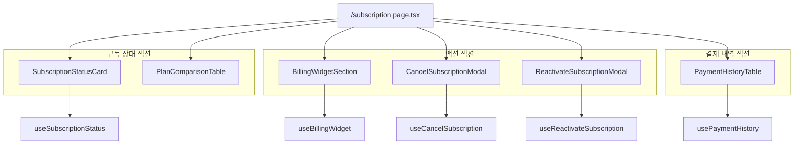
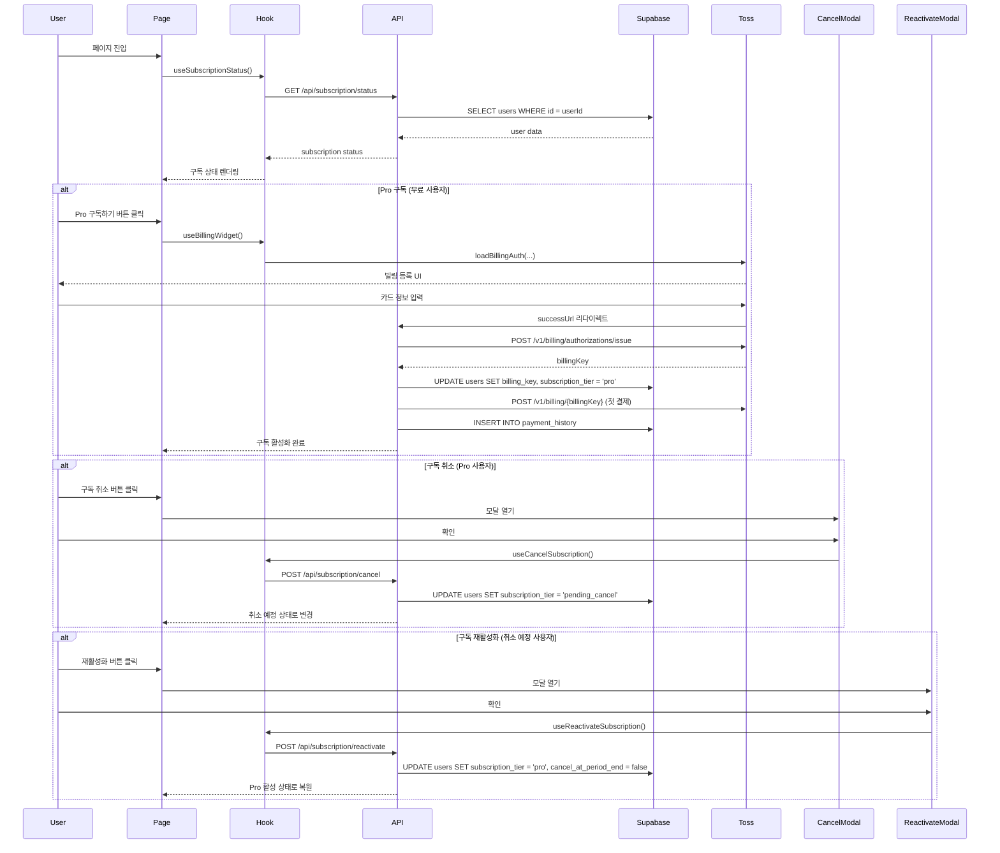

# 구독 관리 페이지 구현 계획

> **페이지**: `/subscription`
> **작성일**: 2025-10-25
> **기반 문서**: PRD 8.6, userflow.md 6.1~6.5, state-design.md 5

---

## 1. 개요

### 1.1 페이지 목적

사용자가 현재 구독 상태를 확인하고, Pro 구독 결제/취소/재활성화를 관리하는 페이지

### 1.2 핵심 기능

- 현재 플랜 정보 표시 (무료/Pro/취소 예정)
- 월간 분석 제공 횟수 및 잔여 횟수 표시
- Pro 구독 결제 (토스페이먼츠 빌링키 발급)
- 구독 취소 (취소 예정 상태로 전환)
- 구독 재활성화 (취소 예정 → Pro로 복원)
- 결제 내역 조회 (최근 12개월)

### 1.3 모듈 구조 개요

```
src/features/subscription/
├── backend/
│   ├── route.ts              # Hono 라우터 (구독 조회/취소/재활성화)
│   ├── service.ts            # Supabase 접근 및 비즈니스 로직
│   ├── schema.ts             # Zod 스키마 (요청/응답)
│   └── error.ts              # 에러 코드 정의
├── components/
│   ├── subscription-status-card.tsx      # 현재 구독 상태 카드
│   ├── plan-comparison-table.tsx         # 무료 vs Pro 비교표
│   ├── billing-widget-section.tsx        # 토스페이먼츠 결제위젯
│   ├── cancel-subscription-modal.tsx     # 구독 취소 확인 모달
│   ├── reactivate-subscription-modal.tsx # 재활성화 확인 모달
│   └── payment-history-table.tsx         # 결제 내역 테이블
├── hooks/
│   ├── use-subscription-status.ts        # 구독 상태 조회 (React Query)
│   ├── use-cancel-subscription.ts        # 구독 취소 Mutation
│   ├── use-reactivate-subscription.ts    # 구독 재활성화 Mutation
│   └── use-payment-history.ts            # 결제 내역 조회 (React Query)
├── lib/
│   └── dto.ts                # 백엔드 스키마 재노출 (클라이언트 사용)
└── constants/
    └── plans.ts              # 요금제 정보 상수

src/features/billing/
├── backend/
│   ├── route.ts              # 빌링키 발급/과금 라우터
│   ├── service.ts            # 토스페이먼츠 API 호출 로직
│   ├── schema.ts             # 빌링 요청/응답 스키마
│   └── error.ts              # 빌링 에러 코드
├── components/
│   └── toss-billing-widget.tsx  # 토스페이먼츠 빌링 등록 위젯
└── hooks/
    └── use-billing-widget.ts    # 위젯 초기화 및 빌링키 발급 훅

src/app/subscription/
└── page.tsx                  # 구독 관리 페이지 (Client Component)
```

---

## 2. 모듈 다이어그램

### 2.1 컴포넌트 구조



### 2.2 데이터 플로우



### 2.3 백엔드 API 구조

```mermaid
graph LR
    A[Hono App] --> B[/api/subscription/status]
    A --> C[/api/subscription/cancel]
    A --> D[/api/subscription/reactivate]
    A --> E[/api/billing/issue]
    A --> F[/api/billing/charge]
    A --> G[/api/payments/history]

    B --> B1[getSubscriptionStatus service]
    C --> C1[cancelSubscription service]
    D --> D1[reactivateSubscription service]
    E --> E1[issueBillingKey service]
    F --> F1[chargeRecurring service]
    G --> G1[getPaymentHistory service]

    B1 --> Supabase
    C1 --> Supabase
    D1 --> Supabase
    E1 --> TossAPI
    E1 --> Supabase
    F1 --> TossAPI
    F1 --> Supabase
    G1 --> Supabase
```

---

## 3. 구현 계획 상세

### 3.1 백엔드 레이어

#### 3.1.1 Schema 정의 (`src/features/subscription/backend/schema.ts`)

```typescript
import { z } from 'zod';

// 구독 상태 응답 스키마
export const SubscriptionStatusResponseSchema = z.object({
  plan: z.enum(['free', 'pro', 'pending_cancel']),
  remainingAnalyses: z.number().int().min(0),
  nextBillingDate: z.string().nullable(),
  subscriptionStartDate: z.string().nullable(),
  cancelAtPeriodEnd: z.boolean(),
});

export type SubscriptionStatusResponse = z.infer<typeof SubscriptionStatusResponseSchema>;

// DB Row 스키마 (snake_case)
export const UserSubscriptionRowSchema = z.object({
  id: z.string().uuid(),
  subscription_tier: z.enum(['free', 'pro', 'pending_cancel']),
  remaining_analyses: z.number().int(),
  next_billing_date: z.string().nullable(),
  subscription_start_date: z.string().nullable(),
  cancel_at_period_end: z.boolean(),
  billing_key: z.string().nullable(),
});

export type UserSubscriptionRow = z.infer<typeof UserSubscriptionRowSchema>;

// 구독 취소 요청 스키마
export const CancelSubscriptionRequestSchema = z.object({
  userId: z.string().uuid(),
});

export type CancelSubscriptionRequest = z.infer<typeof CancelSubscriptionRequestSchema>;

// 구독 재활성화 요청 스키마
export const ReactivateSubscriptionRequestSchema = z.object({
  userId: z.string().uuid(),
});

export type ReactivateSubscriptionRequest = z.infer<typeof ReactivateSubscriptionRequestSchema>;

// 결제 내역 응답 스키마
export const PaymentHistoryItemSchema = z.object({
  id: z.string().uuid(),
  orderId: z.string(),
  amount: z.number().int(),
  status: z.enum(['pending', 'done', 'canceled', 'failed']),
  method: z.string().nullable(),
  createdAt: z.string(),
});

export type PaymentHistoryItem = z.infer<typeof PaymentHistoryItemSchema>;

export const PaymentHistoryResponseSchema = z.object({
  items: z.array(PaymentHistoryItemSchema),
  total: z.number().int(),
});

export type PaymentHistoryResponse = z.infer<typeof PaymentHistoryResponseSchema>;
```

#### 3.1.2 에러 코드 (`src/features/subscription/backend/error.ts`)

```typescript
export const subscriptionErrorCodes = {
  fetchError: 'SUBSCRIPTION_FETCH_ERROR',
  notFound: 'SUBSCRIPTION_NOT_FOUND',
  validationError: 'SUBSCRIPTION_VALIDATION_ERROR',
  alreadyCanceled: 'SUBSCRIPTION_ALREADY_CANCELED',
  alreadyActive: 'SUBSCRIPTION_ALREADY_ACTIVE',
  cannotReactivateExpired: 'SUBSCRIPTION_CANNOT_REACTIVATE_EXPIRED',
  updateError: 'SUBSCRIPTION_UPDATE_ERROR',
} as const;

export type SubscriptionErrorCode = typeof subscriptionErrorCodes[keyof typeof subscriptionErrorCodes];

export type SubscriptionServiceError = {
  code: SubscriptionErrorCode;
  message: string;
};
```

#### 3.1.3 Service 로직 (`src/features/subscription/backend/service.ts`)

```typescript
import type { SupabaseClient } from '@supabase/supabase-js';
import {
  failure,
  success,
  type HandlerResult,
} from '@/backend/http/response';
import {
  SubscriptionStatusResponseSchema,
  UserSubscriptionRowSchema,
  type SubscriptionStatusResponse,
  type UserSubscriptionRow,
} from './schema';
import {
  subscriptionErrorCodes,
  type SubscriptionServiceError,
} from './error';

const USERS_TABLE = 'users';

/**
 * 구독 상태 조회
 */
export const getSubscriptionStatus = async (
  client: SupabaseClient,
  userId: string,
): Promise<HandlerResult<SubscriptionStatusResponse, SubscriptionServiceError, unknown>> => {
  const { data, error } = await client
    .from(USERS_TABLE)
    .select('id, subscription_tier, remaining_analyses, next_billing_date, subscription_start_date, cancel_at_period_end, billing_key')
    .eq('id', userId)
    .is('deleted_at', null)
    .maybeSingle<UserSubscriptionRow>();

  if (error) {
    return failure(500, subscriptionErrorCodes.fetchError, error.message);
  }

  if (!data) {
    return failure(404, subscriptionErrorCodes.notFound, 'User subscription not found');
  }

  const rowParse = UserSubscriptionRowSchema.safeParse(data);

  if (!rowParse.success) {
    return failure(
      500,
      subscriptionErrorCodes.validationError,
      'Subscription row failed validation.',
      rowParse.error.format(),
    );
  }

  const mapped: SubscriptionStatusResponse = {
    plan: rowParse.data.subscription_tier,
    remainingAnalyses: rowParse.data.remaining_analyses,
    nextBillingDate: rowParse.data.next_billing_date,
    subscriptionStartDate: rowParse.data.subscription_start_date,
    cancelAtPeriodEnd: rowParse.data.cancel_at_period_end,
  };

  const parsed = SubscriptionStatusResponseSchema.safeParse(mapped);

  if (!parsed.success) {
    return failure(
      500,
      subscriptionErrorCodes.validationError,
      'Subscription response failed validation.',
      parsed.error.format(),
    );
  }

  return success(parsed.data);
};

/**
 * 구독 취소 (취소 예정 상태로 전환)
 */
export const cancelSubscription = async (
  client: SupabaseClient,
  userId: string,
): Promise<HandlerResult<{ success: true }, SubscriptionServiceError, unknown>> => {
  // 현재 상태 확인
  const { data: currentUser, error: fetchError } = await client
    .from(USERS_TABLE)
    .select('subscription_tier, cancel_at_period_end')
    .eq('id', userId)
    .is('deleted_at', null)
    .maybeSingle();

  if (fetchError) {
    return failure(500, subscriptionErrorCodes.fetchError, fetchError.message);
  }

  if (!currentUser) {
    return failure(404, subscriptionErrorCodes.notFound, 'User not found');
  }

  if (currentUser.subscription_tier !== 'pro') {
    return failure(400, subscriptionErrorCodes.alreadyCanceled, 'Subscription is not active');
  }

  if (currentUser.cancel_at_period_end) {
    return failure(400, subscriptionErrorCodes.alreadyCanceled, 'Subscription is already pending cancel');
  }

  // 취소 예정 상태로 변경
  const { error: updateError } = await client
    .from(USERS_TABLE)
    .update({
      subscription_tier: 'pending_cancel',
      cancel_at_period_end: true,
    })
    .eq('id', userId);

  if (updateError) {
    return failure(500, subscriptionErrorCodes.updateError, updateError.message);
  }

  return success({ success: true });
};

/**
 * 구독 재활성화 (취소 예정 → Pro로 복원)
 */
export const reactivateSubscription = async (
  client: SupabaseClient,
  userId: string,
): Promise<HandlerResult<{ success: true }, SubscriptionServiceError, unknown>> => {
  // 현재 상태 확인
  const { data: currentUser, error: fetchError } = await client
    .from(USERS_TABLE)
    .select('subscription_tier, cancel_at_period_end, next_billing_date, billing_key')
    .eq('id', userId)
    .is('deleted_at', null)
    .maybeSingle();

  if (fetchError) {
    return failure(500, subscriptionErrorCodes.fetchError, fetchError.message);
  }

  if (!currentUser) {
    return failure(404, subscriptionErrorCodes.notFound, 'User not found');
  }

  if (currentUser.subscription_tier !== 'pending_cancel') {
    return failure(400, subscriptionErrorCodes.alreadyActive, 'Subscription is not pending cancel');
  }

  // 만료일 확인 (이미 지난 경우 재활성화 불가)
  if (currentUser.next_billing_date) {
    const nextBillingDate = new Date(currentUser.next_billing_date);
    if (nextBillingDate < new Date()) {
      return failure(400, subscriptionErrorCodes.cannotReactivateExpired, 'Cannot reactivate expired subscription. Please subscribe again.');
    }
  }

  // Pro 상태로 복원
  const { error: updateError } = await client
    .from(USERS_TABLE)
    .update({
      subscription_tier: 'pro',
      cancel_at_period_end: false,
    })
    .eq('id', userId);

  if (updateError) {
    return failure(500, subscriptionErrorCodes.updateError, updateError.message);
  }

  return success({ success: true });
};

/**
 * 결제 내역 조회 (최근 12개월)
 */
export const getPaymentHistory = async (
  client: SupabaseClient,
  userId: string,
): Promise<HandlerResult<PaymentHistoryResponse, SubscriptionServiceError, unknown>> => {
  const twelveMonthsAgo = new Date();
  twelveMonthsAgo.setMonth(twelveMonthsAgo.getMonth() - 12);

  const { data, error, count } = await client
    .from('payment_history')
    .select('id, order_id, amount, status, method, created_at', { count: 'exact' })
    .eq('user_id', userId)
    .gte('created_at', twelveMonthsAgo.toISOString())
    .order('created_at', { ascending: false });

  if (error) {
    return failure(500, subscriptionErrorCodes.fetchError, error.message);
  }

  const items = (data || []).map((row) => ({
    id: row.id,
    orderId: row.order_id,
    amount: row.amount,
    status: row.status,
    method: row.method,
    createdAt: row.created_at,
  }));

  return success({
    items,
    total: count || 0,
  });
};
```

#### 3.1.4 Route 정의 (`src/features/subscription/backend/route.ts`)

```typescript
import type { Hono } from 'hono';
import {
  failure,
  respond,
  type ErrorResult,
} from '@/backend/http/response';
import {
  getLogger,
  getSupabase,
  type AppEnv,
} from '@/backend/hono/context';
import {
  getSubscriptionStatus,
  cancelSubscription,
  reactivateSubscription,
  getPaymentHistory,
} from './service';
import {
  subscriptionErrorCodes,
  type SubscriptionServiceError,
} from './error';

export const registerSubscriptionRoutes = (app: Hono<AppEnv>) => {
  /**
   * GET /api/subscription/status
   * 현재 사용자의 구독 상태 조회
   */
  app.get('/api/subscription/status', async (c) => {
    const logger = getLogger(c);
    const supabase = getSupabase(c);

    // TODO: Clerk auth middleware에서 userId 추출
    const userId = c.get('userId'); // 또는 c.req.header('x-user-id')

    if (!userId) {
      return respond(
        c,
        failure(401, 'UNAUTHORIZED', 'User not authenticated'),
      );
    }

    const result = await getSubscriptionStatus(supabase, userId);

    if (!result.ok) {
      const errorResult = result as ErrorResult<SubscriptionServiceError, unknown>;

      if (errorResult.error.code === subscriptionErrorCodes.fetchError) {
        logger.error('Failed to fetch subscription status', errorResult.error.message);
      }
    }

    return respond(c, result);
  });

  /**
   * POST /api/subscription/cancel
   * 구독 취소 (취소 예정 상태로 전환)
   */
  app.post('/api/subscription/cancel', async (c) => {
    const logger = getLogger(c);
    const supabase = getSupabase(c);

    const userId = c.get('userId');

    if (!userId) {
      return respond(
        c,
        failure(401, 'UNAUTHORIZED', 'User not authenticated'),
      );
    }

    const result = await cancelSubscription(supabase, userId);

    if (!result.ok) {
      const errorResult = result as ErrorResult<SubscriptionServiceError, unknown>;

      if (errorResult.error.code === subscriptionErrorCodes.updateError) {
        logger.error('Failed to cancel subscription', errorResult.error.message);
      }
    }

    return respond(c, result);
  });

  /**
   * POST /api/subscription/reactivate
   * 구독 재활성화
   */
  app.post('/api/subscription/reactivate', async (c) => {
    const logger = getLogger(c);
    const supabase = getSupabase(c);

    const userId = c.get('userId');

    if (!userId) {
      return respond(
        c,
        failure(401, 'UNAUTHORIZED', 'User not authenticated'),
      );
    }

    const result = await reactivateSubscription(supabase, userId);

    if (!result.ok) {
      const errorResult = result as ErrorResult<SubscriptionServiceError, unknown>;

      if (errorResult.error.code === subscriptionErrorCodes.updateError) {
        logger.error('Failed to reactivate subscription', errorResult.error.message);
      }
    }

    return respond(c, result);
  });

  /**
   * GET /api/payments/history
   * 결제 내역 조회 (최근 12개월)
   */
  app.get('/api/payments/history', async (c) => {
    const logger = getLogger(c);
    const supabase = getSupabase(c);

    const userId = c.get('userId');

    if (!userId) {
      return respond(
        c,
        failure(401, 'UNAUTHORIZED', 'User not authenticated'),
      );
    }

    const result = await getPaymentHistory(supabase, userId);

    if (!result.ok) {
      const errorResult = result as ErrorResult<SubscriptionServiceError, unknown>;

      if (errorResult.error.code === subscriptionErrorCodes.fetchError) {
        logger.error('Failed to fetch payment history', errorResult.error.message);
      }
    }

    return respond(c, result);
  });
};
```

---

### 3.2 프론트엔드 레이어

#### 3.2.1 React Query Hooks

**`src/features/subscription/hooks/use-subscription-status.ts`**

```typescript
'use client';

import { useQuery } from '@tanstack/react-query';
import { apiClient, extractApiErrorMessage } from '@/lib/remote/api-client';
import { SubscriptionStatusResponseSchema } from '@/features/subscription/lib/dto';

const fetchSubscriptionStatus = async () => {
  try {
    const { data } = await apiClient.get('/api/subscription/status');
    return SubscriptionStatusResponseSchema.parse(data);
  } catch (error) {
    const message = extractApiErrorMessage(error, 'Failed to fetch subscription status.');
    throw new Error(message);
  }
};

export const useSubscriptionStatus = () =>
  useQuery({
    queryKey: ['subscription', 'status'],
    queryFn: fetchSubscriptionStatus,
    staleTime: 60 * 1000, // 1분
  });
```

**`src/features/subscription/hooks/use-cancel-subscription.ts`**

```typescript
'use client';

import { useMutation, useQueryClient } from '@tanstack/react-query';
import { apiClient, extractApiErrorMessage } from '@/lib/remote/api-client';

const cancelSubscription = async () => {
  try {
    const { data } = await apiClient.post('/api/subscription/cancel');
    return data;
  } catch (error) {
    const message = extractApiErrorMessage(error, 'Failed to cancel subscription.');
    throw new Error(message);
  }
};

export const useCancelSubscription = () => {
  const queryClient = useQueryClient();

  return useMutation({
    mutationFn: cancelSubscription,
    onSuccess: () => {
      queryClient.invalidateQueries({ queryKey: ['subscription', 'status'] });
    },
  });
};
```

**`src/features/subscription/hooks/use-reactivate-subscription.ts`**

```typescript
'use client';

import { useMutation, useQueryClient } from '@tanstack/react-query';
import { apiClient, extractApiErrorMessage } from '@/lib/remote/api-client';

const reactivateSubscription = async () => {
  try {
    const { data } = await apiClient.post('/api/subscription/reactivate');
    return data;
  } catch (error) {
    const message = extractApiErrorMessage(error, 'Failed to reactivate subscription.');
    throw new Error(message);
  }
};

export const useReactivateSubscription = () => {
  const queryClient = useQueryClient();

  return useMutation({
    mutationFn: reactivateSubscription,
    onSuccess: () => {
      queryClient.invalidateQueries({ queryKey: ['subscription', 'status'] });
    },
  });
};
```

**`src/features/subscription/hooks/use-payment-history.ts`**

```typescript
'use client';

import { useQuery } from '@tanstack/react-query';
import { apiClient, extractApiErrorMessage } from '@/lib/remote/api-client';
import { PaymentHistoryResponseSchema } from '@/features/subscription/lib/dto';

const fetchPaymentHistory = async () => {
  try {
    const { data } = await apiClient.get('/api/payments/history');
    return PaymentHistoryResponseSchema.parse(data);
  } catch (error) {
    const message = extractApiErrorMessage(error, 'Failed to fetch payment history.');
    throw new Error(message);
  }
};

export const usePaymentHistory = () =>
  useQuery({
    queryKey: ['payments', 'history'],
    queryFn: fetchPaymentHistory,
    staleTime: 5 * 60 * 1000, // 5분
  });
```

#### 3.2.2 상수 정의

**`src/features/subscription/constants/plans.ts`**

```typescript
export const PLANS = {
  FREE: {
    name: '무료',
    monthlyAnalyses: 3,
    model: 'gemini-2.5-flash',
    price: 0,
    features: [
      '최초 3회 분석',
      '기본 AI 모델 (Flash)',
      '프로필 저장 (최대 5개)',
    ],
  },
  PRO: {
    name: 'Pro',
    monthlyAnalyses: 10,
    model: 'gemini-2.5-pro',
    price: 10000,
    features: [
      '월 10회 분석',
      '고급 AI 모델 (Pro)',
      '무제한 프로필 저장',
      'PDF 다운로드',
      '카카오톡 공유',
    ],
  },
} as const;

export const PLAN_STATUS_LABELS = {
  free: '무료 사용자',
  pro: 'Pro 사용자',
  pending_cancel: '취소 예정',
} as const;

export const PAYMENT_STATUS_LABELS = {
  pending: '대기 중',
  done: '완료',
  canceled: '취소됨',
  failed: '실패',
} as const;
```

#### 3.2.3 컴포넌트 구현

**`src/features/subscription/components/subscription-status-card.tsx`**

```typescript
'use client';

import { Card, CardContent, CardDescription, CardHeader, CardTitle } from '@/components/ui/card';
import { Badge } from '@/components/ui/badge';
import { Progress } from '@/components/ui/progress';
import { useSubscriptionStatus } from '@/features/subscription/hooks/use-subscription-status';
import { PLAN_STATUS_LABELS, PLANS } from '@/features/subscription/constants/plans';
import { format } from 'date-fns';
import { ko } from 'date-fns/locale';

export const SubscriptionStatusCard = () => {
  const { data, isLoading, error } = useSubscriptionStatus();

  if (isLoading) {
    return (
      <Card>
        <CardHeader>
          <CardTitle>구독 정보</CardTitle>
        </CardHeader>
        <CardContent>
          <div className="animate-pulse space-y-4">
            <div className="h-6 bg-gray-200 rounded w-1/3" />
            <div className="h-4 bg-gray-200 rounded w-2/3" />
            <div className="h-8 bg-gray-200 rounded" />
          </div>
        </CardContent>
      </Card>
    );
  }

  if (error) {
    return (
      <Card>
        <CardHeader>
          <CardTitle>구독 정보</CardTitle>
        </CardHeader>
        <CardContent>
          <p className="text-sm text-destructive">구독 정보를 불러올 수 없습니다.</p>
        </CardContent>
      </Card>
    );
  }

  if (!data) return null;

  const planConfig = data.plan === 'pro' || data.plan === 'pending_cancel' ? PLANS.PRO : PLANS.FREE;
  const progressPercent = (data.remainingAnalyses / planConfig.monthlyAnalyses) * 100;

  return (
    <Card>
      <CardHeader>
        <div className="flex items-center justify-between">
          <CardTitle>현재 플랜</CardTitle>
          <Badge variant={data.plan === 'pro' ? 'default' : data.plan === 'pending_cancel' ? 'destructive' : 'secondary'}>
            {PLAN_STATUS_LABELS[data.plan]}
          </Badge>
        </div>
        <CardDescription>{planConfig.name}</CardDescription>
      </CardHeader>
      <CardContent className="space-y-4">
        <div>
          <div className="flex justify-between text-sm mb-2">
            <span>남은 분석 횟수</span>
            <span className="font-medium">
              {data.remainingAnalyses} / {planConfig.monthlyAnalyses}회
            </span>
          </div>
          <Progress value={progressPercent} />
        </div>

        {data.nextBillingDate && (
          <div className="flex justify-between text-sm">
            <span className="text-muted-foreground">
              {data.plan === 'pending_cancel' ? '만료 예정일' : '다음 결제일'}
            </span>
            <span className="font-medium">
              {format(new Date(data.nextBillingDate), 'yyyy년 MM월 dd일', { locale: ko })}
            </span>
          </div>
        )}

        {data.subscriptionStartDate && (
          <div className="flex justify-between text-sm">
            <span className="text-muted-foreground">구독 시작일</span>
            <span className="font-medium">
              {format(new Date(data.subscriptionStartDate), 'yyyy년 MM월 dd일', { locale: ko })}
            </span>
          </div>
        )}

        <div className="pt-4 border-t">
          <div className="flex justify-between text-sm">
            <span className="text-muted-foreground">사용 AI 모델</span>
            <span className="font-medium">{planConfig.model}</span>
          </div>
        </div>
      </CardContent>
    </Card>
  );
};
```

**`src/features/subscription/components/plan-comparison-table.tsx`**

```typescript
'use client';

import { Card, CardContent, CardHeader, CardTitle } from '@/components/ui/card';
import { Check } from 'lucide-react';
import { PLANS } from '@/features/subscription/constants/plans';

export const PlanComparisonTable = () => {
  return (
    <Card>
      <CardHeader>
        <CardTitle>요금제 비교</CardTitle>
      </CardHeader>
      <CardContent>
        <div className="grid md:grid-cols-2 gap-4">
          {/* 무료 플랜 */}
          <div className="border rounded-lg p-6 space-y-4">
            <div>
              <h3 className="text-lg font-semibold">{PLANS.FREE.name}</h3>
              <p className="text-3xl font-bold mt-2">₩0</p>
            </div>
            <ul className="space-y-2">
              {PLANS.FREE.features.map((feature) => (
                <li key={feature} className="flex items-start gap-2 text-sm">
                  <Check className="h-5 w-5 text-primary shrink-0 mt-0.5" />
                  <span>{feature}</span>
                </li>
              ))}
            </ul>
          </div>

          {/* Pro 플랜 */}
          <div className="border-2 border-primary rounded-lg p-6 space-y-4 relative">
            <div className="absolute top-0 right-0 bg-primary text-primary-foreground text-xs font-semibold px-3 py-1 rounded-bl-lg">
              추천
            </div>
            <div>
              <h3 className="text-lg font-semibold">{PLANS.PRO.name}</h3>
              <p className="text-3xl font-bold mt-2">
                ₩{PLANS.PRO.price.toLocaleString()}
                <span className="text-sm font-normal text-muted-foreground">/월</span>
              </p>
            </div>
            <ul className="space-y-2">
              {PLANS.PRO.features.map((feature) => (
                <li key={feature} className="flex items-start gap-2 text-sm">
                  <Check className="h-5 w-5 text-primary shrink-0 mt-0.5" />
                  <span>{feature}</span>
                </li>
              ))}
            </ul>
          </div>
        </div>
      </CardContent>
    </Card>
  );
};
```

**`src/features/subscription/components/cancel-subscription-modal.tsx`**

```typescript
'use client';

import { useState } from 'react';
import {
  Dialog,
  DialogContent,
  DialogDescription,
  DialogFooter,
  DialogHeader,
  DialogTitle,
} from '@/components/ui/dialog';
import { Button } from '@/components/ui/button';
import { useCancelSubscription } from '@/features/subscription/hooks/use-cancel-subscription';
import { useToast } from '@/components/ui/use-toast';
import { AlertTriangle } from 'lucide-react';

interface CancelSubscriptionModalProps {
  open: boolean;
  onOpenChange: (open: boolean) => void;
  nextBillingDate: string | null;
}

export const CancelSubscriptionModal = ({
  open,
  onOpenChange,
  nextBillingDate,
}: CancelSubscriptionModalProps) => {
  const { mutate: cancelSubscription, isPending } = useCancelSubscription();
  const { toast } = useToast();

  const handleConfirm = () => {
    cancelSubscription(undefined, {
      onSuccess: () => {
        toast({
          title: '구독 취소 예정',
          description: '다음 결제일까지 Pro 혜택이 유지됩니다.',
        });
        onOpenChange(false);
      },
      onError: (error) => {
        toast({
          title: '구독 취소 실패',
          description: error.message,
          variant: 'destructive',
        });
      },
    });
  };

  return (
    <Dialog open={open} onOpenChange={onOpenChange}>
      <DialogContent>
        <DialogHeader>
          <DialogTitle className="flex items-center gap-2">
            <AlertTriangle className="h-5 w-5 text-amber-500" />
            구독을 취소하시겠습니까?
          </DialogTitle>
          <DialogDescription className="space-y-2 pt-4">
            <p>구독을 취소하시면 다음과 같이 처리됩니다:</p>
            <ul className="list-disc list-inside space-y-1 text-sm">
              <li>
                {nextBillingDate
                  ? `${new Date(nextBillingDate).toLocaleDateString('ko-KR')}까지 Pro 혜택이 유지됩니다.`
                  : '현재 기간 종료 시까지 Pro 혜택이 유지됩니다.'}
              </li>
              <li>이후 자동으로 무료 플랜으로 전환됩니다.</li>
              <li>남은 분석 횟수는 이월되지 않습니다.</li>
              <li>취소 철회는 만료 전까지 가능합니다.</li>
            </ul>
          </DialogDescription>
        </DialogHeader>
        <DialogFooter>
          <Button variant="outline" onClick={() => onOpenChange(false)} disabled={isPending}>
            돌아가기
          </Button>
          <Button variant="destructive" onClick={handleConfirm} disabled={isPending}>
            {isPending ? '처리 중...' : '구독 취소'}
          </Button>
        </DialogFooter>
      </DialogContent>
    </Dialog>
  );
};
```

**`src/features/subscription/components/reactivate-subscription-modal.tsx`**

```typescript
'use client';

import {
  Dialog,
  DialogContent,
  DialogDescription,
  DialogFooter,
  DialogHeader,
  DialogTitle,
} from '@/components/ui/dialog';
import { Button } from '@/components/ui/button';
import { useReactivateSubscription } from '@/features/subscription/hooks/use-reactivate-subscription';
import { useToast } from '@/components/ui/use-toast';
import { CheckCircle } from 'lucide-react';

interface ReactivateSubscriptionModalProps {
  open: boolean;
  onOpenChange: (open: boolean) => void;
}

export const ReactivateSubscriptionModal = ({
  open,
  onOpenChange,
}: ReactivateSubscriptionModalProps) => {
  const { mutate: reactivateSubscription, isPending } = useReactivateSubscription();
  const { toast } = useToast();

  const handleConfirm = () => {
    reactivateSubscription(undefined, {
      onSuccess: () => {
        toast({
          title: '구독 재활성화 완료',
          description: 'Pro 구독이 다시 활성화되었습니다.',
        });
        onOpenChange(false);
      },
      onError: (error) => {
        toast({
          title: '재활성화 실패',
          description: error.message,
          variant: 'destructive',
        });
      },
    });
  };

  return (
    <Dialog open={open} onOpenChange={onOpenChange}>
      <DialogContent>
        <DialogHeader>
          <DialogTitle className="flex items-center gap-2">
            <CheckCircle className="h-5 w-5 text-green-500" />
            구독을 재활성화하시겠습니까?
          </DialogTitle>
          <DialogDescription className="space-y-2 pt-4">
            <p>구독을 재활성화하시면:</p>
            <ul className="list-disc list-inside space-y-1 text-sm">
              <li>즉시 Pro 혜택이 복원됩니다.</li>
              <li>다음 결제일에 자동 결제가 진행됩니다.</li>
              <li>월 10회 분석 횟수가 유지됩니다.</li>
            </ul>
          </DialogDescription>
        </DialogHeader>
        <DialogFooter>
          <Button variant="outline" onClick={() => onOpenChange(false)} disabled={isPending}>
            취소
          </Button>
          <Button onClick={handleConfirm} disabled={isPending}>
            {isPending ? '처리 중...' : '재활성화'}
          </Button>
        </DialogFooter>
      </DialogContent>
    </Dialog>
  );
};
```

**`src/features/subscription/components/payment-history-table.tsx`**

```typescript
'use client';

import { Card, CardContent, CardHeader, CardTitle } from '@/components/ui/card';
import {
  Table,
  TableBody,
  TableCell,
  TableHead,
  TableHeader,
  TableRow,
} from '@/components/ui/table';
import { Badge } from '@/components/ui/badge';
import { usePaymentHistory } from '@/features/subscription/hooks/use-payment-history';
import { PAYMENT_STATUS_LABELS } from '@/features/subscription/constants/plans';
import { format } from 'date-fns';
import { ko } from 'date-fns/locale';

const statusVariants = {
  pending: 'secondary',
  done: 'default',
  canceled: 'outline',
  failed: 'destructive',
} as const;

export const PaymentHistoryTable = () => {
  const { data, isLoading, error } = usePaymentHistory();

  if (isLoading) {
    return (
      <Card>
        <CardHeader>
          <CardTitle>결제 내역</CardTitle>
        </CardHeader>
        <CardContent>
          <div className="animate-pulse space-y-2">
            {[...Array(3)].map((_, i) => (
              <div key={i} className="h-12 bg-gray-200 rounded" />
            ))}
          </div>
        </CardContent>
      </Card>
    );
  }

  if (error) {
    return (
      <Card>
        <CardHeader>
          <CardTitle>결제 내역</CardTitle>
        </CardHeader>
        <CardContent>
          <p className="text-sm text-destructive">결제 내역을 불러올 수 없습니다.</p>
        </CardContent>
      </Card>
    );
  }

  if (!data || data.items.length === 0) {
    return (
      <Card>
        <CardHeader>
          <CardTitle>결제 내역</CardTitle>
        </CardHeader>
        <CardContent>
          <p className="text-sm text-muted-foreground">결제 내역이 없습니다.</p>
        </CardContent>
      </Card>
    );
  }

  return (
    <Card>
      <CardHeader>
        <CardTitle>결제 내역 (최근 12개월)</CardTitle>
      </CardHeader>
      <CardContent>
        <Table>
          <TableHeader>
            <TableRow>
              <TableHead>주문번호</TableHead>
              <TableHead>결제일</TableHead>
              <TableHead className="text-right">금액</TableHead>
              <TableHead>결제수단</TableHead>
              <TableHead>상태</TableHead>
            </TableRow>
          </TableHeader>
          <TableBody>
            {data.items.map((payment) => (
              <TableRow key={payment.id}>
                <TableCell className="font-mono text-xs">{payment.orderId}</TableCell>
                <TableCell>
                  {format(new Date(payment.createdAt), 'yyyy-MM-dd HH:mm', { locale: ko })}
                </TableCell>
                <TableCell className="text-right font-medium">
                  ₩{payment.amount.toLocaleString()}
                </TableCell>
                <TableCell>{payment.method || '-'}</TableCell>
                <TableCell>
                  <Badge variant={statusVariants[payment.status]}>
                    {PAYMENT_STATUS_LABELS[payment.status]}
                  </Badge>
                </TableCell>
              </TableRow>
            ))}
          </TableBody>
        </Table>
      </CardContent>
    </Card>
  );
};
```

#### 3.2.4 페이지 구현

**`src/app/subscription/page.tsx`**

```typescript
'use client';

import { useState } from 'react';
import { Button } from '@/components/ui/button';
import { SubscriptionStatusCard } from '@/features/subscription/components/subscription-status-card';
import { PlanComparisonTable } from '@/features/subscription/components/plan-comparison-table';
import { CancelSubscriptionModal } from '@/features/subscription/components/cancel-subscription-modal';
import { ReactivateSubscriptionModal } from '@/features/subscription/components/reactivate-subscription-modal';
import { PaymentHistoryTable } from '@/features/subscription/components/payment-history-table';
import { useSubscriptionStatus } from '@/features/subscription/hooks/use-subscription-status';

export default function SubscriptionPage() {
  const { data: subscription } = useSubscriptionStatus();
  const [showCancelModal, setShowCancelModal] = useState(false);
  const [showReactivateModal, setShowReactivateModal] = useState(false);

  return (
    <div className="container max-w-5xl mx-auto py-8 space-y-8">
      <div>
        <h1 className="text-3xl font-bold">구독 관리</h1>
        <p className="text-muted-foreground mt-2">
          구독 상태를 확인하고 플랜을 관리하세요.
        </p>
      </div>

      {/* 현재 구독 상태 */}
      <SubscriptionStatusCard />

      {/* 액션 버튼 */}
      {subscription && (
        <div className="flex gap-4">
          {subscription.plan === 'free' && (
            <Button size="lg" className="w-full md:w-auto">
              Pro로 업그레이드
            </Button>
          )}

          {subscription.plan === 'pro' && (
            <Button
              variant="outline"
              size="lg"
              onClick={() => setShowCancelModal(true)}
            >
              구독 취소
            </Button>
          )}

          {subscription.plan === 'pending_cancel' && (
            <Button
              size="lg"
              onClick={() => setShowReactivateModal(true)}
            >
              구독 재활성화
            </Button>
          )}
        </div>
      )}

      {/* 요금제 비교 */}
      <PlanComparisonTable />

      {/* 결제 내역 */}
      <PaymentHistoryTable />

      {/* 모달 */}
      <CancelSubscriptionModal
        open={showCancelModal}
        onOpenChange={setShowCancelModal}
        nextBillingDate={subscription?.nextBillingDate || null}
      />

      <ReactivateSubscriptionModal
        open={showReactivateModal}
        onOpenChange={setShowReactivateModal}
      />
    </div>
  );
}
```

---

### 3.3 Billing 레이어 (토스페이먼츠 연동)

#### 3.3.1 Billing Schema (`src/features/billing/backend/schema.ts`)

```typescript
import { z } from 'zod';

// 빌링키 발급 요청
export const IssueBillingKeyRequestSchema = z.object({
  authKey: z.string(),
  customerKey: z.string(),
});

export type IssueBillingKeyRequest = z.infer<typeof IssueBillingKeyRequestSchema>;

// 빌링키 발급 응답
export const IssueBillingKeyResponseSchema = z.object({
  billingKey: z.string(),
  success: z.boolean(),
});

export type IssueBillingKeyResponse = z.infer<typeof IssueBillingKeyResponseSchema>;

// 자동 결제 요청
export const ChargeRecurringRequestSchema = z.object({
  billingKey: z.string(),
  userId: z.string().uuid(),
  amount: z.number().int().positive(),
});

export type ChargeRecurringRequest = z.infer<typeof ChargeRecurringRequestSchema>;
```

#### 3.3.2 Billing Service (`src/features/billing/backend/service.ts`)

```typescript
import type { SupabaseClient } from '@supabase/supabase-js';
import {
  failure,
  success,
  type HandlerResult,
} from '@/backend/http/response';
import {
  IssueBillingKeyResponseSchema,
  type IssueBillingKeyResponse,
} from './schema';
import { billingErrorCodes, type BillingServiceError } from './error';

const TOSS_API_BASE = 'https://api.tosspayments.com';
const TOSS_SECRET_KEY = process.env.TOSS_SECRET_KEY!;

/**
 * 토스페이먼츠 빌링키 발급
 */
export const issueBillingKey = async (
  client: SupabaseClient,
  authKey: string,
  customerKey: string,
): Promise<HandlerResult<IssueBillingKeyResponse, BillingServiceError, unknown>> => {
  const auth = Buffer.from(`${TOSS_SECRET_KEY}:`).toString('base64');

  try {
    const response = await fetch(`${TOSS_API_BASE}/v1/billing/authorizations/issue`, {
      method: 'POST',
      headers: {
        Authorization: `Basic ${auth}`,
        'Content-Type': 'application/json',
        'Idempotency-Key': `billing-issue-${customerKey}`,
      },
      body: JSON.stringify({ authKey, customerKey }),
    });

    if (!response.ok) {
      const errorData = await response.json();
      return failure(response.status, billingErrorCodes.issueFailed, errorData.message || 'Billing key issue failed');
    }

    const data = await response.json();
    const billingKey = data.billingKey;

    if (!billingKey) {
      return failure(500, billingErrorCodes.issueFailed, 'No billing key returned');
    }

    return success({ billingKey, success: true });
  } catch (error) {
    return failure(500, billingErrorCodes.networkError, (error as Error).message);
  }
};

/**
 * 자동 결제 (빌링키 기반)
 */
export const chargeRecurring = async (
  client: SupabaseClient,
  billingKey: string,
  userId: string,
  amount: number,
): Promise<HandlerResult<{ paymentKey: string }, BillingServiceError, unknown>> => {
  const auth = Buffer.from(`${TOSS_SECRET_KEY}:`).toString('base64');
  const orderId = `sub-${userId}-${Date.now()}`;

  try {
    const response = await fetch(`${TOSS_API_BASE}/v1/billing/${billingKey}`, {
      method: 'POST',
      headers: {
        Authorization: `Basic ${auth}`,
        'Content-Type': 'application/json',
        'Idempotency-Key': `bill-${billingKey}-${new Date().toISOString().slice(0, 10)}`,
      },
      body: JSON.stringify({
        orderId,
        orderName: 'Pro 구독',
        amount,
        customerKey: userId,
      }),
    });

    if (!response.ok) {
      const errorData = await response.json();
      return failure(response.status, billingErrorCodes.chargeFailed, errorData.message || 'Charge failed');
    }

    const data = await response.json();

    // 결제 내역 저장
    await client.from('payment_history').insert({
      user_id: userId,
      order_id: orderId,
      payment_key: data.paymentKey,
      amount,
      status: 'done',
      method: 'billing',
    });

    return success({ paymentKey: data.paymentKey });
  } catch (error) {
    return failure(500, billingErrorCodes.networkError, (error as Error).message);
  }
};
```

---

## 4. 구현 순서 및 우선순위

### Phase 1: 백엔드 API 기반 구축 (1-2일)

1. **Subscription Backend**
   - [x] Schema 정의 (`schema.ts`)
   - [x] 에러 코드 정의 (`error.ts`)
   - [x] Service 로직 (`service.ts`)
   - [x] Route 등록 (`route.ts`)

2. **Billing Backend**
   - [x] Schema 정의
   - [x] 토스페이먼츠 API 호출 로직 (`service.ts`)
   - [x] Route 등록

3. **Hono 앱에 라우터 등록**
   - `src/backend/hono/app.ts`에서 `registerSubscriptionRoutes(app)` 호출

### Phase 2: 프론트엔드 Hooks 및 상수 (1일)

1. **React Query Hooks**
   - [x] `use-subscription-status.ts`
   - [x] `use-cancel-subscription.ts`
   - [x] `use-reactivate-subscription.ts`
   - [x] `use-payment-history.ts`

2. **상수 정의**
   - [x] `constants/plans.ts`

3. **DTO 재노출**
   - [x] `lib/dto.ts`

### Phase 3: UI 컴포넌트 구현 (2-3일)

1. **카드 컴포넌트**
   - [x] `subscription-status-card.tsx`
   - [x] `plan-comparison-table.tsx`

2. **모달 컴포넌트**
   - [x] `cancel-subscription-modal.tsx`
   - [x] `reactivate-subscription-modal.tsx`

3. **테이블 컴포넌트**
   - [x] `payment-history-table.tsx`

4. **페이지 통합**
   - [x] `src/app/subscription/page.tsx`

### Phase 4: 토스페이먼츠 결제위젯 연동 (2-3일)

1. **Billing Widget 컴포넌트**
   - [ ] `toss-billing-widget.tsx`
   - [ ] `use-billing-widget.ts`

2. **결제 성공/실패 페이지**
   - [ ] `src/app/payments/success/page.tsx`
   - [ ] `src/app/payments/fail/page.tsx`

3. **빌링키 발급 플로우 테스트**

### Phase 5: 테스트 및 QA (1-2일)

1. **Backend Unit Tests**
   - [ ] `getSubscriptionStatus` 테스트
   - [ ] `cancelSubscription` 테스트
   - [ ] `reactivateSubscription` 테스트
   - [ ] `issueBillingKey` 테스트

2. **Frontend QA**
   - [ ] 구독 상태별 UI 표시 확인
   - [ ] 모달 동작 확인
   - [ ] 결제 플로우 E2E 테스트

---

## 5. QA Sheet (Frontend)

| 시나리오 | 입력 | 예상 결과 | 실제 결과 | 통과 여부 |
|---------|------|----------|----------|-----------|
| 무료 사용자 페이지 진입 | plan: 'free' | "무료 사용자" 배지, "Pro로 업그레이드" 버튼 표시 | | |
| Pro 사용자 페이지 진입 | plan: 'pro' | "Pro 사용자" 배지, "구독 취소" 버튼 표시 | | |
| 취소 예정 사용자 페이지 진입 | plan: 'pending_cancel' | "취소 예정" 배지, "구독 재활성화" 버튼 표시 | | |
| 잔여 횟수 프로그레스 바 | remainingAnalyses: 3, monthlyAnalyses: 10 | 30% 프로그레스 바 | | |
| 구독 취소 모달 열기 | 취소 버튼 클릭 | 모달 열림, 안내 문구 표시 | | |
| 구독 취소 확인 | 모달에서 확인 클릭 | API 호출, 성공 토스트, 상태 업데이트 | | |
| 구독 재활성화 | 재활성화 버튼 클릭 | 모달 열림 → 확인 → API 호출 → 성공 토스트 | | |
| 결제 내역 조회 | 결제 내역 3건 | 테이블에 3건 표시, 날짜/금액/상태 정확 | | |
| 결제 내역 없음 | 결제 내역 0건 | "결제 내역이 없습니다" 메시지 | | |
| API 오류 처리 | 네트워크 오류 | 에러 메시지 표시 | | |

---

## 6. Unit Test (Backend)

### 6.1 `getSubscriptionStatus` 테스트

```typescript
// src/features/subscription/backend/__tests__/service.test.ts

describe('getSubscriptionStatus', () => {
  it('should return subscription status for valid user', async () => {
    const mockClient = createMockSupabaseClient({
      from: () => ({
        select: () => ({
          eq: () => ({
            is: () => ({
              maybeSingle: async () => ({
                data: {
                  id: 'user-123',
                  subscription_tier: 'pro',
                  remaining_analyses: 7,
                  next_billing_date: '2025-11-25T00:00:00Z',
                  subscription_start_date: '2025-10-25T00:00:00Z',
                  cancel_at_period_end: false,
                  billing_key: 'billing-key-123',
                },
                error: null,
              }),
            }),
          }),
        }),
      }),
    });

    const result = await getSubscriptionStatus(mockClient, 'user-123');

    expect(result.ok).toBe(true);
    if (result.ok) {
      expect(result.data.plan).toBe('pro');
      expect(result.data.remainingAnalyses).toBe(7);
    }
  });

  it('should return 404 if user not found', async () => {
    const mockClient = createMockSupabaseClient({
      from: () => ({
        select: () => ({
          eq: () => ({
            is: () => ({
              maybeSingle: async () => ({ data: null, error: null }),
            }),
          }),
        }),
      }),
    });

    const result = await getSubscriptionStatus(mockClient, 'nonexistent-user');

    expect(result.ok).toBe(false);
    if (!result.ok) {
      expect(result.error.code).toBe(subscriptionErrorCodes.notFound);
    }
  });
});
```

### 6.2 `cancelSubscription` 테스트

```typescript
describe('cancelSubscription', () => {
  it('should cancel active subscription', async () => {
    const mockClient = createMockSupabaseClient({
      from: (table: string) => {
        if (table === 'users') {
          return {
            select: () => ({
              eq: () => ({
                is: () => ({
                  maybeSingle: async () => ({
                    data: {
                      subscription_tier: 'pro',
                      cancel_at_period_end: false,
                    },
                    error: null,
                  }),
                }),
              }),
            }),
            update: () => ({
              eq: async () => ({ error: null }),
            }),
          };
        }
      },
    });

    const result = await cancelSubscription(mockClient, 'user-123');

    expect(result.ok).toBe(true);
    if (result.ok) {
      expect(result.data.success).toBe(true);
    }
  });

  it('should fail if subscription already canceled', async () => {
    const mockClient = createMockSupabaseClient({
      from: () => ({
        select: () => ({
          eq: () => ({
            is: () => ({
              maybeSingle: async () => ({
                data: {
                  subscription_tier: 'pro',
                  cancel_at_period_end: true,
                },
                error: null,
              }),
            }),
          }),
        }),
      }),
    });

    const result = await cancelSubscription(mockClient, 'user-123');

    expect(result.ok).toBe(false);
    if (!result.ok) {
      expect(result.error.code).toBe(subscriptionErrorCodes.alreadyCanceled);
    }
  });
});
```

---

## 7. 추가 고려사항

### 7.1 보안

- 토스페이먼츠 시크릿 키는 환경 변수로 관리 (`TOSS_SECRET_KEY`)
- 클라이언트 키는 `NEXT_PUBLIC_TOSS_CLIENT_KEY`로 브라우저 노출 가능
- Clerk 인증 미들웨어를 통해 userId 추출 (모든 API 엔드포인트에 적용)

### 7.2 성능

- React Query `staleTime` 설정:
  - 구독 상태: 1분 (빈번한 변경 없음)
  - 결제 내역: 5분 (정적 데이터)
- 페이지네이션은 현재 미적용, 향후 결제 내역이 많아질 경우 추가

### 7.3 에러 처리

- 모든 API 오류는 사용자 친화적인 메시지로 변환 (`extractApiErrorMessage`)
- 네트워크 오류 시 재시도 버튼 제공
- 토스트 알림으로 성공/실패 피드백

### 7.4 접근성

- 모든 버튼은 키보드 네비게이션 지원
- 모달은 Escape 키로 닫기 가능
- ARIA 레이블 적용 (shadcn-ui 기본 제공)

---

## 8. 미래 확장 계획

### 8.1 Phase 2 기능

- [ ] 구독 플랜 변경 (Pro → Premium 등)
- [ ] 쿠폰 적용
- [ ] 영수증 다운로드 (토스페이먼츠 영수증 API)
- [ ] 이메일 알림 (결제 성공/실패, 구독 만료 임박)

### 8.2 성능 최적화

- [ ] 결제 내역 페이지네이션
- [ ] Intersection Observer로 무한 스크롤
- [ ] 결제 내역 CSV 다운로드

---

**문서 끝**
