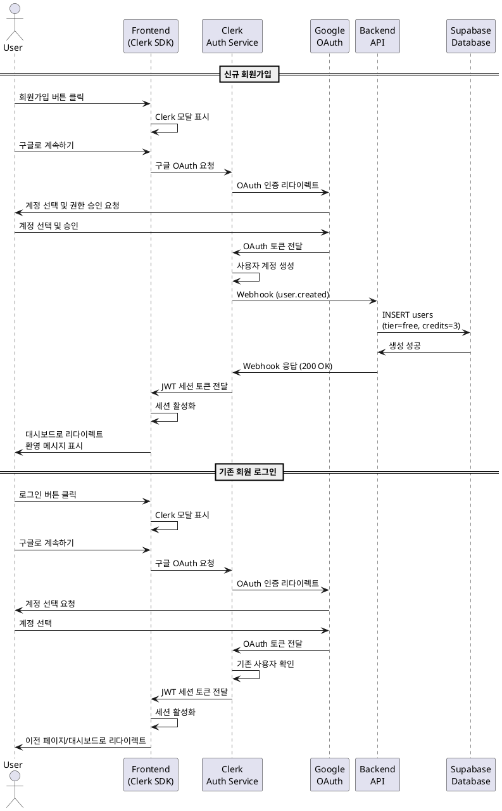

# UC-001: 구글 소셜 로그인

## Primary Actor
- 신규 사용자 또는 기존 사용자

## Precondition
- 사용자가 서비스 홈 페이지에 접근 가능한 상태
- 사용자가 유효한 구글 계정을 보유

## Trigger
- 사용자가 홈 페이지에서 '로그인' 또는 '회원가입' 버튼 클릭

## Main Scenario

### 신규 회원가입
1. 사용자가 홈 페이지의 '회원가입' 버튼을 클릭한다.
2. 시스템이 Clerk 회원가입 모달을 표시한다.
3. 사용자가 '구글로 계속하기' 버튼을 클릭한다.
4. 시스템이 구글 OAuth 인증 페이지로 리다이렉트한다.
5. 사용자가 구글 계정을 선택하고 권한을 승인한다.
6. Clerk가 사용자 정보를 받아 계정을 생성한다.
7. 시스템이 Webhook을 통해 백엔드에 사용자 생성 이벤트를 전달한다.
8. 백엔드가 Supabase에 사용자 레코드를 생성한다.
   - `subscription_tier`: 'free'
   - `remaining_analyses`: 3
   - `created_at`: 현재 시간
9. 시스템이 JWT 세션 토큰을 생성하여 클라이언트에 전달한다.
10. 사용자는 대시보드 페이지로 리다이렉트된다.
11. 시스템이 환영 메시지를 토스트로 표시한다.

### 기존 회원 로그인
1. 사용자가 홈 페이지의 '로그인' 버튼을 클릭한다.
2. 시스템이 Clerk 로그인 모달을 표시한다.
3. 사용자가 '구글로 계속하기' 버튼을 클릭한다.
4. 시스템이 구글 OAuth 인증 페이지로 리다이렉트한다.
5. 사용자가 구글 계정을 선택한다.
6. Clerk가 기존 사용자 정보를 확인한다.
7. 시스템이 JWT 세션 토큰을 생성한다.
8. 사용자는 이전 페이지 또는 대시보드로 리다이렉트된다.

## Alternative Flow

### AF-1: 미가입 구글 계정으로 로그인 시도
1. 사용자가 로그인 모달에서 구글 계정을 선택한다.
2. 시스템이 해당 계정의 가입 정보가 없음을 확인한다.
3. 시스템이 회원가입 플로우로 사용자를 안내한다.
4. Main Scenario의 신규 회원가입 플로우가 진행된다.

### AF-2: 사용자가 인증 프로세스를 중단
1. 사용자가 구글 인증 페이지에서 '취소' 또는 '뒤로가기'를 선택한다.
2. 시스템이 홈 페이지로 복귀한다.
3. 로그인/회원가입 프로세스가 중단된다.

### AF-3: 이미 가입된 계정으로 회원가입 시도
1. 사용자가 회원가입 모달에서 이미 가입된 구글 계정을 선택한다.
2. Clerk가 중복 계정임을 감지한다.
3. 시스템이 "이미 가입된 계정입니다" 메시지를 표시한다.
4. 시스템이 로그인 플로우로 전환할 수 있는 옵션을 제공한다.

## Exception Flow

### EF-1: Webhook 동기화 실패
1. Clerk 계정은 생성되었으나 Supabase 동기화가 실패한다.
2. 시스템이 실패 로그를 기록한다.
3. 사용자가 다음 로그인 시도 시, 시스템이 재시도 로직을 실행한다.
4. 재시도가 성공하면 정상적으로 사용자 레코드가 생성된다.
5. 재시도가 실패하면 관리자에게 알림이 전송된다.

### EF-2: 네트워크 오류
1. 인증 과정 중 네트워크 오류가 발생한다.
2. 시스템이 "네트워크 연결을 확인해주세요" 에러 메시지를 표시한다.
3. 모달이 유지되어 사용자가 재시도할 수 있다.

### EF-3: 구글 OAuth 서비스 장애
1. 구글 OAuth 인증 서비스가 응답하지 않는다.
2. 시스템이 타임아웃 에러를 감지한다.
3. "일시적인 오류가 발생했습니다. 잠시 후 다시 시도해주세요" 메시지를 표시한다.
4. 사용자가 홈 페이지로 복귀할 수 있는 옵션을 제공한다.

## Postcondition

### Success
- 사용자 세션이 활성화되어 인증된 사용자로 시스템에 접근할 수 있다.
- 신규 가입자의 경우 Supabase에 사용자 레코드가 생성되고 무료 플랜 3회 크레딧이 부여된다.
- 기존 사용자의 경우 이전 세션 정보가 복원된다.

### Failure
- 사용자는 미인증 상태로 유지된다.
- 홈 페이지 또는 로그인 모달 상태를 유지한다.
- 에러 메시지가 표시되어 사용자가 문제를 인지할 수 있다.

## Business Rules

### BR-1: 초기 크레딧 제공
- 신규 가입 사용자에게는 무료 플랜으로 3회의 사주 분석 기회가 자동으로 부여된다.
- 이 크레딧은 최초 1회만 제공되며, 소진 후 추가 제공되지 않는다.

### BR-2: 소셜 로그인 제공자
- 현재 구글 소셜 로그인만 지원한다.
- 향후 다른 소셜 로그인 제공자(카카오, 네이버 등) 추가 가능하다.

### BR-3: 이메일 수집
- 구글 계정의 이메일 정보는 사용자 식별 및 알림 발송 목적으로 수집된다.
- 수집된 정보는 개인정보 처리방침에 따라 관리된다.

### BR-4: 세션 유효기간
- JWT 세션 토큰의 유효기간은 Clerk 기본 설정을 따른다.
- 세션 만료 시 자동으로 재로그인 프롬프트가 표시된다.

### BR-5: 계정 고유성
- 구글 계정 ID를 기준으로 계정의 고유성을 보장한다.
- 동일한 구글 계정으로 중복 가입은 불가능하다.

## Sequence Diagram

