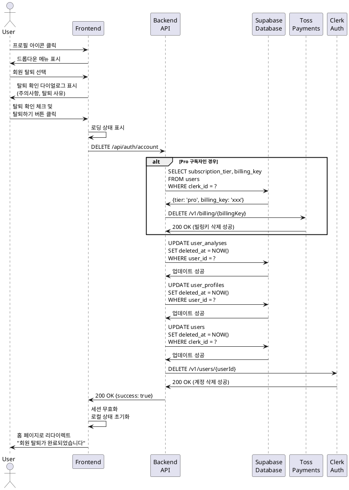

# UC-002: 회원 탈퇴

## Primary Actor
- 인증된 사용자 (무료 또는 Pro 구독자)

## Precondition
- 사용자가 로그인된 상태
- 사용자가 마이페이지에 접근 가능

## Trigger
- 사용자가 헤더의 프로필 아이콘을 클릭하고 드롭다운 메뉴에서 '회원 탈퇴'를 선택

## Main Scenario

1. 사용자가 헤더의 프로필 아이콘을 클릭한다.
2. 시스템이 드롭다운 메뉴를 표시한다.
3. 사용자가 '회원 탈퇴' 메뉴를 선택한다.
4. 시스템이 회원 탈퇴 확인 다이얼로그를 표시한다.
   - 탈퇴 시 주의사항 안내
   - "모든 분석 내역이 삭제되며 복구할 수 없습니다"
   - "Pro 구독 중인 경우 즉시 해지됩니다"
   - 탈퇴 사유 선택 옵션 (선택사항)
5. 사용자가 탈퇴 확인 체크박스를 선택한다.
6. 사용자가 '탈퇴하기' 버튼을 클릭한다.
7. 시스템이 로딩 상태를 표시한다.
8. 시스템이 사용자의 구독 상태를 확인한다.
9. Pro 구독자인 경우, 시스템이 토스페이먼츠 빌링키 삭제 API를 호출한다.
10. 시스템이 Supabase에서 사용자 관련 데이터를 소프트 삭제한다.
    - `user_analyses` 테이블: `deleted_at` 설정
    - `user_profiles` 테이블: `deleted_at` 설정
    - `users` 테이블: `deleted_at` 설정
11. 시스템이 Clerk API를 통해 사용자 계정을 삭제한다.
12. 시스템이 사용자 세션을 무효화한다.
13. 시스템이 홈 페이지로 리다이렉트한다.
14. 시스템이 "회원 탈퇴가 완료되었습니다" 메시지를 표시한다.

## Alternative Flow

### AF-1: 활성 Pro 구독 중 탈퇴 시도
1. 사용자가 '탈퇴하기' 버튼을 클릭한다.
2. 시스템이 활성 Pro 구독 상태를 확인한다.
3. 시스템이 추가 확인 다이얼로그를 표시한다.
   - "Pro 구독이 활성화되어 있습니다"
   - "탈퇴 시 즉시 구독이 해지되며 환불되지 않습니다"
   - "정말로 탈퇴하시겠습니까?"
4. 사용자가 '계속 탈퇴' 버튼을 클릭한다.
5. Main Scenario 9번부터 진행된다.

### AF-2: 사용자가 탈퇴를 취소
1. 사용자가 확인 다이얼로그에서 '취소' 버튼을 클릭한다.
2. 시스템이 다이얼로그를 닫는다.
3. 사용자는 이전 페이지를 유지한다.
4. 탈퇴 프로세스가 중단된다.

### AF-3: 취소 예정 상태의 구독자 탈퇴
1. 사용자의 구독 상태가 'pending_cancel'이다.
2. 시스템이 빌링키 삭제를 시도한다.
3. 이미 취소 예정이므로 빌링키만 삭제하고 추가 처리는 하지 않는다.
4. Main Scenario 10번부터 진행된다.

## Exception Flow

### EF-1: 빌링키 삭제 실패
1. 토스페이먼츠 빌링키 삭제 API 호출이 실패한다.
2. 시스템이 에러를 로그에 기록한다.
3. 시스템이 "구독 해지 처리 중 오류가 발생했습니다" 에러 메시지를 표시한다.
4. 다이얼로그가 유지되어 사용자가 재시도할 수 있다.
5. 사용자가 재시도하거나 고객센터에 문의할 수 있다.

### EF-2: 데이터베이스 삭제 실패
1. Supabase 데이터 삭제 중 오류가 발생한다.
2. 시스템이 트랜잭션을 롤백한다.
3. 시스템이 "회원 탈퇴 처리 중 오류가 발생했습니다" 에러 메시지를 표시한다.
4. 다이얼로그가 유지되어 사용자가 재시도할 수 있다.

### EF-3: Clerk 계정 삭제 실패
1. Clerk API 호출이 실패한다.
2. 시스템이 Supabase 데이터는 이미 삭제된 상태를 확인한다.
3. 시스템이 에러 로그를 기록하고 관리자에게 알림을 전송한다.
4. 사용자에게는 "일부 처리가 지연되고 있습니다. 고객센터로 문의해주세요" 메시지를 표시한다.
5. 관리자가 수동으로 Clerk 계정 삭제를 처리한다.

### EF-4: 네트워크 오류
1. 네트워크 오류로 인해 API 호출이 실패한다.
2. 시스템이 "네트워크 연결을 확인해주세요" 에러 메시지를 표시한다.
3. 다이얼로그가 유지되어 사용자가 재시도할 수 있다.
4. 재시도 버튼을 제공한다.

## Postcondition

### Success
- 사용자 계정이 시스템에서 완전히 삭제된다.
- 사용자 세션이 무효화되어 로그아웃 상태가 된다.
- 사용자는 홈 페이지로 이동한다.
- Pro 구독자의 경우 빌링키가 삭제되어 추가 결제가 발생하지 않는다.

### Failure
- 사용자 계정이 유지된다.
- 사용자는 여전히 로그인 상태를 유지한다.
- 에러 메시지가 표시되어 사용자가 문제를 인지할 수 있다.
- 다이얼로그가 유지되어 재시도가 가능하다.

## Business Rules

### BR-1: 데이터 완전 삭제 정책
- 탈퇴 시 사용자의 모든 데이터는 소프트 삭제된다 (`deleted_at` 타임스탬프 설정).
- 소프트 삭제된 데이터는 30일간 보관 후 완전히 삭제된다.
- 이 기간 동안 관리자는 요청 시 데이터를 복구할 수 있다.

### BR-2: 구독 해지 정책
- Pro 구독 중 탈퇴 시 즉시 구독이 해지된다.
- 이미 결제된 금액은 환불되지 않는다.
- 잔여 사용 기간이 남아있어도 즉시 만료된다.

### BR-3: 재가입 정책
- 탈퇴 후 동일한 구글 계정으로 재가입이 가능하다.
- 재가입 시 이전 데이터는 복구되지 않으며 새로운 사용자로 취급된다.
- 재가입 시에도 무료 플랜 3회 크레딧이 다시 제공된다.

### BR-4: 탈퇴 사유 수집
- 탈퇴 사유는 선택사항이며 수집된 정보는 서비스 개선에 활용된다.
- 수집된 사유는 익명화되어 통계 목적으로만 사용된다.

### BR-5: 공유된 분석 결과 처리
- 사용자가 탈퇴하더라도 이미 공유된 링크는 만료일까지 유효하다.
- 다만 탈퇴한 사용자의 이름은 "탈퇴한 사용자"로 표시된다.

### BR-6: 결제 내역 보관
- 세법에 따라 결제 내역은 5년간 별도 보관된다.
- 사용자는 탈퇴 후에도 결제 내역 조회를 요청할 수 있다.

## Sequence Diagram

