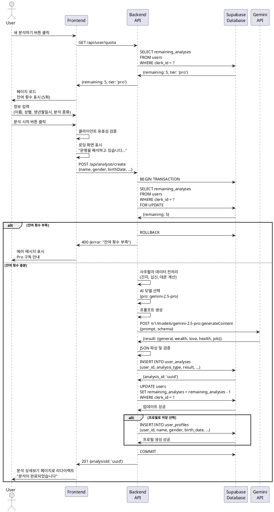

# UC-003: 새 사주 분석 생성 (직접 입력)

## Primary Actor
- 인증된 사용자 (무료 또는 Pro 구독자)

## Precondition
- 사용자가 로그인된 상태
- 사용자가 분석 잔여 횟수를 보유 (무료: 최대 3회, Pro: 월 10회)

## Trigger
- 사용자가 헤더 또는 대시보드에서 '새 분석하기' 버튼을 클릭

## Main Scenario

1. 사용자가 '새 분석하기' 버튼을 클릭한다.
2. 시스템이 새 분석하기 페이지를 로드한다.
3. 시스템이 사용자의 분석 잔여 횟수를 조회한다.
4. 시스템이 페이지 상단에 잔여 횟수를 배지로 표시한다.
5. 사용자가 '새로 입력하기' 탭을 선택한다 (기본 선택).
6. 시스템이 입력 폼을 표시한다.
7. 사용자가 필수 정보를 입력한다.
   - 이름 (텍스트 입력)
   - 성별 (남성/여성 라디오 버튼)
   - 생년월일 (날짜 선택기)
   - 음력/양력 선택 (토글 스위치)
   - 태어난 시간 (시간 선택 드롭다운, 선택사항)
   - 분석 종류 (평생 운세/신년 운세/월간 운세 라디오 버튼)
8. 사용자가 선택적으로 '프로필로 저장' 체크박스를 선택한다.
9. 사용자가 '분석 시작' 버튼을 클릭한다.
10. 시스템이 클라이언트 측 입력 유효성을 검증한다.
11. 시스템이 로딩 화면을 표시한다 ("운명을 해석하고 있습니다...").
12. 시스템이 백엔드 API에 분석 생성 요청을 전송한다.
13. 백엔드가 사용자의 잔여 횟수를 재확인한다 (동시성 제어).
14. 백엔드가 사주팔자 데이터를 전처리한다.
    - 생년월일시를 간지(干支) 데이터로 변환
    - 십신(十神), 대운(大運) 계산
15. 백엔드가 사용자 플랜에 맞는 AI 모델을 선택한다.
    - 무료: gemini-2.5-flash
    - Pro: gemini-2.5-pro
16. 백엔드가 구조화된 프롬프트를 생성하고 Gemini API를 호출한다.
17. Gemini API가 JSON 형식의 분석 결과를 반환한다.
18. 백엔드가 응답을 파싱하고 검증한다.
19. 백엔드가 Supabase에 분석 결과를 저장한다.
    - `user_analyses` 테이블에 레코드 생성
    - JSON 결과 저장
20. 백엔드가 사용자의 잔여 횟수를 차감한다 (트랜잭션).
21. '프로필로 저장'이 선택된 경우, 백엔드가 `user_profiles` 테이블에 프로필을 생성한다.
22. 백엔드가 생성된 분석 ID를 반환한다.
23. 시스템이 분석 상세보기 페이지로 리다이렉트한다.
24. 시스템이 "분석이 완료되었습니다" 토스트 메시지를 표시한다.

## Alternative Flow

### AF-1: 잔여 횟수 3회 이하 알림
1. 페이지 로드 시 잔여 횟수가 3회 이하인 경우를 확인한다.
2. 시스템이 알림 배너를 표시한다.
   - "남은 분석 횟수가 N회입니다"
   - Pro 사용자가 아닌 경우 "Pro로 업그레이드하여 더 많은 분석을 이용하세요" 버튼 표시
3. Main Scenario가 계속 진행된다.

### AF-2: 잔여 횟수 0회
1. 페이지 로드 시 잔여 횟수가 0회임을 확인한다.
2. 시스템이 입력 폼 대신 Pro 구독 안내 페이지를 표시한다.
   - "더 이상 무료 분석 횟수가 없습니다"
   - Pro 요금제 혜택 안내
   - "Pro로 업그레이드" 버튼
3. 사용자가 버튼을 클릭하면 구독 관리 페이지로 이동한다.

### AF-3: 입력 유효성 검증 실패
1. 사용자가 필수 필드를 누락하거나 잘못된 형식으로 입력한다.
2. 시스템이 해당 필드 아래 에러 메시지를 표시한다.
   - "이름을 입력해주세요"
   - "올바른 날짜를 선택해주세요"
3. 사용자가 입력을 수정할 수 있다.
4. 유효성 검증을 통과하면 Main Scenario 12번부터 진행된다.

### AF-4: 음력 날짜 입력
1. 사용자가 음력 토글을 활성화한다.
2. 시스템이 날짜 선택기에 음력 안내를 표시한다.
3. 사용자가 음력 생년월일을 입력한다.
4. 백엔드가 음력을 양력으로 변환한다.
5. Main Scenario 15번부터 진행된다.

## Exception Flow

### EF-1: 잔여 횟수 부족 (동시 요청)
1. 사용자가 여러 탭에서 동시에 분석을 시작한다.
2. 백엔드가 트랜잭션으로 잔여 횟수를 확인하고 차감한다.
3. 두 번째 요청이 잔여 횟수 부족으로 실패한다.
4. 시스템이 "잔여 횟수가 부족합니다" 에러 메시지를 표시한다.
5. Pro 구독 안내 다이얼로그를 표시한다.
6. 입력 폼이 유지된다 (입력값 보존).

### EF-2: AI API 호출 실패
1. Gemini API 호출 중 네트워크 오류 또는 서비스 장애가 발생한다.
2. 백엔드가 에러를 감지하고 로그를 기록한다.
3. 잔여 횟수는 차감하지 않는다.
4. 시스템이 "일시적인 오류가 발생했습니다. 잠시 후 다시 시도해주세요" 에러 메시지를 표시한다.
5. 시스템이 재시도 버튼을 제공한다.
6. 입력 폼이 유지된다 (입력값 보존).

### EF-3: AI 응답 JSON 파싱 실패
1. Gemini API가 유효하지 않은 JSON을 반환한다.
2. 백엔드가 파싱 실패를 감지한다.
3. 백엔드가 최대 2회까지 재시도한다.
4. 재시도가 모두 실패하면 에러를 반환한다.
5. 잔여 횟수는 차감하지 않는다.
6. 시스템이 "분석 생성에 실패했습니다" 에러 메시지를 표시한다.
7. 시스템이 재시도 버튼을 제공한다.

### EF-4: AI 응답 타임아웃
1. Gemini API 호출이 30초 이상 소요된다.
2. 시스템이 타임아웃 에러를 감지한다.
3. 잔여 횟수는 차감하지 않는다.
4. 시스템이 "처리 시간이 초과되었습니다" 에러 메시지를 표시한다.
5. 시스템이 재시도 버튼을 제공한다.

### EF-5: 데이터베이스 저장 실패
1. Supabase에 분석 결과 저장 중 오류가 발생한다.
2. 백엔드가 트랜잭션을 롤백한다.
3. 잔여 횟수는 차감하지 않는다.
4. 시스템이 "저장 중 오류가 발생했습니다" 에러 메시지를 표시한다.
5. 시스템이 재시도 버튼을 제공한다.

### EF-6: 유효하지 않은 음력 날짜
1. 사용자가 유효하지 않은 음력 날짜를 입력한다 (예: 음력 1월 32일).
2. 백엔드가 음력-양력 변환 중 에러를 감지한다.
3. 시스템이 "유효하지 않은 음력 날짜입니다" 에러 메시지를 표시한다.
4. 입력 폼이 유지되어 사용자가 수정할 수 있다.

## Postcondition

### Success
- 새로운 사주 분석 결과가 Supabase에 저장된다.
- 사용자의 잔여 분석 횟수가 1회 차감된다.
- 사용자는 분석 상세보기 페이지로 이동하여 결과를 확인할 수 있다.
- 프로필로 저장한 경우 `user_profiles`에 새 프로필이 추가된다.

### Failure
- 분석 결과가 생성되지 않는다.
- 사용자의 잔여 분석 횟수는 차감되지 않는다.
- 에러 메시지가 표시되어 사용자가 문제를 인지할 수 있다.
- 입력 폼이 유지되어 재시도가 가능하다.

## Business Rules

### BR-1: 크레딧 차감 시점
- 분석 결과가 성공적으로 생성되고 저장된 시점에만 크레딧이 차감된다.
- AI API 호출 실패, 타임아웃, 파싱 오류 등의 경우 크레딧은 차감되지 않는다.

### BR-2: AI 모델 선택
- 무료 사용자: gemini-2.5-flash 모델 사용
- Pro 사용자: gemini-2.5-pro 모델 사용
- 모델은 사용자의 현재 구독 상태에 따라 자동으로 선택된다.

### BR-3: 분석 종류
- 평생 운세: 전반적인 삶의 흐름과 특성
- 신년 운세: 현재 연도의 운세
- 월간 운세: 현재 월의 운세
- 각 분석 종류는 서로 다른 프롬프트를 사용한다.

### BR-4: 결과 데이터 구조
- AI 응답은 반드시 다음 JSON 스키마를 따라야 한다:
  - `general`: 총운 (200자 이상)
  - `wealth`: 재물운 (200자 이상)
  - `love`: 애정운 (200자 이상)
  - `health`: 건강운 (200자 이상)
  - `job`: 직업운 (200자 이상)

### BR-5: 프로필 자동 저장
- '프로필로 저장' 옵션을 선택한 경우, 입력한 정보가 `user_profiles`에 저장된다.
- 동일한 이름과 생년월일의 프로필이 이미 존재하면 저장하지 않는다.

### BR-6: 동시성 제어
- 여러 탭에서 동시에 분석을 시작하더라도 잔여 횟수는 정확하게 차감된다.
- 데이터베이스 트랜잭션으로 동시성을 보장한다.

### BR-7: 태어난 시간 선택사항
- 태어난 시간은 선택사항이다.
- 시간을 입력하지 않은 경우 정오(12:00)로 가정하여 분석한다.

## Sequence Diagram

