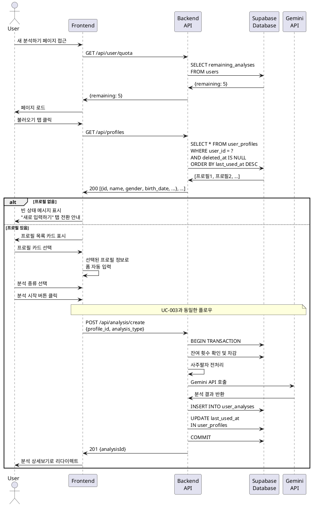

# UC-004: 새 사주 분석 생성 (프로필 불러오기)

## Primary Actor
- 인증된 사용자 (무료 또는 Pro 구독자)

## Precondition
- 사용자가 로그인된 상태
- 사용자가 분석 잔여 횟수를 보유
- 사용자가 1개 이상의 저장된 프로필을 보유

## Trigger
- 사용자가 새 분석하기 페이지에서 '불러오기' 탭을 선택

## Main Scenario

1. 사용자가 새 분석하기 페이지에 접근한다.
2. 시스템이 잔여 횟수를 조회하고 표시한다.
3. 사용자가 '불러오기' 탭을 클릭한다.
4. 시스템이 사용자의 저장된 프로필 목록을 조회한다.
5. 시스템이 프로필 목록을 카드 형태로 표시한다.
   - 각 카드: 이름, 성별 아이콘, 생년월일
6. 사용자가 원하는 프로필 카드를 선택한다.
7. 시스템이 선택된 프로필로 폼을 자동 입력한다.
   - 이름
   - 성별
   - 생년월일
   - 음력/양력
   - 태어난 시간
8. 사용자가 분석 종류를 선택한다 (평생/신년/월간 운세).
9. 사용자가 '분석 시작' 버튼을 클릭한다.
10. 이후 UC-003의 Main Scenario 10번부터 동일하게 진행된다.
    - 입력 유효성 검증
    - 로딩 화면 표시
    - 백엔드 API 호출
    - 사주팔자 데이터 전처리
    - AI 모델 선택 및 분석
    - 결과 저장 및 크레딧 차감
11. 시스템이 분석 상세보기 페이지로 리다이렉트한다.
12. 시스템이 "분석이 완료되었습니다" 토스트 메시지를 표시한다.

## Alternative Flow

### AF-1: 프로필 없음
1. 사용자가 '불러오기' 탭을 클릭한다.
2. 시스템이 프로필 목록을 조회한다.
3. 프로필이 없는 경우를 확인한다.
4. 시스템이 빈 상태 메시지를 표시한다.
   - "저장된 프로필이 없습니다"
   - "프로필을 추가하면 더 빠르게 분석할 수 있습니다"
5. 시스템이 '새로 입력하기' 탭으로 전환하는 버튼을 표시한다.
6. 사용자가 버튼을 클릭하면 '새로 입력하기' 탭으로 이동한다.

### AF-2: 프로필 선택 후 정보 수정
1. 사용자가 프로필을 선택하여 폼이 자동 입력된다.
2. 사용자가 일부 정보를 수정한다 (예: 분석 날짜 기준 변경).
3. 수정된 정보로 분석이 진행된다.
4. Main Scenario 9번부터 진행된다.

### AF-3: 다른 프로필 재선택
1. 사용자가 첫 번째 프로필을 선택한다.
2. 시스템이 폼을 자동 입력한다.
3. 사용자가 다른 프로필 카드를 클릭한다.
4. 시스템이 폼을 새로운 프로필 정보로 업데이트한다.
5. Main Scenario 8번부터 진행된다.

### AF-4: 프로필 목록 로딩 중
1. 사용자가 '불러오기' 탭을 클릭한다.
2. 시스템이 프로필 목록 API를 호출한다.
3. 응답이 느린 경우 스켈레톤 UI를 표시한다.
4. 목록이 로드되면 Main Scenario 5번부터 진행된다.

## Exception Flow

### EF-1: 프로필 목록 조회 실패
1. 프로필 목록 API 호출이 실패한다.
2. 시스템이 "프로필을 불러올 수 없습니다" 에러 메시지를 표시한다.
3. 시스템이 재시도 버튼을 제공한다.
4. 사용자가 재시도하거나 '새로 입력하기' 탭으로 전환할 수 있다.

### EF-2: 선택한 프로필이 삭제됨
1. 사용자가 프로필을 선택한다.
2. 다른 탭에서 해당 프로필이 삭제되었다.
3. 분석 시작 시 백엔드가 프로필을 찾을 수 없다.
4. 시스템이 "선택한 프로필이 존재하지 않습니다" 에러 메시지를 표시한다.
5. 시스템이 프로필 목록을 새로고침한다.
6. 사용자가 다른 프로필을 선택하거나 직접 입력할 수 있다.

### EF-3: 프로필 데이터 불완전
1. 선택한 프로필에 필수 정보가 누락되어 있다 (예: 생년월일 없음).
2. 시스템이 자동 입력 후 유효성 검증을 수행한다.
3. 누락된 필드에 에러 메시지를 표시한다.
4. 사용자가 누락된 정보를 수동으로 입력한다.
5. Main Scenario 9번부터 진행된다.

### EF-4: 네트워크 오류
1. 프로필 목록 조회 중 네트워크 오류가 발생한다.
2. 시스템이 "네트워크 연결을 확인해주세요" 에러 메시지를 표시한다.
3. 시스템이 재시도 버튼을 제공한다.
4. React Query가 자동으로 3회까지 재시도한다.
5. 모든 재시도가 실패하면 사용자에게 재시도 옵션을 제공한다.

## Postcondition

### Success
- UC-003과 동일
- 새로운 사주 분석 결과가 Supabase에 저장된다.
- 사용자의 잔여 분석 횟수가 1회 차감된다.
- 사용자는 분석 상세보기 페이지로 이동하여 결과를 확인할 수 있다.

### Failure
- UC-003과 동일
- 분석 결과가 생성되지 않는다.
- 사용자의 잔여 분석 횟수는 차감되지 않는다.
- 에러 메시지가 표시되어 사용자가 문제를 인지할 수 있다.

## Business Rules

### BR-1: 프로필 선택 편의성
- 프로필 불러오기 기능은 자주 보는 사람(가족, 친구 등)의 분석을 빠르게 생성하기 위한 것이다.
- 프로필에서 불러온 정보도 수정 가능하다.

### BR-2: 프로필 제한
- 무료 사용자: 최대 5개의 프로필 저장 가능
- Pro 사용자: 무제한 프로필 저장 가능

### BR-3: 프로필 정보 활용
- 프로필에 저장된 정보는 읽기 전용이 아니며, 분석 시마다 수정하여 사용할 수 있다.
- 프로필을 선택하더라도 '프로필로 저장' 옵션은 표시되지 않는다 (이미 저장된 프로필이므로).

### BR-4: 프로필 정렬
- 프로필 목록은 최근 사용된 순서로 정렬된다.
- 한 번도 사용하지 않은 프로필은 생성일 기준으로 정렬된다.

### BR-5: 프로필 카드 디자인
- 각 프로필 카드는 이름, 성별 아이콘, 생년월일을 표시한다.
- 음력인 경우 "(음력)" 표시를 추가한다.
- 선택된 프로필은 강조 표시된다 (테두리 색상 변경).

## Sequence Diagram

