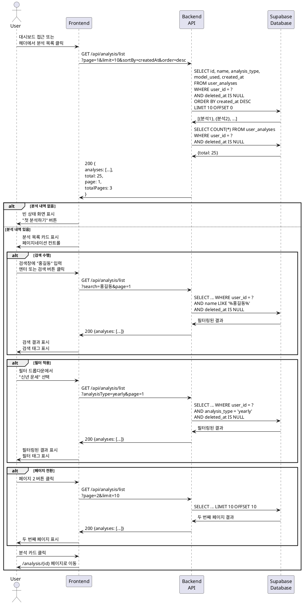

# UC-005: 사주 분석 목록 조회

## Primary Actor
- 인증된 사용자 (무료 또는 Pro 구독자)

## Precondition
- 사용자가 로그인된 상태
- 사용자가 1개 이상의 분석 내역을 보유 (선택사항)

## Trigger
- 사용자가 헤더 메뉴에서 '분석 목록' 클릭 또는 로그인 직후 대시보드 자동 진입

## Main Scenario

1. 사용자가 대시보드 페이지에 접근한다.
2. 시스템이 사용자의 분석 목록을 조회한다.
   - 기본: 페이지 1, 10개씩, 생성일 기준 내림차순
3. 시스템이 분석 목록을 카드 형태로 표시한다.
   - 3열 그리드 레이아웃
4. 각 카드는 다음 정보를 포함한다.
   - 대상 이름
   - 분석 종류 배지 (평생/신년/월간)
   - 생성일 (예: 2025년 10월 24일)
   - 사용된 AI 모델 배지 (Flash/Pro)
   - 호버 시 삭제 버튼 표시
5. 시스템이 페이지네이션 컨트롤을 하단에 표시한다.
   - 현재 페이지 번호
   - 이전/다음 버튼
   - 총 페이지 수
6. 시스템이 상단에 검색창과 필터 드롭다운을 표시한다.
7. 사용자가 카드를 클릭하면 해당 분석 상세보기 페이지로 이동한다.

## Alternative Flow

### AF-1: 분석 내역 없음 (빈 상태)
1. 사용자가 대시보드에 접근한다.
2. 시스템이 분석 목록을 조회한다.
3. 분석 내역이 없는 경우를 확인한다.
4. 시스템이 빈 상태 화면을 표시한다.
   - 일러스트 또는 이모지
   - "아직 분석 내역이 없습니다"
   - "첫 번째 사주 분석을 시작해보세요"
   - '첫 분석하기' CTA 버튼 (큰 버튼)
5. 사용자가 버튼을 클릭하면 새 분석하기 페이지로 이동한다.

### AF-2: 이름으로 검색
1. 사용자가 검색창에 이름을 입력한다 (예: "홍길동").
2. 사용자가 엔터 키를 누르거나 검색 버튼을 클릭한다.
3. 시스템이 검색 쿼리를 포함한 API를 호출한다.
   - `?search=홍길동&page=1`
4. 시스템이 필터링된 결과를 표시한다.
5. 검색 키워드가 카드의 이름에서 하이라이트된다.
6. 시스템이 검색 태그를 표시한다 ("홍길동" X 버튼).
7. 사용자가 X 버튼을 클릭하면 검색이 초기화된다.

### AF-3: 분석 종류별 필터링
1. 사용자가 필터 드롭다운을 클릭한다.
2. 시스템이 옵션을 표시한다.
   - 전체
   - 평생 운세
   - 신년 운세
   - 월간 운세
3. 사용자가 "신년 운세"를 선택한다.
4. 시스템이 필터링된 결과를 표시한다.
5. 시스템이 필터 태그를 표시한다 ("신년 운세" X 버튼).
6. 사용자가 X 버튼을 클릭하면 필터가 초기화된다.

### AF-4: 검색 + 필터 조합
1. 사용자가 검색창에 "김철수"를 입력한다.
2. 사용자가 필터에서 "월간 운세"를 선택한다.
3. 시스템이 두 조건을 모두 만족하는 결과를 표시한다.
   - `?search=김철수&analysisType=monthly`
4. 시스템이 두 개의 태그를 표시한다.
5. 사용자가 각 태그의 X 버튼으로 개별 해제 가능하다.

### AF-5: 페이지네이션
1. 사용자가 분석 내역이 10개 이상 있다.
2. 시스템이 10개씩 첫 페이지를 표시한다.
3. 사용자가 '다음' 버튼 또는 페이지 번호를 클릭한다.
4. 시스템이 두 번째 페이지를 로드한다.
   - `?page=2&limit=10`
5. URL이 업데이트된다 (`/dashboard?page=2`).
6. 사용자가 '이전' 버튼으로 돌아갈 수 있다.

### AF-6: 정렬 순서 변경 (향후 기능)
1. 사용자가 정렬 드롭다운을 클릭한다.
2. 옵션을 선택한다 (최신순/오래된순/이름순).
3. 시스템이 선택된 순서로 목록을 재정렬한다.

## Exception Flow

### EF-1: 목록 조회 API 실패
1. 분석 목록 API 호출이 실패한다.
2. 시스템이 "목록을 불러올 수 없습니다" 에러 메시지를 표시한다.
3. 시스템이 재시도 버튼을 제공한다.
4. React Query가 자동으로 3회까지 재시도한다.
5. 사용자가 수동으로 재시도할 수 있다.

### EF-2: 검색 결과 없음
1. 사용자가 검색어를 입력한다.
2. 시스템이 검색 결과가 없음을 확인한다.
3. 시스템이 "검색 결과가 없습니다" 메시지를 표시한다.
4. 시스템이 "검색어를 변경하거나 필터를 초기화하세요" 안내를 제공한다.
5. 검색 초기화 버튼을 제공한다.

### EF-3: 네트워크 오류
1. 네트워크 연결이 끊긴 상태에서 페이지에 접근한다.
2. 시스템이 "네트워크 연결을 확인해주세요" 에러 메시지를 표시한다.
3. 시스템이 오프라인 일러스트를 표시한다.
4. 재시도 버튼을 제공한다.

### EF-4: 페이지 번호 오류
1. 사용자가 URL을 직접 수정하여 존재하지 않는 페이지에 접근한다 (예: `?page=999`).
2. 시스템이 빈 결과를 감지한다.
3. 시스템이 첫 페이지로 리다이렉트한다.
4. "페이지를 찾을 수 없어 첫 페이지로 이동했습니다" 토스트 메시지를 표시한다.

## Postcondition

### Success
- 사용자가 분석 목록을 확인할 수 있다.
- 검색/필터 조건이 적용된 결과를 볼 수 있다.
- 페이지네이션으로 많은 내역을 탐색할 수 있다.
- 카드 클릭으로 상세보기 페이지로 이동할 수 있다.

### Failure
- 에러 메시지가 표시되어 사용자가 문제를 인지할 수 있다.
- 재시도 옵션이 제공되어 사용자가 다시 시도할 수 있다.

## Business Rules

### BR-1: 페이지네이션 설정
- 한 페이지당 10개의 분석 내역을 표시한다.
- 이 값은 변경 가능하지만 성능을 위해 최대 50개로 제한한다.

### BR-2: 기본 정렬 순서
- 분석 목록은 생성일 기준 내림차순(최신순)으로 정렬된다.
- 사용자가 마지막으로 생성한 분석이 가장 위에 표시된다.

### BR-3: 검색 범위
- 검색은 대상 이름 필드만 대상으로 한다.
- 부분 일치 검색을 지원한다 (예: "홍"으로 검색 시 "홍길동", "홍철수" 모두 표시).
- 대소문자를 구분하지 않는다.

### BR-4: 필터 옵션
- 분석 종류 필터: 전체, 평생 운세, 신년 운세, 월간 운세
- 향후 AI 모델별 필터 추가 가능 (Flash/Pro).

### BR-5: 카드 디자인
- 각 카드는 hover 시 그림자 효과로 상호작용을 표시한다.
- 삭제 버튼은 hover 시에만 표시되어 UI를 깔끔하게 유지한다.
- 분석 종류 배지는 색상으로 구분된다 (평생: 보라, 신년: 파랑, 월간: 초록).

### BR-6: 캐싱 정책
- 분석 목록은 React Query로 5분간 캐싱된다.
- 새 분석 생성 시 캐시가 무효화되어 자동으로 갱신된다.

### BR-7: 소프트 삭제
- 삭제된 분석(`deleted_at`이 설정된)은 목록에서 제외된다.
- 삭제된 분석은 30일 후 완전히 삭제된다.

## Sequence Diagram

