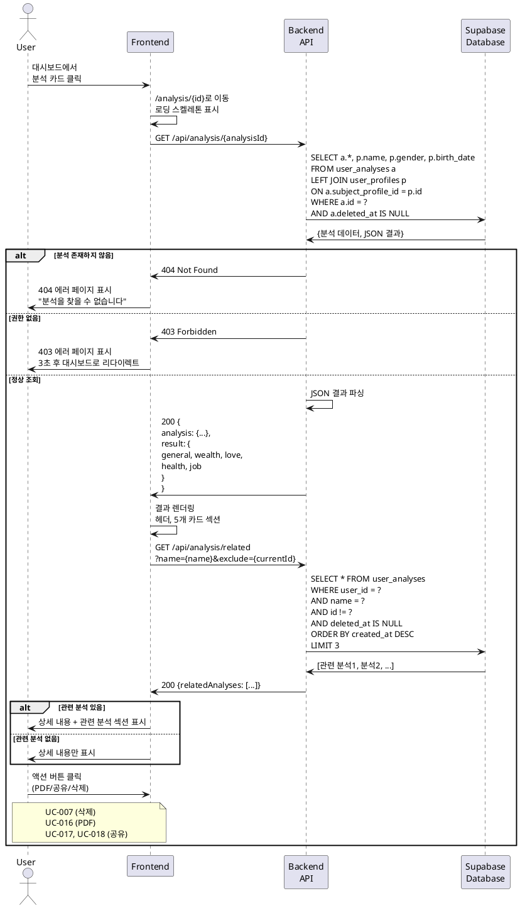

# UC-006: 사주 분석 상세보기

## Primary Actor
- 인증된 사용자 (무료 또는 Pro 구독자)

## Precondition
- 사용자가 로그인된 상태
- 사용자가 조회하려는 분석이 존재하고 본인 소유임

## Trigger
- 사용자가 대시보드에서 분석 카드를 클릭하거나 직접 URL로 접근

## Main Scenario

1. 사용자가 분석 카드를 클릭한다.
2. 시스템이 분석 상세보기 페이지로 이동한다 (`/analysis/{analysisId}`).
3. 시스템이 로딩 스켈레톤 UI를 표시한다.
4. 시스템이 백엔드에 분석 데이터를 요청한다.
5. 백엔드가 분석이 현재 사용자 소유인지 확인한다.
6. 백엔드가 Supabase에서 분석 전체 데이터를 조회한다.
7. 백엔드가 JSON 결과를 파싱하여 반환한다.
8. 시스템이 분석 결과를 섹션별로 렌더링한다.
   - **헤더 섹션**:
     - 대상 이름 (큰 제목)
     - 생년월일 (음력/양력 표시)
     - 분석 종류 배지
     - 생성일
     - 사용된 AI 모델 배지 (Flash/Pro)
   - **결과 섹션** (카드 형태):
     - 총운 카드 (🌟 이모지)
     - 재물운 카드 (💰 이모지)
     - 애정운 카드 (💕 이모지)
     - 건강운 카드 (🏥 이모지)
     - 직업운 카드 (💼 이모지)
9. 각 카드는 제목과 AI가 생성한 내용을 표시한다 (200자 이상).
10. 시스템이 하단에 액션 버튼을 표시한다.
    - PDF로 저장
    - 공유하기
    - 삭제하기
11. 시스템이 "관련 분석" 섹션을 하단에 표시한다.
    - 동일 대상의 다른 분석 내역 (최대 3개)
    - 카드 형태로 표시

## Alternative Flow

### AF-1: 긴 내용 표시
1. AI 생성 내용이 매우 긴 경우 (예: 500자 이상).
2. 시스템이 각 카드에 "더 보기" 버튼을 추가한다.
3. 초기에는 300자까지만 표시한다.
4. 사용자가 "더 보기"를 클릭하면 전체 내용을 확장한다.
5. "접기" 버튼으로 다시 축소할 수 있다.

### AF-2: 관련 분석 없음
1. 동일 대상의 다른 분석 내역이 없다.
2. 시스템이 "관련 분석" 섹션을 표시하지 않는다.
3. 또는 "이 사람의 첫 분석입니다" 메시지를 표시한다.

### AF-3: 태어난 시간 미입력
1. 분석 생성 시 태어난 시간을 입력하지 않았다.
2. 헤더 섹션에 "시간 미입력 (정오 기준)" 안내를 표시한다.

### AF-4: 모바일 뷰
1. 사용자가 모바일 기기로 접근한다.
2. 시스템이 반응형 레이아웃을 적용한다.
3. 카드가 1열로 세로 배치된다.
4. 액션 버튼이 하단 고정 바로 표시된다.

## Exception Flow

### EF-1: 존재하지 않는 분석 ID
1. 사용자가 존재하지 않는 ID로 접근한다.
2. 백엔드가 404 에러를 반환한다.
3. 시스템이 404 에러 페이지를 표시한다.
   - "분석을 찾을 수 없습니다"
   - 대시보드로 이동 버튼
4. 사용자가 버튼을 클릭하면 대시보드로 이동한다.

### EF-2: 권한 없음 (다른 사용자의 분석)
1. 사용자가 다른 사용자의 분석 ID로 접근 시도한다.
2. 백엔드가 권한을 확인하여 403 에러를 반환한다.
3. 시스템이 403 에러 페이지를 표시한다.
   - "접근 권한이 없습니다"
   - 대시보드로 이동 버튼
4. 3초 후 자동으로 대시보드로 리다이렉트한다.

### EF-3: JSON 파싱 오류
1. 저장된 분석 결과 JSON이 손상되었다.
2. 백엔드가 파싱 중 에러를 감지한다.
3. 백엔드가 에러 로그를 기록하고 500 에러를 반환한다.
4. 시스템이 "분석 결과를 불러올 수 없습니다" 에러 메시지를 표시한다.
5. 관리자에게 알림이 전송되어 수동 복구를 진행한다.

### EF-4: 네트워크 오류
1. API 호출 중 네트워크 오류가 발생한다.
2. 시스템이 "네트워크 연결을 확인해주세요" 에러 메시지를 표시한다.
3. React Query가 자동으로 3회까지 재시도한다.
4. 재시도 버튼을 제공한다.

### EF-5: 삭제된 분석 접근
1. 사용자가 이미 삭제한 분석의 URL에 접근한다 (북마크 등).
2. 백엔드가 `deleted_at`이 설정된 것을 확인한다.
3. 404 에러로 처리한다.
4. EF-1과 동일하게 진행된다.

## Postcondition

### Success
- 사용자가 분석 결과를 상세하게 확인할 수 있다.
- 액션 버튼으로 추가 작업(PDF 저장, 공유, 삭제)을 수행할 수 있다.
- 관련 분석으로 쉽게 이동할 수 있다.

### Failure
- 에러 페이지가 표시되어 사용자가 문제를 인지할 수 있다.
- 대시보드로 돌아갈 수 있는 옵션이 제공된다.

## Business Rules

### BR-1: 결과 카드 순서
- 결과 카드는 항상 다음 순서로 표시된다:
  1. 총운
  2. 재물운
  3. 애정운
  4. 건강운
  5. 직업운

### BR-2: 이모지 사용
- 각 카드의 제목 옆에 어울리는 이모지를 표시하여 시각적 가독성을 높인다.
- 이모지는 변경 가능하지만 일관성을 유지한다.

### BR-3: 카드 디자인
- shadcn-ui Card 컴포넌트를 활용한다.
- 각 카드는 여백과 그림자로 구분된다.
- 배경색은 흰색, 테두리는 연한 회색을 사용한다.

### BR-4: 읽기 전용
- 상세보기 페이지는 읽기 전용이다.
- 분석 결과를 수정하거나 재생성할 수 없다.
- 새로운 분석을 생성하려면 '새 분석하기'로 이동해야 한다.

### BR-5: 관련 분석 표시 기준
- 동일한 대상 이름을 가진 분석 중 현재 분석을 제외한 나머지
- 최근 생성된 순서로 최대 3개
- 현재 분석과 동일한 분석 종류는 제외할 수 있다 (옵션)

### BR-6: 캐싱 정책
- 분석 상세 데이터는 React Query로 무제한 캐싱된다.
- 분석 결과는 변경되지 않는 데이터이므로 staleTime을 Infinity로 설정한다.

### BR-7: SEO 및 메타 태그
- 각 분석 페이지는 고유한 메타 태그를 가진다.
- `<title>`: "[이름]님의 [분석 종류] - SuperNext"
- `<meta description>`: AI가 생성한 총운의 첫 100자
- Open Graph 태그로 공유 시 미리보기 최적화

## Sequence Diagram

