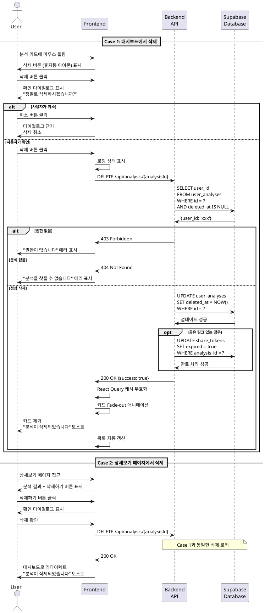

# UC-007: 사주 분석 삭제

## Primary Actor
- 인증된 사용자 (무료 또는 Pro 구독자)

## Precondition
- 사용자가 로그인된 상태
- 사용자가 1개 이상의 분석 내역을 보유
- 삭제하려는 분석이 사용자 본인 소유

## Trigger
- 사용자가 대시보드에서 분석 카드에 마우스를 올리고 삭제 버튼을 클릭
- 또는 분석 상세보기 페이지에서 삭제 버튼을 클릭

## Main Scenario

### Case 1: 대시보드에서 삭제
1. 사용자가 대시보드 페이지에서 분석 목록을 조회한다.
2. 사용자가 삭제하려는 분석 카드에 마우스를 올린다.
3. 시스템이 삭제 버튼(휴지통 아이콘)을 표시한다.
4. 사용자가 삭제 버튼을 클릭한다.
5. 시스템이 확인 다이얼로그를 표시한다.
   - "정말로 이 분석을 삭제하시겠습니까?"
   - 대상 이름 및 분석 종류 표시
   - "삭제된 분석은 복구할 수 없습니다" 경고
6. 사용자가 '삭제' 버튼을 클릭한다.
7. 시스템이 로딩 상태를 표시한다.
8. 시스템이 백엔드 API에 삭제 요청을 전송한다.
9. 백엔드가 해당 분석이 현재 사용자 소유인지 확인한다.
10. 백엔드가 Supabase에서 소프트 삭제를 수행한다.
    - `deleted_at` 타임스탬프 설정
11. 백엔드가 성공 응답을 반환한다.
12. 시스템이 React Query 캐시를 무효화한다.
13. 시스템이 목록에서 해당 카드를 부드럽게 제거한다 (Fade-out 애니메이션).
14. 시스템이 "분석이 삭제되었습니다" 토스트 메시지를 표시한다.
15. 목록이 자동으로 갱신된다.

### Case 2: 상세보기 페이지에서 삭제
1. 사용자가 분석 상세보기 페이지에서 하단의 '삭제하기' 버튼을 클릭한다.
2. 시스템이 확인 다이얼로그를 표시한다 (Case 1의 5번과 동일).
3. 사용자가 '삭제' 버튼을 클릭한다.
4. Case 1의 7~11번 동일하게 진행된다.
5. 시스템이 대시보드 페이지로 리다이렉트한다.
6. 시스템이 "분석이 삭제되었습니다" 토스트 메시지를 표시한다.

## Alternative Flow

### AF-1: 사용자가 삭제를 취소
1. 확인 다이얼로그에서 사용자가 '취소' 버튼을 클릭한다.
2. 시스템이 다이얼로그를 닫는다.
3. 삭제 프로세스가 중단된다.
4. 사용자는 이전 페이지를 유지한다.

### AF-2: 다이얼로그 외부 클릭으로 닫기
1. 사용자가 다이얼로그 외부 영역을 클릭한다.
2. 시스템이 다이얼로그를 닫는다.
3. 삭제 프로세스가 중단된다.

### AF-3: 마지막 분석 삭제
1. 사용자가 보유한 유일한 분석을 삭제한다.
2. Case 1 또는 Case 2와 동일하게 삭제가 진행된다.
3. 대시보드가 빈 상태로 변경된다.
4. 시스템이 "첫 분석하기" CTA 화면을 표시한다.

### AF-4: 공유된 분석 삭제
1. 사용자가 이미 공유 링크를 생성한 분석을 삭제한다.
2. 확인 다이얼로그에 추가 경고를 표시한다.
   - "이 분석은 공유 링크가 생성되어 있습니다"
   - "삭제 시 공유 링크도 만료됩니다"
3. 사용자가 확인하고 삭제를 진행한다.
4. Case 1 또는 Case 2와 동일하게 진행된다.
5. 관련 공유 토큰도 만료 처리된다.

## Exception Flow

### EF-1: 권한 없음 (다른 사용자의 분석 삭제 시도)
1. 사용자가 다른 사용자의 분석 ID로 삭제 요청을 전송한다 (비정상적인 경로).
2. 백엔드가 권한을 확인하여 403 에러를 반환한다.
3. 시스템이 "권한이 없습니다" 에러 메시지를 표시한다.
4. 목록이 새로고침되어 정상 상태로 복구된다.

### EF-2: 존재하지 않는 분석 삭제 시도
1. 사용자가 이미 삭제되었거나 존재하지 않는 분석 ID로 요청한다.
2. 백엔드가 404 에러를 반환한다.
3. 시스템이 "분석을 찾을 수 없습니다" 에러 메시지를 표시한다.
4. 목록이 새로고침되어 해당 카드가 제거된다.

### EF-3: 데이터베이스 삭제 실패
1. Supabase 소프트 삭제 중 오류가 발생한다.
2. 백엔드가 500 에러를 반환한다.
3. 시스템이 "삭제 중 오류가 발생했습니다" 에러 메시지를 표시한다.
4. 다이얼로그가 유지되어 사용자가 재시도할 수 있다.
5. 재시도 버튼을 제공한다.

### EF-4: 네트워크 오류
1. 삭제 요청 중 네트워크 오류가 발생한다.
2. 시스템이 "네트워크 연결을 확인해주세요" 에러 메시지를 표시한다.
3. 다이얼로그가 유지되어 사용자가 재시도할 수 있다.
4. React Query가 자동으로 재시도하지 않는다 (삭제는 재시도 위험).

### EF-5: 동시 삭제 시도
1. 사용자가 여러 탭에서 동일한 분석을 동시에 삭제 시도한다.
2. 첫 번째 요청이 성공하여 `deleted_at`이 설정된다.
3. 두 번째 요청이 404 에러를 반환한다 (이미 삭제됨).
4. 시스템이 "이미 삭제된 분석입니다" 메시지를 표시한다.
5. 목록이 자동으로 갱신된다.

## Postcondition

### Success
- 해당 분석이 Supabase에서 소프트 삭제된다 (`deleted_at` 설정).
- 대시보드 목록에서 해당 분석이 제거된다.
- React Query 캐시가 무효화되어 최신 상태를 반영한다.
- 상세보기 페이지에서 삭제한 경우 대시보드로 이동한다.

### Failure
- 분석이 삭제되지 않고 유지된다.
- 에러 메시지가 표시되어 사용자가 문제를 인지할 수 있다.
- 다이얼로그가 유지되어 재시도가 가능하다.

## Business Rules

### BR-1: 소프트 삭제 정책
- 분석 삭제는 소프트 삭제로 처리된다 (`deleted_at` 타임스탬프 설정).
- 소프트 삭제된 데이터는 30일간 보관 후 완전히 삭제된다.
- 관리자는 요청 시 30일 이내 복구할 수 있다.

### BR-2: 크레딧 복구 불가
- 분석을 삭제해도 사용한 크레딧은 복구되지 않는다.
- 삭제는 단순히 내역을 정리하는 목적이다.

### BR-3: 공유 링크 만료
- 삭제된 분석의 공유 링크는 즉시 만료된다.
- 공유 링크로 접근 시 "삭제된 분석입니다" 메시지를 표시한다.

### BR-4: 프로필 유지
- 분석을 삭제해도 관련 프로필은 유지된다.
- 프로필과 분석은 독립적으로 관리된다.

### BR-5: 삭제 확인 필수
- 실수로 인한 삭제를 방지하기 위해 확인 다이얼로그를 필수로 표시한다.
- "삭제된 분석은 복구할 수 없습니다" 경고를 명시한다.

### BR-6: 애니메이션
- 대시보드에서 삭제 시 Fade-out 애니메이션으로 부드럽게 제거한다.
- 애니메이션 시간은 300ms로 설정한다.

### BR-7: 일괄 삭제 미지원
- 현재 버전에서는 개별 삭제만 지원한다.
- 향후 체크박스를 통한 일괄 삭제 기능 추가 가능하다.

## Sequence Diagram

