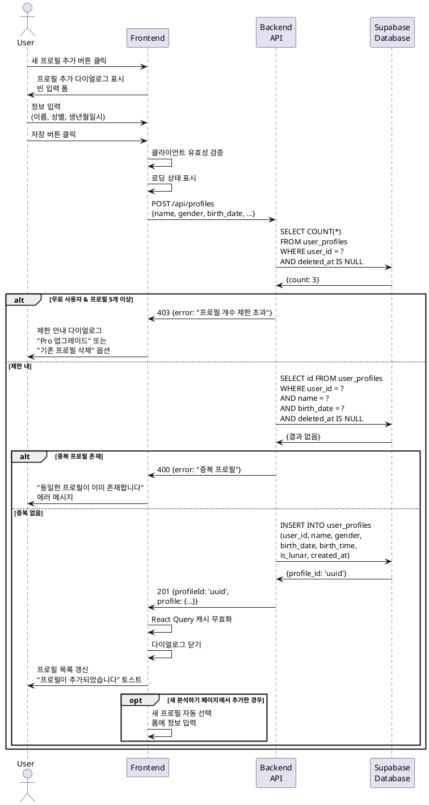

# UC-008: 대상 인물 프로필 추가

## Primary Actor
- 인증된 사용자 (무료 또는 Pro 구독자)

## Precondition
- 사용자가 로그인된 상태
- 무료 사용자: 프로필 5개 미만 보유
- Pro 사용자: 제한 없음

## Trigger
- 사용자가 새 분석하기 페이지의 '불러오기' 탭에서 '새 프로필 추가' 버튼 클릭
- 또는 프로필 관리 페이지에서 '프로필 추가' 버튼 클릭

## Main Scenario

1. 사용자가 '새 프로필 추가' 버튼을 클릭한다.
2. 시스템이 프로필 추가 다이얼로그를 표시한다.
3. 시스템이 빈 입력 폼을 표시한다.
   - 이름 (텍스트 필드)
   - 성별 (라디오 버튼: 남성/여성)
   - 생년월일 (날짜 선택기)
   - 음력/양력 선택 (토글 스위치)
   - 태어난 시간 (시간 선택 드롭다운, 선택사항)
4. 사용자가 필수 정보를 입력한다.
5. 사용자가 '저장' 버튼을 클릭한다.
6. 시스템이 클라이언트 측 유효성 검증을 수행한다.
7. 시스템이 로딩 상태를 표시한다.
8. 시스템이 백엔드 API에 프로필 생성 요청을 전송한다.
9. 백엔드가 사용자의 프로필 개수를 확인한다.
   - 무료: 5개 이하
   - Pro: 제한 없음
10. 백엔드가 중복 프로필을 확인한다 (같은 이름 + 생년월일).
11. 중복이 없으면 Supabase `user_profiles` 테이블에 레코드를 생성한다.
12. 백엔드가 생성된 프로필 ID를 반환한다.
13. 시스템이 다이얼로그를 닫는다.
14. 시스템이 React Query 캐시를 무효화한다.
15. 프로필 목록이 자동으로 갱신되어 새 프로필이 표시된다.
16. 시스템이 "프로필이 추가되었습니다" 토스트 메시지를 표시한다.

## Alternative Flow

### AF-1: 프로필 개수 제한 도달 (무료 사용자)
1. 무료 사용자가 이미 5개의 프로필을 보유하고 있다.
2. 사용자가 '새 프로필 추가' 버튼을 클릭한다.
3. 시스템이 제한 안내 다이얼로그를 표시한다.
   - "무료 플랜은 최대 5개의 프로필만 저장할 수 있습니다"
   - "Pro로 업그레이드하여 무제한 프로필을 이용하세요"
   - 'Pro 업그레이드' 버튼
   - '기존 프로필 삭제 후 추가' 버튼
4. 사용자가 'Pro 업그레이드'를 선택하면 구독 관리 페이지로 이동한다.
5. 또는 '기존 프로필 삭제'를 선택하면 프로필 목록으로 이동한다.

### AF-2: 중복 프로필 감지
1. 사용자가 이미 존재하는 이름과 생년월일을 입력한다.
2. 사용자가 '저장' 버튼을 클릭한다.
3. 백엔드가 중복을 감지한다.
4. 시스템이 "동일한 프로필이 이미 존재합니다" 에러 메시지를 표시한다.
5. 다이얼로그가 유지되어 사용자가 정보를 수정할 수 있다.
6. 사용자가 이름이나 생년월일을 변경하여 재시도한다.

### AF-3: 입력 유효성 검증 실패
1. 사용자가 필수 필드를 누락하거나 잘못된 형식으로 입력한다.
2. 시스템이 해당 필드 아래 에러 메시지를 표시한다.
   - "이름을 입력해주세요"
   - "올바른 날짜를 선택해주세요"
3. 사용자가 입력을 수정한다.
4. 유효성 검증을 통과하면 Main Scenario 8번부터 진행된다.

### AF-4: 프로필 추가 후 즉시 사용
1. 새 분석하기 페이지에서 프로필을 추가한다.
2. Main Scenario와 동일하게 프로필이 생성된다.
3. 시스템이 다이얼로그를 닫는다.
4. 프로필 목록이 갱신되어 새 프로필이 최상단에 표시된다.
5. 시스템이 자동으로 새 프로필을 선택하여 폼에 입력한다.
6. 사용자가 바로 분석 종류를 선택하고 분석을 시작할 수 있다.

## Exception Flow

### EF-1: 프로필 생성 API 실패
1. Supabase에 프로필 저장 중 오류가 발생한다.
2. 시스템이 "프로필 저장에 실패했습니다" 에러 메시지를 표시한다.
3. 다이얼로그가 유지되어 사용자가 재시도할 수 있다.
4. 재시도 버튼을 제공한다.

### EF-2: 네트워크 오류
1. API 호출 중 네트워크 오류가 발생한다.
2. 시스템이 "네트워크 연결을 확인해주세요" 에러 메시지를 표시한다.
3. 다이얼로그가 유지되어 사용자가 재시도할 수 있다.
4. React Query가 자동으로 3회까지 재시도한다.

### EF-3: 유효하지 않은 음력 날짜
1. 사용자가 유효하지 않은 음력 날짜를 입력한다 (예: 음력 1월 32일).
2. 백엔드가 음력-양력 변환 중 에러를 감지한다.
3. 시스템이 "유효하지 않은 음력 날짜입니다" 에러 메시지를 표시한다.
4. 다이얼로그가 유지되어 사용자가 수정할 수 있다.

### EF-4: 권한 확인 실패
1. 사용자 세션이 만료된 상태에서 프로필 추가를 시도한다.
2. 백엔드가 401 에러를 반환한다.
3. 시스템이 "세션이 만료되었습니다" 메시지를 표시한다.
4. 시스템이 자동으로 로그인 페이지로 리다이렉트한다.

## Postcondition

### Success
- 새 프로필이 Supabase `user_profiles` 테이블에 저장된다.
- 프로필 목록에 새 프로필이 추가되어 표시된다.
- 다음 분석 시 해당 프로필을 선택하여 빠르게 정보를 입력할 수 있다.

### Failure
- 프로필이 생성되지 않는다.
- 에러 메시지가 표시되어 사용자가 문제를 인지할 수 있다.
- 다이얼로그가 유지되어 재시도가 가능하다.

## Business Rules

### BR-1: 프로필 개수 제한
- 무료 사용자: 최대 5개의 프로필 저장 가능
- Pro 사용자: 무제한 프로필 저장 가능
- 제한 도달 시 기존 프로필 삭제 또는 Pro 업그레이드 필요

### BR-2: 중복 방지
- 동일한 이름과 생년월일을 가진 프로필은 중복 저장되지 않는다.
- 이름은 대소문자를 구분하지 않고 비교한다.
- 생년월일은 연월일까지만 비교하며, 시간은 고려하지 않는다.

### BR-3: 필수 필드
- 필수: 이름, 성별, 생년월일
- 선택: 태어난 시간
- 시간을 입력하지 않은 경우 null로 저장된다.

### BR-4: 음력/양력 변환
- 음력을 선택한 경우, 입력된 날짜를 음력으로 저장한다.
- 양력 변환은 분석 생성 시점에 수행한다.

### BR-5: 프로필 정렬
- 새로 추가된 프로필은 목록의 최상단에 표시된다.
- 이후 사용 빈도에 따라 `last_used_at`으로 정렬된다.

### BR-6: 프로필 용도
- 프로필은 자주 보는 사람(가족, 친구 등)의 정보를 저장하는 편의 기능이다.
- 본인의 정보도 프로필로 저장할 수 있다.

## Sequence Diagram

