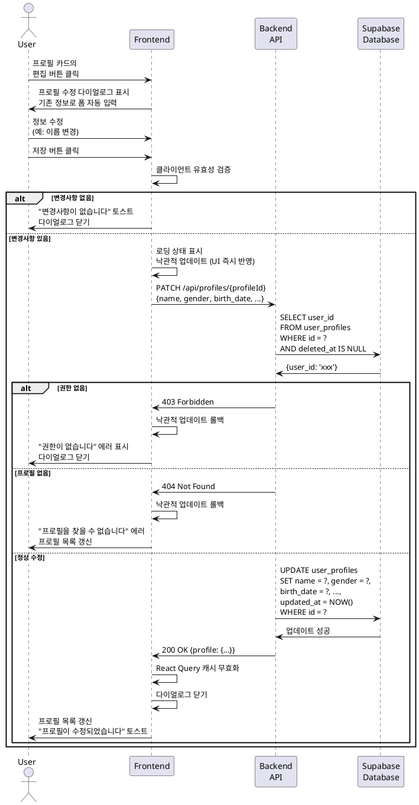

# UC-009: 대상 인물 프로필 수정

## Primary Actor
- 인증된 사용자 (무료 또는 Pro 구독자)

## Precondition
- 사용자가 로그인된 상태
- 사용자가 1개 이상의 프로필을 보유
- 수정하려는 프로필이 사용자 본인 소유

## Trigger
- 사용자가 프로필 목록 또는 프로필 관리 페이지에서 프로필 카드의 '편집' 버튼 클릭

## Main Scenario

1. 사용자가 프로필 카드의 '편집' 버튼을 클릭한다.
2. 시스템이 프로필 수정 다이얼로그를 표시한다.
3. 시스템이 기존 프로필 정보로 폼을 자동 입력한다.
   - 이름
   - 성별
   - 생년월일
   - 음력/양력
   - 태어난 시간
4. 사용자가 원하는 정보를 수정한다.
5. 사용자가 '저장' 버튼을 클릭한다.
6. 시스템이 클라이언트 측 유효성 검증을 수행한다.
7. 시스템이 로딩 상태를 표시한다.
8. 시스템이 백엔드 API에 프로필 업데이트 요청을 전송한다.
9. 백엔드가 해당 프로필이 현재 사용자 소유인지 확인한다.
10. 백엔드가 Supabase에서 프로필 정보를 업데이트한다.
    - `updated_at` 타임스탬프 자동 갱신
11. 백엔드가 업데이트된 프로필을 반환한다.
12. 시스템이 다이얼로그를 닫는다.
13. 시스템이 React Query 캐시를 무효화한다.
14. 프로필 목록이 자동으로 갱신되어 수정된 정보가 표시된다.
15. 시스템이 "프로필이 수정되었습니다" 토스트 메시지를 표시한다.

## Alternative Flow

### AF-1: 정보를 수정하지 않고 저장
1. 사용자가 다이얼로그를 열었으나 아무것도 수정하지 않는다.
2. 사용자가 '저장' 버튼을 클릭한다.
3. 시스템이 변경사항이 없음을 감지한다.
4. Main Scenario 8~11번을 건너뛴다.
5. 다이얼로그를 닫고 "변경사항이 없습니다" 토스트 메시지를 표시한다.

### AF-2: 수정 중 취소
1. 사용자가 정보를 수정하는 중이다.
2. 사용자가 '취소' 버튼을 클릭한다.
3. 시스템이 변경사항 확인 다이얼로그를 표시한다.
   - "변경사항이 저장되지 않습니다. 계속하시겠습니까?"
4. 사용자가 '확인'을 선택하면 다이얼로그가 닫힌다.
5. 사용자가 '취소'를 선택하면 수정 다이얼로그로 돌아간다.

### AF-3: 입력 유효성 검증 실패
1. 사용자가 필수 필드를 삭제하거나 잘못된 형식으로 수정한다.
2. 시스템이 해당 필드 아래 에러 메시지를 표시한다.
   - "이름을 입력해주세요"
   - "올바른 날짜를 선택해주세요"
3. 사용자가 입력을 수정한다.
4. 유효성 검증을 통과하면 Main Scenario 8번부터 진행된다.

### AF-4: 이름만 수정
1. 사용자가 프로필의 이름만 수정한다 (예: "엄마" → "어머니").
2. 생년월일 등 다른 정보는 그대로 유지된다.
3. Main Scenario와 동일하게 진행된다.
4. 해당 프로필로 생성된 기존 분석 내역의 이름도 업데이트된다 (선택적 정책).

## Exception Flow

### EF-1: 권한 없음 (다른 사용자의 프로필 수정 시도)
1. 사용자가 다른 사용자의 프로필 ID로 수정 요청을 전송한다 (비정상적인 경로).
2. 백엔드가 권한을 확인하여 403 에러를 반환한다.
3. 시스템이 "권한이 없습니다" 에러 메시지를 표시한다.
4. 다이얼로그가 닫힌다.
5. 프로필 목록이 새로고침되어 정상 상태로 복구된다.

### EF-2: 존재하지 않는 프로필 수정 시도
1. 사용자가 이미 삭제되었거나 존재하지 않는 프로필 ID로 요청한다.
2. 백엔드가 404 에러를 반환한다.
3. 시스템이 "프로필을 찾을 수 없습니다" 에러 메시지를 표시한다.
4. 다이얼로그가 닫힌다.
5. 프로필 목록이 새로고침되어 해당 프로필이 제거된다.

### EF-3: 데이터베이스 업데이트 실패
1. Supabase 프로필 업데이트 중 오류가 발생한다.
2. 백엔드가 500 에러를 반환한다.
3. 시스템이 "프로필 수정에 실패했습니다" 에러 메시지를 표시한다.
4. 다이얼로그가 유지되어 사용자가 재시도할 수 있다.
5. 재시도 버튼을 제공한다.

### EF-4: 네트워크 오류
1. API 호출 중 네트워크 오류가 발생한다.
2. 시스템이 "네트워크 연결을 확인해주세요" 에러 메시지를 표시한다.
3. 다이얼로그가 유지되어 사용자가 재시도할 수 있다.
4. React Query가 자동으로 3회까지 재시도한다.

### EF-5: 동시 수정 충돌
1. 사용자가 여러 탭에서 동일한 프로필을 수정한다.
2. 첫 번째 요청이 성공하여 `updated_at`이 변경된다.
3. 두 번째 요청이 도착하여 다시 업데이트된다.
4. 마지막 요청의 내용으로 덮어씌워진다 (Last Write Wins).
5. 낙관적 업데이트로 인한 불일치는 자동 갱신으로 해결된다.

## Postcondition

### Success
- 프로필 정보가 Supabase에서 업데이트된다.
- `updated_at` 타임스탬프가 현재 시간으로 갱신된다.
- 프로필 목록에 수정된 정보가 반영된다.
- React Query 캐시가 무효화되어 최신 상태를 반영한다.

### Failure
- 프로필이 수정되지 않고 원래 상태를 유지한다.
- 에러 메시지가 표시되어 사용자가 문제를 인지할 수 있다.
- 다이얼로그가 유지되어 재시도가 가능하다.

## Business Rules

### BR-1: 수정 가능 필드
- 모든 필드 수정 가능: 이름, 성별, 생년월일, 음력/양력, 태어난 시간
- `created_at`은 수정되지 않고 유지된다.

### BR-2: 기존 분석 내역 영향
- 프로필 수정이 기존 분석 내역에 영향을 주지 않는다.
- 분석 생성 시점의 정보가 독립적으로 저장되어 있다.
- 단, 프로필 ID로 연결된 경우 관련 분석에서 최신 이름을 표시할 수 있다 (선택적 정책).

### BR-3: 중복 확인 제외
- 프로필 수정 시에는 중복 확인을 하지 않는다.
- 동일한 이름과 생년월일로 수정해도 허용된다 (본인 프로필 수정이므로).

### BR-4: 변경 이력 미저장
- 프로필 수정 이력은 별도로 저장하지 않는다.
- `updated_at`으로 마지막 수정 시간만 추적한다.

### BR-5: 낙관적 업데이트
- 클라이언트는 낙관적 업데이트를 수행하여 즉각적인 UI 반응을 제공한다.
- 백엔드 응답이 실패하면 롤백하여 이전 상태로 복구한다.

## Sequence Diagram

