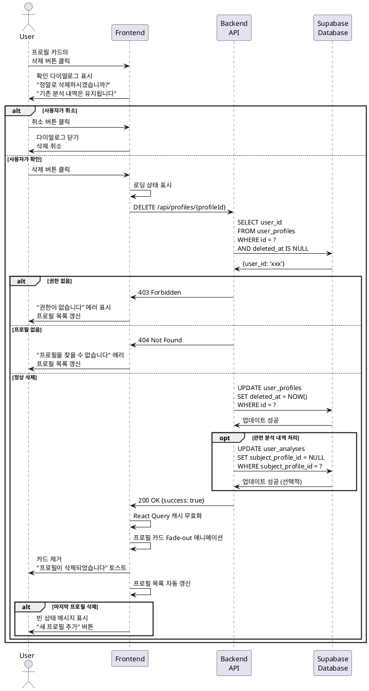

# UC-010: 대상 인물 프로필 삭제

## Primary Actor
- 인증된 사용자 (무료 또는 Pro 구독자)

## Precondition
- 사용자가 로그인된 상태
- 사용자가 1개 이상의 프로필을 보유
- 삭제하려는 프로필이 사용자 본인 소유

## Trigger
- 사용자가 프로필 목록 또는 프로필 관리 페이지에서 프로필 카드의 '삭제' 버튼 클릭

## Main Scenario

1. 사용자가 프로필 카드의 '삭제' 버튼을 클릭한다.
2. 시스템이 확인 다이얼로그를 표시한다.
   - "정말로 이 프로필을 삭제하시겠습니까?"
   - 프로필 이름 및 생년월일 표시
   - "기존 분석 내역은 유지됩니다" 안내
3. 사용자가 '삭제' 버튼을 클릭한다.
4. 시스템이 로딩 상태를 표시한다.
5. 시스템이 백엔드 API에 삭제 요청을 전송한다.
6. 백엔드가 해당 프로필이 현재 사용자 소유인지 확인한다.
7. 백엔드가 Supabase에서 소프트 삭제를 수행한다.
   - `deleted_at` 타임스탬프 설정
8. 백엔드가 성공 응답을 반환한다.
9. 시스템이 React Query 캐시를 무효화한다.
10. 프로필 목록에서 해당 카드가 부드럽게 제거된다 (Fade-out 애니메이션).
11. 시스템이 "프로필이 삭제되었습니다" 토스트 메시지를 표시한다.
12. 목록이 자동으로 갱신된다.

## Alternative Flow

### AF-1: 사용자가 삭제를 취소
1. 확인 다이얼로그에서 사용자가 '취소' 버튼을 클릭한다.
2. 시스템이 다이얼로그를 닫는다.
3. 삭제 프로세스가 중단된다.
4. 사용자는 프로필 목록을 유지한다.

### AF-2: 다이얼로그 외부 클릭으로 닫기
1. 사용자가 다이얼로그 외부 영역을 클릭한다.
2. 시스템이 다이얼로그를 닫는다.
3. 삭제 프로세스가 중단된다.

### AF-3: 마지막 프로필 삭제
1. 사용자가 보유한 유일한 프로필을 삭제한다.
2. Main Scenario와 동일하게 삭제가 진행된다.
3. 프로필 목록이 빈 상태로 변경된다.
4. 시스템이 빈 상태 메시지를 표시한다.
   - "저장된 프로필이 없습니다"
   - "새 프로필 추가" 버튼

### AF-4: 사용 중인 프로필 삭제
1. 사용자가 분석 내역에서 사용된 프로필을 삭제한다.
2. 확인 다이얼로그에 추가 안내를 표시한다.
   - "이 프로필은 N개의 분석에서 사용되었습니다"
   - "삭제해도 기존 분석 내역은 유지됩니다"
3. 사용자가 확인하고 삭제를 진행한다.
4. Main Scenario 5번부터 동일하게 진행된다.
5. 기존 분석 내역의 `subject_profile_id`는 NULL로 설정되거나 유지된다 (정책에 따라).

## Exception Flow

### EF-1: 권한 없음 (다른 사용자의 프로필 삭제 시도)
1. 사용자가 다른 사용자의 프로필 ID로 삭제 요청을 전송한다 (비정상적인 경로).
2. 백엔드가 권한을 확인하여 403 에러를 반환한다.
3. 시스템이 "권한이 없습니다" 에러 메시지를 표시한다.
4. 프로필 목록이 새로고침되어 정상 상태로 복구된다.

### EF-2: 존재하지 않는 프로필 삭제 시도
1. 사용자가 이미 삭제되었거나 존재하지 않는 프로필 ID로 요청한다.
2. 백엔드가 404 에러를 반환한다.
3. 시스템이 "프로필을 찾을 수 없습니다" 에러 메시지를 표시한다.
4. 프로필 목록이 새로고침되어 해당 프로필이 제거된다.

### EF-3: 데이터베이스 삭제 실패
1. Supabase 소프트 삭제 중 오류가 발생한다.
2. 백엔드가 500 에러를 반환한다.
3. 시스템이 "프로필 삭제에 실패했습니다" 에러 메시지를 표시한다.
4. 다이얼로그가 유지되어 사용자가 재시도할 수 있다.
5. 재시도 버튼을 제공한다.

### EF-4: 네트워크 오류
1. 삭제 요청 중 네트워크 오류가 발생한다.
2. 시스템이 "네트워크 연결을 확인해주세요" 에러 메시지를 표시한다.
3. 다이얼로그가 유지되어 사용자가 재시도할 수 있다.
4. React Query가 자동으로 재시도하지 않는다 (삭제는 재시도 위험).

### EF-5: 동시 삭제 시도
1. 사용자가 여러 탭에서 동일한 프로필을 동시에 삭제 시도한다.
2. 첫 번째 요청이 성공하여 `deleted_at`이 설정된다.
3. 두 번째 요청이 404 에러를 반환한다 (이미 삭제됨).
4. 시스템이 "이미 삭제된 프로필입니다" 메시지를 표시한다.
5. 프로필 목록이 자동으로 갱신된다.

## Postcondition

### Success
- 해당 프로필이 Supabase에서 소프트 삭제된다 (`deleted_at` 설정).
- 프로필 목록에서 해당 프로필이 제거된다.
- React Query 캐시가 무효화되어 최신 상태를 반영한다.
- 기존 분석 내역은 유지된다.

### Failure
- 프로필이 삭제되지 않고 유지된다.
- 에러 메시지가 표시되어 사용자가 문제를 인지할 수 있다.
- 다이얼로그가 유지되어 재시도가 가능하다.

## Business Rules

### BR-1: 소프트 삭제 정책
- 프로필 삭제는 소프트 삭제로 처리된다 (`deleted_at` 타임스탬프 설정).
- 소프트 삭제된 데이터는 30일간 보관 후 완전히 삭제된다.
- 관리자는 요청 시 30일 이내 복구할 수 있다.

### BR-2: 분석 내역 유지
- 프로필을 삭제해도 해당 프로필로 생성된 분석 내역은 유지된다.
- 분석 생성 시점의 정보가 독립적으로 저장되어 있다.
- `subject_profile_id`는 NULL로 설정되거나 참조만 끊어진다.

### BR-3: 삭제 확인 필수
- 실수로 인한 삭제를 방지하기 위해 확인 다이얼로그를 필수로 표시한다.
- "기존 분석 내역은 유지됩니다" 안내를 명시한다.

### BR-4: 삭제 후 복구 불가 (사용자 입장)
- 사용자는 직접 삭제한 프로필을 복구할 수 없다.
- 관리자 문의를 통해서만 복구 가능하다.

### BR-5: 애니메이션
- 프로필 삭제 시 Fade-out 애니메이션으로 부드럽게 제거한다.
- 애니메이션 시간은 300ms로 설정한다.

### BR-6: 일괄 삭제 미지원
- 현재 버전에서는 개별 삭제만 지원한다.
- 향후 체크박스를 통한 일괄 삭제 기능 추가 가능하다.

### BR-7: 삭제 사유 미수집
- 프로필 삭제 시 사유를 수집하지 않는다.
- 단순히 더 이상 사용하지 않는 프로필을 정리하는 목적이다.

## Sequence Diagram

