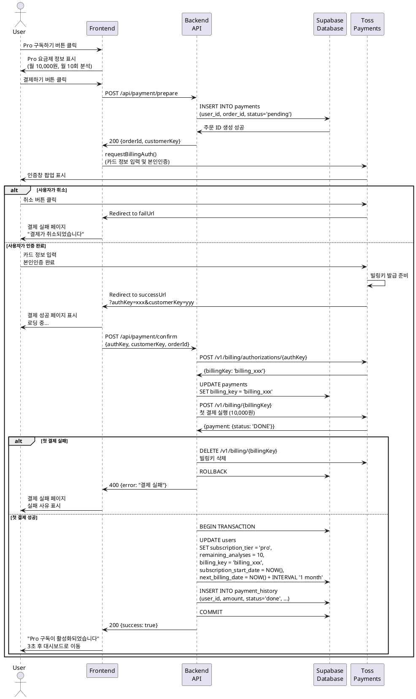

# UC-011: Pro 구독 결제 (토스페이먼츠)

## Primary Actor
- 인증된 무료 사용자

## Precondition
- 사용자가 로그인된 상태
- 사용자의 현재 구독 상태가 'free'
- 사용자가 유효한 결제 수단(카드)을 보유

## Trigger
- 사용자가 구독 관리 페이지에서 'Pro 구독하기' 버튼 클릭
- 또는 무료 횟수 소진 후 안내 다이얼로그에서 '구독하기' 버튼 클릭

## Main Scenario

1. 사용자가 'Pro 구독하기' 버튼을 클릭한다.
2. 시스템이 구독 페이지로 이동하거나 결제 모달을 표시한다.
3. 시스템이 Pro 요금제 정보를 표시한다.
   - 월 요금: ₩10,000 (예시)
   - 월 10회 분석 제공
   - gemini-2.5-pro 모델 사용
   - 무제한 프로필 저장
4. 사용자가 '결제하기' 버튼을 클릭한다.
5. 시스템이 결제 준비 API를 호출한다.
6. 백엔드가 주문 ID를 생성하고 Supabase에 임시 저장한다.
7. 백엔드가 결제 준비 정보를 반환한다.
8. 시스템이 토스페이먼츠 SDK를 초기화한다.
9. 시스템이 빌링키 발급을 위한 인증창을 호출한다.
   ```javascript
   tossPayments.requestBillingAuth({
     method: '카드',
     customerKey: userId,
     successUrl: `${baseUrl}/payments/success`,
     failUrl: `${baseUrl}/payments/fail`
   })
   ```
10. 토스페이먼츠 인증창이 팝업으로 표시된다.
11. 사용자가 카드 정보를 입력하고 본인인증을 완료한다.
12. 토스페이먼츠가 빌링키를 발급하고 successUrl로 리다이렉트한다.
13. 시스템이 결제 성공 페이지로 이동한다.
14. 시스템이 결제 확인 API를 호출한다.
    - `authKey`, `customerKey`, `orderId` 전달
15. 백엔드가 토스페이먼츠 빌링키 발급 API를 호출한다.
16. 백엔드가 발급된 빌링키를 저장한다.
17. 백엔드가 첫 결제를 실행한다 (빌링키 사용).
18. 결제 성공 시 백엔드가 Supabase를 업데이트한다.
    - `subscription_tier`: 'pro'
    - `remaining_analyses`: 10
    - `billing_key`: 발급된 빌링키
    - `subscription_start_date`: 현재 시간
    - `next_billing_date`: 1개월 후
19. 백엔드가 `payment_history` 테이블에 결제 내역을 저장한다.
20. 백엔드가 Supabase Cron에 다음 결제일 자동 결제를 등록한다.
21. 백엔드가 성공 응답을 반환한다.
22. 시스템이 "Pro 구독이 활성화되었습니다" 메시지를 표시한다.
23. 시스템이 3초 후 대시보드로 자동 리다이렉트한다.
24. 대시보드에서 Pro 사용자 배지가 표시된다.

## Alternative Flow

### AF-1: 이미 Pro 구독자
1. Pro 구독자가 구독 페이지에 접근한다.
2. 시스템이 'Pro 구독하기' 버튼 대신 현재 구독 정보를 표시한다.
3. '구독 취소' 버튼이 표시된다.

### AF-2: 결제창 팝업 차단
1. 사용자 브라우저가 팝업을 차단한다.
2. 시스템이 "팝업이 차단되었습니다" 안내를 표시한다.
3. 시스템이 팝업 허용 방법을 안내한다.
4. 사용자가 팝업을 허용하고 재시도한다.

### AF-3: 사용자가 인증창에서 취소
1. 사용자가 토스페이먼츠 인증창에서 '취소' 버튼을 클릭한다.
2. 토스페이먼츠가 failUrl로 리다이렉트한다.
3. 시스템이 결제 실패 페이지를 표시한다.
4. 시스템이 "결제가 취소되었습니다" 메시지를 표시한다.
5. '다시 시도' 버튼으로 구독 페이지로 복귀할 수 있다.

## Exception Flow

### EF-1: 빌링키 발급 성공, 첫 결제 실패
1. 빌링키는 발급되었으나 첫 결제가 실패한다 (한도 초과 등).
2. 백엔드가 발급된 빌링키를 삭제한다.
3. 트랜잭션을 롤백한다.
4. 시스템이 결제 실패 페이지를 표시한다.
5. 실패 사유를 표시한다 (예: "카드 한도 초과").
6. '다른 카드로 결제' 버튼을 제공한다.

### EF-2: 결제 확인 타임아웃
1. 사용자가 인증을 완료했으나 successUrl 리다이렉트가 지연된다.
2. 10분 이상 경과하여 토스페이먼츠 승인 가능 시간이 초과된다.
3. 백엔드가 빌링키 발급을 시도하지만 실패한다.
4. 시스템이 "결제 처리 시간이 초과되었습니다" 에러 메시지를 표시한다.
5. "처음부터 다시 시도해주세요" 안내를 제공한다.

### EF-3: 중복 결제 방지
1. 사용자가 여러 탭에서 동시에 결제를 시작한다.
2. 첫 번째 요청이 성공하여 빌링키가 발급된다.
3. 두 번째 요청이 도착하지만 이미 Pro 구독자임을 확인한다.
4. 시스템이 "이미 구독이 활성화되어 있습니다" 메시지를 표시한다.
5. 대시보드로 리다이렉트한다.

### EF-4: 네트워크 오류
1. 결제 확인 API 호출 중 네트워크 오류가 발생한다.
2. 시스템이 "네트워크 연결을 확인해주세요" 에러 메시지를 표시한다.
3. 재시도 버튼을 제공한다.
4. 토스페이먼츠 Webhook이 비동기로 처리하여 누락을 방지한다.

### EF-5: Webhook 보완 처리
1. 결제 확인 API 호출이 실패했으나 실제로는 결제가 성공했다.
2. 토스페이먼츠가 Webhook으로 결제 성공 이벤트를 전송한다.
3. 백엔드가 Webhook을 수신하고 구독 상태를 업데이트한다.
4. 사용자가 다음 로그인 시 Pro 구독이 활성화되어 있다.

## Postcondition

### Success
- 사용자의 구독 상태가 'pro'로 변경된다.
- 빌링키가 Supabase에 안전하게 저장된다.
- 월 10회 분석 크레딧이 부여된다.
- 다음 결제일이 1개월 후로 설정된다.
- 첫 결제 내역이 `payment_history`에 저장된다.
- 정기 결제가 Supabase Cron에 등록된다.

### Failure
- 사용자는 무료 플랜을 유지한다.
- 빌링키가 발급되지 않거나 삭제된다.
- 에러 메시지가 표시되어 사용자가 문제를 인지할 수 있다.
- 재시도 옵션이 제공된다.

## Business Rules

### BR-1: 결제 금액
- Pro 요금제: 월 ₩10,000 (VAT 포함)
- 첫 결제 시 즉시 과금되며 월간 구독이 시작된다.

### BR-2: 빌링키 발급
- 빌링키는 토스페이먼츠가 발급하는 자동결제 토큰이다.
- 빌링키로 매월 자동 결제가 진행된다.
- 빌링키는 암호화하여 Supabase에 저장한다.

### BR-3: 결제 승인 시간 제한
- 토스페이먼츠는 successUrl 리다이렉트 후 10분 이내 승인 필수.
- 10분 초과 시 결제가 자동으로 취소된다.

### BR-4: 크레딧 부여 시점
- 첫 결제 성공 시 즉시 10회 크레딧이 부여된다.
- 무료 플랜에서 사용하지 않은 크레딧은 소멸된다.

### BR-5: 구독 시작일
- 구독 시작일은 첫 결제 성공 시점이다.
- 다음 결제일은 구독 시작일 + 1개월이다.

### BR-6: 환불 정책
- 구독 중도 해지 시 즉시 환불되지 않는다.
- 다음 결제일까지 Pro 혜택이 유지된다.

## Sequence Diagram


