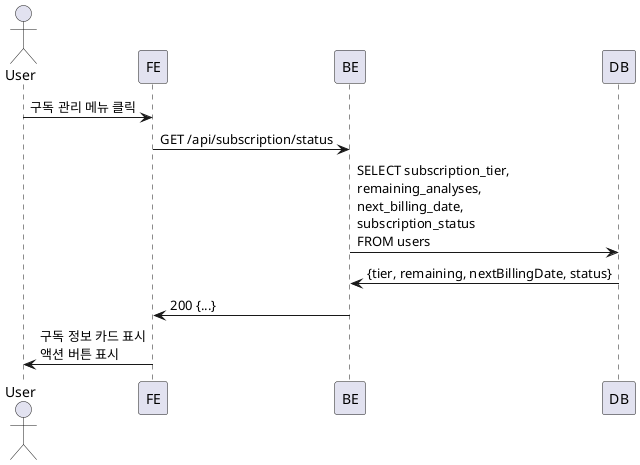

# UC-012: 구독 상태 조회

## Primary Actor
- 인증된 사용자 (무료 또는 Pro 구독자)

## Precondition
- 사용자가 로그인된 상태

## Trigger
- 사용자가 헤더 메뉴에서 '구독 관리' 클릭

## Main Scenario

1. 사용자가 '구독 관리' 메뉴를 클릭한다.
2. 시스템이 구독 관리 페이지로 이동한다.
3. 시스템이 구독 상태 조회 API를 호출한다.
4. 백엔드가 Supabase에서 사용자의 구독 정보를 조회한다.
5. 백엔드가 현재 구독 상태, 잔여 횟수, 다음 결제일을 반환한다.
6. 시스템이 현재 구독 정보 카드를 표시한다.
   - 구독 상태 배지 (무료/Pro/취소 예정)
   - 월간 분석 제공 횟수 및 잔여 횟수 (프로그레스 바)
   - 다음 결제일 (Pro인 경우)
   - 사용 중인 AI 모델 정보
7. 시스템이 요금제 비교표를 표시한다.
8. 상태별 액션 버튼을 표시한다.
   - 무료: 'Pro 구독하기'
   - Pro: '구독 취소하기'
   - 취소 예정: '구독 재활성화'

## Business Rules

- **BR-1**: 구독 상태는 실시간으로 조회된다.
- **BR-2**: 잔여 횟수는 서버에서 조회하여 정확성을 보장한다.
- **BR-3**: 캐싱 시간은 1분으로 설정하여 최신 정보를 유지한다.

## Sequence Diagram

