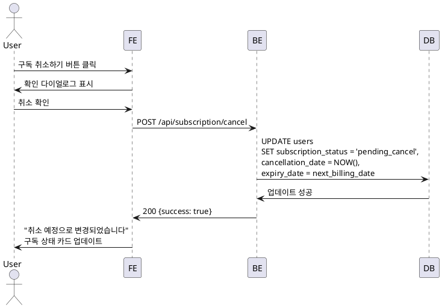

# UC-013: 구독 취소

## Primary Actor
- Pro 구독자

## Precondition
- 사용자가 로그인된 상태
- 사용자의 구독 상태가 'pro' (활성)

## Trigger
- 사용자가 구독 관리 페이지에서 '구독 취소하기' 버튼 클릭

## Main Scenario

1. 사용자가 '구독 취소하기' 버튼을 클릭한다.
2. 시스템이 취소 확인 다이얼로그를 표시한다.
   - "다음 결제일까지 Pro 혜택이 유지됩니다"
   - "취소 후 언제든 재활성화 가능합니다"
   - 크레딧 이월 불가 안내
3. 사용자가 '취소' 버튼을 클릭한다.
4. 시스템이 구독 취소 API를 호출한다.
5. 백엔드가 구독 상태를 'pending_cancel'로 업데이트한다.
6. 백엔드가 만료 예정일을 설정한다 (현재 `next_billing_date`).
7. 백엔드가 Supabase Cron에서 자동 결제 스케줄을 제거한다.
8. 빌링키는 유지한다 (재활성화 대비).
9. 시스템이 "구독이 취소 예정으로 변경되었습니다" 메시지를 표시한다.
10. 시스템이 구독 상태 카드를 업데이트한다 (취소 예정 표시).
11. '구독 재활성화' 버튼이 활성화된다.

## Business Rules

- **BR-1**: 취소 즉시 구독이 만료되지 않고, 다음 결제일까지 Pro 혜택 유지.
- **BR-2**: 빌링키는 유지하여 재활성화 시 재사용.
- **BR-3**: 만료 예정일에 Supabase Cron이 구독을 완전히 종료.

## Sequence Diagram

