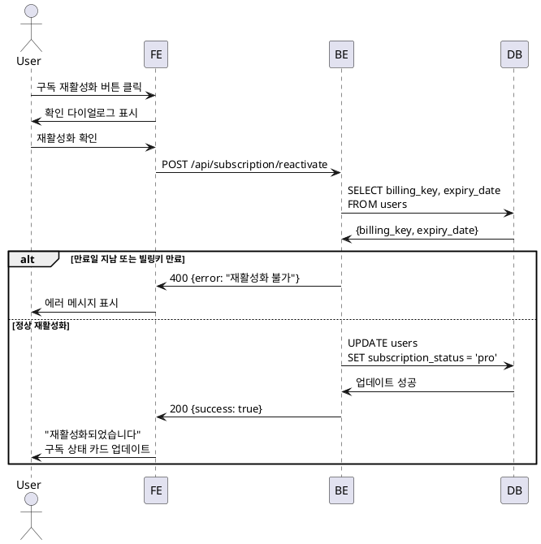

# UC-014: 구독 재활성화

## Primary Actor
- 취소 예정 상태의 Pro 구독자

## Precondition
- 사용자가 로그인된 상태
- 사용자의 구독 상태가 'pending_cancel'
- 아직 만료 예정일이 지나지 않음

## Trigger
- 사용자가 구독 관리 페이지에서 '구독 재활성화' 버튼 클릭

## Main Scenario

1. 사용자가 '구독 재활성화' 버튼을 클릭한다.
2. 시스템이 재활성화 확인 다이얼로그를 표시한다.
   - "구독이 재활성화되어 다음 결제일에 자동 결제됩니다"
3. 사용자가 '재활성화' 버튼을 클릭한다.
4. 시스템이 구독 재활성화 API를 호출한다.
5. 백엔드가 구독 상태를 'pro'로 복원한다.
6. 백엔드가 Supabase Cron에 자동 결제 스케줄을 재등록한다.
7. 백엔드가 빌링키 유효성을 확인한다.
8. 시스템이 "구독이 재활성화되었습니다" 메시지를 표시한다.
9. 시스템이 구독 상태 카드를 업데이트한다 (Pro 활성 상태).
10. '구독 취소하기' 버튼이 활성화된다.

## Alternative Flow

### AF-1: 빌링키 만료
1. 빌링키 유효성 확인 중 만료됨을 감지한다.
2. 시스템이 "결제 정보가 만료되었습니다" 에러 메시지를 표시한다.
3. 재결제 플로우로 안내한다.

## Business Rules

- **BR-1**: 재활성화는 만료 예정일 이전에만 가능.
- **BR-2**: 빌링키가 유효해야 재활성화 가능.
- **BR-3**: 재활성화 시 기존 다음 결제일 유지.

## Sequence Diagram

