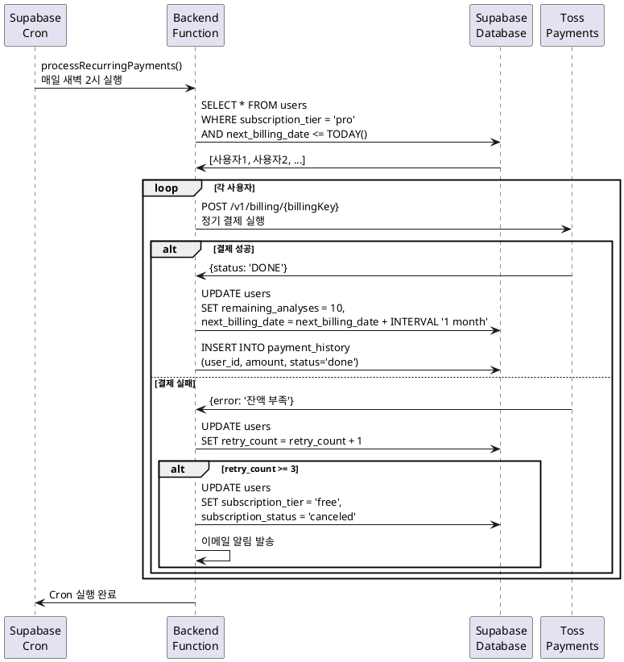

# UC-015: 정기 결제 처리 (Supabase Cron)

## Primary Actor
- Supabase Cron (자동화 시스템)

## Precondition
- Supabase Cron이 정상 작동 중
- Pro 구독자의 다음 결제일이 오늘

## Trigger
- Supabase Cron이 매일 특정 시간(예: 새벽 2시)에 실행

## Main Scenario

1. Supabase Cron이 `processRecurringPayments()` 함수를 실행한다.
2. 시스템이 다음 결제일이 오늘이고 구독 상태가 'pro'인 사용자 목록을 조회한다.
3. 각 사용자에 대해 순차적으로 처리한다.
4. 시스템이 저장된 빌링키로 토스페이먼츠 결제 API를 호출한다.
5. 결제가 성공한다.
6. 시스템이 Supabase를 업데이트한다.
   - `remaining_analyses`: 10으로 리셋
   - `next_billing_date`: 1개월 후로 업데이트
7. 시스템이 `payment_history` 테이블에 결제 내역을 추가한다.
8. 시스템이 Cron 실행 로그를 기록한다.
9. 다음 사용자로 이동하여 반복한다.

## Alternative Flow

### AF-1: 결제 실패 및 재시도
1. 결제가 실패한다 (잔액 부족, 한도 초과 등).
2. 시스템이 실패 로그를 기록한다.
3. 시스템이 `retry_count`를 1 증가시킨다.
4. 다음 날 재시도한다 (최대 3회).
5. 3회 모두 실패 시 구독을 취소하고 이메일 알림을 발송한다.

### AF-2: 취소 예정 구독자 처리
1. `subscription_status`가 'pending_cancel'이고 만료 예정일이 오늘인 사용자를 조회한다.
2. 시스템이 빌링키를 삭제한다 (`DELETE /v1/billing/{billingKey}`).
3. 시스템이 Supabase를 업데이트한다.
   - `subscription_tier`: 'free'
   - `remaining_analyses`: 3
   - `billing_key`: null
   - `subscription_end_date`: 현재 시간
4. 시스템이 이메일 알림을 발송한다 (선택).

## Exception Flow

### EF-1: 빌링키 만료
1. 결제 시도 중 빌링키 만료 에러가 발생한다.
2. 시스템이 구독을 취소 처리한다.
3. 사용자에게 이메일 알림을 발송한다 ("결제 수단 만료").

### EF-2: Cron 실행 실패
1. Supabase Cron이 실행되지 않는다.
2. 다음 실행 시 누락된 결제를 재처리한다 (date < today).
3. 관리자에게 알림을 전송한다.

## Business Rules

- **BR-1**: Cron은 매일 특정 시간에 실행 (예: 새벽 2시).
- **BR-2**: 결제 실패 시 최대 3회 재시도 (하루 간격).
- **BR-3**: 3회 실패 시 자동으로 구독 취소.
- **BR-4**: 빌링키 만료 시 즉시 구독 취소.

## Sequence Diagram

