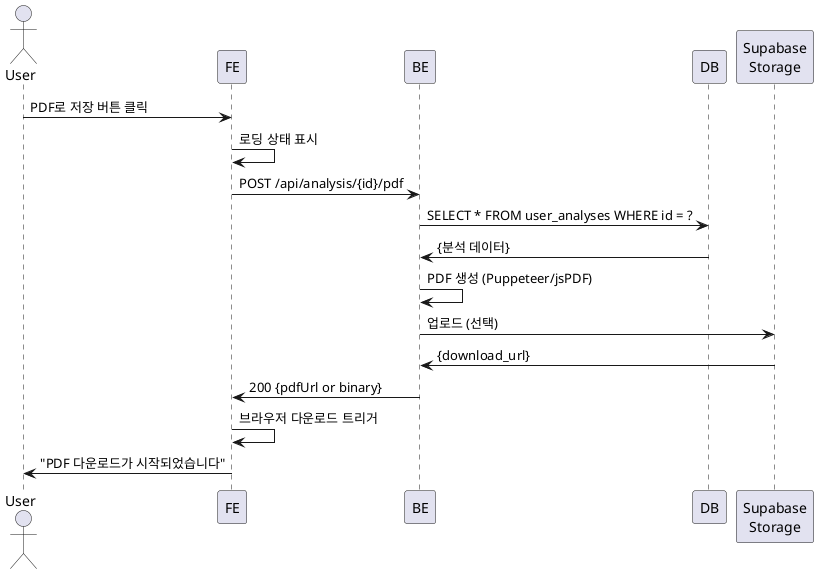

# UC-016: PDF 다운로드

## Primary Actor
- 인증된 사용자

## Precondition
- 사용자가 로그인된 상태
- 분석 상세보기 페이지에 접근

## Trigger
- 사용자가 분석 상세보기 페이지에서 'PDF로 저장' 버튼 클릭

## Main Scenario

1. 사용자가 'PDF로 저장' 버튼을 클릭한다.
2. 시스템이 로딩 상태를 표시한다 ("PDF 생성 중...").
3. 시스템이 PDF 생성 API를 호출한다.
4. 백엔드가 해당 분석이 현재 사용자 소유인지 확인한다.
5. 백엔드가 분석 데이터를 조회한다.
6. 백엔드가 PDF 생성 라이브러리(Puppeteer 또는 jsPDF)를 사용한다.
7. 백엔드가 분석 상세보기 페이지와 동일한 레이아웃으로 PDF를 렌더링한다.
   - 헤더 정보 (이름, 생년월일, 분석 종류)
   - 5개 결과 카드 (이모지 포함)
8. 백엔드가 생성된 PDF를 Supabase Storage에 업로드한다 (선택).
9. 백엔드가 PDF 바이너리 또는 다운로드 URL을 반환한다.
10. 클라이언트가 브라우저 다운로드를 트리거한다.
11. 파일명: `사주분석_[이름]_[날짜].pdf`
12. 시스템이 "PDF 다운로드가 시작되었습니다" 토스트 메시지를 표시한다.

## Alternative Flow

### AF-1: 이미 생성된 PDF 재사용
1. 백엔드가 Supabase Storage에서 기존 PDF를 확인한다.
2. 이미 생성된 PDF가 있는 경우 재사용한다.
3. 다운로드 URL을 즉시 반환한다.

## Exception Flow

### EF-1: PDF 생성 타임아웃
1. PDF 생성이 30초 이상 소요된다.
2. 시스템이 타임아웃 에러를 감지한다.
3. "PDF 생성 시간이 초과되었습니다" 에러 메시지를 표시한다.
4. 재시도 버튼을 제공한다.

## Business Rules

- **BR-1**: PDF는 분석 상세보기 페이지와 동일한 디자인.
- **BR-2**: PDF 파일명은 "사주분석_이름_YYYYMMDD.pdf" 형식.
- **BR-3**: PDF는 Supabase Storage에 7일간 캐싱 (선택).

## Sequence Diagram

