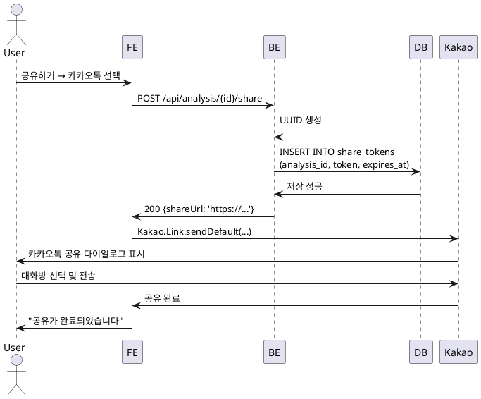

# UC-017: 카카오톡 공유

## Primary Actor
- 인증된 사용자

## Precondition
- 사용자가 로그인된 상태
- 분석 상세보기 페이지에 접근
- 카카오 SDK가 초기화됨

## Trigger
- 사용자가 분석 상세보기 페이지에서 '공유하기' 버튼 클릭 후 '카카오톡으로 공유' 선택

## Main Scenario

1. 사용자가 '공유하기' 버튼을 클릭한다.
2. 시스템이 공유 옵션 다이얼로그를 표시한다.
   - 카카오톡으로 공유
   - 링크 복사
3. 사용자가 '카카오톡으로 공유'를 선택한다.
4. 시스템이 공유 링크 생성 API를 호출한다.
5. 백엔드가 공개 공유 토큰을 생성한다 (UUID).
6. 백엔드가 Supabase에 공유 토큰을 저장한다 (만료 시간: 7일).
7. 백엔드가 공유 URL을 반환한다: `https://domain.com/share/{shareToken}`
8. 시스템이 카카오 SDK를 통해 카카오톡 공유를 호출한다.
   ```javascript
   Kakao.Link.sendDefault({
     objectType: 'feed',
     content: {
       title: '[이름]님의 사주 분석 결과',
       description: '운명의 해석을 확인해보세요',
       imageUrl: 'https://domain.com/og-image.png',
       link: {
         mobileWebUrl: shareUrl,
         webUrl: shareUrl
       }
     }
   })
   ```
9. 카카오톡 공유 다이얼로그가 표시된다.
10. 사용자가 대화방을 선택하고 전송한다.
11. 시스템이 "공유가 완료되었습니다" 토스트 메시지를 표시한다.

## Exception Flow

### EF-1: 카카오톡 미설치 (모바일)
1. 카카오톡이 설치되지 않은 기기에서 공유를 시도한다.
2. 시스템이 "카카오톡이 설치되지 않았습니다" 안내를 표시한다.
3. '링크 복사' 옵션으로 대체 안내한다.

### EF-2: SDK 초기화 실패
1. 카카오 SDK 초기화가 실패한다.
2. 에러 메시지를 표시한다.
3. '링크 복사'로 대체 안내한다.

## Business Rules

- **BR-1**: 공유 링크는 생성 후 7일간 유효.
- **BR-2**: 공유 링크는 로그인 없이 접근 가능 (읽기 전용).
- **BR-3**: 공유 토큰은 UUID로 생성하여 추측 불가능하게 함.

## Sequence Diagram


