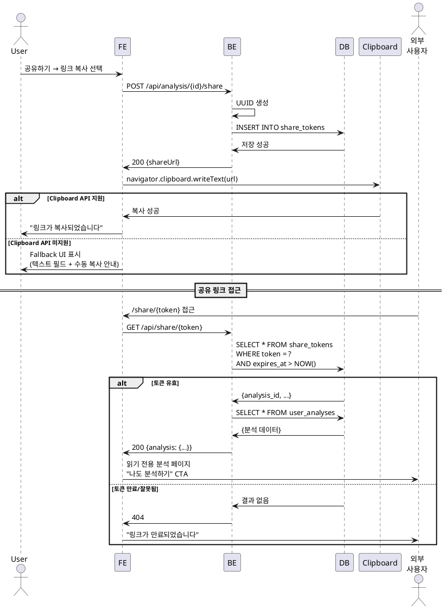

# UC-018: 링크 복사 및 공유

## Primary Actor
- 인증된 사용자

## Precondition
- 사용자가 로그인된 상태
- 분석 상세보기 페이지에 접근

## Trigger
- 사용자가 분석 상세보기 페이지에서 '공유하기' 버튼 클릭 후 '링크 복사' 선택

## Main Scenario

1. 사용자가 '공유하기' 버튼을 클릭한다.
2. 시스템이 공유 옵션 다이얼로그를 표시한다.
3. 사용자가 '링크 복사'를 선택한다.
4. 시스템이 공유 링크 생성 API를 호출한다 (UC-017의 4~7번과 동일).
5. 백엔드가 공개 공유 토큰을 생성하고 저장한다.
6. 백엔드가 공유 URL을 반환한다.
7. 시스템이 Clipboard API를 사용하여 링크를 클립보드에 복사한다.
   ```javascript
   navigator.clipboard.writeText(shareUrl)
   ```
8. 시스템이 "링크가 복사되었습니다" 토스트 메시지를 표시한다.
9. 다이얼로그가 닫힌다.

## Alternative Flow

### AF-1: Clipboard API 미지원
1. 브라우저가 Clipboard API를 지원하지 않는다.
2. 시스템이 fallback UI를 표시한다.
3. 텍스트 필드에 URL을 표시하고 수동 복사를 유도한다.
4. "Ctrl+C를 눌러 복사하세요" 안내를 표시한다.

### AF-2: 권한 거부
1. 사용자가 클립보드 접근 권한을 거부한다.
2. 시스템이 "클립보드 권한을 허용해주세요" 안내를 표시한다.
3. Fallback UI로 전환한다.

## Exception Flow

### EF-1: 공유 링크 생성 실패
1. 백엔드 API 호출이 실패한다.
2. 에러 메시지를 표시한다.
3. 재시도 버튼을 제공한다.

## Business Rules

- **BR-1**: 공유 링크는 생성 후 7일간 유효.
- **BR-2**: 공유 링크로 접근 시 로그인 없이 읽기 가능.
- **BR-3**: 만료된 링크 접근 시 "링크가 만료되었습니다" 안내 페이지 표시.

## 공유 링크 접근 시나리오

1. 외부 사용자가 공유 링크에 접근한다 (`/share/{shareToken}`).
2. 시스템이 공유 토큰을 조회한다.
3. 토큰이 유효한 경우:
   - 분석 데이터를 조회한다.
   - 읽기 전용 페이지를 표시한다.
   - '나도 분석하기' CTA 버튼 (회원가입 유도).
4. 토큰이 만료된 경우:
   - "링크가 만료되었습니다" 안내 페이지.
   - 홈으로 이동 버튼.
5. 토큰이 잘못된 경우:
   - 404 페이지 표시.

## Sequence Diagram


